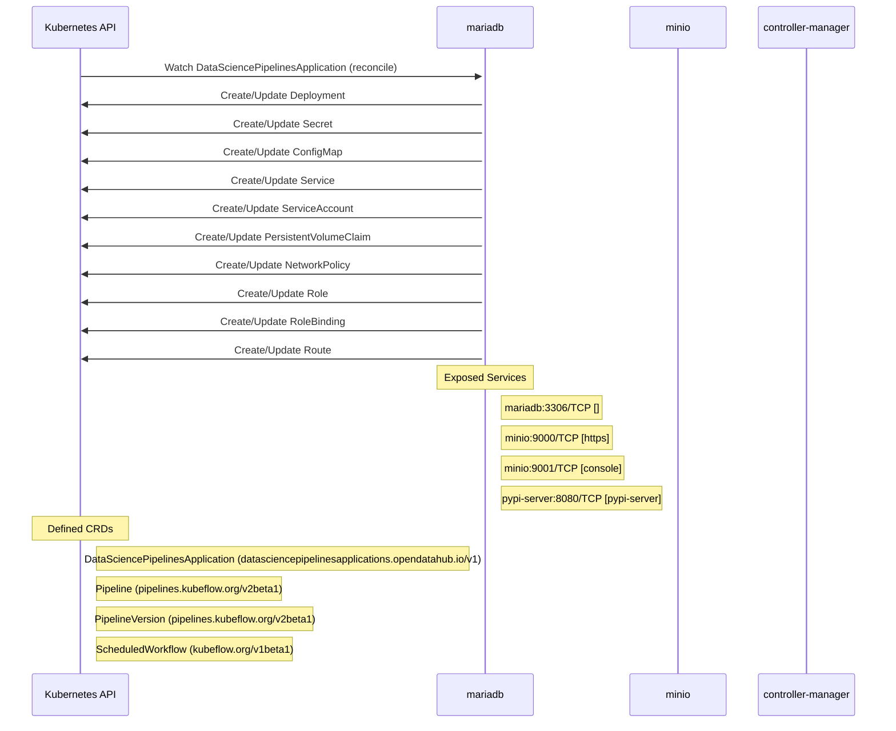

# data-science-pipelines-operator: Dataflow

## Controller Watches

Kubernetes resources this controller monitors for changes. Each watch triggers reconciliation when the watched resource is created, updated, or deleted.

| Type | GVK | Source |
|------|-----|--------|
| For | api/v1/DataSciencePipelinesApplication | `controllers/dspipeline_controller.go:796` |
| Owns | /v1/ConfigMap | `controllers/dspipeline_controller.go:799` |
| Owns | /v1/PersistentVolumeClaim | `controllers/dspipeline_controller.go:802` |
| Owns | /v1/Secret | `controllers/dspipeline_controller.go:798` |
| Owns | /v1/Service | `controllers/dspipeline_controller.go:800` |
| Owns | /v1/ServiceAccount | `controllers/dspipeline_controller.go:801` |
| Owns | apps/v1/Deployment | `controllers/dspipeline_controller.go:797` |
| Owns | networking.k8s.io/v1/NetworkPolicy | `controllers/dspipeline_controller.go:803` |
| Owns | rbac.authorization.k8s.io/v1/Role | `controllers/dspipeline_controller.go:804` |
| Owns | rbac.authorization.k8s.io/v1/RoleBinding | `controllers/dspipeline_controller.go:805` |
| Owns | route/v1/Route | `controllers/dspipeline_controller.go:806` |

## Reconciliation Flow

How the controller interacts with the Kubernetes API during reconciliation.

## Configuration

ConfigMaps and Helm values that control this component's runtime behavior.

### ConfigMaps

| Name | Data Keys | Source |
|------|-----------|--------|
| workflow-controller-configmap |  | `config/argo/configmap.workflow-controller-configmap.yaml` |
| custom-ui-configmap | viewer-pod-template.json | `config/samples/custom-configs/ui-configmap.yaml` |
| custom-workflow-controller-configmap | artifactRepository, executor | `config/samples/custom-workflow-controller-config/custom-workflow-controller-configmap.yaml` |
| ds-pipeline-server-config-testdsp0 | config.json | `controllers/testdata/declarative/case_0/expected/created/configmap_server_config.yaml` |
| dsp-trusted-ca-testdsp5 | testcabundleconfigmapkey5.crt | `controllers/testdata/declarative/case_5/expected/created/configmap_dspa_trusted_ca.yaml` |
| ds-pipeline-server-config-testdspa | config.json | `controllers/testdata/declarative/case_7/expected/created/configmap_server_config.yaml` |

