# kserve: Dataflow

## Controller Watches

Kubernetes resources this controller monitors for changes. Each watch triggers reconciliation when the watched resource is created, updated, or deleted.

| Type | GVK | Source |
|------|-----|--------|
| For | serving/v1alpha1/InferenceGraph | `pkg/controller/v1alpha1/inferencegraph/controller.go:446` |
| For | serving/v1alpha1/LocalModelCache | `pkg/controller/v1alpha1/localmodel/reconcilers/localmodelcache_reconciler.go:292` |
| For | serving/v1alpha1/LocalModelNamespaceCache | `pkg/controller/v1alpha1/localmodel/reconcilers/localmodelnamespacecache_reconciler.go:295` |
| For | serving/v1alpha1/LocalModelNode | `pkg/controller/v1alpha1/localmodelnode/controller.go:613` |
| For | serving/v1alpha1/TrainedModel | `pkg/controller/v1alpha1/trainedmodel/controller.go:306` |
| For | serving/v1alpha2/LLMInferenceService | `pkg/controller/v1alpha2/llmisvc/controller.go:277` |
| For | serving/v1beta1/InferenceService | `pkg/controller/v1beta1/inferenceservice/controller.go:682` |
| Owns | /v1/PersistentVolume | `pkg/controller/v1alpha1/localmodel/reconcilers/localmodelcache_reconciler.go:293` |
| Owns | /v1/PersistentVolumeClaim | `pkg/controller/v1alpha1/localmodel/reconcilers/localmodelcache_reconciler.go:294` |
| Owns | /v1/PersistentVolumeClaim | `pkg/controller/v1alpha1/localmodel/reconcilers/localmodelnamespacecache_reconciler.go:296` |
| Owns | /v1/Secret | `pkg/controller/v1alpha2/llmisvc/controller.go:281` |
| Owns | /v1/Service | `pkg/controller/v1beta1/inferenceservice/controller.go:684` |
| Owns | /v1/Service | `pkg/controller/v1alpha2/llmisvc/controller.go:282` |
| Owns | api/v1/InferencePool | `pkg/controller/v1alpha2/llmisvc/controller.go:302` |
| Owns | api/v1alpha1/VariantAutoscaling | `pkg/controller/v1alpha2/llmisvc/controller.go:310` |
| Owns | apis/v1/HTTPRoute | `pkg/controller/v1alpha2/llmisvc/controller.go:294` |
| Owns | apis/v1/HTTPRoute | `pkg/controller/v1beta1/inferenceservice/controller.go:728` |
| Owns | apis/v1beta1/OpenTelemetryCollector | `pkg/controller/v1beta1/inferenceservice/controller.go:710` |
| Owns | apix/v1alpha2/InferencePool | `pkg/controller/v1alpha2/llmisvc/controller.go:306` |
| Owns | apps/v1/Deployment | `pkg/controller/v1beta1/inferenceservice/controller.go:683` |
| Owns | apps/v1/Deployment | `pkg/controller/v1alpha2/llmisvc/controller.go:280` |
| Owns | apps/v1/Deployment | `pkg/controller/v1alpha1/inferencegraph/controller.go:447` |
| Owns | autoscaling/v2/HorizontalPodAutoscaler | `pkg/controller/v1alpha2/llmisvc/controller.go:283` |
| Owns | batch/v1/Job | `pkg/controller/v1alpha1/localmodelnode/controller.go:614` |
| Owns | keda/v1alpha1/ScaledObject | `pkg/controller/v1alpha2/llmisvc/controller.go:314` |
| Owns | keda/v1alpha1/ScaledObject | `pkg/controller/v1beta1/inferenceservice/controller.go:693` |
| Owns | leaderworkerset/v1/LeaderWorkerSet | `pkg/controller/v1alpha2/llmisvc/controller.go:318` |
| Owns | monitoring/v1/PodMonitor | `pkg/controller/v1alpha2/llmisvc/controller.go:323` |
| Owns | monitoring/v1/ServiceMonitor | `pkg/controller/v1alpha2/llmisvc/controller.go:326` |
| Owns | networking.k8s.io/v1/Ingress | `pkg/controller/v1alpha2/llmisvc/controller.go:279` |
| Owns | networking.k8s.io/v1/Ingress | `pkg/controller/v1beta1/inferenceservice/controller.go:734` |
| Owns | networking/v1beta1/VirtualService | `pkg/controller/v1beta1/inferenceservice/controller.go:716` |
| Owns | route/v1/Route | `pkg/controller/v1alpha1/inferencegraph/controller.go:448` |
| Owns | serving/v1/Service | `pkg/controller/v1alpha1/inferencegraph/controller.go:451` |
| Owns | serving/v1/Service | `pkg/controller/v1beta1/inferenceservice/controller.go:687` |
| Watches | /v1/ConfigMap | `pkg/controller/v1alpha2/llmisvc/controller.go:284` |
| Watches | /v1/Node | `pkg/controller/v1alpha1/localmodel/reconcilers/localmodelcache_reconciler.go:301` |
| Watches | /v1/Node | `pkg/controller/v1alpha1/localmodel/reconcilers/localmodelnamespacecache_reconciler.go:303` |
| Watches | /v1/Pod | `pkg/controller/v1beta1/inferenceservice/controller.go:739` |
| Watches | /v1/Pod | `pkg/controller/v1alpha2/llmisvc/controller.go:285` |
| Watches | apis/v1/Gateway | `pkg/controller/v1alpha2/llmisvc/controller.go:298` |
| Watches | apis/v1/HTTPRoute | `pkg/controller/v1alpha2/llmisvc/controller.go:295` |
| Watches | serving/v1alpha1/ClusterServingRuntime | `pkg/controller/v1beta1/inferenceservice/controller.go:738` |
| Watches | serving/v1alpha1/LocalModelNode | `pkg/controller/v1alpha1/localmodel/reconcilers/localmodelcache_reconciler.go:303` |
| Watches | serving/v1alpha1/LocalModelNode | `pkg/controller/v1alpha1/localmodel/reconcilers/localmodelnamespacecache_reconciler.go:304` |
| Watches | serving/v1alpha1/ServingRuntime | `pkg/controller/v1beta1/inferenceservice/controller.go:737` |
| Watches | serving/v1alpha2/LLMInferenceServiceConfig | `pkg/controller/v1alpha2/llmisvc/controller.go:278` |
| Watches | serving/v1beta1/InferenceService | `pkg/controller/v1alpha1/localmodel/reconcilers/localmodelcache_reconciler.go:297` |
| Watches | serving/v1beta1/InferenceService | `pkg/controller/v1alpha1/localmodel/reconcilers/localmodelnamespacecache_reconciler.go:299` |

## Reconciliation Flow

How the controller interacts with the Kubernetes API during reconciliation.

```mermaid
sequenceDiagram
    %% Static dataflow for kserve

    participant KubernetesAPI as Kubernetes API
    participant spark_pmml_iris as spark-pmml-iris
    participant kserve_controller_manager as kserve-controller-manager
    participant llmisvc_controller_manager as llmisvc-controller-manager
    participant kserve_localmodel_controller_manager as kserve-localmodel-controller-manager

    KubernetesAPI->>+spark_pmml_iris: Watch LocalModelCache (reconcile)
    spark_pmml_iris->>KubernetesAPI: Create/Update PersistentVolume
    spark_pmml_iris->>KubernetesAPI: Create/Update PersistentVolumeClaim
    KubernetesAPI-->>+spark_pmml_iris: Watch InferenceService (informer)
    KubernetesAPI-->>+spark_pmml_iris: Watch Node (informer)
    KubernetesAPI-->>+spark_pmml_iris: Watch LocalModelNode (informer)
    KubernetesAPI->>+spark_pmml_iris: Watch LocalModelNamespaceCache (reconcile)
    spark_pmml_iris->>KubernetesAPI: Create/Update PersistentVolumeClaim
    KubernetesAPI-->>+spark_pmml_iris: Watch InferenceService (informer)
    KubernetesAPI-->>+spark_pmml_iris: Watch Node (informer)
    KubernetesAPI-->>+spark_pmml_iris: Watch LocalModelNode (informer)
    KubernetesAPI->>+spark_pmml_iris: Watch InferenceGraph (reconcile)
    spark_pmml_iris->>KubernetesAPI: Create/Update Deployment
    spark_pmml_iris->>KubernetesAPI: Create/Update Route
    spark_pmml_iris->>KubernetesAPI: Create/Update Service
    KubernetesAPI->>+spark_pmml_iris: Watch LocalModelNode (reconcile)
    spark_pmml_iris->>KubernetesAPI: Create/Update Job
    KubernetesAPI->>+spark_pmml_iris: Watch TrainedModel (reconcile)
    KubernetesAPI->>+spark_pmml_iris: Watch LLMInferenceService (reconcile)
    KubernetesAPI-->>+spark_pmml_iris: Watch LLMInferenceServiceConfig (informer)
    spark_pmml_iris->>KubernetesAPI: Create/Update Ingress
    spark_pmml_iris->>KubernetesAPI: Create/Update Deployment
    spark_pmml_iris->>KubernetesAPI: Create/Update Secret
    spark_pmml_iris->>KubernetesAPI: Create/Update Service
    spark_pmml_iris->>KubernetesAPI: Create/Update HorizontalPodAutoscaler
    KubernetesAPI-->>+spark_pmml_iris: Watch ConfigMap (informer)
    KubernetesAPI-->>+spark_pmml_iris: Watch Pod (informer)
    spark_pmml_iris->>KubernetesAPI: Create/Update HTTPRoute
    KubernetesAPI-->>+spark_pmml_iris: Watch HTTPRoute (informer)
    KubernetesAPI-->>+spark_pmml_iris: Watch Gateway (informer)
    spark_pmml_iris->>KubernetesAPI: Create/Update InferencePool
    spark_pmml_iris->>KubernetesAPI: Create/Update InferencePool
    spark_pmml_iris->>KubernetesAPI: Create/Update VariantAutoscaling
    spark_pmml_iris->>KubernetesAPI: Create/Update ScaledObject
    spark_pmml_iris->>KubernetesAPI: Create/Update LeaderWorkerSet
    spark_pmml_iris->>KubernetesAPI: Create/Update PodMonitor
    spark_pmml_iris->>KubernetesAPI: Create/Update ServiceMonitor
    KubernetesAPI->>+spark_pmml_iris: Watch InferenceService (reconcile)
    spark_pmml_iris->>KubernetesAPI: Create/Update Deployment
    spark_pmml_iris->>KubernetesAPI: Create/Update Service
    spark_pmml_iris->>KubernetesAPI: Create/Update Service
    spark_pmml_iris->>KubernetesAPI: Create/Update ScaledObject
    spark_pmml_iris->>KubernetesAPI: Create/Update OpenTelemetryCollector
    spark_pmml_iris->>KubernetesAPI: Create/Update VirtualService
    spark_pmml_iris->>KubernetesAPI: Create/Update HTTPRoute
    spark_pmml_iris->>KubernetesAPI: Create/Update Ingress
    KubernetesAPI-->>+spark_pmml_iris: Watch ServingRuntime (informer)
    KubernetesAPI-->>+spark_pmml_iris: Watch ClusterServingRuntime (informer)
    KubernetesAPI-->>+spark_pmml_iris: Watch Pod (informer)

    Note over spark_pmml_iris: Exposed Services
    Note right of spark_pmml_iris: llmisvc-controller-manager-service:8443/TCP [https]
    Note right of spark_pmml_iris: kserve-controller-manager-service:8443/TCP []
    Note right of spark_pmml_iris: llmisvc-webhook-server-service:443/TCP [https]
    Note right of spark_pmml_iris: localmodel-webhook-server-service:443/TCP []
    Note right of spark_pmml_iris: kserve-webhook-server-service:443/TCP []
    Note right of spark_pmml_iris: webhook-service:443/TCP [https]

    Note over KubernetesAPI: Defined CRDs
    Note right of KubernetesAPI: ClusterStorageContainer (serving.kserve.io/v1alpha1)
    Note right of KubernetesAPI: LLMInferenceServiceConfig (serving.kserve.io/v1alpha1)
    Note right of KubernetesAPI: LLMInferenceServiceConfig (serving.kserve.io/v1alpha2)
    Note right of KubernetesAPI: LLMInferenceService (serving.kserve.io/v1alpha1)
    Note right of KubernetesAPI: LLMInferenceService (serving.kserve.io/v1alpha2)
    Note right of KubernetesAPI: LocalModelCache (serving.kserve.io/v1alpha1)
    Note right of KubernetesAPI: LocalModelNamespaceCache (serving.kserve.io/v1alpha1)
    Note right of KubernetesAPI: LocalModelNodeGroup (serving.kserve.io/v1alpha1)
    Note right of KubernetesAPI: LocalModelNode (serving.kserve.io/v1alpha1)
    Note right of KubernetesAPI: ClusterServingRuntime (serving.kserve.io/v1alpha1)
    Note right of KubernetesAPI: InferenceGraph (serving.kserve.io/v1alpha1)
    Note right of KubernetesAPI: InferenceService (serving.kserve.io/v1beta1)
    Note right of KubernetesAPI: ServingRuntime (serving.kserve.io/v1alpha1)
    Note right of KubernetesAPI: TrainedModel (serving.kserve.io/v1alpha1)
```

### Webhooks

| Name | Type | Path | Failure Policy | Service | Source |
|------|------|------|----------------|---------|--------|
| inferenceservice.kserve-webhook-server.defaulter | mutating | /mutate-serving-kserve-io-v1beta1-inferenceservice | Fail | $(kserveNamespace)/$(webhookServiceName) | `config/webhook/manifests.yaml` |
| inferenceservice.kserve-webhook-server.pod-mutator | mutating | /mutate-pods | Fail | $(kserveNamespace)/$(webhookServiceName) | `config/webhook/manifests.yaml` |
| inferenceservice.kserve-webhook-server.validator | validating | /validate-serving-kserve-io-v1beta1-inferenceservice | Fail | $(kserveNamespace)/$(webhookServiceName) | `config/webhook/manifests.yaml` |
| trainedmodel.kserve-webhook-server.validator | validating | /validate-serving-kserve-io-v1alpha1-trainedmodel | Fail | $(kserveNamespace)/$(webhookServiceName) | `config/webhook/manifests.yaml` |
| inferencegraph.kserve-webhook-server.validator | validating | /validate-serving-kserve-io-v1alpha1-inferencegraph | Fail | $(kserveNamespace)/$(webhookServiceName) | `config/webhook/manifests.yaml` |
| clusterservingruntime.kserve-webhook-server.validator | validating | /validate-serving-kserve-io-v1alpha1-clusterservingruntime | Fail | $(kserveNamespace)/$(webhookServiceName) | `config/webhook/manifests.yaml` |
| servingruntime.kserve-webhook-server.validator | validating | /validate-serving-kserve-io-v1alpha1-servingruntime | Fail | $(kserveNamespace)/$(webhookServiceName) | `config/webhook/manifests.yaml` |
| localmodelcache.kserve-webhook-server.validator | validating |  |  |  | `config/localmodels/webhook_cainjection_patch.yaml` |

### HTTP Endpoints

| Method | Path | Source |
|--------|------|--------|
| * | / | `cmd/router/main.go:671` |
| POST | /splitter | `docs/samples/graph/bgtest/bgtest/main.go:26` |
| POST | /switch | `docs/samples/graph/bgtest/bgtest/main.go:27` |
| POST | /single | `docs/samples/graph/bgtest/bgtest/main.go:28` |
| POST | /ensemble | `docs/samples/graph/bgtest/bgtest/main.go:29` |
| * | gateway.networking.k8s.io | `pkg/controller/v1alpha2/llmisvc/config_merge.go:375` |
| * | gateway.networking.k8s.io | `pkg/controller/v1alpha2/llmisvc/fixture/gwapi_builders.go:210` |
| * | gateway.networking.k8s.io | `pkg/controller/v1alpha2/llmisvc/fixture/gwapi_builders.go:228` |
| * | inference.networking.k8s.io | `pkg/controller/v1alpha2/llmisvc/fixture/gwapi_builders.go:290` |
| * | inference.networking.x-k8s.io | `pkg/controller/v1alpha2/llmisvc/fixture/gwapi_builders.go:304` |
| * | gateway.networking.k8s.io | `pkg/controller/v1alpha2/llmisvc/fixture/gwapi_builders.go:398` |
| * | gateway.networking.k8s.io | `pkg/controller/v1alpha2/llmisvc/fixture/gwapi_builders.go:700` |

## Configuration

ConfigMaps and Helm values that control this component's runtime behavior.

### ConfigMaps

| Name | Data Keys | Source |
|------|-----------|--------|
| inferenceservice-config | agent, autoscaler, batcher, credentials, deploy, explainers, inferenceService, ingress, localModel, logger, metricsAggregator, opentelemetryCollector, router, security, service, storageInitializer | `charts/_common/common-patches/configmap-patch.yaml` |
| inferenceservice-config | agent, autoscaler, batcher, credentials, deploy, explainers, inferenceService, ingress, localModel, logger, metricsAggregator, opentelemetryCollector, router, security, service, storageInitializer | `charts/kserve-llmisvc-resources/files/common/configmap-patch.yaml` |
| inferenceservice-config | _example, agent, autoscaler, batcher, credentials, deploy, explainers, inferenceService, ingress, localModel, logger, metricsAggregator, opentelemetryCollector, router, security, storageInitializer | `charts/kserve-llmisvc-resources/files/common/configmap.yaml` |
| inferenceservice-config | agent, autoscaler, batcher, credentials, deploy, explainers, inferenceService, ingress, localModel, logger, metricsAggregator, opentelemetryCollector, router, security, service, storageInitializer | `charts/kserve-resources/files/common/configmap-patch.yaml` |
| inferenceservice-config | _example, agent, autoscaler, batcher, credentials, deploy, explainers, inferenceService, ingress, localModel, logger, metricsAggregator, opentelemetryCollector, router, security, storageInitializer | `charts/kserve-resources/files/common/configmap.yaml` |

### Helm

**Chart:** kserve-crd vv0.17.0

