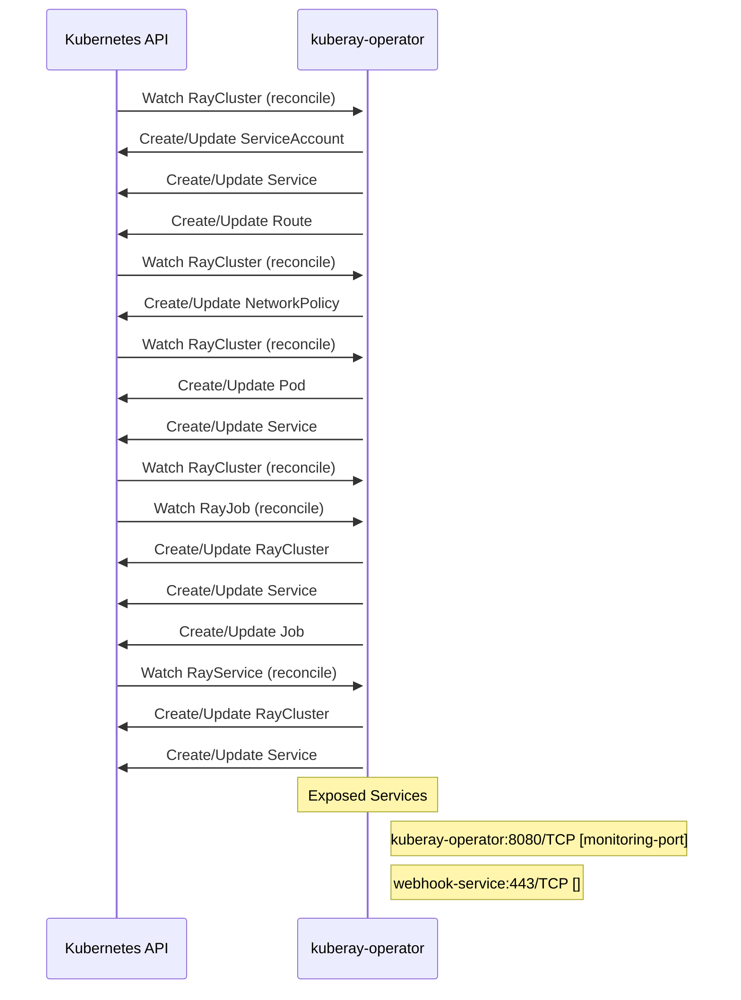

# kuberay: Dataflow

## Controller Watches

Kubernetes resources this controller monitors for changes. Each watch triggers reconciliation when the watched resource is created, updated, or deleted.

| Type | GVK | Source |
|------|-----|--------|
| For | ray/v1/RayCluster | `ray-operator/controllers/ray/authentication_controller.go:1089` |
| For | ray/v1/RayCluster | `ray-operator/controllers/ray/networkpolicy_controller.go:427` |
| For | ray/v1/RayCluster | `ray-operator/controllers/ray/raycluster_controller.go:1574` |
| For | ray/v1/RayCluster | `ray-operator/controllers/ray/raycluster_mtls_controller.go:834` |
| For | ray/v1/RayJob | `ray-operator/controllers/ray/rayjob_controller.go:729` |
| For | ray/v1/RayService | `ray-operator/controllers/ray/rayservice_controller.go:434` |
| Owns | /v1/Pod | `ray-operator/controllers/ray/raycluster_controller.go:1579` |
| Owns | /v1/Service | `ray-operator/controllers/ray/authentication_controller.go:1092` |
| Owns | /v1/Service | `ray-operator/controllers/ray/raycluster_controller.go:1580` |
| Owns | /v1/Service | `ray-operator/controllers/ray/rayjob_controller.go:731` |
| Owns | /v1/Service | `ray-operator/controllers/ray/rayservice_controller.go:440` |
| Owns | /v1/ServiceAccount | `ray-operator/controllers/ray/authentication_controller.go:1091` |
| Owns | batch/v1/Job | `ray-operator/controllers/ray/rayjob_controller.go:732` |
| Owns | networking.k8s.io/v1/NetworkPolicy | `ray-operator/controllers/ray/networkpolicy_controller.go:428` |
| Owns | ray/v1/RayCluster | `ray-operator/controllers/ray/rayjob_controller.go:730` |
| Owns | ray/v1/RayCluster | `ray-operator/controllers/ray/rayservice_controller.go:439` |
| Owns | route/v1/Route | `ray-operator/controllers/ray/authentication_controller.go:1093` |

## Reconciliation Flow

How the controller interacts with the Kubernetes API during reconciliation.

### Webhooks

| Name | Type | Path | Failure Policy | Service | Source |
|------|------|------|----------------|---------|--------|
| mraycluster.kb.io | mutating | /mutate-ray-io-v1-raycluster | Fail | $(namespace)/kuberay-webhook-service | `ray-operator/config/openshift/webhook.yaml` |
| mraycluster.kb.io | mutating | /mutate-ray-io-v1-raycluster | fail |  | `ray-operator/pkg/webhooks/v1/raycluster_mutating_webhook.go` |
| vraycluster.kb.io | validating | /validate-ray-io-v1-raycluster | fail |  | `ray-operator/pkg/webhooks/v1/raycluster_validating_webhook.go` |

### HTTP Endpoints

| Method | Path | Source |
|--------|------|--------|
| * | /apis/ray.io/v1/ | `apiserversdk/proxy.go:38` |
| * | GET /api/v1/namespaces/{namespace}/events | `apiserversdk/proxy.go:39` |
| * | /api/v1/namespaces/{namespace}/services/{service}/proxy | `apiserversdk/proxy.go:46` |
| * | /api/v1/namespaces/{namespace}/services/{service}/proxy/ | `apiserversdk/proxy.go:47` |
| * | / | `experimental/cmd/main.go:111` |
| * | POST | `proto/go_client/cluster.pb.gw.go:358` |
| * | GET | `proto/go_client/cluster.pb.gw.go:381` |
| * | GET | `proto/go_client/cluster.pb.gw.go:404` |
| * | GET | `proto/go_client/cluster.pb.gw.go:427` |
| * | DELETE | `proto/go_client/cluster.pb.gw.go:450` |
| * | POST | `proto/go_client/cluster.pb.gw.go:514` |
| * | GET | `proto/go_client/cluster.pb.gw.go:534` |
| * | GET | `proto/go_client/cluster.pb.gw.go:554` |
| * | GET | `proto/go_client/cluster.pb.gw.go:574` |
| * | DELETE | `proto/go_client/cluster.pb.gw.go:594` |
| * | POST | `proto/go_client/config.pb.gw.go:570` |
| * | GET | `proto/go_client/config.pb.gw.go:593` |
| * | GET | `proto/go_client/config.pb.gw.go:616` |
| * | GET | `proto/go_client/config.pb.gw.go:639` |
| * | DELETE | `proto/go_client/config.pb.gw.go:662` |
| * | POST | `proto/go_client/config.pb.gw.go:694` |
| * | GET | `proto/go_client/config.pb.gw.go:717` |
| * | GET | `proto/go_client/config.pb.gw.go:740` |
| * | DELETE | `proto/go_client/config.pb.gw.go:763` |
| * | POST | `proto/go_client/config.pb.gw.go:827` |
| * | GET | `proto/go_client/config.pb.gw.go:847` |
| * | GET | `proto/go_client/config.pb.gw.go:867` |
| * | GET | `proto/go_client/config.pb.gw.go:887` |
| * | DELETE | `proto/go_client/config.pb.gw.go:907` |
| * | POST | `proto/go_client/config.pb.gw.go:992` |
| * | GET | `proto/go_client/config.pb.gw.go:1012` |
| * | GET | `proto/go_client/config.pb.gw.go:1032` |
| * | DELETE | `proto/go_client/config.pb.gw.go:1052` |
| * | POST | `proto/go_client/job.pb.gw.go:358` |
| * | GET | `proto/go_client/job.pb.gw.go:381` |
| * | GET | `proto/go_client/job.pb.gw.go:404` |
| * | GET | `proto/go_client/job.pb.gw.go:427` |
| * | DELETE | `proto/go_client/job.pb.gw.go:450` |
| * | POST | `proto/go_client/job.pb.gw.go:514` |
| * | GET | `proto/go_client/job.pb.gw.go:534` |
| * | GET | `proto/go_client/job.pb.gw.go:554` |
| * | GET | `proto/go_client/job.pb.gw.go:574` |
| * | DELETE | `proto/go_client/job.pb.gw.go:594` |
| * | POST | `proto/go_client/job_submission.pb.gw.go:568` |
| * | GET | `proto/go_client/job_submission.pb.gw.go:591` |
| * | GET | `proto/go_client/job_submission.pb.gw.go:614` |
| * | GET | `proto/go_client/job_submission.pb.gw.go:637` |
| * | POST | `proto/go_client/job_submission.pb.gw.go:660` |
| * | DELETE | `proto/go_client/job_submission.pb.gw.go:683` |
| * | POST | `proto/go_client/job_submission.pb.gw.go:747` |
| * | GET | `proto/go_client/job_submission.pb.gw.go:767` |
| * | GET | `proto/go_client/job_submission.pb.gw.go:787` |
| * | GET | `proto/go_client/job_submission.pb.gw.go:807` |
| * | POST | `proto/go_client/job_submission.pb.gw.go:827` |
| * | DELETE | `proto/go_client/job_submission.pb.gw.go:847` |
| * | POST | `proto/go_client/serve.pb.gw.go:446` |
| * | PUT | `proto/go_client/serve.pb.gw.go:469` |
| * | GET | `proto/go_client/serve.pb.gw.go:492` |
| * | GET | `proto/go_client/serve.pb.gw.go:515` |
| * | GET | `proto/go_client/serve.pb.gw.go:538` |
| * | DELETE | `proto/go_client/serve.pb.gw.go:561` |
| * | POST | `proto/go_client/serve.pb.gw.go:625` |
| * | PUT | `proto/go_client/serve.pb.gw.go:645` |
| * | GET | `proto/go_client/serve.pb.gw.go:665` |
| * | GET | `proto/go_client/serve.pb.gw.go:685` |
| * | GET | `proto/go_client/serve.pb.gw.go:705` |
| * | DELETE | `proto/go_client/serve.pb.gw.go:725` |
| * | gateway.networking.k8s.io | `ray-operator/controllers/ray/authentication_controller.go:432` |

## Configuration

ConfigMaps and Helm values that control this component's runtime behavior.

### Helm

**Chart:** kuberay-apiserver v1.4.2

