# opendatahub-operator: RBAC

ServiceAccount bindings, roles, and resource permissions.

## RBAC Overview

This component defines a large RBAC surface (97 diagram lines). The graph below groups roles by permission scope.

```mermaid
graph LR
    classDef wide fill:#e74c3c,stroke:#c0392b,color:#fff
    classDef medium fill:#f39c12,stroke:#d68910,color:#fff
    classDef narrow fill:#2ecc71,stroke:#27ae60,color:#fff
    classDef subject fill:#3498db,stroke:#2980b9,color:#fff

    subgraph nar["Narrow Scope (<10)"]
    metrics_reader["metrics-reader"]:::narrow
    dashboard_editor_role["dashboard-editor-role\n2 resources"]:::narrow
    dashboard_viewer_role["dashboard-viewer-role\n2 resources"]:::narrow
    datasciencepipelines_editor_role["datasciencepipelines-editor-role\n2 resources"]:::narrow
    datasciencepipelines_viewer_role["datasciencepipelines-viewer-role\n2 resources"]:::narrow
    kserve_editor_role["kserve-editor-role\n2 resources"]:::narrow
    kserve_viewer_role["kserve-viewer-role\n2 resources"]:::narrow
    kueue_editor_role["kueue-editor-role\n2 resources"]:::narrow
    kueue_viewer_role["kueue-viewer-role\n2 resources"]:::narrow
    modelregistry_editor_role["modelregistry-editor-role\n2 resources"]:::narrow
    modelregistry_viewer_role["modelregistry-viewer-role\n2 resources"]:::narrow
    ray_editor_role["ray-editor-role\n2 resources"]:::narrow
    ray_viewer_role["ray-viewer-role\n2 resources"]:::narrow
    trainingoperator_editor_role["trainingoperator-editor-role\n2 resources"]:::narrow
    trainingoperator_viewer_role["trainingoperator-viewer-role\n2 resources"]:::narrow
    trustyai_editor_role["trustyai-editor-role\n2 resources"]:::narrow
    trustyai_viewer_role["trustyai-viewer-role\n2 resources"]:::narrow
    workbenches_editor_role["workbenches-editor-role\n2 resources"]:::narrow
    workbenches_viewer_role["workbenches-viewer-role\n2 resources"]:::narrow
    auth_editor_role["auth-editor-role\n2 resources"]:::narrow
    auth_viewer_role["auth-viewer-role\n2 resources"]:::narrow
    monitoring_editor_role["monitoring-editor-role\n2 resources"]:::narrow
    monitoring_viewer_role["monitoring-viewer-role\n2 resources"]:::narrow
    end

    subj_controller_manager["controller-manager\nServiceAccount"]:::subject
    subj_controller_manager -->|binds| controller_manager_role
```

## Bindings

Subject-to-role mappings defining who has access to what.

| Binding | Type | Role | Subject |
|---------|------|------|---------|
| controller-manager-rolebinding | ClusterRoleBinding | controller-manager-role | ServiceAccount/controller-manager |

## Role Details

Per-rule breakdown of API groups, resources, and verbs for each role.

| Role | Kind | API Groups | Resources | Verbs |
|------|------|------------|-----------|-------|
| metrics-reader | ClusterRole |  |  | get |
| dashboard-editor-role | ClusterRole |  | dashboards | create, delete, get, list, patch, update, watch |
| dashboard-editor-role | ClusterRole |  | dashboards/status | get |
| dashboard-viewer-role | ClusterRole |  | dashboards | get, list, watch |
| dashboard-viewer-role | ClusterRole |  | dashboards/status | get |
| datasciencepipelines-editor-role | ClusterRole |  | datasciencepipelines | create, delete, get, list, patch, update, watch |
| datasciencepipelines-editor-role | ClusterRole |  | datasciencepipelines/status | get |
| datasciencepipelines-viewer-role | ClusterRole |  | datasciencepipelines | get, list, watch |
| datasciencepipelines-viewer-role | ClusterRole |  | datasciencepipelines/status | get |
| kserve-editor-role | ClusterRole |  | kserves | create, delete, get, list, patch, update, watch |
| kserve-editor-role | ClusterRole |  | kserves/status | get |
| kserve-viewer-role | ClusterRole |  | kserves | get, list, watch |
| kserve-viewer-role | ClusterRole |  | kserves/status | get |
| kueue-editor-role | ClusterRole |  | kueues | create, delete, get, list, patch, update, watch |
| kueue-editor-role | ClusterRole |  | kueues/status | get |
| kueue-viewer-role | ClusterRole |  | kueues | get, list, watch |
| kueue-viewer-role | ClusterRole |  | kueues/status | get |
| modelregistry-editor-role | ClusterRole |  | modelregistries | create, delete, get, list, patch, update, watch |
| modelregistry-editor-role | ClusterRole |  | modelregistries/status | get |
| modelregistry-viewer-role | ClusterRole |  | modelregistries | get, list, watch |
| modelregistry-viewer-role | ClusterRole |  | modelregistries/status | get |
| ray-editor-role | ClusterRole |  | rays | create, delete, get, list, patch, update, watch |
| ray-editor-role | ClusterRole |  | rays/status | get |
| ray-viewer-role | ClusterRole |  | rays | get, list, watch |
| ray-viewer-role | ClusterRole |  | rays/status | get |
| trainingoperator-editor-role | ClusterRole |  | trainingoperators | create, delete, get, list, patch, update, watch |
| trainingoperator-editor-role | ClusterRole |  | trainingoperators/status | get |
| trainingoperator-viewer-role | ClusterRole |  | trainingoperators | get, list, watch |
| trainingoperator-viewer-role | ClusterRole |  | trainingoperators/status | get |
| trustyai-editor-role | ClusterRole |  | trustyais | create, delete, get, list, patch, update, watch |
| trustyai-editor-role | ClusterRole |  | trustyais/status | get |
| trustyai-viewer-role | ClusterRole |  | trustyais | get, list, watch |
| trustyai-viewer-role | ClusterRole |  | trustyais/status | get |
| workbenches-editor-role | ClusterRole |  | workbenches | create, delete, get, list, patch, update, watch |
| workbenches-editor-role | ClusterRole |  | workbenches/status | get |
| workbenches-viewer-role | ClusterRole |  | workbenches | get, list, watch |
| workbenches-viewer-role | ClusterRole |  | workbenches/status | get |
| auth-editor-role | ClusterRole |  | auths | create, delete, get, list, patch, update, watch |
| auth-editor-role | ClusterRole |  | auths/status | get |
| auth-viewer-role | ClusterRole |  | auths | get, list, watch |
| auth-viewer-role | ClusterRole |  | auths/status | get |
| monitoring-editor-role | ClusterRole |  | monitorings | create, delete, get, list, patch, update, watch |
| monitoring-editor-role | ClusterRole |  | monitorings/status | get |
| monitoring-viewer-role | ClusterRole |  | monitorings | get, list, watch |
| monitoring-viewer-role | ClusterRole |  | monitorings/status | get |

### Cluster Roles

| Name | Resources | Verbs | Source |
|------|-----------|-------|--------|
| metrics-reader |  | get | `config/rbac/auth_proxy_client_clusterrole.yaml` |
| dashboard-editor-role | dashboards | create, delete, get, list, patch, update, watch | `config/rbac/components_dashboard_editor_role.yaml` |
| dashboard-editor-role | dashboards/status | get | `config/rbac/components_dashboard_editor_role.yaml` |
| dashboard-viewer-role | dashboards | get, list, watch | `config/rbac/components_dashboard_viewer_role.yaml` |
| dashboard-viewer-role | dashboards/status | get | `config/rbac/components_dashboard_viewer_role.yaml` |
| datasciencepipelines-editor-role | datasciencepipelines | create, delete, get, list, patch, update, watch | `config/rbac/components_datasciencepipelines_editor_role.yaml` |
| datasciencepipelines-editor-role | datasciencepipelines/status | get | `config/rbac/components_datasciencepipelines_editor_role.yaml` |
| datasciencepipelines-viewer-role | datasciencepipelines | get, list, watch | `config/rbac/components_datasciencepipelines_viewer_role.yaml` |
| datasciencepipelines-viewer-role | datasciencepipelines/status | get | `config/rbac/components_datasciencepipelines_viewer_role.yaml` |
| kserve-editor-role | kserves | create, delete, get, list, patch, update, watch | `config/rbac/components_kserve_editor_role.yaml` |
| kserve-editor-role | kserves/status | get | `config/rbac/components_kserve_editor_role.yaml` |
| kserve-viewer-role | kserves | get, list, watch | `config/rbac/components_kserve_viewer_role.yaml` |
| kserve-viewer-role | kserves/status | get | `config/rbac/components_kserve_viewer_role.yaml` |
| kueue-editor-role | kueues | create, delete, get, list, patch, update, watch | `config/rbac/components_kueue_editor_role.yaml` |
| kueue-editor-role | kueues/status | get | `config/rbac/components_kueue_editor_role.yaml` |
| kueue-viewer-role | kueues | get, list, watch | `config/rbac/components_kueue_viewer_role.yaml` |
| kueue-viewer-role | kueues/status | get | `config/rbac/components_kueue_viewer_role.yaml` |
| modelregistry-editor-role | modelregistries | create, delete, get, list, patch, update, watch | `config/rbac/components_modelregistry_editor_role.yaml` |
| modelregistry-editor-role | modelregistries/status | get | `config/rbac/components_modelregistry_editor_role.yaml` |
| modelregistry-viewer-role | modelregistries | get, list, watch | `config/rbac/components_modelregistry_viewer_role.yaml` |
| modelregistry-viewer-role | modelregistries/status | get | `config/rbac/components_modelregistry_viewer_role.yaml` |
| ray-editor-role | rays | create, delete, get, list, patch, update, watch | `config/rbac/components_ray_editor_role.yaml` |
| ray-editor-role | rays/status | get | `config/rbac/components_ray_editor_role.yaml` |
| ray-viewer-role | rays | get, list, watch | `config/rbac/components_ray_viewer_role.yaml` |
| ray-viewer-role | rays/status | get | `config/rbac/components_ray_viewer_role.yaml` |
| trainingoperator-editor-role | trainingoperators | create, delete, get, list, patch, update, watch | `config/rbac/components_trainingoperator_editor_role.yaml` |
| trainingoperator-editor-role | trainingoperators/status | get | `config/rbac/components_trainingoperator_editor_role.yaml` |
| trainingoperator-viewer-role | trainingoperators | get, list, watch | `config/rbac/components_trainingoperator_viewer_role.yaml` |
| trainingoperator-viewer-role | trainingoperators/status | get | `config/rbac/components_trainingoperator_viewer_role.yaml` |
| trustyai-editor-role | trustyais | create, delete, get, list, patch, update, watch | `config/rbac/components_trustyai_editor_role.yaml` |
| trustyai-editor-role | trustyais/status | get | `config/rbac/components_trustyai_editor_role.yaml` |
| trustyai-viewer-role | trustyais | get, list, watch | `config/rbac/components_trustyai_viewer_role.yaml` |
| trustyai-viewer-role | trustyais/status | get | `config/rbac/components_trustyai_viewer_role.yaml` |
| workbenches-editor-role | workbenches | create, delete, get, list, patch, update, watch | `config/rbac/components_workbenches_editor_role.yaml` |
| workbenches-editor-role | workbenches/status | get | `config/rbac/components_workbenches_editor_role.yaml` |
| workbenches-viewer-role | workbenches | get, list, watch | `config/rbac/components_workbenches_viewer_role.yaml` |
| workbenches-viewer-role | workbenches/status | get | `config/rbac/components_workbenches_viewer_role.yaml` |
| auth-editor-role | auths | create, delete, get, list, patch, update, watch | `config/rbac/services_auth_editor_role.yaml` |
| auth-editor-role | auths/status | get | `config/rbac/services_auth_editor_role.yaml` |
| auth-viewer-role | auths | get, list, watch | `config/rbac/services_auth_viewer_role.yaml` |
| auth-viewer-role | auths/status | get | `config/rbac/services_auth_viewer_role.yaml` |
| monitoring-editor-role | monitorings | create, delete, get, list, patch, update, watch | `config/rbac/services_monitoring_editor_role.yaml` |
| monitoring-editor-role | monitorings/status | get | `config/rbac/services_monitoring_editor_role.yaml` |
| monitoring-viewer-role | monitorings | get, list, watch | `config/rbac/services_monitoring_viewer_role.yaml` |
| monitoring-viewer-role | monitorings/status | get | `config/rbac/services_monitoring_viewer_role.yaml` |

### Kubebuilder RBAC Markers

Kubebuilder `+kubebuilder:rbac` markers declare the RBAC requirements of controller reconcilers. These are the source of truth for generated ClusterRole manifests. 35 markers found.

| File | Line | Groups | Resources | Verbs |
|------|------|--------|-----------|-------|
| `internal/controller/datasciencecluster/kubebuilder_rbac.go:210` | 210 |  |  | get, list, watch |
| `internal/controller/datasciencecluster/kubebuilder_rbac.go:211` | 211 |  |  |  |
| `internal/controller/dscinitialization/kubebuilder_rbac.go:39` | 39 |  |  | get, list, watch, create, update, patch, delete |
| `internal/controller/dscinitialization/kubebuilder_rbac.go:40` | 40 |  |  | get, update, patch |
| `internal/controller/dscinitialization/kubebuilder_rbac.go:41` | 41 |  |  |  |
| `internal/controller/dscinitialization/kubebuilder_rbac.go:45` | 45 |  |  | get, list, watch, create, update, patch, delete |
| `internal/controller/dscinitialization/kubebuilder_rbac.go:46` | 46 |  |  | get, update, patch |
| `internal/controller/dscinitialization/kubebuilder_rbac.go:47` | 47 |  |  |  |
| `internal/controller/dscinitialization/kubebuilder_rbac.go:48` | 48 |  |  | get, list, watch, create, update, patch, delete |
| `internal/controller/dscinitialization/kubebuilder_rbac.go:49` | 49 |  |  | get, update, patch |
| `internal/controller/dscinitialization/kubebuilder_rbac.go:50` | 50 |  |  |  |
| `internal/controller/dscinitialization/kubebuilder_rbac.go:51` | 51 |  |  | get, list, watch, create, update, patch, delete |
| `internal/controller/dscinitialization/kubebuilder_rbac.go:52` | 52 |  |  | get, update, patch |
| `internal/controller/dscinitialization/kubebuilder_rbac.go:53` | 53 |  |  |  |
| `internal/controller/dscinitialization/kubebuilder_rbac.go:54` | 54 |  |  | get, list, watch, create, update, patch, delete |
| `internal/controller/dscinitialization/kubebuilder_rbac.go:55` | 55 |  |  | get, update, patch |
| `internal/controller/dscinitialization/kubebuilder_rbac.go:56` | 56 |  |  |  |
| `internal/controller/dscinitialization/kubebuilder_rbac.go:57` | 57 |  |  | get, list, watch, create, update, patch, delete |
| `internal/controller/dscinitialization/kubebuilder_rbac.go:58` | 58 |  |  | get, update, patch |
| `internal/controller/dscinitialization/kubebuilder_rbac.go:59` | 59 |  |  |  |
| `internal/controller/dscinitialization/kubebuilder_rbac.go:60` | 60 |  |  | get, list, watch, create, update, patch, delete |
| `internal/controller/dscinitialization/kubebuilder_rbac.go:61` | 61 |  |  | get, update, patch |
| `internal/controller/dscinitialization/kubebuilder_rbac.go:62` | 62 |  |  |  |
| `internal/controller/dscinitialization/kubebuilder_rbac.go:64` | 64 |  |  | get, list, watch, create, update, patch, delete |
| `internal/controller/dscinitialization/kubebuilder_rbac.go:65` | 65 |  |  | get, update, patch |
| `internal/controller/dscinitialization/kubebuilder_rbac.go:66` | 66 |  |  |  |
| `internal/controller/dscinitialization/kubebuilder_rbac.go:68` | 68 |  |  | get, list, watch, create, update, patch, delete |
| `internal/controller/dscinitialization/kubebuilder_rbac.go:69` | 69 |  |  | get, update, patch |
| `internal/controller/dscinitialization/kubebuilder_rbac.go:70` | 70 |  |  |  |
| `internal/controller/dscinitialization/kubebuilder_rbac.go:72` | 72 |  |  | get, list, watch, create, update, patch, delete |
| `internal/controller/dscinitialization/kubebuilder_rbac.go:73` | 73 |  |  | get, update, patch |
| `internal/controller/dscinitialization/kubebuilder_rbac.go:74` | 74 |  |  |  |
| `internal/controller/dscinitialization/kubebuilder_rbac.go:76` | 76 |  |  | get, list, watch, create, update, patch, delete |
| `internal/controller/dscinitialization/kubebuilder_rbac.go:77` | 77 |  |  | get, update, patch |
| `internal/controller/dscinitialization/kubebuilder_rbac.go:78` | 78 |  |  |  |

