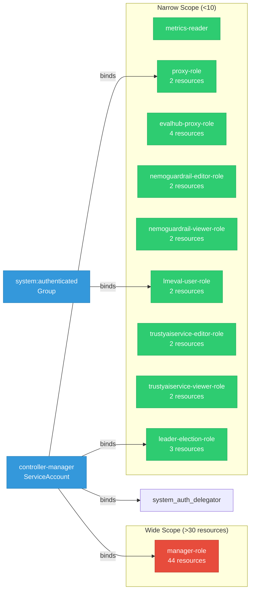

# trustyai-service-operator: RBAC

ServiceAccount bindings, roles, and resource permissions.

## RBAC Overview

This component defines a large RBAC surface (151 diagram lines). The graph below groups roles by permission scope.

## Bindings

Subject-to-role mappings defining who has access to what.

| Binding | Type | Role | Subject |
|---------|------|------|---------|
| proxy-rolebinding | ClusterRoleBinding | proxy-role | ServiceAccount/controller-manager |
| default-lmeval-user-rolebinding | ClusterRoleBinding | lmeval-user-role | Group/system:authenticated |
| manager-rolebinding | ClusterRoleBinding | manager-role | ServiceAccount/controller-manager |
| manager-auth-delegator | ClusterRoleBinding | system:auth-delegator | ServiceAccount/controller-manager |
| leader-election-rolebinding | RoleBinding | leader-election-role | ServiceAccount/controller-manager |

## Role Details

Per-rule breakdown of API groups, resources, and verbs for each role.

| Role | Kind | API Groups | Resources | Verbs |
|------|------|------------|-----------|-------|
| metrics-reader | ClusterRole |  |  | get |
| proxy-role | ClusterRole |  | tokenreviews | create |
| proxy-role | ClusterRole |  | subjectaccessreviews | create |
| evalhub-proxy-role | ClusterRole |  | tokenreviews | create |
| evalhub-proxy-role | ClusterRole |  | subjectaccessreviews | create |
| evalhub-proxy-role | ClusterRole |  | evalhubs | get, list, watch |
| evalhub-proxy-role | ClusterRole |  | evalhubs/proxy | get, create, update |
| nemoguardrail-editor-role | ClusterRole |  | nemoguardrails | create, delete, get, list, patch, update, watch |
| nemoguardrail-editor-role | ClusterRole |  | nemoguardrails/status | get |
| nemoguardrail-viewer-role | ClusterRole |  | nemoguardrails | get, list, watch |
| nemoguardrail-viewer-role | ClusterRole |  | nemoguardrails/status | get |
| lmeval-user-role | ClusterRole |  | lmevaljobs | create, delete, get, list, patch, update, watch |
| lmeval-user-role | ClusterRole |  | lmevaljobs/status | get |
| manager-role | ClusterRole |  | configmaps, persistentvolumeclaims, pods, secrets, serviceaccounts, services | create, delete, get, list, patch, update, watch |
| manager-role | ClusterRole |  | events | create, patch, update, watch |
| manager-role | ClusterRole |  | persistentvolumes | get, list, watch |
| manager-role | ClusterRole |  | pods/exec | create, delete, get, list, watch |
| manager-role | ClusterRole |  | customresourcedefinitions | get, list, watch |
| manager-role | ClusterRole |  | deployments | create, delete, get, list, patch, update, watch |
| manager-role | ClusterRole |  | deployments/finalizers | update |
| manager-role | ClusterRole |  | deployments/status | get, patch, update |
| manager-role | ClusterRole |  | leases | create, get, update |
| manager-role | ClusterRole |  | resourceflavors, workloadpriorityclasses | get, list, watch |
| manager-role | ClusterRole |  | workloads | create, delete, get, list, patch, update, watch |
| manager-role | ClusterRole |  | workloads/finalizers | update |
| manager-role | ClusterRole |  | workloads/status | get, patch, update |
| manager-role | ClusterRole |  | servicemonitors | create, list, watch |
| manager-role | ClusterRole |  | destinationrules, virtualservices | create, delete, get, list, patch, update, watch |
| manager-role | ClusterRole |  | clusterrolebindings | create, delete, get, list, update, watch |
| manager-role | ClusterRole |  | routes | create, delete, get, list, patch, update, watch |
| manager-role | ClusterRole |  | priorityclasses | get, list, watch |
| manager-role | ClusterRole |  | inferenceservices | get, list, patch, update, watch |
| manager-role | ClusterRole |  | inferenceservices/finalizers | delete, get, list, patch, update, watch |
| manager-role | ClusterRole |  | servingruntimes | get, list, watch |
| manager-role | ClusterRole |  | evalhubs, guardrailsorchestrators, lmevaljobs, nemoguardrails, trustyaiservices | create, delete, get, list, patch, update, watch |
| manager-role | ClusterRole |  | evalhubs/finalizers, guardrailsorchestrators/finalizers, lmevaljobs/finalizers, nemoguardrails/finalizers, trustyaiservices/finalizers | update |
| manager-role | ClusterRole |  | evalhubs/proxy | create, get, update |
| manager-role | ClusterRole |  | evalhubs/status, guardrailsorchestrators/status, lmevaljobs/status, nemoguardrails/status, trustyaiservices/status | get, patch, update |
| trustyaiservice-editor-role | ClusterRole |  | trustyaiservices | create, delete, get, list, patch, update, watch |
| trustyaiservice-editor-role | ClusterRole |  | trustyaiservices/status | get |
| trustyaiservice-viewer-role | ClusterRole |  | trustyaiservices | get, list, watch |
| trustyaiservice-viewer-role | ClusterRole |  | trustyaiservices/status | get |
| leader-election-role | Role |  | configmaps | get, list, watch, create, update, patch, delete |
| leader-election-role | Role |  | leases | get, list, watch, create, update, patch, delete |
| leader-election-role | Role |  | events | create, patch |

### Cluster Roles

| Name | Resources | Verbs | Source |
|------|-----------|-------|--------|
| metrics-reader |  | get | `config/rbac/auth_proxy_client_clusterrole.yaml` |
| proxy-role | tokenreviews | create | `config/rbac/auth_proxy_role.yaml` |
| proxy-role | subjectaccessreviews | create | `config/rbac/auth_proxy_role.yaml` |
| evalhub-proxy-role | tokenreviews | create | `config/rbac/evalhub_proxy_role.yaml` |
| evalhub-proxy-role | subjectaccessreviews | create | `config/rbac/evalhub_proxy_role.yaml` |
| evalhub-proxy-role | evalhubs | get, list, watch | `config/rbac/evalhub_proxy_role.yaml` |
| evalhub-proxy-role | evalhubs/proxy | get, create, update | `config/rbac/evalhub_proxy_role.yaml` |
| nemoguardrail-editor-role | nemoguardrails | create, delete, get, list, patch, update, watch | `config/rbac/nemoguardrail_editor_role.yaml` |
| nemoguardrail-editor-role | nemoguardrails/status | get | `config/rbac/nemoguardrail_editor_role.yaml` |
| nemoguardrail-viewer-role | nemoguardrails | get, list, watch | `config/rbac/nemoguardrail_viewer_role.yaml` |
| nemoguardrail-viewer-role | nemoguardrails/status | get | `config/rbac/nemoguardrail_viewer_role.yaml` |
| lmeval-user-role | lmevaljobs | create, delete, get, list, patch, update, watch | `config/rbac/non_admin_lmeval_role.yaml` |
| lmeval-user-role | lmevaljobs/status | get | `config/rbac/non_admin_lmeval_role.yaml` |
| manager-role | configmaps, persistentvolumeclaims, pods, secrets, serviceaccounts, services | create, delete, get, list, patch, update, watch | `config/rbac/role.yaml` |
| manager-role | events | create, patch, update, watch | `config/rbac/role.yaml` |
| manager-role | persistentvolumes | get, list, watch | `config/rbac/role.yaml` |
| manager-role | pods/exec | create, delete, get, list, watch | `config/rbac/role.yaml` |
| manager-role | customresourcedefinitions | get, list, watch | `config/rbac/role.yaml` |
| manager-role | deployments | create, delete, get, list, patch, update, watch | `config/rbac/role.yaml` |
| manager-role | deployments/finalizers | update | `config/rbac/role.yaml` |
| manager-role | deployments/status | get, patch, update | `config/rbac/role.yaml` |
| manager-role | leases | create, get, update | `config/rbac/role.yaml` |
| manager-role | resourceflavors, workloadpriorityclasses | get, list, watch | `config/rbac/role.yaml` |
| manager-role | workloads | create, delete, get, list, patch, update, watch | `config/rbac/role.yaml` |
| manager-role | workloads/finalizers | update | `config/rbac/role.yaml` |
| manager-role | workloads/status | get, patch, update | `config/rbac/role.yaml` |
| manager-role | servicemonitors | create, list, watch | `config/rbac/role.yaml` |
| manager-role | destinationrules, virtualservices | create, delete, get, list, patch, update, watch | `config/rbac/role.yaml` |
| manager-role | clusterrolebindings | create, delete, get, list, update, watch | `config/rbac/role.yaml` |
| manager-role | routes | create, delete, get, list, patch, update, watch | `config/rbac/role.yaml` |
| manager-role | priorityclasses | get, list, watch | `config/rbac/role.yaml` |
| manager-role | inferenceservices | get, list, patch, update, watch | `config/rbac/role.yaml` |
| manager-role | inferenceservices/finalizers | delete, get, list, patch, update, watch | `config/rbac/role.yaml` |
| manager-role | servingruntimes | get, list, watch | `config/rbac/role.yaml` |
| manager-role | evalhubs, guardrailsorchestrators, lmevaljobs, nemoguardrails, trustyaiservices | create, delete, get, list, patch, update, watch | `config/rbac/role.yaml` |
| manager-role | evalhubs/finalizers, guardrailsorchestrators/finalizers, lmevaljobs/finalizers, nemoguardrails/finalizers, trustyaiservices/finalizers | update | `config/rbac/role.yaml` |
| manager-role | evalhubs/proxy | create, get, update | `config/rbac/role.yaml` |
| manager-role | evalhubs/status, guardrailsorchestrators/status, lmevaljobs/status, nemoguardrails/status, trustyaiservices/status | get, patch, update | `config/rbac/role.yaml` |
| trustyaiservice-editor-role | trustyaiservices | create, delete, get, list, patch, update, watch | `config/rbac/trustyaiservice_editor_role.yaml` |
| trustyaiservice-editor-role | trustyaiservices/status | get | `config/rbac/trustyaiservice_editor_role.yaml` |
| trustyaiservice-viewer-role | trustyaiservices | get, list, watch | `config/rbac/trustyaiservice_viewer_role.yaml` |
| trustyaiservice-viewer-role | trustyaiservices/status | get | `config/rbac/trustyaiservice_viewer_role.yaml` |

### Kubebuilder RBAC Markers

Kubebuilder `+kubebuilder:rbac` markers declare the RBAC requirements of controller reconcilers. These are the source of truth for generated ClusterRole manifests. 44 markers found.

| File | Line | Groups | Resources | Verbs |
|------|------|--------|-----------|-------|
| `controllers/evalhub/evalhub_controller.go:43` | 43 |  |  | get, list, watch, create, update, patch, delete |
| `controllers/evalhub/evalhub_controller.go:44` | 44 |  |  | get, update, patch |
| `controllers/evalhub/evalhub_controller.go:45` | 45 |  |  |  |
| `controllers/evalhub/evalhub_controller.go:46` | 46 |  |  | get, create, update |
| `controllers/evalhub/evalhub_controller.go:47` | 47 |  |  | list, watch, get, create, update, patch, delete |
| `controllers/evalhub/evalhub_controller.go:48` | 48 |  |  | get, update, patch |
| `controllers/evalhub/evalhub_controller.go:49` | 49 |  |  | get, list, watch, create, update, patch, delete |
| `controllers/evalhub/evalhub_controller.go:50` | 50 |  |  | get, list, watch, create, update, patch, delete |
| `controllers/evalhub/evalhub_controller.go:51` | 51 |  |  | get, list, watch, create, update, delete |
| `controllers/evalhub/evalhub_controller.go:52` | 52 |  |  | get, list, watch, create, update, delete |
| `controllers/evalhub/evalhub_controller.go:53` | 53 |  |  | list, watch, get, create, update, patch, delete |
| `controllers/evalhub/evalhub_controller.go:54` | 54 |  |  | create, patch, update |
| `controllers/gorch/guardrailsorchestrator_controller.go:60` | 60 |  |  | list, watch, get, create, update, patch, delete |
| `controllers/gorch/guardrailsorchestrator_controller.go:61` | 61 |  |  | get, update, patch |
| `controllers/gorch/guardrailsorchestrator_controller.go:62` | 62 |  |  |  |
| `controllers/gorch/guardrailsorchestrator_controller.go:63` | 63 |  |  | get, list, watch, create, update, patch, delete |
| `controllers/gorch/guardrailsorchestrator_controller.go:64` | 64 |  |  | get, list, watch, create, update, patch, delete |
| `controllers/gorch/guardrailsorchestrator_controller.go:65` | 65 |  |  | get, list, watch, create, update, patch, delete |
| `controllers/gorch/guardrailsorchestrator_controller.go:66` | 66 |  |  | create, patch, update |
| `controllers/gorch/guardrailsorchestrator_controller.go:67` | 67 |  |  | get, list, watch, create, update, patch, delete |
| `controllers/gorch/guardrailsorchestrator_controller.go:68` | 68 |  |  | get, list, watch, create, update, delete |
| `controllers/tas/trustyaiservice_controller.go:59` | 59 |  |  | get, list, watch, create, update, patch, delete |
| `controllers/tas/trustyaiservice_controller.go:60` | 60 |  |  | get, update, patch |
| `controllers/tas/trustyaiservice_controller.go:61` | 61 |  |  |  |
| `controllers/tas/trustyaiservice_controller.go:62` | 62 |  |  | list, watch, get, create, update, patch, delete |
| `controllers/tas/trustyaiservice_controller.go:63` | 63 |  |  | get, update, patch |
| `controllers/tas/trustyaiservice_controller.go:64` | 64 |  |  |  |
| `controllers/tas/trustyaiservice_controller.go:65` | 65 |  |  | list, watch, create |
| `controllers/tas/trustyaiservice_controller.go:66` | 66 |  |  | get, list, watch, create, update, patch, delete |
| `controllers/tas/trustyaiservice_controller.go:67` | 67 |  |  | get, list, watch, create, update, patch, delete |
| `controllers/tas/trustyaiservice_controller.go:68` | 68 |  |  | get, list, watch, create, update, patch, delete |
| `controllers/tas/trustyaiservice_controller.go:69` | 69 |  |  | list, get, watch |
| `controllers/tas/trustyaiservice_controller.go:70` | 70 |  |  | list, get, watch, create, update, patch, delete |
| `controllers/tas/trustyaiservice_controller.go:71` | 71 |  |  | list, watch, get, create, update, patch, delete |
| `controllers/tas/trustyaiservice_controller.go:72` | 72 |  |  | list, watch, get, update, patch |
| `controllers/tas/trustyaiservice_controller.go:73` | 73 |  |  | list, watch, get, update, patch, delete |
| `controllers/tas/trustyaiservice_controller.go:74` | 74 |  |  | create, patch, update |
| `controllers/tas/trustyaiservice_controller.go:75` | 75 |  |  | get, list, watch, create, update, patch, delete |
| `controllers/tas/trustyaiservice_controller.go:76` | 76 |  |  | get, list, watch, create, update, delete |
| `controllers/tas/trustyaiservice_controller.go:77` | 77 |  |  | get, list, watch, create, update, delete |
| `controllers/tas/trustyaiservice_controller.go:78` | 78 |  |  | get, create, update |
| `controllers/tas/trustyaiservice_controller.go:79` | 79 |  |  | create, list, watch, get, update, patch, delete |
| `controllers/tas/trustyaiservice_controller.go:80` | 80 |  |  | create, list, watch, get, update, patch, delete |
| `controllers/tas/trustyaiservice_controller.go:81` | 81 |  |  | list, watch, get |

