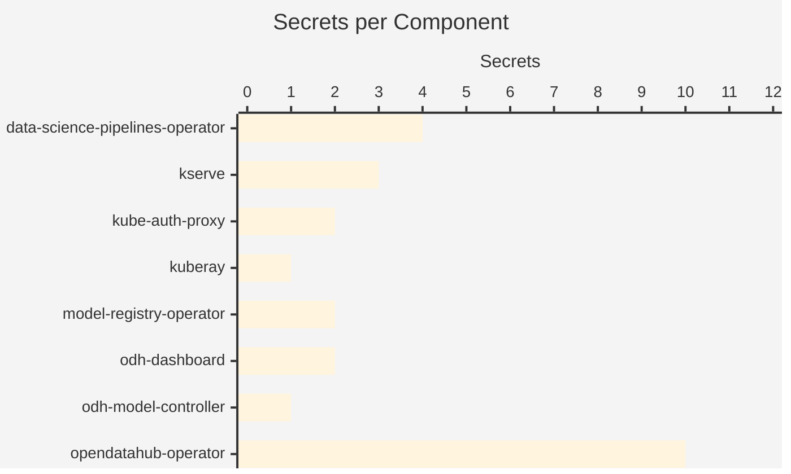

# Secrets Inventory

25 secrets referenced across the platform. No secret values are extracted, only names, types, and which component references them.

## Secret Distribution

## Secrets by Component

| Component | TLS | Opaque | Total |
|-----------|-----|--------|-------|
| data-science-pipelines-operator | 0 | 4 | 4 |
| kserve | 0 | 3 | 3 |
| kube-auth-proxy | 0 | 2 | 2 |
| kuberay | 0 | 1 | 1 |
| model-registry-operator | 0 | 2 | 2 |
| odh-dashboard | 1 | 1 | 2 |
| odh-model-controller | 1 | 0 | 1 |
| opendatahub-operator | 5 | 5 | 10 |

## Secret Detail

Per-component secret breakdown by name and type.

### data-science-pipelines-operator (4 secrets)

| Secret | Type |
|--------|------|
| mariadb-certs | Opaque |
| ds-pipeline-db-test | Opaque |
| minio-certs | Opaque |
| minio | Opaque |

### kserve (3 secrets)

| Secret | Type |
|--------|------|
| llmisvc-webhook-server-cert | Opaque |
| localmodel-webhook-server-cert | Opaque |
| kserve-webhook-server-cert | Opaque |

### kube-auth-proxy (2 secrets)

| Secret | Type |
|--------|------|
| kube-auth-proxy-secret | Opaque |
| kube-rbac-proxy-client-certificates | Opaque |

### kuberay (1 secrets)

| Secret | Type |
|--------|------|
| webhook-server-cert | Opaque |

### model-registry-operator (2 secrets)

| Secret | Type |
|--------|------|
| webhook-server-cert | Opaque |
| controller-manager-metrics-service | Opaque |

### odh-dashboard (2 secrets)

| Secret | Type |
|--------|------|
| dashboard-proxy-tls | kubernetes.io/tls |
| webhook-server-cert | Opaque |

### odh-model-controller (1 secrets)

| Secret | Type |
|--------|------|
| odh-model-controller-webhook-cert | kubernetes.io/tls |

### opendatahub-operator (10 secrets)

| Secret | Type |
|--------|------|
| odh-model-controller-webhook-cert | kubernetes.io/tls |
| webhook-server-cert | Opaque |
| controller-manager-metrics-service | Opaque |
| odh-notebook-controller-webhook-cert | kubernetes.io/tls |
| opendatahub-operator-controller-webhook-cert | kubernetes.io/tls |
| redhat-ods-operator-controller-webhook-cert | kubernetes.io/tls |
| kserve-webhook-server-cert | Opaque |
| kubeflow-training-operator-webhook-cert | Opaque |
| dashboard-proxy-tls | kubernetes.io/tls |
| training-operator-webhook-cert | Opaque |

## Patterns

- **Webhook certs** are the dominant secret type (18 of 25 secrets).
- **kubernetes.io/tls** secrets (7) are used for TLS-terminated services.

