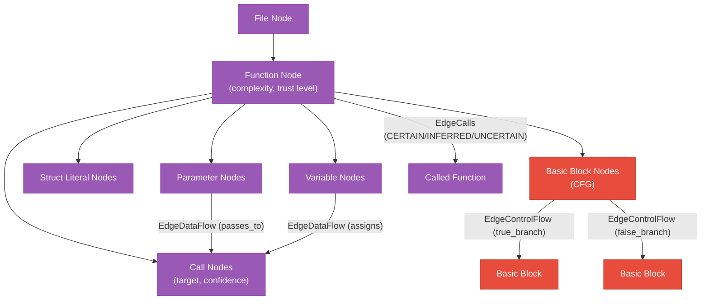
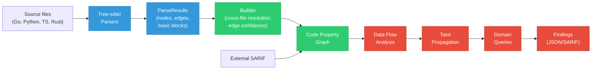

# Code Property Graph

The code property graph (CPG) is a multi-language representation of source code that supports data flow analysis, control flow graphs, taint propagation, and security queries across function boundaries.

## What is a CPG?

When you write code like `func main() { fmt.Println("hello") }`, the compiler first turns it into an **Abstract Syntax Tree (AST)**: a tree structure where each node represents a syntactic element (function declaration, call expression, string literal, etc.). The AST captures the structure of the code but not the relationships between different parts of the program.

A **Code Property Graph** goes further: it takes the AST and adds cross-references, data flow edges, control flow graphs, and semantic annotations. This means you can ask questions like "which functions call `exec.Command` with user-supplied input?" or "does tainted data reach a SQL sink without sanitization?" by traversing the graph rather than doing text search.

The analyzer builds its CPG using [tree-sitter](https://tree-sitter.github.io/tree-sitter/), a fast incremental parsing library. Tree-sitter produces a concrete syntax tree for each source file, which the builder then transforms into the CPG by resolving cross-file references and adding semantic edges. No compilation required.

## Supported Languages

| Language | Parser | Data Flow | Control Flow | Taint |
|----------|--------|-----------|--------------|-------|
| Go | tree-sitter-go | Yes | Yes | Yes |
| Python | tree-sitter-python | Yes | Yes | Yes |
| TypeScript | tree-sitter-typescript | Yes | Yes | Yes |
| Rust | tree-sitter-rust | Yes | Yes | Yes |

## Structure



### Node kinds

| Kind | Description |
|------|-------------|
| `File` | Source file |
| `Function` | Function or method declaration (carries complexity, param types, return type, trust level) |
| `Parameter` | Function parameter with type |
| `Call` | Function call expression (carries target, confidence) |
| `StructLiteral` | Composite literal (struct instantiation) |
| `Variable` | Variable assignment/usage within a function body |
| `BasicBlock` | Control flow graph basic block |

### Edge kinds

| Kind | Labels | Description |
|------|--------|-------------|
| `EdgeCalls` | | Function A calls function B (with confidence: CERTAIN, INFERRED, UNCERTAIN) |
| `EdgeContains` | | Containment (file contains function, function contains literal) |
| `EdgeAliases` | | Type alias relationship |
| `EdgeDataFlow` | `assigns`, `reads`, `passes_to`, `field_access`, `returns` | Data flow within a function body |
| `EdgeControlFlow` | `true_branch`, `false_branch`, `fallthrough`, `loop_back`, `loop_exit`, `exception`, `entry`, `exit` | Control flow between basic blocks |

### Edge Confidence

Call edges carry a confidence classification that indicates how reliable the resolution is:

| Confidence | When assigned |
|------------|---------------|
| `CERTAIN` | Same-package exact match, qualified name match |
| `INFERRED` | Cross-package short-name match, cross-language HTTP/subprocess calls |
| `UNCERTAIN` | Multiple candidates, interface method dispatch, dynamic dispatch, reflection |

Security queries never filter out UNCERTAIN edges. They use confidence to prioritize review order (CERTAIN first, then INFERRED, then UNCERTAIN).

### Typed Node Fields

Nodes carry typed fields instead of generic string maps:

- **Function nodes**: `Complexity` (cyclomatic), `ParamNames`, `ParamTypes`, `ReturnType`, `IsTest`, `IsUnsafe`, `IsExtern`, `TrustLevel`
- **Call nodes**: `CallTarget`, `IsMacro`
- **HTTP endpoint nodes**: `Route`, `HTTPMethod`
- **DB operation nodes**: `Operation`, `Table`
- **Struct literal nodes**: `StructType`, `FieldNames`

## Building the CPG

The CPG is built in stages: parse, assemble, analyze.



1. **Parsers** (`pkg/parser/`): Each language parser uses tree-sitter to parse source files and extract:
    - Function declarations with parameters, return types, and cyclomatic complexity
    - Function call expressions with arguments (detecting sensitive sinks)
    - Composite literals, variable assignments, field accesses
    - Basic blocks for control flow graph construction
    - Data flow edges (assigns, reads, passes_to) within function bodies

2. **Builder** (`pkg/builder/builder.go`): Assembles per-file parse results into the unified CPG:
    - Creates all nodes and edges
    - Resolves cross-file call references
    - Classifies edge confidence (CERTAIN, INFERRED, UNCERTAIN)
    - Merges basic blocks from parse results

3. **Annotators** (`pkg/annotator/`, `pkg/domains/`): Add semantic annotations:
    - Security annotations: `sec:executes_sql`, `sec:subprocess_call`, `sec:handles_request`, etc.
    - Trust level classification on HTTP handlers and entrypoints
    - Domain-specific labels for testing, upgrade analysis

4. **Taint Engine** (`pkg/dataflow/taint.go`): Two-phase taint propagation (see below)

5. **Domain Queries** (`pkg/domains/`): 20 rules across security, testing, and upgrade domains

## Data Flow Analysis

Intraprocedural data flow tracks how data moves within each function body:

| Edge Label | Meaning | Example |
|------------|---------|---------|
| `assigns` | Variable receives value from expression/call | `body, _ := io.ReadAll(r.Body)` |
| `reads` | Expression uses variable as input | `json.Unmarshal(body, &review)` |
| `passes_to` | Value passed as argument to a call | `db.Exec(query)` |
| `field_access` | Field/attribute access on a variable | `name := review.Request.Name` |
| `returns` | Variable is returned from function | `return result` |

**Go example chain:**
```
r.Body -> body -> json.Unmarshal -> review -> name -> query -> db.Exec
```

**Scope:** Intraprocedural only. Cross-function flow happens via call argument edges in the taint engine.

## Control Flow Graphs

Basic block construction within each function enables path-sensitive analysis. The function body is split into basic blocks at branch points (if/else, for, switch, match, try/catch, return).

This distinguishes:

```go
// Pattern 1: validation guards the dangerous operation
if !isValid(input) {
    return error        // Block 1: reject
}
dangerous(input)        // Block 2: only reached if valid

// Pattern 2: validation on independent path
if someCondition {
    validate(input)     // Block 1: some path
}
dangerous(input)        // Block 2: always reached
```

The taint engine uses CFG reachability to determine whether sanitizers are on ALL paths from source to sink, or only on some paths.

## Taint Propagation

Two-phase taint engine traces labeled data from sources to sinks:

**Phase A (intraprocedural):** Per-function taint propagation along data flow edges, filtered by CFG block reachability. Produces function summaries describing how taint flows through each function.

**Phase B (interprocedural):** Walks the call graph using Phase A summaries to trace taint across function boundaries. When taint reaches a call site with a resolved target, it propagates to the target function's parameter nodes.

**Sources:** User input handlers (`handles_user_input`, `sec:handles_request`), deserialization calls
**Sinks:** SQL execution, subprocess calls, command execution, template rendering, HTML output, file access, eval usage, external connections

**Limits:** Bounded by configurable depth (20), paths per source (100), and total visits (10K). Truncation diagnostics are emitted when any limit is hit, distinguishing "no findings" from "analysis was truncated."

## SARIF Ingestion

External static analyzer output (SARIF 2.1.0) can be ingested and mapped to CPG nodes:

1. Parse SARIF JSON (runs, results, locations)
2. Normalize file paths to repo-relative
3. Match each finding to the tightest-fitting CPG node at that location
4. Add `sarif:<tool>:<rule_id>` annotation to matched nodes

This enriches external findings with architecture context. A Semgrep finding at `handler.go:42` gains CPG context about trust level, RBAC permissions, and data flow paths.

**Validation:** Schema validation, path normalization (strips configurable prefix for containerized scanners), annotation sanitization (`[a-zA-Z0-9_-]`), 50K result size limit.

```bash
# Ingest standalone
arch-analyzer ingest gosec.sarif --graph code-graph.json --output enriched-graph.json

# Ingest during scan
arch-analyzer scan /path/to/repo --import-sarif gosec.sarif,semgrep.sarif
```

## Structural Diff

Compare two code-graph.json files to detect changes:

```bash
arch-analyzer diff base.json head.json --format text
```

Detects: new/removed functions, changed complexity, new call edges, trust level changes, new annotations. Useful for PR review automation and regression detection.

## Architecture Enrichment

When `--with-arch` is provided, the CPG gains an `ArchData` sidecar containing extracted architecture data (CRDs, RBAC, services, etc.). This enables queries that cross-reference code against architecture:

- CGA-U01: Compare CRD version references in code against extracted CRD schemas
- Architecture-aware taint analysis: Follow data through known API boundaries
- Finding enrichment: Add `ArchRef` to findings linking code to architecture components

## Thread Safety

The CPG implementation (`pkg/graph/cpg.go`) is thread-safe:

- `sync.RWMutex` protects all node and edge operations
- Multiple annotators can read concurrently
- Write operations (adding nodes/edges) are serialized

## Output

The CPG is serialized to `code-graph.json` with a schema version:

```json
{
  "schema_version": 2,
  "nodes": [...],
  "edges": [...],
  "taint_findings": [...]
}
```

Security findings are written to `security-findings.json` (JSON) or `findings.sarif` (SARIF 2.1.0).
