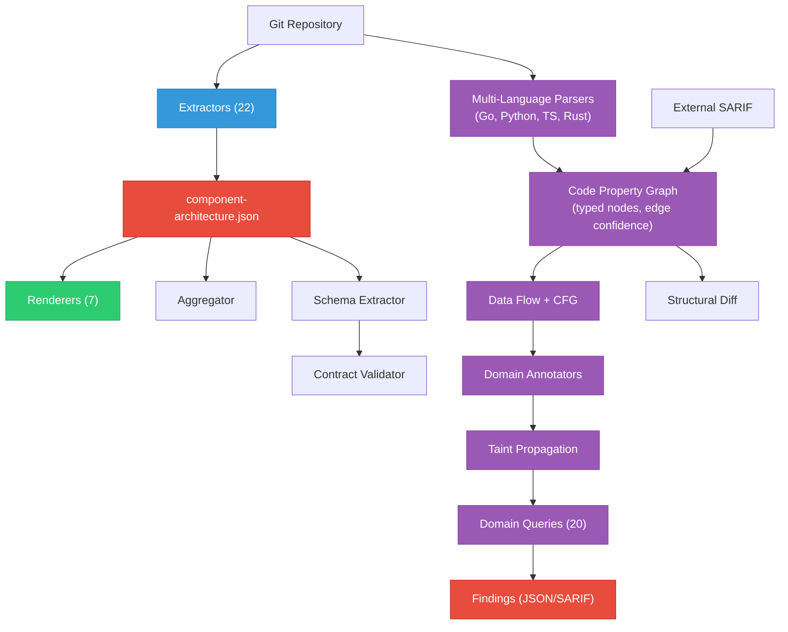

# Design Overview

The Architecture Analyzer is a deterministic static analysis tool. No LLM involvement, no non-determinism, no API calls. It reads a repository and produces structured architecture data plus a code property graph with security analysis.

## Core Pipeline



## Design Decisions

### Why static analysis?

- **Deterministic**: Same input always produces same output. No model variability.
- **Fast**: Full analysis of a typical K8s operator repo takes under 10 seconds.
- **Free**: No API calls, no token consumption. Run as often as you want.
- **Source-traceable**: Every fact in the output can be traced back to a specific file and line.

### Why extractors + renderers separation?

Extraction and rendering are decoupled through the JSON intermediate format:

- **Extract once, render many**: Extract JSON, then produce different visualizations without re-scanning
- **Aggregate**: Merge multiple JSON files for cross-component analysis
- **Custom processing**: Use the JSON with any tool (jq, Python, etc.)
- **CI artifacts**: Store JSON as build artifacts, render on demand

### Why tree-sitter?

- **No toolchain dependency**: Tree-sitter parses syntax without needing compilation to succeed
- **Multi-language**: Same approach works for Go, Python, TypeScript, and Rust with language-specific grammars
- **Fast incremental parsing**: Can parse individual files without resolving the full module graph
- **Partial-file resilience**: Parses what it can even if the file has errors

### Why a code property graph?

The CPG provides:

- **Cross-function analysis**: Trace data flow across function boundaries via taint propagation
- **Annotation layers**: Multiple domains (security, testing, upgrade) annotate the same graph
- **Composable queries**: Each query traverses the same graph independently
- **Architecture integration**: CPG nodes link to architecture data for cross-cutting analysis
- **Edge confidence**: Call resolution classified as CERTAIN, INFERRED, or UNCERTAIN so queries can prioritize
- **Path sensitivity**: Control flow graphs distinguish validation-guarded paths from unguarded ones

## Package Structure

```
pkg/
  extractor/      # 22 architecture extractors
  renderer/       # 7 diagram/report renderers
  aggregator/     # Platform-wide aggregation
  validator/      # CRD contract validation
  parser/         # Multi-language parsers (Go, Python, TypeScript, Rust)
                  # with CFG (basic block) construction per language
  builder/        # CPG builder (cross-file resolution, edge confidence)
  graph/          # CPG data structure (typed nodes, thread-safe)
  dataflow/       # Taint propagation engine (intraprocedural + interprocedural)
  diff/           # Structural diff engine for code graph comparison
  sarif/          # SARIF 2.1.0 ingestion and node mapping
  annotator/      # Annotation engine
  query/          # Query engine + base taint-to-sink queries
  domains/        # Pluggable domain framework
    security/     # Security domain (12 queries, multi-language annotators)
    testing/      # Testing domain (4 queries)
    upgrade/      # Upgrade domain (4 queries)
  linker/         # Storage linker (DB operations to schemas)
  arch/           # Architecture data types and parsing
  config/         # Configuration types
```

## Data Flow

1. **Input**: Path to a git repository (local checkout)
2. **YAML extraction**: Walk filesystem for Kubernetes manifests, parse into typed structs
3. **Go source extraction**: Parse controller files for watches, endpoints, cache config, operator constants, reconcile sequences, Prometheus metrics, status conditions, and platform detection
4. **File extraction**: Parse Dockerfiles, Helm charts, go.mod
5. **Assembly**: All extracted data merged into `ComponentArchitecture` struct
6. **Serialization**: JSON output (`component-architecture.json`)
7. **Rendering**: Each renderer reads JSON, produces its format
8. **CPG** (optional): Tree-sitter parses source files across 4 languages, builds typed node graph with data flow edges, control flow graphs, and edge confidence
9. **SARIF ingestion** (optional): External scanner findings mapped to CPG nodes
10. **Taint analysis**: Two-phase propagation (intraprocedural summaries, then interprocedural call graph walk)
11. **Domain queries**: 20 rules across security, testing, and upgrade domains produce findings
12. **Aggregation** (optional): Multiple component JSONs merged into platform view
13. **Validation** (optional): CRD schemas compared against baseline contracts
14. **Diff** (optional): Structural comparison of two code graphs for regression detection
