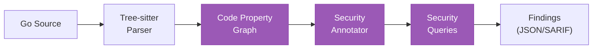

# Security Scanning

The analyzer builds a code property graph (CPG) from Go source code and runs security queries to detect vulnerabilities.

## Usage

```bash
# JSON output
arch-analyzer scan /path/to/repo --format json --output findings.json

# SARIF output (for GitHub Code Scanning, VS Code, etc.)
arch-analyzer scan /path/to/repo --format sarif --output findings.sarif

# With architecture data enrichment
arch-analyzer scan /path/to/repo --with-arch /path/to/component-architecture.json

# Run specific domains only
arch-analyzer scan /path/to/repo --domains security,testing
```

## Security queries

The security domain runs these queries against the CPG:

| Query ID | Name | What it detects |
|----------|------|-----------------|
| CGA-003 | Taint Analysis | Data flows from untrusted sources to sensitive sinks |
| CGA-004 | Hardcoded Secrets | API keys, passwords, tokens in source code |
| CGA-005 | SQL Injection | Unsanitized input in database queries |
| CGA-006 | Missing Auth | HTTP endpoints without authentication checks |
| CGA-007 | Unconverted CRD | References to deprecated CRD versions |
| CGA-008 | Dangerous Functions | Usage of known-unsafe functions |
| CGA-009 | Source Trust | Trust boundary violations in data flow |

## Extraction-phase security checks

In addition to CPG queries, the analyzer runs security checks during the extraction phase. These inspect the parsed architecture data (RBAC, Deployments, Services, workflows) and produce `SecurityAnnotation` findings.

### SCAFFOLDING_NAME_COLLISION

Detects Kubernetes resources using default kubebuilder/operator-sdk scaffolding names that collide when multiple operators are deployed to the same namespace.

- **Severity**: medium
- **Resources checked**: ClusterRoles, Roles, ClusterRoleBindings, RoleBindings, Deployments, Services
- **Flagged names**: `controller-manager`, `controller-manager-metrics-monitor`, `controller-manager-metrics-service`, `leader-election-role`, `leader-election-rolebinding`, `manager-role`, `manager-rolebinding`, `proxy-role`, `proxy-rolebinding`, `metrics-reader`, `metrics-auth-role`, `metrics-auth-rolebinding`
- **Why it matters**: `kubebuilder init` scaffolds all operators with the same generic names. When ODH manages multiple operators (e.g., MLFlow + MCP Lifecycle), these names collide causing ownerReference conflicts at deploy time.
- **Remediation**: Prefix resource names with the operator name in kustomize overlays (e.g., `mlflow-operator-controller-manager-metrics-monitor`).

### GHA_PULL_REQUEST_TARGET

Detects GitHub Actions workflows using the `pull_request_target` trigger combined with `actions/checkout` of fork code (the "pwn-request" pattern).

- **Severity**: critical
- **Why it matters**: `pull_request_target` runs with write access to the base repo's secrets. Checking out fork code in that context allows arbitrary code execution with elevated privileges.
- **FP guards**: only flags when BOTH conditions are met (trigger + fork checkout ref). Default checkout (no `ref:`) is safe.

### GHA_MISSING_PERMISSIONS

Detects GitHub Actions workflows without a top-level `permissions:` block.

- **Severity**: high
- **Why it matters**: without explicit permissions, the GITHUB_TOKEN gets default permissions which may include write access to contents, packages, and more.
- **FP guards**: skips reusable-only workflows (`on: workflow_call`). Accepts job-level permissions as sufficient.

### GHA_UNPINNED_ACTION

Detects GitHub Actions referenced by mutable tag instead of SHA pin.

- **Severity**: medium
- **Why it matters**: a compromised action version can inject malicious code into the workflow. SHA pinning ensures reproducibility.
- **FP guards**: skips local actions (`./`), Docker actions (`docker://`). Accepts both SHA-1 (40-char) and SHA-256 (64-char) pins.

### Other extraction-phase checks

| Type | Severity | What it detects |
|------|----------|-----------------|
| `RBAC_CLUSTER_SCOPE_SENSITIVE` | high/medium | ClusterRoles granting cluster-wide CRUD on secrets, CRBs, SCCs, nodes, pods/exec |
| `SECRET_IN_CONTAINER_ARGS` | medium | Container args/command referencing secrets via `$(VAR)`, exposed in /proc/1/cmdline |
| `CRD_CONFUSED_DEPUTY` | high | CRDs with user-settable image fields deployed with operator ServiceAccount |
| `MISSING_AUTH_REQUIREMENT` | high | Optional auth components with mutual exclusion but no "at least one" rule |
| `ROUTE_NO_TLS` | medium | OpenShift Routes with no `spec.tls` block |
| `HARDCODED_SECRET_VALUE` | high | Known placeholder secrets (password, changeme, admin) in manifests |
| `PERMISSIVE_PASSWORD_ENV` | medium | ALLOW_EMPTY_PASSWORD, DISABLE_AUTH flags set to true |
| `AUTH_BYPASS_ARG` | medium | Flags like --skip-auth-regex, --insecure-skip-tls-verify in container args |
| `DEBUG_ENDPOINT_PPROF` | medium | pprof debug endpoint imports/registration in Go source |
| `KUSTOMIZE_SECURITY_DELETION` | high | Kustomize overlays deleting security resources (NetworkPolicies, RBAC) |
| `SECRET_IN_URL` | medium | Credentials embedded in URLs (api_key=, token=, password=) |

## How it works

1. **Parse**: Tree-sitter parses all Go source files into ASTs
2. **Build CPG**: Functions, parameters, calls, struct literals are extracted into a graph
3. **Annotate**: Domain-specific annotators add security metadata to CPG nodes
4. **Query**: Security queries traverse the annotated graph looking for vulnerability patterns
5. **Report**: Findings are emitted with file:line references and severity



## Architecture enrichment

When `--with-arch` is provided, the CPG is enriched with architecture data. This enables cross-cutting queries:

- **CGA-U01** (Unconverted CRD): Compares CRD versions in code against extracted CRD schemas
- Architecture-aware taint analysis: Traces data flow through known API boundaries
- Finding annotations include `ArchRef` linking to the relevant architecture component

```bash
# First extract architecture
arch-analyzer extract /path/to/repo --output arch.json

# Then scan with architecture context
arch-analyzer scan /path/to/repo --with-arch arch.json --format sarif --output findings.sarif
```

## SARIF integration

SARIF output integrates with:

- **GitHub Code Scanning**: Upload via `github/codeql-action/upload-sarif`
- **VS Code SARIF Viewer**: Open `.sarif` files directly
- **Azure DevOps**: Native SARIF support in Advanced Security

## Domain-specific scanning

Beyond security, two additional domains are available:

| Domain | Queries | Description |
|--------|---------|-------------|
| `testing` | Test coverage, mock usage | Identifies untested code paths and test patterns |
| `upgrade` | Deprecation detection | Tracks API version compatibility issues |

```bash
# List all registered domains
arch-analyzer domains

# Run specific domains
arch-analyzer scan /path/to/repo --domains security,testing
```

See [Domains reference](../reference/domains.md) for full details.
