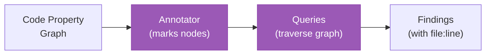

# Domains

The domain analysis framework provides pluggable analysis capabilities on top of the code property graph.

## Registered Domains

| Domain | Languages | Dependencies | Queries |
|--------|-----------|-------------|---------|
| `security` | Go, Python, TypeScript, Rust | None | 12 rules (CGA-003 to CGA-014) |
| `testing` | Go | security | 4 rules (CGA-T01 to CGA-T04) |
| `upgrade` | Go | None | 4 rules (CGA-U01 to CGA-U04) |

Additionally, the base query engine provides 2 core queries (CGA-001, CGA-002) that run independently of domains.

## Domain Architecture

Each domain consists of three components:



1. **Annotator**: Walks CPG nodes and adds domain-specific metadata (annotations). Each language has its own annotator (e.g., `go_annotator.go`, `python_annotator.go`).
2. **Queries**: Traverse the annotated graph looking for patterns. Queries can use typed node fields (complexity, trust level), edge confidence, and annotations.
3. **Findings**: Results with file:line references, severity, and optional architecture cross-references.

## Base Queries

These run independently of domains via the query engine (`pkg/query/engine.go`):

| Query ID | Name | Severity | Description |
|----------|------|----------|-------------|
| CGA-001 | Missing Auth | High | HTTP handlers or entrypoints without authentication middleware |
| CGA-002 | Cross-Storage Taint | High | Tainted data flowing from user input to storage sinks |

## Security Domain

### Annotator

Multi-language annotators (`go_annotator.go`, `python_annotator.go`, `typescript_annotator.go`, `rust_annotator.go`) mark CPG nodes with security-relevant metadata:

- **Source annotations**: `handles_user_input`, `sec:handles_request`, `sec:deserializes_input`
- **Sink annotations**: `sec:executes_sql`, `sec:subprocess_call`, `sec:command_execution`, `sec:renders_html`, `sec:template_render`, `sec:file_access`, `sec:eval_usage`
- **Auth annotations**: Authentication/authorization function calls
- **Secret annotations**: Potential hardcoded credentials

### Queries

| Query ID | Name | Severity | Description |
|----------|------|----------|-------------|
| CGA-003 | webhook-missing-update | High | Webhooks intercepting CREATE but not UPDATE operations |
| CGA-004 | rbac-precedence-bug | High | Conflicting RBAC rules across bindings |
| CGA-005 | cert-as-ca | High | Certificate used as CA without proper validation |
| CGA-006 | cross-namespace-secret | High | Secret access crossing namespace boundaries |
| CGA-007 | unfiltered-cache | Medium | Watched types without cache filters (OOM risk) |
| CGA-008 | plaintext-secrets | Medium | Hardcoded secrets or credentials in source |
| CGA-009 | weak-serial-entropy | Medium | Weak randomness in security-sensitive contexts |
| CGA-010 | complexity-hotspot | Medium | High-complexity functions with security annotations |
| CGA-011 | untrusted-endpoint | Info | HTTP endpoints without recognized auth middleware |
| CGA-012 | unprotected-ingress | High | Ingress routes without TLS or auth configuration |
| CGA-013 | overprivileged-secret-access | Medium | Broad secret access beyond operational needs |
| CGA-014 | uncontrolled-egress | Medium | Outbound connections without network policy |

## Testing Domain

### Annotator

Marks nodes with testing metadata:

- Test function detection (`Test*`, `Benchmark*`)
- Mock/fake usage patterns (interface mocks, fake clients)
- Table-driven test detection

### Queries

| Query ID | Name | Severity | Description |
|----------|------|----------|-------------|
| CGA-T01 | untested-security-func | Medium | Security-annotated functions without corresponding test functions |
| CGA-T02 | fake-only-integration | Low | Integration tests using only fakes/mocks, no real dependencies |
| CGA-T03 | missing-error-paths | Medium | Error return paths without test coverage |
| CGA-T04 | consolidation-opportunity | Low | Duplicate test patterns that could be consolidated |

## Upgrade Domain

### Annotator

Marks nodes with upgrade-relevant metadata:

- Deprecated API version usage (v1beta1, v1alpha1)
- Feature gate references
- Version-dependent code paths

### Queries

| Query ID | Name | Severity | Description |
|----------|------|----------|-------------|
| CGA-U01 | unconverted-crd | Medium | CRDs still using v1beta1 when v1 is available |
| CGA-U02 | pre-release-api-usage | Low | Usage of alpha/beta Kubernetes APIs |
| CGA-U03 | ungated-feature | Medium | Features without feature gate protection |
| CGA-U04 | unchecked-version-access | Low | Version-dependent code without version checks |

## Using Domains

```bash
# List registered domains
arch-analyzer domains

# Run all domains
arch-analyzer scan /path/to/repo

# Run specific domains
arch-analyzer scan /path/to/repo --domains security,testing

# With architecture enrichment
arch-analyzer scan /path/to/repo --domains security --with-arch

# With external SARIF findings
arch-analyzer scan /path/to/repo --import-sarif gosec.sarif,semgrep.sarif
```

## Domain Orchestrator

The orchestrator (`pkg/domains/orchestrator.go`) handles domain execution:

1. Reads domain dependencies via `Dependencies()` method
2. Performs topological sort to determine execution order (e.g., testing depends on security)
3. Runs annotators in dependency order
4. Runs taint analysis (if data flow edges are present)
5. Runs queries after all annotators complete
6. Collects findings grouped by domain

Domains without dependencies can run their annotators in parallel.

## Adding a Custom Domain

A domain needs:

1. `analyzer.go`: Implements `DomainAnalyzer` interface
2. `annotations.go`: Defines annotation types
3. Language-specific annotators (e.g., `go_annotator.go`)
4. `queries.go`: Implements query functions returning `[]query.Finding`
5. Registration in `pkg/domains/registry.go`
