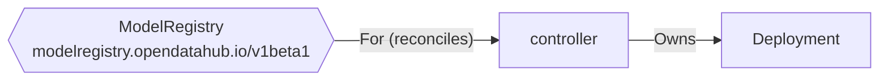
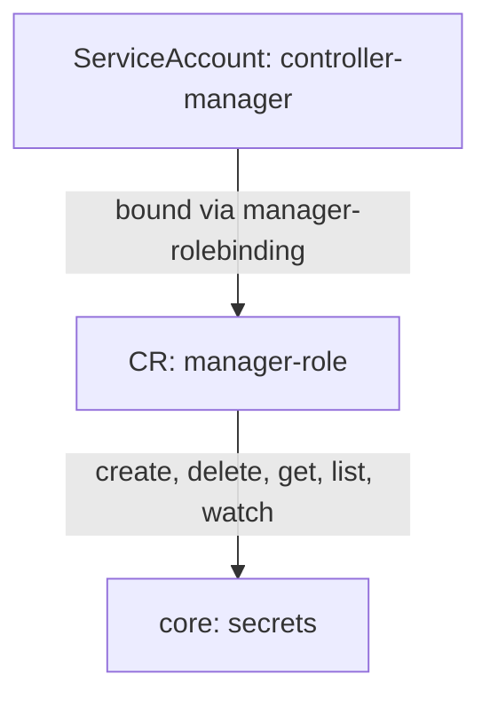

# Output Format

The architecture analyzer produces several output files depending on the command used. This page documents every output file, how it is generated, and what it provides.

## Output by command

| Command | Output files |
|---------|-------------|
| `analyze` | `component-architecture.json`, `diagrams/*` (7 files) |
| `full-analysis` | All `analyze` outputs + `security-findings.json`, `code-graph.json`, `build-config.json`, `schemas/*.json`, `snapshot-metadata.json` |
| `scan` | `security-findings.json` (or SARIF) |
| `context-bundle` | `.srclg` (SrcLang XML) |
| `quick-index` | `quick-index.json` |
| `aggregate` | `platform-architecture.json`, `diagrams/*` (5 files) |
| `extract-schema` | `schemas/*.json` |
| `sbom` | CycloneDX 1.5 JSON |
| `report` | Image/container analysis markdown |

---

## Architecture extraction outputs

### component-architecture.json

**Produced by:** `analyze`, `extract`, `full-analysis`

The core output. Contains all data extracted by the 22 extractor groups from a single repository. This is the source of truth for everything else: diagrams, reports, security annotations, and SrcLang context bundles are all derived from this data.

```json
{
  "component": "my-operator",
  "repo": "github.com/org/my-operator",
  "commit_sha": "abc123def456",
  "extracted_at": "2026-07-14T10:30:00Z",
  "analyzer_version": "0.2.2",
  "crds": [],
  "rbac": {},
  "services": [],
  "deployments": [],
  "network_policies": [],
  "controller_watches": {},
  "dependencies": {},
  "secrets_referenced": [],
  "dockerfiles": [],
  "helm": {},
  "webhooks": [],
  "configmaps": [],
  "http_endpoints": [],
  "ingress_routing": [],
  "external_connections": [],
  "feature_gates": [],
  "cache_config": {},
  "operator_config": [],
  "reconcile_sequences": [],
  "prometheus_metrics": [],
  "status_conditions": [],
  "platform_detection": {},
  "template_files": [],
  "security_annotations": []
}
```

#### Key types

**CRD**: Custom Resource Definitions with field counts, validation rules, and source paths.

```json
{
  "group": "datasciencecluster.opendatahub.io",
  "version": "v1",
  "kind": "DataScienceCluster",
  "scope": "Cluster",
  "field_count": 42,
  "validation_rules": ["has(self.kubeRBACProxy) || has(self.oauthProxy)"],
  "source": "config/crd/bases/datasciencecluster.yaml"
}
```

**RBAC**: ClusterRoles, Roles, RoleBindings, and kubebuilder RBAC markers.

```json
{
  "cluster_roles": [
    {
      "name": "manager-role",
      "rules": [
        {
          "api_groups": [""],
          "resources": ["secrets"],
          "verbs": ["get", "list", "watch", "create", "update", "delete"]
        }
      ],
      "source": "config/rbac/role.yaml"
    }
  ]
}
```

**Deployments**: Container images, args, commands, env var references, security contexts, probes, resource limits. Extracted from YAML manifests and `.yaml.tmpl` template files.

```json
{
  "name": "controller-manager",
  "kind": "Deployment",
  "source": "config/manager/manager.yaml",
  "containers": [
    {
      "name": "manager",
      "image": "quay.io/org/controller:latest",
      "args": ["--leader-elect", "--database-dsn=$(DB_PASSWORD)"],
      "env_var_refs": [
        {"name": "DB_PASSWORD", "secret_name": "db-creds", "secret_key": "password"}
      ]
    }
  ]
}
```

**Ingress Routing**: Gateway API, OpenShift Routes, Istio VirtualServices, and Kubernetes Ingress resources. Extracted from YAML and `.yaml.tmpl` files.

```json
{
  "kind": "Route",
  "name": "http-route",
  "hosts": [],
  "paths": [],
  "backend": "my-service",
  "tls": false,
  "source": "internal/controller/config/templates/http-route.yaml.tmpl"
}
```

Supported kinds: `Gateway`, `HTTPRoute`, `Ingress`, `VirtualService`, `DestinationRule`, `ServiceEntry`, `Route`.

**Template Files**: Go template files (`.yaml.tmpl`) with Kubernetes resource kinds and conditional guards.

```json
{
  "path": "internal/controller/config/templates/deployment.yaml.tmpl",
  "resource_kinds": ["Deployment"],
  "conditionals": [".Spec.Postgres", ".Spec.MySQL"]
}
```

**Security Annotations**: Security evaluation results from static analysis of the extracted data. These are also surfaced as `SEC-*` findings in `security-findings.json`.

```json
{
  "type": "RBAC_CLUSTER_SCOPE_SENSITIVE",
  "severity": "high",
  "resource": "secrets",
  "verbs": ["create", "update", "patch", "delete"],
  "source": "config/rbac/role.yaml",
  "description": "ClusterRole \"manager-role\" grants cluster-wide create/update/patch/delete secrets"
}
```

| Type | What it detects |
|------|-----------------|
| `RBAC_CLUSTER_SCOPE_SENSITIVE` | ClusterRoles granting cluster-wide CRUD on secrets, CRBs, SCCs, nodes, pods/exec |
| `SECRET_IN_CONTAINER_ARGS` | Container args/command referencing secrets via `$(VAR)`, exposed in /proc/1/cmdline |
| `CRD_CONFUSED_DEPUTY` | CRDs with user-settable image fields deployed with operator ServiceAccount |
| `MISSING_AUTH_REQUIREMENT` | Optional auth components with mutual exclusion but no "at least one" rule |
| `ROUTE_NO_TLS` | OpenShift Routes with no `spec.tls` block |
| `GHA_UNPINNED_ACTION` | GitHub Actions using tag references instead of SHA pins |
| `GHA_MISSING_PERMISSIONS` | Workflows without explicit permissions blocks |

**Other types** documented in the JSON structure: Controller Watches, Dependencies, External Connections, Feature Gates, Cache Config, Operator Config, Reconcile Sequences, Prometheus Metrics, Status Conditions, Platform Detection.

---

### Diagram and report outputs (diagrams/)

**Produced by:** `analyze`, `full-analysis` (in `diagrams/` subdirectory)

Seven files generated from `component-architecture.json`:

#### component-report.md

Human-readable architecture summary with clickable GitHub source links. This is the most useful output for review agents and humans who need a quick overview of a component's architecture.

Sections:

- **APIs Exposed**
    - CRDs: group, version, kind, scope, field count, CEL validation rule count, discovery method (YAML, Go AST, or both), source file
    - Webhooks: name, type (validating/mutating/conversion), path, failure policy, service reference, kustomize overlays, enable conditions, Go AST-extracted mutation/validation behavior (fields, operations, conditions)
    - HTTP Endpoints: method, path, source file
- **Dependencies**
    - Internal platform dependencies: which ODH/RHOAI components this operator depends on, with interaction type (Go module, CRD watch, code reference)
    - Key external dependencies: filtered to notable modules (controller-runtime, client-go, k8s.io/api, etc.) with versions
- **Network Architecture**
    - Services: name, type (ClusterIP/NodePort/LoadBalancer), ports with protocol, source file
    - Ingress/Routing: kind (Route/Ingress/Gateway/HTTPRoute), name, hosts, paths, TLS status, source file
    - Network Policies: name, policy types (Ingress/Egress), source file
- **Security**
    - Cluster Roles: name, resources, verbs, source file (one row per RBAC rule)
    - Kubebuilder RBAC Markers: file, line, API groups, resources, verbs (from `+kubebuilder:rbac` annotations in Go source)
    - Secrets Referenced: name, type (Opaque/TLS/etc.), referenced-by list
    - Container Security Contexts: deployment, container, runAsNonRoot, readOnlyRootFilesystem, privileged, source file
- **Configuration**
    - ConfigMaps: name, data keys, source file
    - Helm: chart name and version (if Helm-based)
- **Build**
    - Dockerfiles: path, base image, stage count, USER directive, exposed ports, architectures, FIPS enabled, issues (unpinned base, missing USER, etc.)
- **Controller Watches**
    - Watch registrations: type (For/Owns/Watches), GVK, source file
    - Programmatic resource operations: verb (create/update/delete), kind, API group, conditional guard (extracted from Go AST)
- **Cache Architecture** (when cache config is detected)
    - Manager configuration: manager file, cache scope, DefaultTransform, GOMEMLIMIT, container memory limit
    - Filtered types: type, filter kind, filter expression
    - Cache-bypassed types (DisableFor)
    - Transform-stripped types
    - Implicit informers with OOM risk assessment
    - Issues and recommendations

#### component.mmd

Mermaid graph diagram showing the component architecture: CRDs as red nodes, controllers as blue nodes, owned resources as green nodes, external dependencies. Shows For/Owns/Watches relationships between controllers and resources.



#### rbac.mmd

Mermaid graph showing the RBAC permission hierarchy: ServiceAccounts bound to Roles/ClusterRoles via RoleBindings/ClusterRoleBindings, with resource access arrows showing which API resources each role can access.



#### dependencies.mmd

Mermaid graph showing Go module dependencies, highlighting platform-internal modules and key external libraries.

#### dataflow.mmd

Mermaid graph showing data flow between controllers, CRDs, external systems (databases, object storage, messaging), and storage backends.

#### c4-context.dsl

Structurizr DSL file for C4 context diagrams. Defines system boundaries, containers (one per deployment), external systems (Kubernetes API, databases), and person actors (Platform Admin, Data Scientist).

```
workspace {
    model {
        admin = person "Platform Admin" "Manages the OpenShift AI platform"
        my_system = softwareSystem "my-operator" {
            container_manager = container "controller-manager" "..." "port 9443/TCP"
        }
        kubernetes_api = softwareSystem "Kubernetes API" "Cluster API server"
    }
}
```

#### security-network.txt

ASCII art diagram showing the security and network architecture in layers: network topology (services with ports and TLS), network policies (ingress/egress rules with namespace selectors), RBAC surface (cluster roles with resource permissions), and deployment security (container security contexts, probes, resource limits).

```
================================================================================
  NETWORK TOPOLOGY
================================================================================
--- Services -------------------------------------------------------------------
  [ClusterIP] my-service
    Port: 8443 -> 9443/TCP [https] (TLS)
--- Network Policies -----------------------------------------------------------
  [Policy] default-network-policy
    Ingress: from namespace-selector app=my-operator
    Ports: 8443/TCP
```

---

## Code graph outputs

### security-findings.json

**Produced by:** `full-analysis`, `scan`

Array of findings from three sources: CPG domain queries (CGA-* rules), security evaluation annotations (SEC-* rules), and external SARIF ingestion.

```json
[
  {
    "rule_id": "CGA-S01",
    "severity": "high",
    "message": "Webhook handler accepts untrusted input without validation",
    "file": "pkg/webhook/handler.go",
    "line": 42,
    "domain": "security",
    "architecture_ref": ""
  },
  {
    "rule_id": "SEC-RBAC-001",
    "severity": "high",
    "message": "ClusterRole \"manager-role\" grants cluster-wide create/update/patch/delete secrets",
    "file": "config/rbac/role.yaml",
    "domain": "security",
    "architecture_ref": "security_annotations:RBAC_CLUSTER_SCOPE_SENSITIVE"
  }
]
```

Finding sources:

- **CGA-\* rules**: CPG domain query results from security, testing, upgrade, architecture, and netpolicy domains
- **SEC-\* rules**: Security evaluation annotations (SEC-RBAC, SEC-SECRET, SEC-ROUTE, SEC-CRD, SEC-AUTH, SEC-GHA)
- **External SARIF**: Findings ingested via `--import-sarif` flag, with tool name and version preserved

### code-graph.json

**Produced by:** `full-analysis`, `graph`

The code property graph. Contains all nodes and edges from tree-sitter parsing and call resolution.

```json
{
  "schema_version": 2,
  "nodes": [],
  "edges": []
}
```

**Node kinds**: `Function`, `CallSite`, `HTTPEndpoint`, `DBOperation`, `StructLiteral`, `Variable`, `Parameter`, `BasicBlock`, `Class`, `ExternalFinding`.

**Edge kinds**: `EdgeCalls` (with confidence: CERTAIN/INFERRED/UNCERTAIN), `EdgeDataFlow`, `EdgeContains`, `EdgeStorageLink`, `EdgeTaint`, `EdgeControlFlow`.

### build-config.json

**Produced by:** `full-analysis`, `build-config`

Build metadata extracted from Dockerfiles, OLM bundle, and CI configuration.

```json
{
  "ocp_versions": {"min": "4.14", "max": "4.17"},
  "architectures": ["amd64", "arm64"],
  "go_version": "1.22",
  "base_images": ["registry.access.redhat.com/ubi9/go-toolset:1.22"],
  "fips_enabled": false,
  "olm": {"default_channel": "stable", "channels": ["stable", "alpha"]}
}
```

### schemas/*.json

**Produced by:** `full-analysis`, `extract-schema`

CRD JSON schemas extracted from `openAPIV3Schema` in CRD YAML files. One file per CRD, named `<group>_<version>_<kind>.json`. Used for contract validation to detect breaking API changes between versions.

---

## SrcLang context bundle (.srclg)

**Produced by:** `context-bundle`

Structured XML format for LLM agent consumption. Contains a domain-specialized view of the repository with semantic annotations, optimized for review agents. Reduces raw source (150K-1M tokens) to 15-25K tokens of security-relevant or architecture-relevant content.

```xml
<?xml version="1.0" encoding="UTF-8"?>
<srclang version="0.0.1" xmlns="https://srclang.dev/ns/core/0">
  <head>
    <producer>arch-analyzer 0.2.2</producer>
    <repository uri="https://github.com/org/my-operator">
      <commit sha="abc1234"/>
    </repository>
    <component>my-operator</component>
    <extracted>2026-07-14T10:00:00Z</extracted>
    <layer name="security"/>
    <languages><language name="go"/></languages>
    <platform name="RHOAI" components="38">
      <inbound><edge from="other-component" type="go-module"/></inbound>
      <outbound><edge to="kserve" type="code-ref"/></outbound>
    </platform>
  </head>
  <body>
    <layer name="security">
      <finding id="ext-RBAC_CLUSTER_SCOPE_SENSITIVE-001" domain="extraction"
               severity="high" rule="RBAC_CLUSTER_SCOPE_SENSITIVE">
        <source file="config/rbac/role.yaml"/>
        <title>ClusterRole grants cluster-wide secrets CRUD</title>
        <description>...</description>
      </finding>
      <file path="pkg/webhook/handler.go" language="go">
        <function name="Handle" kind="method" trust="untrusted" taint-role="source">
          <source line="42"/>
          <params><param name="ctx" type="context.Context"/></params>
          <metrics complexity="8" lines="35"/>
          <code><![CDATA[func (h *Handler) Handle(...) { ... }]]></code>
        </function>
      </file>
      <resource kind="ClusterRole" name="manager-role">
        <source file="config/rbac/role.yaml"/>
        <summary>45 rules</summary>
      </resource>
      <relationship kind="calls">
        <from function="Handle" file="pkg/webhook/handler.go" line="42"/>
        <to function="Create" file="pkg/client/client.go" resolved="false"/>
      </relationship>
    </layer>
  </body>
</srclang>
```

Available layers:

| Layer | Content |
|-------|---------|
| `security` | Security-relevant functions with full source code, taint paths, RBAC surface, network policies, findings from CPG queries and extraction annotations |
| `architecture` | CRDs, controller watches, reconcile sequences, external connections, API surface |

---

## Quick index (quick-index.json)

**Produced by:** `quick-index`

Lightweight function and call graph index from tree-sitter parsing. Runs tree-sitter + call edge resolution only (no taint analysis, no domain queries, no storage linking). Designed for fast function lookup and caller/callee verification.

```json
{
  "schema_version": 1,
  "repo_path": "/path/to/repo",
  "indexed_at": "2026-07-14T12:00:00Z",
  "stats": {
    "functions": 282,
    "call_sites": 4660,
    "call_edges": 1737,
    "http_endpoints": 0,
    "db_operations": 0,
    "classes": 0,
    "parse_time_ms": 70
  },
  "functions": [
    {
      "name": "Reconcile",
      "file": "controllers/reconciler.go",
      "line": 45,
      "end_line": 120,
      "language": "go",
      "kind": "method",
      "receiver": "MyReconciler",
      "params": ["ctx context.Context", "req ctrl.Request"],
      "return_type": "ctrl.Result, error",
      "complexity": 12
    }
  ],
  "calls": [
    {
      "caller": "r.Reconcile",
      "caller_file": "controllers/reconciler.go",
      "callee": "Create",
      "callee_file": "pkg/client/client.go",
      "line": 67,
      "confidence": "certain"
    }
  ],
  "http_endpoints": [],
  "db_operations": [],
  "classes": []
}
```

Performance: 70ms for a 282-function repo, 526ms for a 4725-function repo.

---

## Platform aggregation outputs

**Produced by:** `aggregate`

### platform-architecture.json

Merged view of all component architectures in a platform.

```json
{
  "platform": "OpenShift AI",
  "component_count": 38,
  "components": ["kserve", "odh-model-controller", "..."],
  "dependency_graph": [
    {"from": "odh-model-controller", "to": "kserve", "type": "go-module"}
  ],
  "component_data": [],
  "crd_ownership": {},
  "rbac_cluster_roles": [],
  "secrets_referenced": [],
  "services": []
}
```

### Platform diagrams

| File | Format | What it provides |
|------|--------|-----------------|
| `platform-dependencies.mmd` | Mermaid | Cross-component dependency graph |
| `platform-crd-ownership.mmd` | Mermaid | Which components own which CRDs |
| `platform-rbac-overview.mmd` | Mermaid | RBAC permissions across all components |
| `platform-network-topology.mmd` | Mermaid | Network policy mesh across namespaces |
| `PLATFORM.md` | Markdown | Platform-level summary report |

---

## Security findings (SARIF)

**Produced by:** `scan --format sarif`

Standard SARIF 2.1.0 format compatible with GitHub Code Scanning.

```json
{
  "$schema": "https://raw.githubusercontent.com/oasis-tcs/sarif-spec/master/Schemata/sarif-schema-2.1.0.json",
  "version": "2.1.0",
  "runs": [
    {
      "tool": {
        "driver": {
          "name": "architecture-analyzer",
          "version": "0.2.2",
          "rules": []
        }
      },
      "results": []
    }
  ]
}
```
