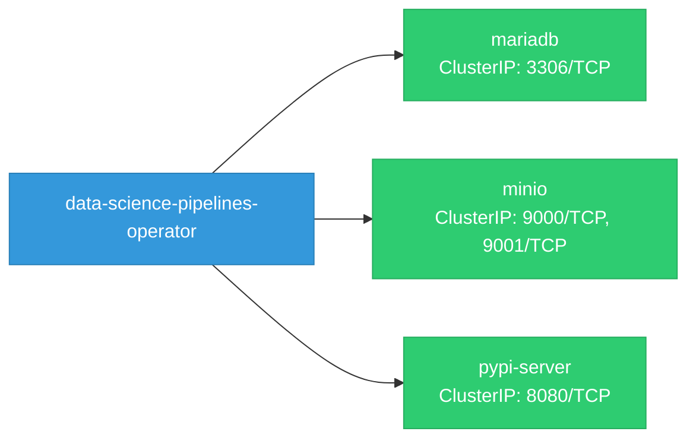

# data-science-pipelines-operator: Network

## Service Map

### Services

| Name | Type | Ports | Source |
|------|------|-------|--------|
| mariadb | ClusterIP | 3306/TCP | `.github/resources/mariadb/service.yaml` |
| minio | ClusterIP | 9000/TCP, 9001/TCP | `.github/resources/minio/service.yaml` |
| pypi-server | ClusterIP | 8080/TCP | `.github/resources/pypiserver/base/service.yaml` |

!!! warning "No Network Policies"
    No NetworkPolicy resources found. All pod-to-pod traffic is allowed by default.

