# data-science-pipelines-operator: RBAC

## RBAC Hierarchy

ServiceAccount bindings, roles, and resource permissions.

```mermaid
graph TD
    %% RBAC hierarchy for data-science-pipelines-operator
    classDef sa fill:#4a90d9,stroke:#2c5f8a,color:#fff
    classDef role fill:#e8a838,stroke:#b07828,color:#fff
    classDef resource fill:#5cb85c,stroke:#3d8b3d,color:#fff

    sa_2["ServiceAccount: controller-manager (datasciencepipelinesapplications-controller)"] -->|bound via manager-argo-rolebinding| crb_1["manager-argo-rolebinding"]
    class sa_2 sa
    crb_1 -->|grants| cr_manager_argo_role["CR: manager-argo-role"]
    class cr_manager_argo_role role
    sa_4["ServiceAccount: controller-manager (datasciencepipelinesapplications-controller)"] -->|bound via manager-rolebinding| crb_3["manager-rolebinding"]
    class sa_4 sa
    crb_3 -->|grants| cr_manager_role["CR: manager-role"]
    class cr_manager_role role
    sa_6["ServiceAccount: controller-manager"] -->|bound via leader-election-rolebinding| rb_5["leader-election-rolebinding"]
    class sa_6 sa
    rb_5 -->|grants| r_leader_election_role["Role: leader-election-role"]
    class r_leader_election_role role
    cr_aggregate_dspa_admin_edit -->|get, list, watch, create, update, patch, delete| res_7["datasciencepipelinesapplications.opendatahub.io: datasciencepipelinesapplications"]
    class res_7 resource
    cr_aggregate_dspa_admin_edit -->|get, list, watch, create, update, patch, delete| res_8["datasciencepipelinesapplications.opendatahub.io: datasciencepipelinesapplications/api"]
    class res_8 resource
    cr_aggregate_dspa_admin_edit -->|get, list, watch, create, update, patch, delete| res_9["pipelines.kubeflow.org: pipelines"]
    class res_9 resource
    cr_aggregate_dspa_admin_edit -->|get, list, watch, create, update, patch, delete| res_10["pipelines.kubeflow.org: pipelineversions"]
    class res_10 resource
    cr_aggregate_dspa_admin_view -->|get, list, watch| res_11["datasciencepipelinesapplications.opendatahub.io: datasciencepipelinesapplications"]
    class res_11 resource
    cr_aggregate_dspa_admin_view -->|get, list, watch| res_12["datasciencepipelinesapplications.opendatahub.io: datasciencepipelinesapplications/api"]
    class res_12 resource
    cr_aggregate_dspa_admin_view -->|get, list, watch| res_13["pipelines.kubeflow.org: pipelines"]
    class res_13 resource
    cr_aggregate_dspa_admin_view -->|get, list, watch| res_14["pipelines.kubeflow.org: pipelineversions"]
    class res_14 resource
    cr_manager_argo_role -->|create, get, update| res_15["coordination.k8s.io: leases"]
    class res_15 resource
    cr_manager_argo_role -->|create, get, list, watch, update, patch, delete| res_16["core: pods"]
    class res_16 resource
    cr_manager_argo_role -->|create, get, list, watch, update, patch, delete| res_17["core: pods/exec"]
    class res_17 resource
    cr_manager_argo_role -->|get, watch, list| res_18["core: configmaps"]
    class res_18 resource
    cr_manager_argo_role -->|create, update, delete, get| res_19["core: persistentvolumeclaims"]
    class res_19 resource
    cr_manager_argo_role -->|create, update, delete, get| res_20["core: persistentvolumeclaims/finalizers"]
    class res_20 resource
    cr_manager_argo_role -->|get, list, watch, update, patch, delete, create| res_21["argoproj.io: workflows"]
    class res_21 resource
    cr_manager_argo_role -->|get, list, watch, update, patch, delete, create| res_22["argoproj.io: workflows/finalizers"]
    class res_22 resource
    cr_manager_argo_role -->|get, list, watch, update, patch, delete, create| res_23["argoproj.io: workflowtasksets"]
    class res_23 resource
    cr_manager_argo_role -->|get, list, watch, update, patch, delete, create| res_24["argoproj.io: workflowtasksets/finalizers"]
    class res_24 resource
    cr_manager_argo_role -->|get, list, watch, update, patch, delete, create| res_25["argoproj.io: workflowartifactgctasks"]
    class res_25 resource
    cr_manager_argo_role -->|get, list, watch, update, patch, delete, create| res_26["argoproj.io: workflowartifactgctasks/finalizers"]
    class res_26 resource
    cr_manager_argo_role -->|get, list, watch| res_27["argoproj.io: workflowtemplates"]
    class res_27 resource
    cr_manager_argo_role -->|get, list, watch| res_28["argoproj.io: workflowtemplates/finalizers"]
    class res_28 resource
    cr_manager_argo_role -->|get, list| res_29["core: serviceaccounts"]
    class res_29 resource
    cr_manager_argo_role -->|list, watch, deletecollection| res_30["argoproj.io: workflowtaskresults"]
    class res_30 resource
    cr_manager_argo_role -->|get, list| res_31["core: serviceaccounts"]
    class res_31 resource
    cr_manager_argo_role -->|get| res_32["core: secrets"]
    class res_32 resource
    cr_manager_argo_role -->|get, list, watch, update, patch, delete| res_33["argoproj.io: cronworkflows"]
    class res_33 resource
    cr_manager_argo_role -->|get, list, watch, update, patch, delete| res_34["argoproj.io: cronworkflows/finalizers"]
    class res_34 resource
    cr_manager_argo_role -->|create, patch| res_35["core: events"]
    class res_35 resource
    cr_manager_argo_role -->|create, get, delete| res_36["policy: poddisruptionbudgets"]
    class res_36 resource
    cr_manager_role -->|create, delete, get, list, patch, update, watch| res_37["core: configmaps"]
    class res_37 resource
    cr_manager_role -->|create, delete, get, list, patch, update, watch| res_38["core: secrets"]
    class res_38 resource
    cr_manager_role -->|create, delete, get, list, patch, update, watch| res_39["core: serviceaccounts"]
    class res_39 resource
    cr_manager_role -->|create, list, patch| res_40["core: events"]
    class res_40 resource
    cr_manager_role -->|*, create, delete, get, list, patch, update, watch| res_41["core: persistentvolumeclaims"]
    class res_41 resource
    cr_manager_role -->|*, create, delete, get, list, patch, update, watch| res_42["core: persistentvolumes"]
    class res_42 resource
    cr_manager_role -->|*, create, delete, get, list, patch, update, watch| res_43["core: services"]
    class res_43 resource
    cr_manager_role -->|*| res_44["core: pods"]
    class res_44 resource
    cr_manager_role -->|*| res_45["core: pods/exec"]
    class res_45 resource
    cr_manager_role -->|*| res_46["core: pods/log"]
    class res_46 resource
    cr_manager_role -->|*| res_47["core: deployments"]
    class res_47 resource
    cr_manager_role -->|*| res_48["core: deployments/finalizers"]
    class res_48 resource
    cr_manager_role -->|*| res_49["core: replicasets"]
    class res_49 resource
    cr_manager_role -->|create, delete, get, list, patch, update, watch| res_50["*: deployments"]
    class res_50 resource
    cr_manager_role -->|create, delete, get, list, patch, update, watch| res_51["*: services"]
    class res_51 resource
    cr_manager_role -->|create| res_52["admissionregistration.k8s.io: mutatingwebhookconfigurations"]
    class res_52 resource
    cr_manager_role -->|create| res_53["admissionregistration.k8s.io: validatingwebhookconfigurations"]
    class res_53 resource
    cr_manager_role -->|delete, get, list, patch, update, watch| res_54["admissionregistration.k8s.io: mutatingwebhookconfigurations"]
    class res_54 resource
    cr_manager_role -->|delete, get, list, patch, update, watch| res_55["admissionregistration.k8s.io: validatingwebhookconfigurations"]
    class res_55 resource
    cr_manager_role -->|create, delete, get, list, patch, update, watch| res_56["apps: deployments"]
    class res_56 resource
    cr_manager_role -->|*| res_57["argoproj.io: workflowartifactgctasks"]
    class res_57 resource
    cr_manager_role -->|*| res_58["argoproj.io: workflowartifactgctasks/finalizers"]
    class res_58 resource
    cr_manager_role -->|*| res_59["argoproj.io: workflows"]
    class res_59 resource
    cr_manager_role -->|create, patch| res_60["argoproj.io: workflowtaskresults"]
    class res_60 resource
    cr_manager_role -->|create| res_61["authentication.k8s.io: tokenreviews"]
    class res_61 resource
    cr_manager_role -->|create| res_62["authorization.k8s.io: subjectaccessreviews"]
    class res_62 resource
    cr_manager_role -->|*| res_63["batch: jobs"]
    class res_63 resource
    cr_manager_role -->|create, delete, get, list, patch, update, watch| res_64["datasciencepipelinesapplications.opendatahub.io: datasciencepipelinesapplications"]
    class res_64 resource
    cr_manager_role -->|create, delete, get, list, patch, update, watch| res_65["datasciencepipelinesapplications.opendatahub.io: datasciencepipelinesapplications/api"]
    class res_65 resource
    cr_manager_role -->|update| res_66["datasciencepipelinesapplications.opendatahub.io: datasciencepipelinesapplications/finalizers"]
    class res_66 resource
    cr_manager_role -->|get, patch, update| res_67["datasciencepipelinesapplications.opendatahub.io: datasciencepipelinesapplications/status"]
    class res_67 resource
    cr_manager_role -->|get| res_68["image.openshift.io: imagestreamtags"]
    class res_68 resource
    cr_manager_role -->|*| res_69["kubeflow.org: *"]
    class res_69 resource
    cr_manager_role -->|*| res_70["machinelearning.seldon.io: seldondeployments"]
    class res_70 resource
    cr_manager_role -->|create, delete, get, list, patch, update, watch| res_71["monitoring.coreos.com: servicemonitors"]
    class res_71 resource
    cr_manager_role -->|get, list| res_72["networking.k8s.io: ingresses"]
    class res_72 resource
    cr_manager_role -->|create, delete, get, list, patch, update, watch| res_73["networking.k8s.io: networkpolicies"]
    class res_73 resource
    cr_manager_role -->|create, delete, get, list, patch, update, watch| res_74["pipelines.kubeflow.org: pipelines"]
    class res_74 resource
    cr_manager_role -->|create, delete, get, list, patch, update, watch| res_75["pipelines.kubeflow.org: pipelines/finalizers"]
    class res_75 resource
    cr_manager_role -->|create, delete, get, list, patch, update, watch| res_76["pipelines.kubeflow.org: pipelineversions"]
    class res_76 resource
    cr_manager_role -->|create, delete, get, list, patch, update, watch| res_77["pipelines.kubeflow.org: pipelineversions/finalizers"]
    class res_77 resource
    cr_manager_role -->|create, delete, get, list, patch, update, watch| res_78["pipelines.kubeflow.org: pipelineversions/status"]
    class res_78 resource
    cr_manager_role -->|create, delete, get, list, patch| res_79["ray.io: rayclusters"]
    class res_79 resource
    cr_manager_role -->|create, delete, get, list, patch| res_80["ray.io: rayjobs"]
    class res_80 resource
    cr_manager_role -->|create, delete, get, list, patch| res_81["ray.io: rayservices"]
    class res_81 resource
    cr_manager_role -->|create, delete, get, list, update, watch| res_82["rbac.authorization.k8s.io: clusterrolebindings"]
    class res_82 resource
    cr_manager_role -->|create, delete, get, list, update, watch| res_83["rbac.authorization.k8s.io: clusterroles"]
    class res_83 resource
    cr_manager_role -->|create, delete, get, list, patch, update, watch| res_84["rbac.authorization.k8s.io: rolebindings"]
    class res_84 resource
    cr_manager_role -->|create, delete, get, list, patch, update, watch| res_85["rbac.authorization.k8s.io: roles"]
    class res_85 resource
    cr_manager_role -->|create, delete, get, list, patch, update, watch| res_86["route.openshift.io: routes"]
    class res_86 resource
    cr_manager_role -->|create, delete, get, list, patch| res_87["serving.kserve.io: inferenceservices"]
    class res_87 resource
    cr_manager_role -->|create, delete, get| res_88["snapshot.storage.k8s.io: volumesnapshots"]
    class res_88 resource
    cr_manager_role -->|create, delete, deletecollection, get, list, patch, update, watch| res_89["workload.codeflare.dev: appwrappers"]
    class res_89 resource
    cr_manager_role -->|create, delete, deletecollection, get, list, patch, update, watch| res_90["workload.codeflare.dev: appwrappers/finalizers"]
    class res_90 resource
    cr_manager_role -->|create, delete, deletecollection, get, list, patch, update, watch| res_91["workload.codeflare.dev: appwrappers/status"]
    class res_91 resource
    r_leader_election_role -->|get, list, watch, create, update, patch, delete| res_92["core: configmaps"]
    class res_92 resource
    r_leader_election_role -->|get, list, watch, create, update, patch, delete| res_93["coordination.k8s.io: leases"]
    class res_93 resource
    r_leader_election_role -->|create, patch| res_94["core: events"]
    class res_94 resource
```

### Cluster Roles

| Name | Resources | Verbs | Source |
|------|-----------|-------|--------|
| aggregate-dspa-admin-edit | datasciencepipelinesapplications, datasciencepipelinesapplications/api | get, list, watch, create, update, patch, delete | `config/rbac/aggregate_dspa_role_edit.yaml` |
| aggregate-dspa-admin-edit | pipelines, pipelineversions | get, list, watch, create, update, patch, delete | `config/rbac/aggregate_dspa_role_edit.yaml` |
| aggregate-dspa-admin-view | datasciencepipelinesapplications, datasciencepipelinesapplications/api | get, list, watch | `config/rbac/aggregate_dspa_role_view.yaml` |
| aggregate-dspa-admin-view | pipelines, pipelineversions | get, list, watch | `config/rbac/aggregate_dspa_role_view.yaml` |
| manager-argo-role | leases | create, get, update | `config/rbac/argo_role.yaml` |
| manager-argo-role | pods, pods/exec | create, get, list, watch, update, patch, delete | `config/rbac/argo_role.yaml` |
| manager-argo-role | configmaps | get, watch, list | `config/rbac/argo_role.yaml` |
| manager-argo-role | persistentvolumeclaims, persistentvolumeclaims/finalizers | create, update, delete, get | `config/rbac/argo_role.yaml` |
| manager-argo-role | workflows, workflows/finalizers, workflowtasksets, workflowtasksets/finalizers, workflowartifactgctasks, workflowartifactgctasks/finalizers | get, list, watch, update, patch, delete, create | `config/rbac/argo_role.yaml` |
| manager-argo-role | workflowtemplates, workflowtemplates/finalizers | get, list, watch | `config/rbac/argo_role.yaml` |
| manager-argo-role | serviceaccounts | get, list | `config/rbac/argo_role.yaml` |
| manager-argo-role | workflowtaskresults | list, watch, deletecollection | `config/rbac/argo_role.yaml` |
| manager-argo-role | serviceaccounts | get, list | `config/rbac/argo_role.yaml` |
| manager-argo-role | secrets | get | `config/rbac/argo_role.yaml` |
| manager-argo-role | cronworkflows, cronworkflows/finalizers | get, list, watch, update, patch, delete | `config/rbac/argo_role.yaml` |
| manager-argo-role | events | create, patch | `config/rbac/argo_role.yaml` |
| manager-argo-role | poddisruptionbudgets | create, get, delete | `config/rbac/argo_role.yaml` |
| manager-role | configmaps, secrets, serviceaccounts | create, delete, get, list, patch, update, watch | `config/rbac/role.yaml` |
| manager-role | events | create, list, patch | `config/rbac/role.yaml` |
| manager-role | persistentvolumeclaims, persistentvolumes, services | *, create, delete, get, list, patch, update, watch | `config/rbac/role.yaml` |
| manager-role | pods, pods/exec, pods/log | * | `config/rbac/role.yaml` |
| manager-role | deployments, deployments/finalizers, replicasets | * | `config/rbac/role.yaml` |
| manager-role | deployments, services | create, delete, get, list, patch, update, watch | `config/rbac/role.yaml` |
| manager-role | mutatingwebhookconfigurations, validatingwebhookconfigurations | create | `config/rbac/role.yaml` |
| manager-role | mutatingwebhookconfigurations, validatingwebhookconfigurations | delete, get, list, patch, update, watch | `config/rbac/role.yaml` |
| manager-role | deployments | create, delete, get, list, patch, update, watch | `config/rbac/role.yaml` |
| manager-role | workflowartifactgctasks, workflowartifactgctasks/finalizers, workflows | * | `config/rbac/role.yaml` |
| manager-role | workflowtaskresults | create, patch | `config/rbac/role.yaml` |
| manager-role | tokenreviews | create | `config/rbac/role.yaml` |
| manager-role | subjectaccessreviews | create | `config/rbac/role.yaml` |
| manager-role | jobs | * | `config/rbac/role.yaml` |
| manager-role | datasciencepipelinesapplications, datasciencepipelinesapplications/api | create, delete, get, list, patch, update, watch | `config/rbac/role.yaml` |
| manager-role | datasciencepipelinesapplications/finalizers | update | `config/rbac/role.yaml` |
| manager-role | datasciencepipelinesapplications/status | get, patch, update | `config/rbac/role.yaml` |
| manager-role | imagestreamtags | get | `config/rbac/role.yaml` |
| manager-role | * | * | `config/rbac/role.yaml` |
| manager-role | seldondeployments | * | `config/rbac/role.yaml` |
| manager-role | servicemonitors | create, delete, get, list, patch, update, watch | `config/rbac/role.yaml` |
| manager-role | ingresses | get, list | `config/rbac/role.yaml` |
| manager-role | networkpolicies | create, delete, get, list, patch, update, watch | `config/rbac/role.yaml` |
| manager-role | pipelines, pipelines/finalizers, pipelineversions, pipelineversions/finalizers, pipelineversions/status | create, delete, get, list, patch, update, watch | `config/rbac/role.yaml` |
| manager-role | rayclusters, rayjobs, rayservices | create, delete, get, list, patch | `config/rbac/role.yaml` |
| manager-role | clusterrolebindings, clusterroles | create, delete, get, list, update, watch | `config/rbac/role.yaml` |
| manager-role | rolebindings, roles | create, delete, get, list, patch, update, watch | `config/rbac/role.yaml` |
| manager-role | routes | create, delete, get, list, patch, update, watch | `config/rbac/role.yaml` |
| manager-role | inferenceservices | create, delete, get, list, patch | `config/rbac/role.yaml` |
| manager-role | volumesnapshots | create, delete, get | `config/rbac/role.yaml` |
| manager-role | appwrappers, appwrappers/finalizers, appwrappers/status | create, delete, deletecollection, get, list, patch, update, watch | `config/rbac/role.yaml` |

### Kubebuilder RBAC Markers

32 markers found in source code.

