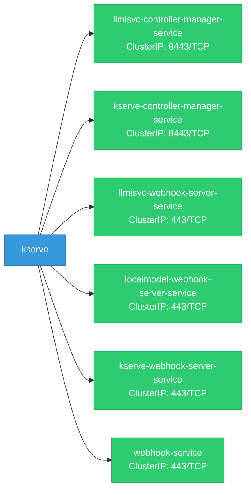

# kserve: Network

## Service Map

### Services

| Name | Type | Ports | Source |
|------|------|-------|--------|
| llmisvc-controller-manager-service | ClusterIP | 8443/TCP | `config/llmisvc/service.yaml` |
| kserve-controller-manager-service | ClusterIP | 8443/TCP | `config/manager/service.yaml` |
| llmisvc-webhook-server-service | ClusterIP | 443/TCP | `config/webhook/llmisvc/service.yaml` |
| localmodel-webhook-server-service | ClusterIP | 443/TCP | `config/webhook/localmodel/service.yaml` |
| kserve-webhook-server-service | ClusterIP | 443/TCP | `config/webhook/service.yaml` |
| webhook-service | ClusterIP | 443/TCP | `test/webhooks/service.yaml` |

### Ingress / Routing

| Kind | Name | Hosts | Paths | TLS | Source |
|------|------|-------|-------|-----|--------|
| Gateway | knative-ingress-gateway |  |  | no | `docs/openshift/serverless/gateways.yaml` |
| Gateway | knative-local-gateway |  |  | no | `docs/openshift/serverless/gateways.yaml` |
| Gateway | ai-gateway |  |  | no | `docs/samples/llmisvc/e2e-gpt-oss/gateway.yaml` |

### Network Policies

| Name | Policy Types | Source |
|------|-------------|--------|
| kserve-controller-manager |  | `config/overlays/odh/network-policies.yaml` |

