# kserve: RBAC

## RBAC Summary

This component defines a large RBAC surface (119 rules). The table below summarizes permissions by role.

| Role | Kind | Resources | Wildcard |
|------|------|-----------|----------|
| kserve-proxy-role | ClusterRole | 2 |  |
| kserve-manager-role | ClusterRole | 45 |  |
| kserve-leader-election-role | Role | 4 |  |

### Bindings

| Binding | Type | Role | Subject |
|---------|------|------|---------|
| kserve-proxy-rolebinding | ClusterRoleBinding | kserve-proxy-role | ServiceAccount/kserve-controller-manager |
| kserve-manager-rolebinding | ClusterRoleBinding | kserve-manager-role | ServiceAccount/kserve-controller-manager |
| kserve-leader-election-rolebinding | RoleBinding | kserve-leader-election-role | ServiceAccount/kserve-controller-manager |

```mermaid
graph TD
    %% RBAC hierarchy for kserve
    classDef sa fill:#4a90d9,stroke:#2c5f8a,color:#fff
    classDef role fill:#e8a838,stroke:#b07828,color:#fff
    classDef resource fill:#5cb85c,stroke:#3d8b3d,color:#fff

    sa_2["ServiceAccount: kserve-controller-manager"] -->|bound via kserve-proxy-rolebinding| crb_1["kserve-proxy-rolebinding"]
    class sa_2 sa
    crb_1 -->|grants| cr_kserve_proxy_role["CR: kserve-proxy-role"]
    class cr_kserve_proxy_role role
    sa_4["ServiceAccount: kserve-controller-manager"] -->|bound via kserve-manager-rolebinding| crb_3["kserve-manager-rolebinding"]
    class sa_4 sa
    crb_3 -->|grants| cr_kserve_manager_role["CR: kserve-manager-role"]
    class cr_kserve_manager_role role
    sa_6["ServiceAccount: kserve-controller-manager"] -->|bound via kserve-leader-election-rolebinding| rb_5["kserve-leader-election-rolebinding"]
    class sa_6 sa
    rb_5 -->|grants| r_kserve_leader_election_role["Role: kserve-leader-election-role"]
    class r_kserve_leader_election_role role
    cr_kserve_proxy_role -->|create| res_7["authentication.k8s.io: tokenreviews"]
    class res_7 resource
    cr_kserve_proxy_role -->|create| res_8["authorization.k8s.io: subjectaccessreviews"]
    class res_8 resource
    cr_kserve_manager_role -->|create, get, update| res_9["core: configmaps"]
    class res_9 resource
    cr_kserve_manager_role -->|create, delete, get, list, patch, update, watch| res_10["core: events"]
    class res_10 resource
    cr_kserve_manager_role -->|create, delete, get, list, patch, update, watch| res_11["core: services"]
    class res_11 resource
    cr_kserve_manager_role -->|get, list, watch| res_12["core: namespaces"]
    class res_12 resource
    cr_kserve_manager_role -->|get, list, watch| res_13["core: pods"]
    class res_13 resource
    cr_kserve_manager_role -->|get| res_14["core: secrets"]
    class res_14 resource
    cr_kserve_manager_role -->|create, delete, get, patch| res_15["core: serviceaccounts"]
    class res_15 resource
    cr_kserve_manager_role -->|create, delete, get, list, patch, update, watch| res_16["admissionregistration.k8s.io: mutatingwebhookconfigurations"]
    class res_16 resource
    cr_kserve_manager_role -->|create, delete, get, list, patch, update, watch| res_17["admissionregistration.k8s.io: validatingwebhookconfigurations"]
    class res_17 resource
    cr_kserve_manager_role -->|create, delete, get, list, patch, update, watch| res_18["apps: deployments"]
    class res_18 resource
    cr_kserve_manager_role -->|create, delete, get, list, patch, update, watch| res_19["autoscaling: horizontalpodautoscalers"]
    class res_19 resource
    cr_kserve_manager_role -->|create, delete, get, list, patch, update, watch| res_20["gateway.networking.k8s.io: httproutes"]
    class res_20 resource
    cr_kserve_manager_role -->|create, delete, get, list, patch, update, watch| res_21["keda.sh: scaledobjects"]
    class res_21 resource
    cr_kserve_manager_role -->|create, delete, get, list, patch, update, watch| res_22["keda.sh: scaledobjects/finalizers"]
    class res_22 resource
    cr_kserve_manager_role -->|get, patch, update| res_23["keda.sh: scaledobjects/status"]
    class res_23 resource
    cr_kserve_manager_role -->|create, delete, get, list, patch, update, watch| res_24["networking.istio.io: virtualservices"]
    class res_24 resource
    cr_kserve_manager_role -->|create, delete, get, list, patch, update, watch| res_25["networking.istio.io: virtualservices/finalizers"]
    class res_25 resource
    cr_kserve_manager_role -->|get, patch, update| res_26["networking.istio.io: virtualservices/status"]
    class res_26 resource
    cr_kserve_manager_role -->|create, delete, get, list, patch, update, watch| res_27["networking.k8s.io: ingresses"]
    class res_27 resource
    cr_kserve_manager_role -->|create, delete, get, list, patch, update, watch| res_28["opentelemetry.io: opentelemetrycollectors"]
    class res_28 resource
    cr_kserve_manager_role -->|create, delete, get, list, patch, update, watch| res_29["opentelemetry.io: opentelemetrycollectors/finalizers"]
    class res_29 resource
    cr_kserve_manager_role -->|get, patch, update| res_30["opentelemetry.io: opentelemetrycollectors/status"]
    class res_30 resource
    cr_kserve_manager_role -->|create, get, patch, update| res_31["rbac.authorization.k8s.io: clusterrolebindings"]
    class res_31 resource
    cr_kserve_manager_role -->|create, delete, get, list, patch, update, watch| res_32["route.openshift.io: routes"]
    class res_32 resource
    cr_kserve_manager_role -->|get| res_33["route.openshift.io: routes/status"]
    class res_33 resource
    cr_kserve_manager_role -->|create, delete, get, list, patch, update, watch| res_34["serving.knative.dev: services"]
    class res_34 resource
    cr_kserve_manager_role -->|create, delete, get, list, patch, update, watch| res_35["serving.knative.dev: services/finalizers"]
    class res_35 resource
    cr_kserve_manager_role -->|get, patch, update| res_36["serving.knative.dev: services/status"]
    class res_36 resource
    cr_kserve_manager_role -->|create, delete, get, list, patch, update, watch| res_37["serving.kserve.io: clusterservingruntimes"]
    class res_37 resource
    cr_kserve_manager_role -->|create, delete, get, list, patch, update, watch| res_38["serving.kserve.io: clusterservingruntimes/finalizers"]
    class res_38 resource
    cr_kserve_manager_role -->|create, delete, get, list, patch, update, watch| res_39["serving.kserve.io: clusterstoragecontainers"]
    class res_39 resource
    cr_kserve_manager_role -->|create, delete, get, list, patch, update, watch| res_40["serving.kserve.io: inferencegraphs"]
    class res_40 resource
    cr_kserve_manager_role -->|create, delete, get, list, patch, update, watch| res_41["serving.kserve.io: inferencegraphs/finalizers"]
    class res_41 resource
    cr_kserve_manager_role -->|create, delete, get, list, patch, update, watch| res_42["serving.kserve.io: inferenceservices"]
    class res_42 resource
    cr_kserve_manager_role -->|create, delete, get, list, patch, update, watch| res_43["serving.kserve.io: inferenceservices/finalizers"]
    class res_43 resource
    cr_kserve_manager_role -->|create, delete, get, list, patch, update, watch| res_44["serving.kserve.io: servingruntimes"]
    class res_44 resource
    cr_kserve_manager_role -->|create, delete, get, list, patch, update, watch| res_45["serving.kserve.io: servingruntimes/finalizers"]
    class res_45 resource
    cr_kserve_manager_role -->|create, delete, get, list, patch, update, watch| res_46["serving.kserve.io: trainedmodels"]
    class res_46 resource
    cr_kserve_manager_role -->|get, patch, update| res_47["serving.kserve.io: clusterservingruntimes/status"]
    class res_47 resource
    cr_kserve_manager_role -->|get, patch, update| res_48["serving.kserve.io: inferencegraphs/status"]
    class res_48 resource
    cr_kserve_manager_role -->|get, patch, update| res_49["serving.kserve.io: inferenceservices/status"]
    class res_49 resource
    cr_kserve_manager_role -->|get, patch, update| res_50["serving.kserve.io: servingruntimes/status"]
    class res_50 resource
    cr_kserve_manager_role -->|get, patch, update| res_51["serving.kserve.io: trainedmodels/status"]
    class res_51 resource
    cr_kserve_manager_role -->|get, list, watch| res_52["serving.kserve.io: localmodelcaches"]
    class res_52 resource
    cr_kserve_manager_role -->|get, list, watch| res_53["serving.kserve.io: localmodelnamespacecaches"]
    class res_53 resource
    r_kserve_leader_election_role -->|create, get, list, update| res_54["coordination.k8s.io: leases"]
    class res_54 resource
    r_kserve_leader_election_role -->|get, list, watch, create, update, patch, delete| res_55["core: configmaps"]
    class res_55 resource
    r_kserve_leader_election_role -->|get, update, patch| res_56["core: configmaps/status"]
    class res_56 resource
    r_kserve_leader_election_role -->|create| res_57["core: events"]
    class res_57 resource
```

Full RBAC hierarchy diagram

### Cluster Roles

| Name | Resources | Verbs | Source |
|------|-----------|-------|--------|
| kserve-proxy-role | tokenreviews | create | `config/rbac/auth_proxy_role.yaml` |
| kserve-proxy-role | subjectaccessreviews | create | `config/rbac/auth_proxy_role.yaml` |
| kserve-manager-role | configmaps | create, get, update | `config/rbac/role.yaml` |
| kserve-manager-role | events, services | create, delete, get, list, patch, update, watch | `config/rbac/role.yaml` |
| kserve-manager-role | namespaces, pods | get, list, watch | `config/rbac/role.yaml` |
| kserve-manager-role | secrets | get | `config/rbac/role.yaml` |
| kserve-manager-role | serviceaccounts | create, delete, get, patch | `config/rbac/role.yaml` |
| kserve-manager-role | mutatingwebhookconfigurations, validatingwebhookconfigurations | create, delete, get, list, patch, update, watch | `config/rbac/role.yaml` |
| kserve-manager-role | deployments | create, delete, get, list, patch, update, watch | `config/rbac/role.yaml` |
| kserve-manager-role | horizontalpodautoscalers | create, delete, get, list, patch, update, watch | `config/rbac/role.yaml` |
| kserve-manager-role | httproutes | create, delete, get, list, patch, update, watch | `config/rbac/role.yaml` |
| kserve-manager-role | scaledobjects, scaledobjects/finalizers | create, delete, get, list, patch, update, watch | `config/rbac/role.yaml` |
| kserve-manager-role | scaledobjects/status | get, patch, update | `config/rbac/role.yaml` |
| kserve-manager-role | virtualservices, virtualservices/finalizers | create, delete, get, list, patch, update, watch | `config/rbac/role.yaml` |
| kserve-manager-role | virtualservices/status | get, patch, update | `config/rbac/role.yaml` |
| kserve-manager-role | ingresses | create, delete, get, list, patch, update, watch | `config/rbac/role.yaml` |
| kserve-manager-role | opentelemetrycollectors, opentelemetrycollectors/finalizers | create, delete, get, list, patch, update, watch | `config/rbac/role.yaml` |
| kserve-manager-role | opentelemetrycollectors/status | get, patch, update | `config/rbac/role.yaml` |
| kserve-manager-role | clusterrolebindings | create, get, patch, update | `config/rbac/role.yaml` |
| kserve-manager-role | routes | create, delete, get, list, patch, update, watch | `config/rbac/role.yaml` |
| kserve-manager-role | routes/status | get | `config/rbac/role.yaml` |
| kserve-manager-role | services, services/finalizers | create, delete, get, list, patch, update, watch | `config/rbac/role.yaml` |
| kserve-manager-role | services/status | get, patch, update | `config/rbac/role.yaml` |
| kserve-manager-role | clusterservingruntimes, clusterservingruntimes/finalizers, clusterstoragecontainers, inferencegraphs, inferencegraphs/finalizers, inferenceservices, inferenceservices/finalizers, servingruntimes, servingruntimes/finalizers, trainedmodels | create, delete, get, list, patch, update, watch | `config/rbac/role.yaml` |
| kserve-manager-role | clusterservingruntimes/status, inferencegraphs/status, inferenceservices/status, servingruntimes/status, trainedmodels/status | get, patch, update | `config/rbac/role.yaml` |
| kserve-manager-role | localmodelcaches, localmodelnamespacecaches | get, list, watch | `config/rbac/role.yaml` |

### Kubebuilder RBAC Markers

34 markers found in source code.

