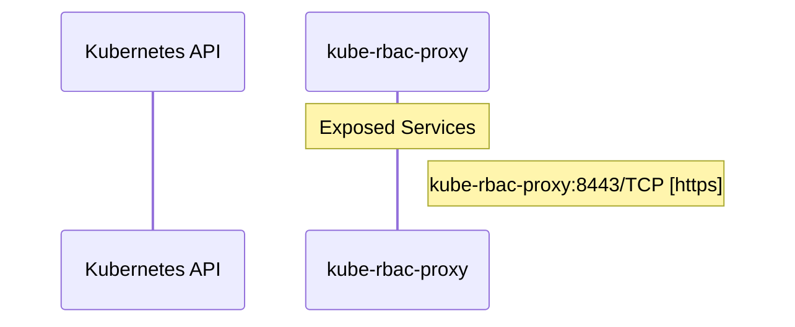

# kube-rbac-proxy: Dataflow

## Controller Watches

No controller watches found.

## Reconciliation Flow

How the controller interacts with the Kubernetes API during reconciliation.

### HTTP Endpoints

| Method | Path | Source |
|--------|------|--------|
| * | / | `cmd/kube-rbac-proxy/app/kube-rbac-proxy.go:322` |

## Configuration

