# model-registry-operator: RBAC

## RBAC Summary

This component defines a large RBAC surface (93 rules). The table below summarizes permissions by role.

| Role | Kind | Resources | Wildcard |
|------|------|-----------|----------|
| metrics-reader | ClusterRole | 0 |  |
| proxy-role | ClusterRole | 2 |  |
| modelregistry-admin-role | ClusterRole | 2 | yes |
| modelregistry-editor-role | ClusterRole | 2 |  |
| modelregistry-viewer-role | ClusterRole | 2 |  |
| manager-role | ClusterRole | 27 |  |
| leader-election-role | Role | 3 |  |

### Bindings

| Binding | Type | Role | Subject |
|---------|------|------|---------|
| proxy-rolebinding | ClusterRoleBinding | proxy-role | ServiceAccount/controller-manager |
| manager-rolebinding | ClusterRoleBinding | manager-role | ServiceAccount/controller-manager |
| leader-election-rolebinding | RoleBinding | leader-election-role | ServiceAccount/controller-manager |

```mermaid
graph TD
    %% RBAC hierarchy for model-registry-operator
    classDef sa fill:#4a90d9,stroke:#2c5f8a,color:#fff
    classDef role fill:#e8a838,stroke:#b07828,color:#fff
    classDef resource fill:#5cb85c,stroke:#3d8b3d,color:#fff

    sa_2["ServiceAccount: controller-manager (system)"] -->|bound via proxy-rolebinding| crb_1["proxy-rolebinding"]
    class sa_2 sa
    crb_1 -->|grants| cr_proxy_role["CR: proxy-role"]
    class cr_proxy_role role
    sa_4["ServiceAccount: controller-manager (system)"] -->|bound via manager-rolebinding| crb_3["manager-rolebinding"]
    class sa_4 sa
    crb_3 -->|grants| cr_manager_role["CR: manager-role"]
    class cr_manager_role role
    sa_6["ServiceAccount: controller-manager"] -->|bound via leader-election-rolebinding| rb_5["leader-election-rolebinding"]
    class sa_6 sa
    rb_5 -->|grants| r_leader_election_role["Role: leader-election-role"]
    class r_leader_election_role role
    cr_proxy_role -->|create| res_7["authentication.k8s.io: tokenreviews"]
    class res_7 resource
    cr_proxy_role -->|create| res_8["authorization.k8s.io: subjectaccessreviews"]
    class res_8 resource
    cr_modelregistry_admin_role -->|*| res_9["modelregistry.opendatahub.io: modelregistries"]
    class res_9 resource
    cr_modelregistry_admin_role -->|get| res_10["modelregistry.opendatahub.io: modelregistries/status"]
    class res_10 resource
    cr_modelregistry_editor_role -->|create, delete, get, list, patch, update, watch| res_11["modelregistry.opendatahub.io: modelregistries"]
    class res_11 resource
    cr_modelregistry_editor_role -->|get| res_12["modelregistry.opendatahub.io: modelregistries/status"]
    class res_12 resource
    cr_modelregistry_viewer_role -->|get, list, watch| res_13["modelregistry.opendatahub.io: modelregistries"]
    class res_13 resource
    cr_modelregistry_viewer_role -->|get| res_14["modelregistry.opendatahub.io: modelregistries/status"]
    class res_14 resource
    cr_manager_role -->|create, delete, get, list, patch, update, watch| res_15["core: configmaps"]
    class res_15 resource
    cr_manager_role -->|create, delete, get, list, patch, update, watch| res_16["core: persistentvolumeclaims"]
    class res_16 resource
    cr_manager_role -->|create, delete, get, list, patch, update, watch| res_17["core: secrets"]
    class res_17 resource
    cr_manager_role -->|create, delete, get, list, patch, update, watch| res_18["core: serviceaccounts"]
    class res_18 resource
    cr_manager_role -->|create, delete, get, list, patch, update, watch| res_19["core: services"]
    class res_19 resource
    cr_manager_role -->|get, list, watch| res_20["core: endpoints"]
    class res_20 resource
    cr_manager_role -->|get, list, watch| res_21["core: pods"]
    class res_21 resource
    cr_manager_role -->|get, list, watch| res_22["core: pods/log"]
    class res_22 resource
    cr_manager_role -->|create, patch| res_23["core: events"]
    class res_23 resource
    cr_manager_role -->|get, list, watch| res_24["apiextensions.k8s.io: customresourcedefinitions"]
    class res_24 resource
    cr_manager_role -->|create, delete, get, list, patch, update, watch| res_25["apps: deployments"]
    class res_25 resource
    cr_manager_role -->|create| res_26["authentication.k8s.io: tokenreviews"]
    class res_26 resource
    cr_manager_role -->|create| res_27["authorization.k8s.io: subjectaccessreviews"]
    class res_27 resource
    cr_manager_role -->|get, list, watch| res_28["components.platform.opendatahub.io: modelregistries"]
    class res_28 resource
    cr_manager_role -->|get, list, watch| res_29["config.openshift.io: ingresses"]
    class res_29 resource
    cr_manager_role -->|create, delete, get, list, patch, update, watch| res_30["migration.k8s.io: storageversionmigrations"]
    class res_30 resource
    cr_manager_role -->|create, delete, get, list, patch, update, watch| res_31["modelregistry.opendatahub.io: modelregistries"]
    class res_31 resource
    cr_manager_role -->|update| res_32["modelregistry.opendatahub.io: modelregistries/finalizers"]
    class res_32 resource
    cr_manager_role -->|get, patch, update| res_33["modelregistry.opendatahub.io: modelregistries/status"]
    class res_33 resource
    cr_manager_role -->|create, delete, get, list, patch, update, watch| res_34["networking.k8s.io: networkpolicies"]
    class res_34 resource
    cr_manager_role -->|create, delete, get, list, patch, update, watch| res_35["rbac.authorization.k8s.io: clusterrolebindings"]
    class res_35 resource
    cr_manager_role -->|create, delete, get, list, patch, update, watch| res_36["rbac.authorization.k8s.io: rolebindings"]
    class res_36 resource
    cr_manager_role -->|create, delete, get, list, patch, update, watch| res_37["rbac.authorization.k8s.io: roles"]
    class res_37 resource
    cr_manager_role -->|create, delete, get, list, patch, update, watch| res_38["route.openshift.io: routes"]
    class res_38 resource
    cr_manager_role -->|create, delete, get, list, patch, update, watch| res_39["route.openshift.io: routes/custom-host"]
    class res_39 resource
    cr_manager_role -->|get, list, watch| res_40["services.platform.opendatahub.io: auths"]
    class res_40 resource
    cr_manager_role -->|create, delete, get, list, patch, update, watch| res_41["user.openshift.io: groups"]
    class res_41 resource
    r_leader_election_role -->|get, list, watch, create, update, patch, delete| res_42["core: configmaps"]
    class res_42 resource
    r_leader_election_role -->|get, list, watch, create, update, patch, delete| res_43["coordination.k8s.io: leases"]
    class res_43 resource
    r_leader_election_role -->|create, patch| res_44["core: events"]
    class res_44 resource
```

Full RBAC hierarchy diagram

### Cluster Roles

| Name | Resources | Verbs | Source |
|------|-----------|-------|--------|
| metrics-reader |  | get | `config/rbac/auth_proxy_client_clusterrole.yaml` |
| proxy-role | tokenreviews | create | `config/rbac/auth_proxy_role.yaml` |
| proxy-role | subjectaccessreviews | create | `config/rbac/auth_proxy_role.yaml` |
| modelregistry-admin-role | modelregistries | * | `config/rbac/modelregistry_admin_role.yaml` |
| modelregistry-admin-role | modelregistries/status | get | `config/rbac/modelregistry_admin_role.yaml` |
| modelregistry-editor-role | modelregistries | create, delete, get, list, patch, update, watch | `config/rbac/modelregistry_editor_role.yaml` |
| modelregistry-editor-role | modelregistries/status | get | `config/rbac/modelregistry_editor_role.yaml` |
| modelregistry-viewer-role | modelregistries | get, list, watch | `config/rbac/modelregistry_viewer_role.yaml` |
| modelregistry-viewer-role | modelregistries/status | get | `config/rbac/modelregistry_viewer_role.yaml` |
| manager-role | configmaps, persistentvolumeclaims, secrets, serviceaccounts, services | create, delete, get, list, patch, update, watch | `config/rbac/role.yaml` |
| manager-role | endpoints, pods, pods/log | get, list, watch | `config/rbac/role.yaml` |
| manager-role | events | create, patch | `config/rbac/role.yaml` |
| manager-role | customresourcedefinitions | get, list, watch | `config/rbac/role.yaml` |
| manager-role | deployments | create, delete, get, list, patch, update, watch | `config/rbac/role.yaml` |
| manager-role | tokenreviews | create | `config/rbac/role.yaml` |
| manager-role | subjectaccessreviews | create | `config/rbac/role.yaml` |
| manager-role | modelregistries | get, list, watch | `config/rbac/role.yaml` |
| manager-role | ingresses | get, list, watch | `config/rbac/role.yaml` |
| manager-role | storageversionmigrations | create, delete, get, list, patch, update, watch | `config/rbac/role.yaml` |
| manager-role | modelregistries | create, delete, get, list, patch, update, watch | `config/rbac/role.yaml` |
| manager-role | modelregistries/finalizers | update | `config/rbac/role.yaml` |
| manager-role | modelregistries/status | get, patch, update | `config/rbac/role.yaml` |
| manager-role | networkpolicies | create, delete, get, list, patch, update, watch | `config/rbac/role.yaml` |
| manager-role | clusterrolebindings, rolebindings, roles | create, delete, get, list, patch, update, watch | `config/rbac/role.yaml` |
| manager-role | routes, routes/custom-host | create, delete, get, list, patch, update, watch | `config/rbac/role.yaml` |
| manager-role | auths | get, list, watch | `config/rbac/role.yaml` |
| manager-role | groups | create, delete, get, list, patch, update, watch | `config/rbac/role.yaml` |

### Kubebuilder RBAC Markers

5 markers found in source code.

