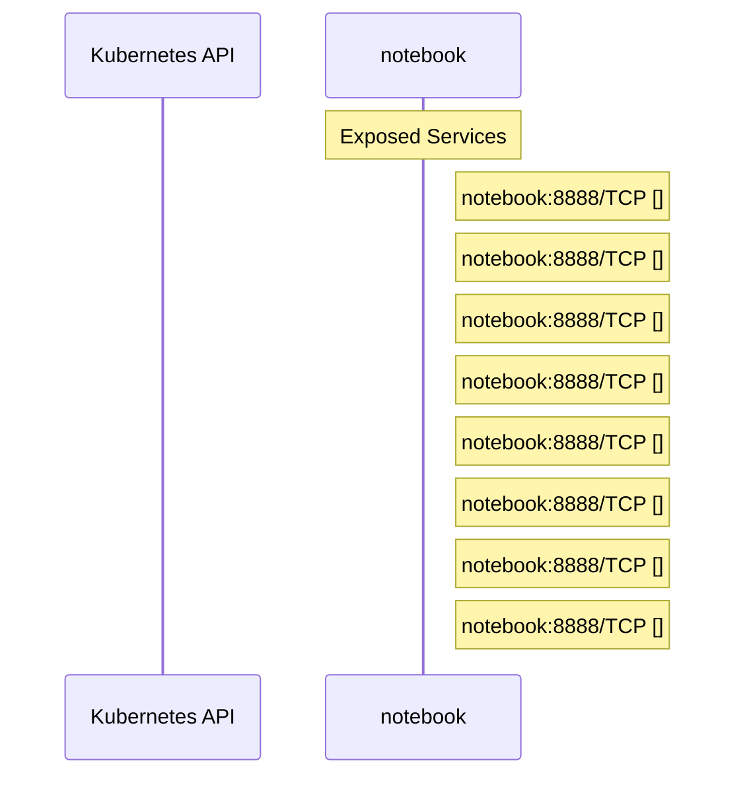

# notebooks: Dataflow

## Controller Watches

No controller watches found.

## Reconciliation Flow

How the controller interacts with the Kubernetes API during reconciliation.

```mermaid
sequenceDiagram
    %% Static dataflow for notebooks

    participant KubernetesAPI as Kubernetes API
    participant notebook as notebook


    Note over notebook: Exposed Services
    Note right of notebook: notebook:8888/TCP []
    Note right of notebook: notebook:8888/TCP []
    Note right of notebook: notebook:8888/TCP []
    Note right of notebook: notebook:8888/TCP []
    Note right of notebook: notebook:8888/TCP []
    Note right of notebook: notebook:8888/TCP []
    Note right of notebook: notebook:8888/TCP []
    Note right of notebook: notebook:8888/TCP []
```

## Configuration

