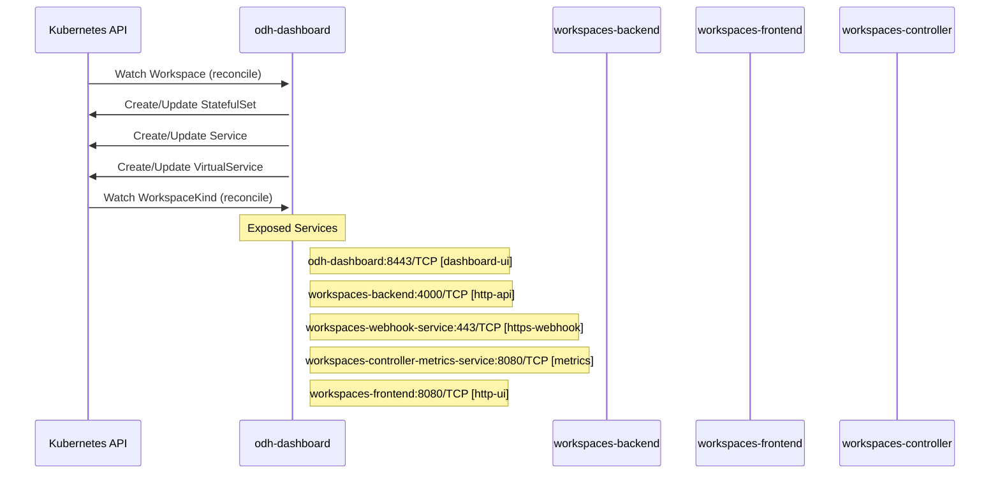

# odh-dashboard: Dataflow

## Controller Watches

| Type | GVK | Source |
|------|-----|--------|
| For | api/v1beta1/Workspace | `packages/notebooks/upstream/workspaces/controller/internal/controller/workspace_controller.go:469` |
| For | api/v1beta1/WorkspaceKind | `packages/notebooks/upstream/workspaces/controller/internal/controller/workspacekind_controller.go:175` |
| Owns | /v1/Service | `packages/notebooks/upstream/workspaces/controller/internal/controller/workspace_controller.go:471` |
| Owns | apps/v1/StatefulSet | `packages/notebooks/upstream/workspaces/controller/internal/controller/workspace_controller.go:470` |
| Owns | networking/v1/VirtualService | `packages/notebooks/upstream/workspaces/controller/internal/controller/workspace_controller.go:475` |

## Reconciliation Flow

How the controller interacts with the Kubernetes API during reconciliation.

## Configuration

### ConfigMaps

| Name | Data Keys | Source |
|------|-----------|--------|
| model-registry-ui-config | images-jobs-async-upload | `manifests/common/model-registry/configmap.yaml` |
| federation-config | module-federation-config.json | `manifests/modular-architecture/federation-configmap.yaml` |
| federation-config | module-federation-config.json | `manifests/rhoai/shared/base/federation-configmap.yaml` |

