# odh-dashboard: RBAC

## RBAC Hierarchy

ServiceAccount bindings, roles, and resource permissions.

```mermaid
graph TD
    %% RBAC hierarchy for odh-dashboard
    classDef sa fill:#4a90d9,stroke:#2c5f8a,color:#fff
    classDef role fill:#e8a838,stroke:#b07828,color:#fff
    classDef resource fill:#5cb85c,stroke:#3d8b3d,color:#fff

    sa_2["ServiceAccount: odh-dashboard"] -->|bound via odh-dashboard-auth-delegator| crb_1["odh-dashboard-auth-delegator"]
    class sa_2 sa
    crb_1 -->|grants| cr_system_auth_delegator["CR: system:auth-delegator"]
    class cr_system_auth_delegator role
    sa_4["ServiceAccount: odh-dashboard"] -->|bound via odh-dashboard-monitoring| crb_3["odh-dashboard-monitoring"]
    class sa_4 sa
    crb_3 -->|grants| cr_cluster_monitoring_view["CR: cluster-monitoring-view"]
    class cr_cluster_monitoring_view role
    sa_6["ServiceAccount: odh-dashboard"] -->|bound via odh-dashboard| crb_5["odh-dashboard"]
    class sa_6 sa
    crb_5 -->|grants| cr_odh_dashboard["CR: odh-dashboard"]
    class cr_odh_dashboard role
    sa_8["Group: system:serviceaccounts"] -->|bound via cluster-image-pullers| rb_7["cluster-image-pullers"]
    class sa_8 sa
    rb_7 -->|grants| r_system_image_puller["Role: system:image-puller"]
    class r_system_image_puller role
    sa_10["Group: system:authenticated"] -->|bound via servingruntimes-config-updater| rb_9["servingruntimes-config-updater"]
    class sa_10 sa
    rb_9 -->|grants| r_servingruntimes_config_updater["Role: servingruntimes-config-updater"]
    class r_servingruntimes_config_updater role
    sa_12["ServiceAccount: odh-dashboard"] -->|bound via odh-dashboard| rb_11["odh-dashboard"]
    class sa_12 sa
    rb_11 -->|grants| r_odh_dashboard["Role: odh-dashboard"]
    class r_odh_dashboard role
    cr_odh_dashboard -->|update, patch| res_13["storage.k8s.io: storageclasses"]
    class res_13 resource
    cr_odh_dashboard -->|get, list| res_14["core: nodes"]
    class res_14 resource
    cr_odh_dashboard -->|get, list| res_15["machine.openshift.io: machineautoscalers"]
    class res_15 resource
    cr_odh_dashboard -->|get, list| res_16["machine.openshift.io: machinesets"]
    class res_16 resource
    cr_odh_dashboard -->|get, watch, list| res_17["core: clusterversions"]
    class res_17 resource
    cr_odh_dashboard -->|get, watch, list| res_18["core: ingresses"]
    class res_18 resource
    cr_odh_dashboard -->|get, list, watch| res_19["operators.coreos.com: clusterserviceversions"]
    class res_19 resource
    cr_odh_dashboard -->|get, list, watch| res_20["operators.coreos.com: subscriptions"]
    class res_20 resource
    cr_odh_dashboard -->|get| res_21["core: imagestreams/layers"]
    class res_21 resource
    cr_odh_dashboard -->|create, delete, get, list, patch, update, watch| res_22["core: configmaps"]
    class res_22 resource
    cr_odh_dashboard -->|create, delete, get, list, patch, update, watch| res_23["core: persistentvolumeclaims"]
    class res_23 resource
    cr_odh_dashboard -->|create, delete, get, list, patch, update, watch| res_24["core: secrets"]
    class res_24 resource
    cr_odh_dashboard -->|get, list, watch| res_25["route.openshift.io: routes"]
    class res_25 resource
    cr_odh_dashboard -->|get, list, watch| res_26["console.openshift.io: consolelinks"]
    class res_26 resource
    cr_odh_dashboard -->|get, list, watch| res_27["operator.openshift.io: consoles"]
    class res_27 resource
    cr_odh_dashboard -->|get, watch, list| res_28["core: rhmis"]
    class res_28 resource
    cr_odh_dashboard -->|get, list, watch| res_29["user.openshift.io: groups"]
    class res_29 resource
    cr_odh_dashboard -->|get, list, watch| res_30["user.openshift.io: users"]
    class res_30 resource
    cr_odh_dashboard -->|get, list, watch| res_31["core: pods"]
    class res_31 resource
    cr_odh_dashboard -->|get, list, watch| res_32["core: serviceaccounts"]
    class res_32 resource
    cr_odh_dashboard -->|get, list, watch| res_33["core: services"]
    class res_33 resource
    cr_odh_dashboard -->|patch| res_34["core: namespaces"]
    class res_34 resource
    cr_odh_dashboard -->|list, get, create, patch, delete| res_35["rbac.authorization.k8s.io: rolebindings"]
    class res_35 resource
    cr_odh_dashboard -->|list, get, create, patch, delete| res_36["rbac.authorization.k8s.io: clusterrolebindings"]
    class res_36 resource
    cr_odh_dashboard -->|list, get, create, patch, delete| res_37["rbac.authorization.k8s.io: roles"]
    class res_37 resource
    cr_odh_dashboard -->|get, list, watch| res_38["core: events"]
    class res_38 resource
    cr_odh_dashboard -->|get, list, watch, create, update, patch, delete| res_39["kubeflow.org: notebooks"]
    class res_39 resource
    cr_odh_dashboard -->|list, watch, get| res_40["datasciencecluster.opendatahub.io: datascienceclusters"]
    class res_40 resource
    cr_odh_dashboard -->|list, watch, get| res_41["dscinitialization.opendatahub.io: dscinitializations"]
    class res_41 resource
    cr_odh_dashboard -->|get, list, watch| res_42["serving.kserve.io: inferenceservices"]
    class res_42 resource
    cr_odh_dashboard -->|get, list, watch, create, update, patch, delete| res_43["modelregistry.opendatahub.io: modelregistries"]
    class res_43 resource
    cr_odh_dashboard -->|get| res_44["core: endpoints"]
    class res_44 resource
    cr_odh_dashboard -->|get| res_45["services.platform.opendatahub.io: auths"]
    class res_45 resource
    cr_odh_dashboard -->|get, list, watch| res_46["llamastack.io: llamastackdistributions"]
    class res_46 resource
    cr_odh_dashboard -->|get, list, watch| res_47["trustyai.opendatahub.io: guardrailsorchestrators"]
    class res_47 resource
    cr_odh_dashboard -->|get, list, watch| res_48["trustyai.opendatahub.io: evalhubs"]
    class res_48 resource
    cr_odh_dashboard -->|get, list, watch| res_49["feast.dev: featurestores"]
    class res_49 resource
    cr_odh_dashboard -->|get, list, watch| res_50["mlflow.opendatahub.io: mlflows"]
    class res_50 resource
    cr_odh_dashboard -->|create| res_51["authentication.k8s.io: tokenreviews"]
    class res_51 resource
    cr_odh_dashboard -->|create| res_52["authorization.k8s.io: subjectaccessreviews"]
    class res_52 resource
    r_servingruntimes_config_updater -->|get, list| res_53["template.openshift.io: templates"]
    class res_53 resource
    r_servingruntimes_config_updater -->|get, list| res_54["opendatahub.io: odhdashboardconfigs"]
    class res_54 resource
    r_odh_dashboard -->|create, get, list, update, patch, delete| res_55["dashboard.opendatahub.io: acceleratorprofiles"]
    class res_55 resource
    r_odh_dashboard -->|get, list, watch| res_56["route.openshift.io: routes"]
    class res_56 resource
    r_odh_dashboard -->|get, update, delete| res_57["batch: cronjobs"]
    class res_57 resource
    r_odh_dashboard -->|create, get, list, update, patch, delete| res_58["image.openshift.io: imagestreams"]
    class res_58 resource
    r_odh_dashboard -->|list| res_59["build.openshift.io: builds"]
    class res_59 resource
    r_odh_dashboard -->|list| res_60["build.openshift.io: buildconfigs"]
    class res_60 resource
    r_odh_dashboard -->|patch, update| res_61["apps: deployments"]
    class res_61 resource
    r_odh_dashboard -->|get, list, watch, create, update, patch, delete| res_62["apps.openshift.io: deploymentconfigs"]
    class res_62 resource
    r_odh_dashboard -->|get, list, watch, create, update, patch, delete| res_63["apps.openshift.io: deploymentconfigs/instantiate"]
    class res_63 resource
    r_odh_dashboard -->|get, list, watch, create, update, patch, delete| res_64["opendatahub.io: odhdashboardconfigs"]
    class res_64 resource
    r_odh_dashboard -->|get, list, watch, create, update, patch, delete| res_65["kubeflow.org: notebooks"]
    class res_65 resource
    r_odh_dashboard -->|get, list| res_66["dashboard.opendatahub.io: odhapplications"]
    class res_66 resource
    r_odh_dashboard -->|get, list| res_67["dashboard.opendatahub.io: odhdocuments"]
    class res_67 resource
    r_odh_dashboard -->|get, list| res_68["console.openshift.io: odhquickstarts"]
    class res_68 resource
    r_odh_dashboard -->|*| res_69["template.openshift.io: templates"]
    class res_69 resource
    r_odh_dashboard -->|*| res_70["serving.kserve.io: servingruntimes"]
    class res_70 resource
    r_odh_dashboard -->|get, list, watch, create, update, patch, delete| res_71["nim.opendatahub.io: accounts"]
    class res_71 resource
```

### Cluster Roles

| Name | Resources | Verbs | Source |
|------|-----------|-------|--------|
| odh-dashboard | storageclasses | update, patch | `manifests/core-bases/base/cluster-role.yaml` |
| odh-dashboard | nodes | get, list | `manifests/core-bases/base/cluster-role.yaml` |
| odh-dashboard | machineautoscalers, machinesets | get, list | `manifests/core-bases/base/cluster-role.yaml` |
| odh-dashboard | clusterversions, ingresses | get, watch, list | `manifests/core-bases/base/cluster-role.yaml` |
| odh-dashboard | clusterserviceversions, subscriptions | get, list, watch | `manifests/core-bases/base/cluster-role.yaml` |
| odh-dashboard | imagestreams/layers | get | `manifests/core-bases/base/cluster-role.yaml` |
| odh-dashboard | configmaps, persistentvolumeclaims, secrets | create, delete, get, list, patch, update, watch | `manifests/core-bases/base/cluster-role.yaml` |
| odh-dashboard | routes | get, list, watch | `manifests/core-bases/base/cluster-role.yaml` |
| odh-dashboard | consolelinks | get, list, watch | `manifests/core-bases/base/cluster-role.yaml` |
| odh-dashboard | consoles | get, list, watch | `manifests/core-bases/base/cluster-role.yaml` |
| odh-dashboard | rhmis | get, watch, list | `manifests/core-bases/base/cluster-role.yaml` |
| odh-dashboard | groups | get, list, watch | `manifests/core-bases/base/cluster-role.yaml` |
| odh-dashboard | users | get, list, watch | `manifests/core-bases/base/cluster-role.yaml` |
| odh-dashboard | pods, serviceaccounts, services | get, list, watch | `manifests/core-bases/base/cluster-role.yaml` |
| odh-dashboard | namespaces | patch | `manifests/core-bases/base/cluster-role.yaml` |
| odh-dashboard | rolebindings, clusterrolebindings, roles | list, get, create, patch, delete | `manifests/core-bases/base/cluster-role.yaml` |
| odh-dashboard | events | get, list, watch | `manifests/core-bases/base/cluster-role.yaml` |
| odh-dashboard | notebooks | get, list, watch, create, update, patch, delete | `manifests/core-bases/base/cluster-role.yaml` |
| odh-dashboard | datascienceclusters | list, watch, get | `manifests/core-bases/base/cluster-role.yaml` |
| odh-dashboard | dscinitializations | list, watch, get | `manifests/core-bases/base/cluster-role.yaml` |
| odh-dashboard | inferenceservices | get, list, watch | `manifests/core-bases/base/cluster-role.yaml` |
| odh-dashboard | modelregistries | get, list, watch, create, update, patch, delete | `manifests/core-bases/base/cluster-role.yaml` |
| odh-dashboard | endpoints | get | `manifests/core-bases/base/cluster-role.yaml` |
| odh-dashboard | auths | get | `manifests/core-bases/base/cluster-role.yaml` |
| odh-dashboard | llamastackdistributions | get, list, watch | `manifests/core-bases/base/cluster-role.yaml` |
| odh-dashboard | guardrailsorchestrators, evalhubs | get, list, watch | `manifests/core-bases/base/cluster-role.yaml` |
| odh-dashboard | featurestores | get, list, watch | `manifests/core-bases/base/cluster-role.yaml` |
| odh-dashboard | mlflows | get, list, watch | `manifests/core-bases/base/cluster-role.yaml` |
| odh-dashboard | tokenreviews | create | `manifests/core-bases/base/cluster-role.yaml` |
| odh-dashboard | subjectaccessreviews | create | `manifests/core-bases/base/cluster-role.yaml` |

