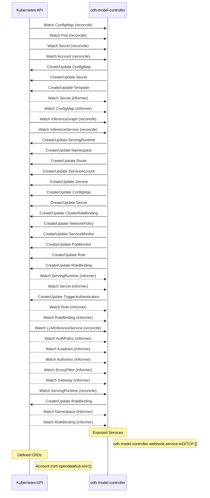

# odh-model-controller: Dataflow

## Controller Watches

| Type | GVK | Source |
|------|-----|--------|
| For | /v1/ConfigMap | `internal/controller/core/configmap_controller.go:155` |
| For | /v1/Pod | `internal/controller/core/pod_controller.go:58` |
| For | /v1/Secret | `internal/controller/core/secret_controller.go:265` |
| For | nim/v1/Account | `internal/controller/nim/account_controller.go:87` |
| For | serving/v1alpha1/InferenceGraph | `internal/controller/serving/inferencegraph_controller.go:74` |
| For | serving/v1alpha1/LLMInferenceService | `internal/controller/serving/llm/llm_inferenceservice_controller.go:156` |
| For | serving/v1alpha1/ServingRuntime | `internal/controller/serving/servingruntime_controller.go:442` |
| For | serving/v1beta1/InferenceService | `internal/controller/serving/inferenceservice_controller.go:230` |
| Owns | /v1/ConfigMap | `internal/controller/nim/account_controller.go:88` |
| Owns | /v1/ConfigMap | `internal/controller/serving/inferenceservice_controller.go:236` |
| Owns | /v1/Namespace | `internal/controller/serving/inferenceservice_controller.go:232` |
| Owns | /v1/Secret | `internal/controller/serving/inferenceservice_controller.go:237` |
| Owns | /v1/Secret | `internal/controller/nim/account_controller.go:89` |
| Owns | /v1/Service | `internal/controller/serving/inferenceservice_controller.go:235` |
| Owns | /v1/ServiceAccount | `internal/controller/serving/inferenceservice_controller.go:234` |
| Owns | keda/v1alpha1/TriggerAuthentication | `internal/controller/serving/inferenceservice_controller.go:303` |
| Owns | monitoring/v1/PodMonitor | `internal/controller/serving/inferenceservice_controller.go:241` |
| Owns | monitoring/v1/ServiceMonitor | `internal/controller/serving/inferenceservice_controller.go:240` |
| Owns | networking.k8s.io/v1/NetworkPolicy | `internal/controller/serving/inferenceservice_controller.go:239` |
| Owns | rbac.authorization.k8s.io/v1/ClusterRoleBinding | `internal/controller/serving/inferenceservice_controller.go:238` |
| Owns | rbac.authorization.k8s.io/v1/Role | `internal/controller/serving/inferenceservice_controller.go:242` |
| Owns | rbac.authorization.k8s.io/v1/RoleBinding | `internal/controller/serving/inferenceservice_controller.go:243` |
| Owns | rbac.authorization.k8s.io/v1/RoleBinding | `internal/controller/serving/servingruntime_controller.go:444` |
| Owns | route/v1/Route | `internal/controller/serving/inferenceservice_controller.go:233` |
| Owns | serving/v1alpha1/ServingRuntime | `internal/controller/serving/inferenceservice_controller.go:231` |
| Owns | template/v1/Template | `internal/controller/nim/account_controller.go:90` |
| Watches | /v1/ConfigMap | `internal/controller/nim/account_controller.go:104` |
| Watches | /v1/Namespace | `internal/controller/serving/servingruntime_controller.go:461` |
| Watches | /v1/Secret | `internal/controller/nim/account_controller.go:91` |
| Watches | /v1/Secret | `internal/controller/serving/inferenceservice_controller.go:275` |
| Watches | api/v1/AuthPolicy | `internal/controller/serving/llm/llm_inferenceservice_controller.go:164` |
| Watches | api/v1beta1/Authorino | `internal/controller/serving/llm/llm_inferenceservice_controller.go:188` |
| Watches | api/v1beta1/Kuadrant | `internal/controller/serving/llm/llm_inferenceservice_controller.go:182` |
| Watches | apis/v1/Gateway | `internal/controller/serving/llm/llm_inferenceservice_controller.go:213` |
| Watches | networking/v1alpha3/EnvoyFilter | `internal/controller/serving/llm/llm_inferenceservice_controller.go:194` |
| Watches | rbac.authorization.k8s.io/v1/Role | `internal/controller/serving/inferenceservice_controller.go:359` |
| Watches | rbac.authorization.k8s.io/v1/RoleBinding | `internal/controller/serving/inferenceservice_controller.go:360` |
| Watches | rbac.authorization.k8s.io/v1/RoleBinding | `internal/controller/serving/servingruntime_controller.go:476` |
| Watches | serving/v1alpha1/ServingRuntime | `internal/controller/serving/inferenceservice_controller.go:245` |

## Reconciliation Flow

How the controller interacts with the Kubernetes API during reconciliation.

### Webhooks

| Name | Type | Path | Failure Policy | Service | Source |
|------|------|------|----------------|---------|--------|
| mutating.pod.odh-model-controller.opendatahub.io | mutating | /mutate--v1-pod | Fail | system/webhook-service | `config/webhook/manifests.yaml` |
| minferencegraph-v1alpha1.odh-model-controller.opendatahub.io | mutating | /mutate-serving-kserve-io-v1alpha1-inferencegraph | Fail | system/webhook-service | `config/webhook/manifests.yaml` |
| minferenceservice-v1beta1.odh-model-controller.opendatahub.io | mutating | /mutate-serving-kserve-io-v1beta1-inferenceservice | Fail | system/webhook-service | `config/webhook/manifests.yaml` |
| validating.nim.account.odh-model-controller.opendatahub.io | validating | /validate-nim-opendatahub-io-v1-account | Fail | system/webhook-service | `config/webhook/manifests.yaml` |
| vinferencegraph-v1alpha1.odh-model-controller.opendatahub.io | validating | /validate-serving-kserve-io-v1alpha1-inferencegraph | Fail | system/webhook-service | `config/webhook/manifests.yaml` |
| validating.isvc.odh-model-controller.opendatahub.io | validating | /validate-serving-kserve-io-v1beta1-inferenceservice | Fail | system/webhook-service | `config/webhook/manifests.yaml` |

### HTTP Endpoints

| Method | Path | Source |
|--------|------|--------|
| * | gateway.networking.k8s.io | `internal/controller/serving/llm/fixture/gwapi_builders.go:243` |
| * | gateway.networking.k8s.io | `internal/controller/serving/llm/fixture/gwapi_builders.go:261` |
| * | inference.networking.x-k8s.io | `internal/controller/serving/llm/fixture/gwapi_builders.go:323` |
| * | gateway.networking.k8s.io | `internal/controller/serving/llm/fixture/gwapi_builders.go:421` |

## Configuration

