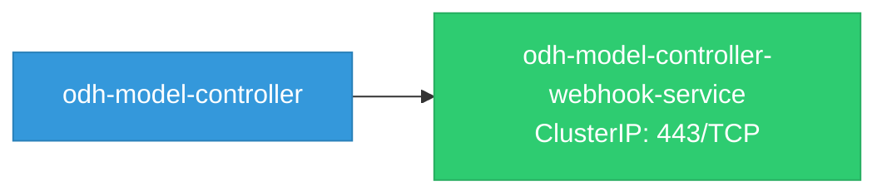

# odh-model-controller: Network

## Service Map

### Services

| Name | Type | Ports | Source |
|------|------|-------|--------|
| odh-model-controller-webhook-service | ClusterIP | 443/TCP | `config/webhook/service.yaml` |

!!! warning "No Network Policies"
    No NetworkPolicy resources found. All pod-to-pod traffic is allowed by default.

