# odh-model-controller: RBAC

## RBAC Hierarchy

ServiceAccount bindings, roles, and resource permissions.

```mermaid
graph TD
    %% RBAC hierarchy for odh-model-controller
    classDef sa fill:#4a90d9,stroke:#2c5f8a,color:#fff
    classDef role fill:#e8a838,stroke:#b07828,color:#fff
    classDef resource fill:#5cb85c,stroke:#3d8b3d,color:#fff

    sa_2["ServiceAccount: odh-model-controller"] -->|bound via proxy-rolebinding| crb_1["proxy-rolebinding"]
    class sa_2 sa
    crb_1 -->|grants| cr_proxy_role["CR: proxy-role"]
    class cr_proxy_role role
    sa_4["ServiceAccount: controller-manager (system)"] -->|bound via metrics-auth-rolebinding| crb_3["metrics-auth-rolebinding"]
    class sa_4 sa
    crb_3 -->|grants| cr_metrics_auth_role["CR: metrics-auth-role"]
    class cr_metrics_auth_role role
    sa_6["ServiceAccount: odh-model-controller (system)"] -->|bound via odh-model-controller-rolebinding-opendatahub| crb_5["odh-model-controller-rolebinding-opendatahub"]
    class sa_6 sa
    crb_5 -->|grants| cr_odh_model_controller_role["CR: odh-model-controller-role"]
    class cr_odh_model_controller_role role
    sa_8["ServiceAccount: odh-model-controller"] -->|bound via leader-election-rolebinding| rb_7["leader-election-rolebinding"]
    class sa_8 sa
    rb_7 -->|grants| r_leader_election_role["Role: leader-election-role"]
    class r_leader_election_role role
    cr_account_editor_role -->|create, delete, get, list, patch, update, watch| res_9["nim.opendatahub.io: accounts"]
    class res_9 resource
    cr_account_editor_role -->|get| res_10["nim.opendatahub.io: accounts/status"]
    class res_10 resource
    cr_account_viewer_role -->|get, list, watch| res_11["nim.opendatahub.io: accounts"]
    class res_11 resource
    cr_account_viewer_role -->|get| res_12["nim.opendatahub.io: accounts/status"]
    class res_12 resource
    cr_proxy_role -->|create| res_13["authentication.k8s.io: tokenreviews"]
    class res_13 resource
    cr_proxy_role -->|create| res_14["authorization.k8s.io: subjectaccessreviews"]
    class res_14 resource
    cr_kserve_prometheus_k8s -->|get, list, watch| res_15["core: services"]
    class res_15 resource
    cr_kserve_prometheus_k8s -->|get, list, watch| res_16["core: endpoints"]
    class res_16 resource
    cr_kserve_prometheus_k8s -->|get, list, watch| res_17["core: pods"]
    class res_17 resource
    cr_metrics_auth_role -->|create| res_18["authentication.k8s.io: tokenreviews"]
    class res_18 resource
    cr_metrics_auth_role -->|create| res_19["authorization.k8s.io: subjectaccessreviews"]
    class res_19 resource
    cr_odh_model_controller_role -->|create, get, list, patch, update, watch| res_20["core: endpoints"]
    class res_20 resource
    cr_odh_model_controller_role -->|create, get, list, patch, update, watch| res_21["core: namespaces"]
    class res_21 resource
    cr_odh_model_controller_role -->|create, get, list, patch, update, watch| res_22["core: pods"]
    class res_22 resource
    cr_odh_model_controller_role -->|create, patch| res_23["core: events"]
    class res_23 resource
    cr_odh_model_controller_role -->|get, list, watch| res_24["config.openshift.io: authentications"]
    class res_24 resource
    cr_odh_model_controller_role -->|get, list, watch| res_25["datasciencecluster.opendatahub.io: datascienceclusters"]
    class res_25 resource
    cr_odh_model_controller_role -->|get, list, watch| res_26["dscinitialization.opendatahub.io: dscinitializations"]
    class res_26 resource
    cr_odh_model_controller_role -->|get, list, watch| res_27["extensions: ingresses"]
    class res_27 resource
    cr_odh_model_controller_role -->|get, list, patch, update, watch| res_28["gateway.networking.k8s.io: gateways"]
    class res_28 resource
    cr_odh_model_controller_role -->|patch, update| res_29["gateway.networking.k8s.io: gateways/finalizers"]
    class res_29 resource
    cr_odh_model_controller_role -->|get, list, watch| res_30["gateway.networking.k8s.io: httproutes"]
    class res_30 resource
    cr_odh_model_controller_role -->|create, delete, get, list, patch, update, watch| res_31["keda.sh: triggerauthentications"]
    class res_31 resource
    cr_odh_model_controller_role -->|create, delete, get, list, patch, update, watch| res_32["kuadrant.io: authpolicies"]
    class res_32 resource
    cr_odh_model_controller_role -->|get, patch, update| res_33["kuadrant.io: authpolicies/status"]
    class res_33 resource
    cr_odh_model_controller_role -->|get, list, watch| res_34["kuadrant.io: kuadrants"]
    class res_34 resource
    cr_odh_model_controller_role -->|get, list, watch| res_35["metrics.k8s.io: nodes"]
    class res_35 resource
    cr_odh_model_controller_role -->|get, list, watch| res_36["metrics.k8s.io: pods"]
    class res_36 resource
    cr_odh_model_controller_role -->|create, delete, get, list, patch, update, watch| res_37["monitoring.coreos.com: podmonitors"]
    class res_37 resource
    cr_odh_model_controller_role -->|create, delete, get, list, patch, update, watch| res_38["monitoring.coreos.com: servicemonitors"]
    class res_38 resource
    cr_odh_model_controller_role -->|create, delete, get, list, patch, update, watch| res_39["networking.istio.io: envoyfilters"]
    class res_39 resource
    cr_odh_model_controller_role -->|create, delete, get, list, patch, update, watch| res_40["networking.k8s.io: networkpolicies"]
    class res_40 resource
    cr_odh_model_controller_role -->|get, list, patch, update, watch| res_41["nim.opendatahub.io: accounts"]
    class res_41 resource
    cr_odh_model_controller_role -->|update| res_42["nim.opendatahub.io: accounts/finalizers"]
    class res_42 resource
    cr_odh_model_controller_role -->|get, list, update, watch| res_43["nim.opendatahub.io: accounts/status"]
    class res_43 resource
    cr_odh_model_controller_role -->|get, list, watch| res_44["operator.authorino.kuadrant.io: authorinos"]
    class res_44 resource
    cr_odh_model_controller_role -->|create, delete, escalate, get, list, patch, update, watch| res_45["rbac.authorization.k8s.io: clusterrolebindings"]
    class res_45 resource
    cr_odh_model_controller_role -->|create, delete, escalate, get, list, patch, update, watch| res_46["rbac.authorization.k8s.io: rolebindings"]
    class res_46 resource
    cr_odh_model_controller_role -->|create, delete, escalate, get, list, patch, update, watch| res_47["rbac.authorization.k8s.io: roles"]
    class res_47 resource
    cr_odh_model_controller_role -->|create, delete, get, list, patch, update, watch| res_48["route.openshift.io: routes"]
    class res_48 resource
    cr_odh_model_controller_role -->|create| res_49["route.openshift.io: routes/custom-host"]
    class res_49 resource
    cr_odh_model_controller_role -->|get, list, watch| res_50["serving.kserve.io: inferencegraphs"]
    class res_50 resource
    cr_odh_model_controller_role -->|get, list, watch| res_51["serving.kserve.io: llminferenceserviceconfigs"]
    class res_51 resource
    cr_odh_model_controller_role -->|update| res_52["serving.kserve.io: inferencegraphs/finalizers"]
    class res_52 resource
    cr_odh_model_controller_role -->|update| res_53["serving.kserve.io: servingruntimes/finalizers"]
    class res_53 resource
    cr_odh_model_controller_role -->|get, list, patch, update, watch| res_54["serving.kserve.io: inferenceservices"]
    class res_54 resource
    cr_odh_model_controller_role -->|create, delete, get, list, patch, update, watch| res_55["serving.kserve.io: inferenceservices/finalizers"]
    class res_55 resource
    cr_odh_model_controller_role -->|get, list, patch, post, update, watch| res_56["serving.kserve.io: llminferenceservices"]
    class res_56 resource
    cr_odh_model_controller_role -->|patch, update| res_57["serving.kserve.io: llminferenceservices/finalizers"]
    class res_57 resource
    cr_odh_model_controller_role -->|get, patch, update| res_58["serving.kserve.io: llminferenceservices/status"]
    class res_58 resource
    cr_odh_model_controller_role -->|create, get, list, update, watch| res_59["serving.kserve.io: servingruntimes"]
    class res_59 resource
    cr_odh_model_controller_role -->|create, delete, get, list, patch, update, watch| res_60["template.openshift.io: templates"]
    class res_60 resource
    r_leader_election_role -->|get, list, watch, create, update, patch, delete| res_61["core: configmaps"]
    class res_61 resource
    r_leader_election_role -->|get, list, watch, create, update, patch, delete| res_62["coordination.k8s.io: leases"]
    class res_62 resource
    r_leader_election_role -->|create, patch| res_63["core: events"]
    class res_63 resource
```

### Cluster Roles

| Name | Resources | Verbs | Source |
|------|-----------|-------|--------|
| account-editor-role | accounts | create, delete, get, list, patch, update, watch | `config/rbac/account_editor_role.yaml` |
| account-editor-role | accounts/status | get | `config/rbac/account_editor_role.yaml` |
| account-viewer-role | accounts | get, list, watch | `config/rbac/account_viewer_role.yaml` |
| account-viewer-role | accounts/status | get | `config/rbac/account_viewer_role.yaml` |
| proxy-role | tokenreviews | create | `config/rbac/auth_proxy_role.yaml` |
| proxy-role | subjectaccessreviews | create | `config/rbac/auth_proxy_role.yaml` |
| kserve-prometheus-k8s | services, endpoints, pods | get, list, watch | `config/rbac/kserve_prometheus_clusterrole.yaml` |
| metrics-auth-role | tokenreviews | create | `config/rbac/metrics_auth_role.yaml` |
| metrics-auth-role | subjectaccessreviews | create | `config/rbac/metrics_auth_role.yaml` |
| metrics-reader |  | get | `config/rbac/metrics_reader_role.yaml` |
| odh-model-controller-role | endpoints, namespaces, pods | create, get, list, patch, update, watch | `config/rbac/role.yaml` |
| odh-model-controller-role | events | create, patch | `config/rbac/role.yaml` |
| odh-model-controller-role | authentications | get, list, watch | `config/rbac/role.yaml` |
| odh-model-controller-role | datascienceclusters | get, list, watch | `config/rbac/role.yaml` |
| odh-model-controller-role | dscinitializations | get, list, watch | `config/rbac/role.yaml` |
| odh-model-controller-role | ingresses | get, list, watch | `config/rbac/role.yaml` |
| odh-model-controller-role | gateways | get, list, patch, update, watch | `config/rbac/role.yaml` |
| odh-model-controller-role | gateways/finalizers | patch, update | `config/rbac/role.yaml` |
| odh-model-controller-role | httproutes | get, list, watch | `config/rbac/role.yaml` |
| odh-model-controller-role | triggerauthentications | create, delete, get, list, patch, update, watch | `config/rbac/role.yaml` |
| odh-model-controller-role | authpolicies | create, delete, get, list, patch, update, watch | `config/rbac/role.yaml` |
| odh-model-controller-role | authpolicies/status | get, patch, update | `config/rbac/role.yaml` |
| odh-model-controller-role | kuadrants | get, list, watch | `config/rbac/role.yaml` |
| odh-model-controller-role | nodes, pods | get, list, watch | `config/rbac/role.yaml` |
| odh-model-controller-role | podmonitors, servicemonitors | create, delete, get, list, patch, update, watch | `config/rbac/role.yaml` |
| odh-model-controller-role | envoyfilters | create, delete, get, list, patch, update, watch | `config/rbac/role.yaml` |
| odh-model-controller-role | networkpolicies | create, delete, get, list, patch, update, watch | `config/rbac/role.yaml` |
| odh-model-controller-role | accounts | get, list, patch, update, watch | `config/rbac/role.yaml` |
| odh-model-controller-role | accounts/finalizers | update | `config/rbac/role.yaml` |
| odh-model-controller-role | accounts/status | get, list, update, watch | `config/rbac/role.yaml` |
| odh-model-controller-role | authorinos | get, list, watch | `config/rbac/role.yaml` |
| odh-model-controller-role | clusterrolebindings, rolebindings, roles | create, delete, escalate, get, list, patch, update, watch | `config/rbac/role.yaml` |
| odh-model-controller-role | routes | create, delete, get, list, patch, update, watch | `config/rbac/role.yaml` |
| odh-model-controller-role | routes/custom-host | create | `config/rbac/role.yaml` |
| odh-model-controller-role | inferencegraphs, llminferenceserviceconfigs | get, list, watch | `config/rbac/role.yaml` |
| odh-model-controller-role | inferencegraphs/finalizers, servingruntimes/finalizers | update | `config/rbac/role.yaml` |
| odh-model-controller-role | inferenceservices | get, list, patch, update, watch | `config/rbac/role.yaml` |
| odh-model-controller-role | inferenceservices/finalizers | create, delete, get, list, patch, update, watch | `config/rbac/role.yaml` |
| odh-model-controller-role | llminferenceservices | get, list, patch, post, update, watch | `config/rbac/role.yaml` |
| odh-model-controller-role | llminferenceservices/finalizers | patch, update | `config/rbac/role.yaml` |
| odh-model-controller-role | llminferenceservices/status | get, patch, update | `config/rbac/role.yaml` |
| odh-model-controller-role | servingruntimes | create, get, list, update, watch | `config/rbac/role.yaml` |
| odh-model-controller-role | templates | create, delete, get, list, patch, update, watch | `config/rbac/role.yaml` |

