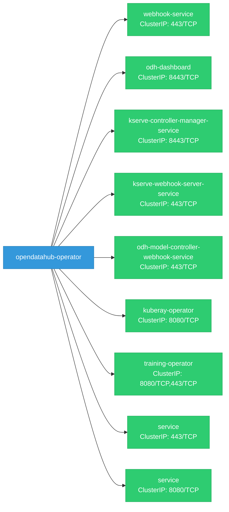

# opendatahub-operator: Network

## Service Map

*9 unique services (14 total, duplicates from test fixtures collapsed).*

### Services

| Name | Type | Ports | Source |
|------|------|-------|--------|
| webhook-service | ClusterIP | 443/TCP | `config/rhaii/webhook/service.yaml` |
| webhook-service | ClusterIP | 443/TCP | `config/rhoai/webhook/service.yaml` |
| webhook-service | ClusterIP | 443/TCP | `config/webhook/service.yaml` |
| odh-dashboard | ClusterIP | 8443/TCP | `opt/manifests/dashboard/core-bases/base/service.yaml` |
| kserve-controller-manager-service | ClusterIP | 8443/TCP | `opt/manifests/kserve/manager/service.yaml` |
| kserve-webhook-server-service | ClusterIP | 443/TCP | `opt/manifests/kserve/webhook/service.yaml` |
| odh-model-controller-webhook-service | ClusterIP | 443/TCP | `opt/manifests/modelcontroller/webhook/service.yaml` |
| webhook-service | ClusterIP | 443/TCP | `opt/manifests/modelregistry/webhook/service.yaml` |
| kuberay-operator | ClusterIP | 8080/TCP | `opt/manifests/ray/manager/service.yaml` |
| webhook-service | ClusterIP | 443/TCP | `opt/manifests/ray/webhook/service.yaml` |
| training-operator | ClusterIP | 8080/TCP, 443/TCP | `opt/manifests/trainingoperator/base/service.yaml` |
| service | ClusterIP | 443/TCP | `opt/manifests/workbenches/kf-notebook-controller/manager/service.yaml` |
| service | ClusterIP | 8080/TCP | `opt/manifests/workbenches/odh-notebook-controller/manager/service.yaml` |
| webhook-service | ClusterIP | 443/TCP | `opt/manifests/workbenches/odh-notebook-controller/webhook/service.yaml` |

### Ingress / Routing

| Kind | Name | Hosts | Paths | TLS | Source |
|------|------|-------|-------|-----|--------|
| HTTPRoute | odh-dashboard |  | / | no | `opt/manifests/dashboard/core-bases/base/httproute.yaml` |
| Gateway | kserve-ingress-gateway |  |  | no | `opt/manifests/kserve/overlays/test/gateway/ingress_gateway.yaml` |
| Ingress | rayclient-ingress | localhost | / | no | `opt/manifests/ray/samples/ingress-rayclient-tls.yaml` |
| Route | odh-dashboard |  |  | yes | `opt/manifests/dashboard/core-bases/base/routes.yaml` |

### Network Policies

| Name | Policy Types | Source |
|------|-------------|--------|
| odh-dashboard-allow-ports | Ingress | `opt/manifests/dashboard/modular-architecture/networkpolicy.yaml` |
| kserve-controller-manager |  | `opt/manifests/kserve/overlays/odh/network-policies.yaml` |

