# opendatahub-operator: RBAC

## RBAC Summary

This component defines a large RBAC surface (97 rules). The table below summarizes permissions by role.

| Role | Kind | Resources | Wildcard |
|------|------|-----------|----------|
| metrics-reader | ClusterRole | 0 |  |
| dashboard-editor-role | ClusterRole | 2 |  |
| dashboard-viewer-role | ClusterRole | 2 |  |
| datasciencepipelines-editor-role | ClusterRole | 2 |  |
| datasciencepipelines-viewer-role | ClusterRole | 2 |  |
| kserve-editor-role | ClusterRole | 2 |  |
| kserve-viewer-role | ClusterRole | 2 |  |
| kueue-editor-role | ClusterRole | 2 |  |
| kueue-viewer-role | ClusterRole | 2 |  |
| modelregistry-editor-role | ClusterRole | 2 |  |
| modelregistry-viewer-role | ClusterRole | 2 |  |
| ray-editor-role | ClusterRole | 2 |  |
| ray-viewer-role | ClusterRole | 2 |  |
| trainingoperator-editor-role | ClusterRole | 2 |  |
| trainingoperator-viewer-role | ClusterRole | 2 |  |
| trustyai-editor-role | ClusterRole | 2 |  |
| trustyai-viewer-role | ClusterRole | 2 |  |
| workbenches-editor-role | ClusterRole | 2 |  |
| workbenches-viewer-role | ClusterRole | 2 |  |
| auth-editor-role | ClusterRole | 2 |  |
| auth-viewer-role | ClusterRole | 2 |  |
| monitoring-editor-role | ClusterRole | 2 |  |
| monitoring-viewer-role | ClusterRole | 2 |  |

### Bindings

| Binding | Type | Role | Subject |
|---------|------|------|---------|
| controller-manager-rolebinding | ClusterRoleBinding | controller-manager-role | ServiceAccount/controller-manager |

```mermaid
graph TD
    %% RBAC hierarchy for opendatahub-operator
    classDef sa fill:#4a90d9,stroke:#2c5f8a,color:#fff
    classDef role fill:#e8a838,stroke:#b07828,color:#fff
    classDef resource fill:#5cb85c,stroke:#3d8b3d,color:#fff

    sa_2["ServiceAccount: controller-manager (system)"] -->|bound via controller-manager-rolebinding| crb_1["controller-manager-rolebinding"]
    class sa_2 sa
    crb_1 -->|grants| cr_controller_manager_role["CR: controller-manager-role"]
    class cr_controller_manager_role role
    cr_dashboard_editor_role -->|create, delete, get, list, patch, update, watch| res_3["components.platform.opendatahub.io: dashboards"]
    class res_3 resource
    cr_dashboard_editor_role -->|get| res_4["components.platform.opendatahub.io: dashboards/status"]
    class res_4 resource
    cr_dashboard_viewer_role -->|get, list, watch| res_5["components.platform.opendatahub.io: dashboards"]
    class res_5 resource
    cr_dashboard_viewer_role -->|get| res_6["components.platform.opendatahub.io: dashboards/status"]
    class res_6 resource
    cr_datasciencepipelines_editor_role -->|create, delete, get, list, patch, update, watch| res_7["components.platform.opendatahub.io: datasciencepipelines"]
    class res_7 resource
    cr_datasciencepipelines_editor_role -->|get| res_8["components.platform.opendatahub.io: datasciencepipelines/status"]
    class res_8 resource
    cr_datasciencepipelines_viewer_role -->|get, list, watch| res_9["components.platform.opendatahub.io: datasciencepipelines"]
    class res_9 resource
    cr_datasciencepipelines_viewer_role -->|get| res_10["components.platform.opendatahub.io: datasciencepipelines/status"]
    class res_10 resource
    cr_kserve_editor_role -->|create, delete, get, list, patch, update, watch| res_11["components.platform.opendatahub.io: kserves"]
    class res_11 resource
    cr_kserve_editor_role -->|get| res_12["components.platform.opendatahub.io: kserves/status"]
    class res_12 resource
    cr_kserve_viewer_role -->|get, list, watch| res_13["components.platform.opendatahub.io: kserves"]
    class res_13 resource
    cr_kserve_viewer_role -->|get| res_14["components.platform.opendatahub.io: kserves/status"]
    class res_14 resource
    cr_kueue_editor_role -->|create, delete, get, list, patch, update, watch| res_15["components.platform.opendatahub.io: kueues"]
    class res_15 resource
    cr_kueue_editor_role -->|get| res_16["components.platform.opendatahub.io: kueues/status"]
    class res_16 resource
    cr_kueue_viewer_role -->|get, list, watch| res_17["components.platform.opendatahub.io: kueues"]
    class res_17 resource
    cr_kueue_viewer_role -->|get| res_18["components.platform.opendatahub.io: kueues/status"]
    class res_18 resource
    cr_modelregistry_editor_role -->|create, delete, get, list, patch, update, watch| res_19["components.platform.opendatahub.io: modelregistries"]
    class res_19 resource
    cr_modelregistry_editor_role -->|get| res_20["components.platform.opendatahub.io: modelregistries/status"]
    class res_20 resource
    cr_modelregistry_viewer_role -->|get, list, watch| res_21["components.platform.opendatahub.io: modelregistries"]
    class res_21 resource
    cr_modelregistry_viewer_role -->|get| res_22["components.platform.opendatahub.io: modelregistries/status"]
    class res_22 resource
    cr_ray_editor_role -->|create, delete, get, list, patch, update, watch| res_23["components.platform.opendatahub.io: rays"]
    class res_23 resource
    cr_ray_editor_role -->|get| res_24["components.platform.opendatahub.io: rays/status"]
    class res_24 resource
    cr_ray_viewer_role -->|get, list, watch| res_25["components.platform.opendatahub.io: rays"]
    class res_25 resource
    cr_ray_viewer_role -->|get| res_26["components.platform.opendatahub.io: rays/status"]
    class res_26 resource
    cr_trainingoperator_editor_role -->|create, delete, get, list, patch, update, watch| res_27["components.platform.opendatahub.io: trainingoperators"]
    class res_27 resource
    cr_trainingoperator_editor_role -->|get| res_28["components.platform.opendatahub.io: trainingoperators/status"]
    class res_28 resource
    cr_trainingoperator_viewer_role -->|get, list, watch| res_29["components.platform.opendatahub.io: trainingoperators"]
    class res_29 resource
    cr_trainingoperator_viewer_role -->|get| res_30["components.platform.opendatahub.io: trainingoperators/status"]
    class res_30 resource
    cr_trustyai_editor_role -->|create, delete, get, list, patch, update, watch| res_31["components.platform.opendatahub.io: trustyais"]
    class res_31 resource
    cr_trustyai_editor_role -->|get| res_32["components.platform.opendatahub.io: trustyais/status"]
    class res_32 resource
    cr_trustyai_viewer_role -->|get, list, watch| res_33["components.platform.opendatahub.io: trustyais"]
    class res_33 resource
    cr_trustyai_viewer_role -->|get| res_34["components.platform.opendatahub.io: trustyais/status"]
    class res_34 resource
    cr_workbenches_editor_role -->|create, delete, get, list, patch, update, watch| res_35["components.platform.opendatahub.io: workbenches"]
    class res_35 resource
    cr_workbenches_editor_role -->|get| res_36["components.platform.opendatahub.io: workbenches/status"]
    class res_36 resource
    cr_workbenches_viewer_role -->|get, list, watch| res_37["components.platform.opendatahub.io: workbenches"]
    class res_37 resource
    cr_workbenches_viewer_role -->|get| res_38["components.platform.opendatahub.io: workbenches/status"]
    class res_38 resource
    cr_auth_editor_role -->|create, delete, get, list, patch, update, watch| res_39["services.opendatahub.io: auths"]
    class res_39 resource
    cr_auth_editor_role -->|get| res_40["services.opendatahub.io: auths/status"]
    class res_40 resource
    cr_auth_viewer_role -->|get, list, watch| res_41["services.opendatahub.io: auths"]
    class res_41 resource
    cr_auth_viewer_role -->|get| res_42["services.opendatahub.io: auths/status"]
    class res_42 resource
    cr_monitoring_editor_role -->|create, delete, get, list, patch, update, watch| res_43["services.platform.opendatahub.io: monitorings"]
    class res_43 resource
    cr_monitoring_editor_role -->|get| res_44["services.platform.opendatahub.io: monitorings/status"]
    class res_44 resource
    cr_monitoring_viewer_role -->|get, list, watch| res_45["services.platform.opendatahub.io: monitorings"]
    class res_45 resource
    cr_monitoring_viewer_role -->|get| res_46["services.platform.opendatahub.io: monitorings/status"]
    class res_46 resource
```

Full RBAC hierarchy diagram

### Cluster Roles

| Name | Resources | Verbs | Source |
|------|-----------|-------|--------|
| metrics-reader |  | get | `config/rbac/auth_proxy_client_clusterrole.yaml` |
| dashboard-editor-role | dashboards | create, delete, get, list, patch, update, watch | `config/rbac/components_dashboard_editor_role.yaml` |
| dashboard-editor-role | dashboards/status | get | `config/rbac/components_dashboard_editor_role.yaml` |
| dashboard-viewer-role | dashboards | get, list, watch | `config/rbac/components_dashboard_viewer_role.yaml` |
| dashboard-viewer-role | dashboards/status | get | `config/rbac/components_dashboard_viewer_role.yaml` |
| datasciencepipelines-editor-role | datasciencepipelines | create, delete, get, list, patch, update, watch | `config/rbac/components_datasciencepipelines_editor_role.yaml` |
| datasciencepipelines-editor-role | datasciencepipelines/status | get | `config/rbac/components_datasciencepipelines_editor_role.yaml` |
| datasciencepipelines-viewer-role | datasciencepipelines | get, list, watch | `config/rbac/components_datasciencepipelines_viewer_role.yaml` |
| datasciencepipelines-viewer-role | datasciencepipelines/status | get | `config/rbac/components_datasciencepipelines_viewer_role.yaml` |
| kserve-editor-role | kserves | create, delete, get, list, patch, update, watch | `config/rbac/components_kserve_editor_role.yaml` |
| kserve-editor-role | kserves/status | get | `config/rbac/components_kserve_editor_role.yaml` |
| kserve-viewer-role | kserves | get, list, watch | `config/rbac/components_kserve_viewer_role.yaml` |
| kserve-viewer-role | kserves/status | get | `config/rbac/components_kserve_viewer_role.yaml` |
| kueue-editor-role | kueues | create, delete, get, list, patch, update, watch | `config/rbac/components_kueue_editor_role.yaml` |
| kueue-editor-role | kueues/status | get | `config/rbac/components_kueue_editor_role.yaml` |
| kueue-viewer-role | kueues | get, list, watch | `config/rbac/components_kueue_viewer_role.yaml` |
| kueue-viewer-role | kueues/status | get | `config/rbac/components_kueue_viewer_role.yaml` |
| modelregistry-editor-role | modelregistries | create, delete, get, list, patch, update, watch | `config/rbac/components_modelregistry_editor_role.yaml` |
| modelregistry-editor-role | modelregistries/status | get | `config/rbac/components_modelregistry_editor_role.yaml` |
| modelregistry-viewer-role | modelregistries | get, list, watch | `config/rbac/components_modelregistry_viewer_role.yaml` |
| modelregistry-viewer-role | modelregistries/status | get | `config/rbac/components_modelregistry_viewer_role.yaml` |
| ray-editor-role | rays | create, delete, get, list, patch, update, watch | `config/rbac/components_ray_editor_role.yaml` |
| ray-editor-role | rays/status | get | `config/rbac/components_ray_editor_role.yaml` |
| ray-viewer-role | rays | get, list, watch | `config/rbac/components_ray_viewer_role.yaml` |
| ray-viewer-role | rays/status | get | `config/rbac/components_ray_viewer_role.yaml` |
| trainingoperator-editor-role | trainingoperators | create, delete, get, list, patch, update, watch | `config/rbac/components_trainingoperator_editor_role.yaml` |
| trainingoperator-editor-role | trainingoperators/status | get | `config/rbac/components_trainingoperator_editor_role.yaml` |
| trainingoperator-viewer-role | trainingoperators | get, list, watch | `config/rbac/components_trainingoperator_viewer_role.yaml` |
| trainingoperator-viewer-role | trainingoperators/status | get | `config/rbac/components_trainingoperator_viewer_role.yaml` |
| trustyai-editor-role | trustyais | create, delete, get, list, patch, update, watch | `config/rbac/components_trustyai_editor_role.yaml` |
| trustyai-editor-role | trustyais/status | get | `config/rbac/components_trustyai_editor_role.yaml` |
| trustyai-viewer-role | trustyais | get, list, watch | `config/rbac/components_trustyai_viewer_role.yaml` |
| trustyai-viewer-role | trustyais/status | get | `config/rbac/components_trustyai_viewer_role.yaml` |
| workbenches-editor-role | workbenches | create, delete, get, list, patch, update, watch | `config/rbac/components_workbenches_editor_role.yaml` |
| workbenches-editor-role | workbenches/status | get | `config/rbac/components_workbenches_editor_role.yaml` |
| workbenches-viewer-role | workbenches | get, list, watch | `config/rbac/components_workbenches_viewer_role.yaml` |
| workbenches-viewer-role | workbenches/status | get | `config/rbac/components_workbenches_viewer_role.yaml` |
| auth-editor-role | auths | create, delete, get, list, patch, update, watch | `config/rbac/services_auth_editor_role.yaml` |
| auth-editor-role | auths/status | get | `config/rbac/services_auth_editor_role.yaml` |
| auth-viewer-role | auths | get, list, watch | `config/rbac/services_auth_viewer_role.yaml` |
| auth-viewer-role | auths/status | get | `config/rbac/services_auth_viewer_role.yaml` |
| monitoring-editor-role | monitorings | create, delete, get, list, patch, update, watch | `config/rbac/services_monitoring_editor_role.yaml` |
| monitoring-editor-role | monitorings/status | get | `config/rbac/services_monitoring_editor_role.yaml` |
| monitoring-viewer-role | monitorings | get, list, watch | `config/rbac/services_monitoring_viewer_role.yaml` |
| monitoring-viewer-role | monitorings/status | get | `config/rbac/services_monitoring_viewer_role.yaml` |

### Kubebuilder RBAC Markers

35 markers found in source code.

