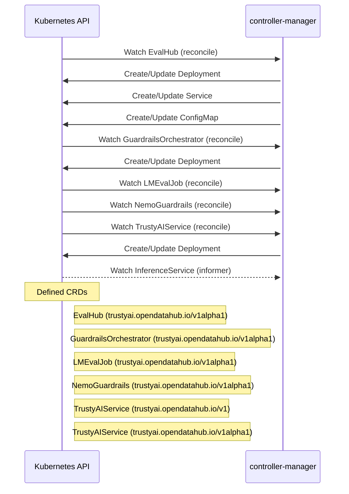

# trustyai-service-operator: Dataflow

## Controller Watches

| Type | GVK | Source |
|------|-----|--------|
| For | evalhub/v1alpha1/EvalHub | `controllers/evalhub/evalhub_controller.go:170` |
| For | gorch/v1alpha1/GuardrailsOrchestrator | `controllers/gorch/guardrailsorchestrator_controller.go:407` |
| For | lmes/v1alpha1/LMEvalJob | `controllers/lmes/lmevaljob_controller.go:299` |
| For | nemo_guardrails/v1alpha1/NemoGuardrails | `controllers/nemo_guardrails/nemoguardrail_controller.go:194` |
| For | tas/v1alpha1/TrustyAIService | `controllers/tas/trustyaiservice_controller.go:279` |
| Owns | /v1/ConfigMap | `controllers/evalhub/evalhub_controller.go:173` |
| Owns | /v1/Service | `controllers/evalhub/evalhub_controller.go:172` |
| Owns | apps/v1/Deployment | `controllers/evalhub/evalhub_controller.go:171` |
| Owns | apps/v1/Deployment | `controllers/gorch/guardrailsorchestrator_controller.go:408` |
| Owns | apps/v1/Deployment | `controllers/tas/trustyaiservice_controller.go:280` |
| Watches | serving/v1beta1/InferenceService | `controllers/tas/trustyaiservice_controller.go:281` |

## Reconciliation Flow

How the controller interacts with the Kubernetes API during reconciliation.

## Configuration

