# trustyai-service-operator: RBAC

## RBAC Hierarchy

ServiceAccount bindings, roles, and resource permissions.

```mermaid
graph TD
    %% RBAC hierarchy for trustyai-service-operator
    classDef sa fill:#4a90d9,stroke:#2c5f8a,color:#fff
    classDef role fill:#e8a838,stroke:#b07828,color:#fff
    classDef resource fill:#5cb85c,stroke:#3d8b3d,color:#fff

    sa_2["ServiceAccount: controller-manager (system)"] -->|bound via proxy-rolebinding| crb_1["proxy-rolebinding"]
    class sa_2 sa
    crb_1 -->|grants| cr_proxy_role["CR: proxy-role"]
    class cr_proxy_role role
    sa_4["Group: system:authenticated"] -->|bound via default-lmeval-user-rolebinding| crb_3["default-lmeval-user-rolebinding"]
    class sa_4 sa
    crb_3 -->|grants| cr_lmeval_user_role["CR: lmeval-user-role"]
    class cr_lmeval_user_role role
    sa_6["ServiceAccount: controller-manager (system)"] -->|bound via manager-rolebinding| crb_5["manager-rolebinding"]
    class sa_6 sa
    crb_5 -->|grants| cr_manager_role["CR: manager-role"]
    class cr_manager_role role
    sa_8["ServiceAccount: controller-manager"] -->|bound via manager-auth-delegator| crb_7["manager-auth-delegator"]
    class sa_8 sa
    crb_7 -->|grants| cr_system_auth_delegator["CR: system:auth-delegator"]
    class cr_system_auth_delegator role
    sa_10["ServiceAccount: controller-manager"] -->|bound via leader-election-rolebinding| rb_9["leader-election-rolebinding"]
    class sa_10 sa
    rb_9 -->|grants| r_leader_election_role["Role: leader-election-role"]
    class r_leader_election_role role
    cr_proxy_role -->|create| res_11["authentication.k8s.io: tokenreviews"]
    class res_11 resource
    cr_proxy_role -->|create| res_12["authorization.k8s.io: subjectaccessreviews"]
    class res_12 resource
    cr_evalhub_proxy_role -->|create| res_13["authentication.k8s.io: tokenreviews"]
    class res_13 resource
    cr_evalhub_proxy_role -->|create| res_14["authorization.k8s.io: subjectaccessreviews"]
    class res_14 resource
    cr_evalhub_proxy_role -->|get, list, watch| res_15["trustyai.opendatahub.io: evalhubs"]
    class res_15 resource
    cr_evalhub_proxy_role -->|get, create, update| res_16["trustyai.opendatahub.io: evalhubs/proxy"]
    class res_16 resource
    cr_nemoguardrail_editor_role -->|create, delete, get, list, patch, update, watch| res_17["trustyai.opendatahub.io: nemoguardrails"]
    class res_17 resource
    cr_nemoguardrail_editor_role -->|get| res_18["trustyai.opendatahub.io: nemoguardrails/status"]
    class res_18 resource
    cr_nemoguardrail_viewer_role -->|get, list, watch| res_19["trustyai.opendatahub.io: nemoguardrails"]
    class res_19 resource
    cr_nemoguardrail_viewer_role -->|get| res_20["trustyai.opendatahub.io: nemoguardrails/status"]
    class res_20 resource
    cr_lmeval_user_role -->|create, delete, get, list, patch, update, watch| res_21["trustyai.opendatahub.io: lmevaljobs"]
    class res_21 resource
    cr_lmeval_user_role -->|get| res_22["trustyai.opendatahub.io: lmevaljobs/status"]
    class res_22 resource
    cr_manager_role -->|create, delete, get, list, patch, update, watch| res_23["core: configmaps"]
    class res_23 resource
    cr_manager_role -->|create, delete, get, list, patch, update, watch| res_24["core: persistentvolumeclaims"]
    class res_24 resource
    cr_manager_role -->|create, delete, get, list, patch, update, watch| res_25["core: pods"]
    class res_25 resource
    cr_manager_role -->|create, delete, get, list, patch, update, watch| res_26["core: secrets"]
    class res_26 resource
    cr_manager_role -->|create, delete, get, list, patch, update, watch| res_27["core: serviceaccounts"]
    class res_27 resource
    cr_manager_role -->|create, delete, get, list, patch, update, watch| res_28["core: services"]
    class res_28 resource
    cr_manager_role -->|create, patch, update, watch| res_29["core: events"]
    class res_29 resource
    cr_manager_role -->|get, list, watch| res_30["core: persistentvolumes"]
    class res_30 resource
    cr_manager_role -->|create, delete, get, list, watch| res_31["core: pods/exec"]
    class res_31 resource
    cr_manager_role -->|get, list, watch| res_32["apiextensions.k8s.io: customresourcedefinitions"]
    class res_32 resource
    cr_manager_role -->|create, delete, get, list, patch, update, watch| res_33["apps: deployments"]
    class res_33 resource
    cr_manager_role -->|update| res_34["apps: deployments/finalizers"]
    class res_34 resource
    cr_manager_role -->|get, patch, update| res_35["apps: deployments/status"]
    class res_35 resource
    cr_manager_role -->|create, get, update| res_36["coordination.k8s.io: leases"]
    class res_36 resource
    cr_manager_role -->|get, list, watch| res_37["kueue.x-k8s.io: resourceflavors"]
    class res_37 resource
    cr_manager_role -->|get, list, watch| res_38["kueue.x-k8s.io: workloadpriorityclasses"]
    class res_38 resource
    cr_manager_role -->|create, delete, get, list, patch, update, watch| res_39["kueue.x-k8s.io: workloads"]
    class res_39 resource
    cr_manager_role -->|update| res_40["kueue.x-k8s.io: workloads/finalizers"]
    class res_40 resource
    cr_manager_role -->|get, patch, update| res_41["kueue.x-k8s.io: workloads/status"]
    class res_41 resource
    cr_manager_role -->|create, list, watch| res_42["monitoring.coreos.com: servicemonitors"]
    class res_42 resource
    cr_manager_role -->|create, delete, get, list, patch, update, watch| res_43["networking.istio.io: destinationrules"]
    class res_43 resource
    cr_manager_role -->|create, delete, get, list, patch, update, watch| res_44["networking.istio.io: virtualservices"]
    class res_44 resource
    cr_manager_role -->|create, delete, get, list, update, watch| res_45["rbac.authorization.k8s.io: clusterrolebindings"]
    class res_45 resource
    cr_manager_role -->|create, delete, get, list, patch, update, watch| res_46["route.openshift.io: routes"]
    class res_46 resource
    cr_manager_role -->|get, list, watch| res_47["scheduling.k8s.io: priorityclasses"]
    class res_47 resource
    cr_manager_role -->|get, list, patch, update, watch| res_48["serving.kserve.io: inferenceservices"]
    class res_48 resource
    cr_manager_role -->|delete, get, list, patch, update, watch| res_49["serving.kserve.io: inferenceservices/finalizers"]
    class res_49 resource
    cr_manager_role -->|get, list, watch| res_50["serving.kserve.io: servingruntimes"]
    class res_50 resource
    cr_manager_role -->|create, delete, get, list, patch, update, watch| res_51["trustyai.opendatahub.io: evalhubs"]
    class res_51 resource
    cr_manager_role -->|create, delete, get, list, patch, update, watch| res_52["trustyai.opendatahub.io: guardrailsorchestrators"]
    class res_52 resource
    cr_manager_role -->|create, delete, get, list, patch, update, watch| res_53["trustyai.opendatahub.io: lmevaljobs"]
    class res_53 resource
    cr_manager_role -->|create, delete, get, list, patch, update, watch| res_54["trustyai.opendatahub.io: nemoguardrails"]
    class res_54 resource
    cr_manager_role -->|create, delete, get, list, patch, update, watch| res_55["trustyai.opendatahub.io: trustyaiservices"]
    class res_55 resource
    cr_manager_role -->|update| res_56["trustyai.opendatahub.io: evalhubs/finalizers"]
    class res_56 resource
    cr_manager_role -->|update| res_57["trustyai.opendatahub.io: guardrailsorchestrators/finalizers"]
    class res_57 resource
    cr_manager_role -->|update| res_58["trustyai.opendatahub.io: lmevaljobs/finalizers"]
    class res_58 resource
    cr_manager_role -->|update| res_59["trustyai.opendatahub.io: nemoguardrails/finalizers"]
    class res_59 resource
    cr_manager_role -->|update| res_60["trustyai.opendatahub.io: trustyaiservices/finalizers"]
    class res_60 resource
    cr_manager_role -->|create, get, update| res_61["trustyai.opendatahub.io: evalhubs/proxy"]
    class res_61 resource
    cr_manager_role -->|get, patch, update| res_62["trustyai.opendatahub.io: evalhubs/status"]
    class res_62 resource
    cr_manager_role -->|get, patch, update| res_63["trustyai.opendatahub.io: guardrailsorchestrators/status"]
    class res_63 resource
    cr_manager_role -->|get, patch, update| res_64["trustyai.opendatahub.io: lmevaljobs/status"]
    class res_64 resource
    cr_manager_role -->|get, patch, update| res_65["trustyai.opendatahub.io: nemoguardrails/status"]
    class res_65 resource
    cr_manager_role -->|get, patch, update| res_66["trustyai.opendatahub.io: trustyaiservices/status"]
    class res_66 resource
    cr_trustyaiservice_editor_role -->|create, delete, get, list, patch, update, watch| res_67["trustyai.opendatahub.io: trustyaiservices"]
    class res_67 resource
    cr_trustyaiservice_editor_role -->|get| res_68["trustyai.opendatahub.io: trustyaiservices/status"]
    class res_68 resource
    cr_trustyaiservice_viewer_role -->|get, list, watch| res_69["trustyai.opendatahub.io: trustyaiservices"]
    class res_69 resource
    cr_trustyaiservice_viewer_role -->|get| res_70["trustyai.opendatahub.io: trustyaiservices/status"]
    class res_70 resource
    r_leader_election_role -->|get, list, watch, create, update, patch, delete| res_71["core: configmaps"]
    class res_71 resource
    r_leader_election_role -->|get, list, watch, create, update, patch, delete| res_72["coordination.k8s.io: leases"]
    class res_72 resource
    r_leader_election_role -->|create, patch| res_73["core: events"]
    class res_73 resource
```

### Cluster Roles

| Name | Resources | Verbs | Source |
|------|-----------|-------|--------|
| metrics-reader |  | get | `config/rbac/auth_proxy_client_clusterrole.yaml` |
| proxy-role | tokenreviews | create | `config/rbac/auth_proxy_role.yaml` |
| proxy-role | subjectaccessreviews | create | `config/rbac/auth_proxy_role.yaml` |
| evalhub-proxy-role | tokenreviews | create | `config/rbac/evalhub_proxy_role.yaml` |
| evalhub-proxy-role | subjectaccessreviews | create | `config/rbac/evalhub_proxy_role.yaml` |
| evalhub-proxy-role | evalhubs | get, list, watch | `config/rbac/evalhub_proxy_role.yaml` |
| evalhub-proxy-role | evalhubs/proxy | get, create, update | `config/rbac/evalhub_proxy_role.yaml` |
| nemoguardrail-editor-role | nemoguardrails | create, delete, get, list, patch, update, watch | `config/rbac/nemoguardrail_editor_role.yaml` |
| nemoguardrail-editor-role | nemoguardrails/status | get | `config/rbac/nemoguardrail_editor_role.yaml` |
| nemoguardrail-viewer-role | nemoguardrails | get, list, watch | `config/rbac/nemoguardrail_viewer_role.yaml` |
| nemoguardrail-viewer-role | nemoguardrails/status | get | `config/rbac/nemoguardrail_viewer_role.yaml` |
| lmeval-user-role | lmevaljobs | create, delete, get, list, patch, update, watch | `config/rbac/non_admin_lmeval_role.yaml` |
| lmeval-user-role | lmevaljobs/status | get | `config/rbac/non_admin_lmeval_role.yaml` |
| manager-role | configmaps, persistentvolumeclaims, pods, secrets, serviceaccounts, services | create, delete, get, list, patch, update, watch | `config/rbac/role.yaml` |
| manager-role | events | create, patch, update, watch | `config/rbac/role.yaml` |
| manager-role | persistentvolumes | get, list, watch | `config/rbac/role.yaml` |
| manager-role | pods/exec | create, delete, get, list, watch | `config/rbac/role.yaml` |
| manager-role | customresourcedefinitions | get, list, watch | `config/rbac/role.yaml` |
| manager-role | deployments | create, delete, get, list, patch, update, watch | `config/rbac/role.yaml` |
| manager-role | deployments/finalizers | update | `config/rbac/role.yaml` |
| manager-role | deployments/status | get, patch, update | `config/rbac/role.yaml` |
| manager-role | leases | create, get, update | `config/rbac/role.yaml` |
| manager-role | resourceflavors, workloadpriorityclasses | get, list, watch | `config/rbac/role.yaml` |
| manager-role | workloads | create, delete, get, list, patch, update, watch | `config/rbac/role.yaml` |
| manager-role | workloads/finalizers | update | `config/rbac/role.yaml` |
| manager-role | workloads/status | get, patch, update | `config/rbac/role.yaml` |
| manager-role | servicemonitors | create, list, watch | `config/rbac/role.yaml` |
| manager-role | destinationrules, virtualservices | create, delete, get, list, patch, update, watch | `config/rbac/role.yaml` |
| manager-role | clusterrolebindings | create, delete, get, list, update, watch | `config/rbac/role.yaml` |
| manager-role | routes | create, delete, get, list, patch, update, watch | `config/rbac/role.yaml` |
| manager-role | priorityclasses | get, list, watch | `config/rbac/role.yaml` |
| manager-role | inferenceservices | get, list, patch, update, watch | `config/rbac/role.yaml` |
| manager-role | inferenceservices/finalizers | delete, get, list, patch, update, watch | `config/rbac/role.yaml` |
| manager-role | servingruntimes | get, list, watch | `config/rbac/role.yaml` |
| manager-role | evalhubs, guardrailsorchestrators, lmevaljobs, nemoguardrails, trustyaiservices | create, delete, get, list, patch, update, watch | `config/rbac/role.yaml` |
| manager-role | evalhubs/finalizers, guardrailsorchestrators/finalizers, lmevaljobs/finalizers, nemoguardrails/finalizers, trustyaiservices/finalizers | update | `config/rbac/role.yaml` |
| manager-role | evalhubs/proxy | create, get, update | `config/rbac/role.yaml` |
| manager-role | evalhubs/status, guardrailsorchestrators/status, lmevaljobs/status, nemoguardrails/status, trustyaiservices/status | get, patch, update | `config/rbac/role.yaml` |
| trustyaiservice-editor-role | trustyaiservices | create, delete, get, list, patch, update, watch | `config/rbac/trustyaiservice_editor_role.yaml` |
| trustyaiservice-editor-role | trustyaiservices/status | get | `config/rbac/trustyaiservice_editor_role.yaml` |
| trustyaiservice-viewer-role | trustyaiservices | get, list, watch | `config/rbac/trustyaiservice_viewer_role.yaml` |
| trustyaiservice-viewer-role | trustyaiservices/status | get | `config/rbac/trustyaiservice_viewer_role.yaml` |

### Kubebuilder RBAC Markers

44 markers found in source code.

