# OpenShift AI Platform Analysis

*Generated by rhoai-architecture-analyzer. All data produced by deterministic static analysis.*

## Platform Summary

| Metric | Count |
|--------|-------|
| Components | 11 |
| CRDs | 50 |
| Services | 29 |
| Secrets | 25 |
| Cluster Roles | 52 |
| Cross-Component Dependencies | 9 |

## Component Dependency Graph

```mermaid
graph TD
    classDef operator fill:#3498db,stroke:#2980b9,color:#fff
    classDef serving fill:#9b59b6,stroke:#8e44ad,color:#fff
    classDef data fill:#e74c3c,stroke:#c0392b,color:#fff
    classDef infra fill:#95a5a6,stroke:#7f8c8d,color:#fff
    classDef ui fill:#2ecc71,stroke:#27ae60,color:#fff

    data_science_pipelines_operator["data-science-pipelines-operator\n(4 CRDs)"]
    kserve["kserve\n(14 CRDs)"]
    kube_auth_proxy["kube-auth-proxy"]
    kube_rbac_proxy["kube-rbac-proxy"]
    kuberay["kuberay"]
    model_registry_operator["model-registry-operator\n(2 CRDs)"]
    notebooks["notebooks"]
    odh_dashboard["odh-dashboard"]
    odh_model_controller["odh-model-controller\n(1 CRDs)"]
    opendatahub_operator["opendatahub-operator\n(23 CRDs)"]
    trustyai_service_operator["trustyai-service-operator\n(6 CRDs)"]

    llama_stack_k8s_operator["llama-stack-k8s-operator"]
    odh_dashboard -.->|"go-module"| llama_stack_k8s_operator
    mlflow_go["mlflow-go"]
    odh_dashboard -.->|"go-module"| mlflow_go
    odh_model_controller -.->|"go-module"| kserve
    odh_model_controller -->|"watches InferenceGraph"| kserve
    odh_model_controller -->|"watches InferenceService"| kserve
    odh_model_controller -->|"watches LLMInferenceService"| kserve
    odh_model_controller -->|"watches ServingRuntime"| kserve
    models_as_a_service["models-as-a-service"]
    opendatahub_operator -.->|"go-module"| models_as_a_service
    opendatahub_operator -.->|"go-module"| opendatahub_operator
```

## Components Analyzed

| Component | CRDs |
|-----------|------|
| data-science-pipelines-operator | 4 |
| kserve | 14 |
| kube-auth-proxy | 0 |
| kube-rbac-proxy | 0 |
| kuberay | 0 |
| model-registry-operator | 2 |
| notebooks | 0 |
| odh-dashboard | 0 |
| odh-model-controller | 1 |
| opendatahub-operator | 23 |
| trustyai-service-operator | 6 |

