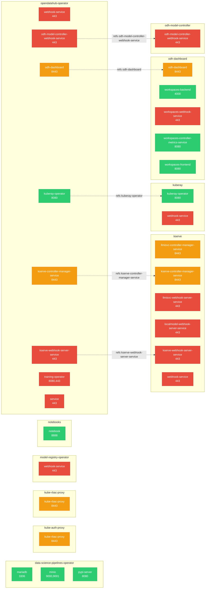

# Network Topology

29 Kubernetes services across the platform.

## Service Map

Services grouped by owning component. Dashed arrows show cross-component references (component A deploys or references a service defined by component B).

## Services by Component

| Owner | Service | Ports |
|-------|---------|-------|
| data-science-pipelines-operator | mariadb | 3306/TCP |
| data-science-pipelines-operator | minio | 9000/TCP, 9001/TCP |
| data-science-pipelines-operator | pypi-server | 8080/TCP |
| kserve | llmisvc-controller-manager-service | 8443/TCP |
| kserve | kserve-controller-manager-service | 8443/TCP |
| kserve | llmisvc-webhook-server-service | 443/TCP |
| kserve | localmodel-webhook-server-service | 443/TCP |
| kserve | kserve-webhook-server-service | 443/TCP |
| kserve | webhook-service | 443/TCP |
| kube-auth-proxy | kube-rbac-proxy | 8443/TCP |
| kube-rbac-proxy | kube-rbac-proxy | 8443/TCP |
| kuberay | kuberay-operator | 8080/TCP |
| kuberay | webhook-service | 443/TCP |
| model-registry-operator | webhook-service | 443/TCP |
| notebooks | notebook | 8888/TCP |
| odh-dashboard | odh-dashboard | 8443/TCP |
| odh-dashboard | workspaces-backend | 4000/TCP |
| odh-dashboard | workspaces-webhook-service | 443/TCP |
| odh-dashboard | workspaces-controller-metrics-service | 8080/TCP |
| odh-dashboard | workspaces-frontend | 8080/TCP |
| odh-model-controller | odh-model-controller-webhook-service | 443/TCP |
| opendatahub-operator | webhook-service | 443/TCP |
| opendatahub-operator | odh-dashboard | 8443/TCP |
| opendatahub-operator | kserve-controller-manager-service | 8443/TCP |
| opendatahub-operator | kserve-webhook-server-service | 443/TCP |
| opendatahub-operator | odh-model-controller-webhook-service | 443/TCP |
| opendatahub-operator | kuberay-operator | 8080/TCP |
| opendatahub-operator | training-operator | 8080/TCP, 443/TCP |
| opendatahub-operator | service | 443/TCP |

## Port Patterns

- **3306/TCP**: mariadb
- **4000/TCP**: workspaces-backend
- **443/TCP**: llmisvc-webhook-server-service, localmodel-webhook-server-service, kserve-webhook-server-service, webhook-service, webhook-service, webhook-service, workspaces-webhook-service, odh-model-controller-webhook-service, webhook-service, kserve-webhook-server-service, odh-model-controller-webhook-service, training-operator, service
- **8080/TCP**: pypi-server, kuberay-operator, workspaces-controller-metrics-service, workspaces-frontend, kuberay-operator, training-operator
- **8443/TCP**: llmisvc-controller-manager-service, kserve-controller-manager-service, kube-rbac-proxy, kube-rbac-proxy, odh-dashboard, odh-dashboard, kserve-controller-manager-service
- **8888/TCP**: notebook
- **9000/TCP**: minio
- **9001/TCP**: minio

