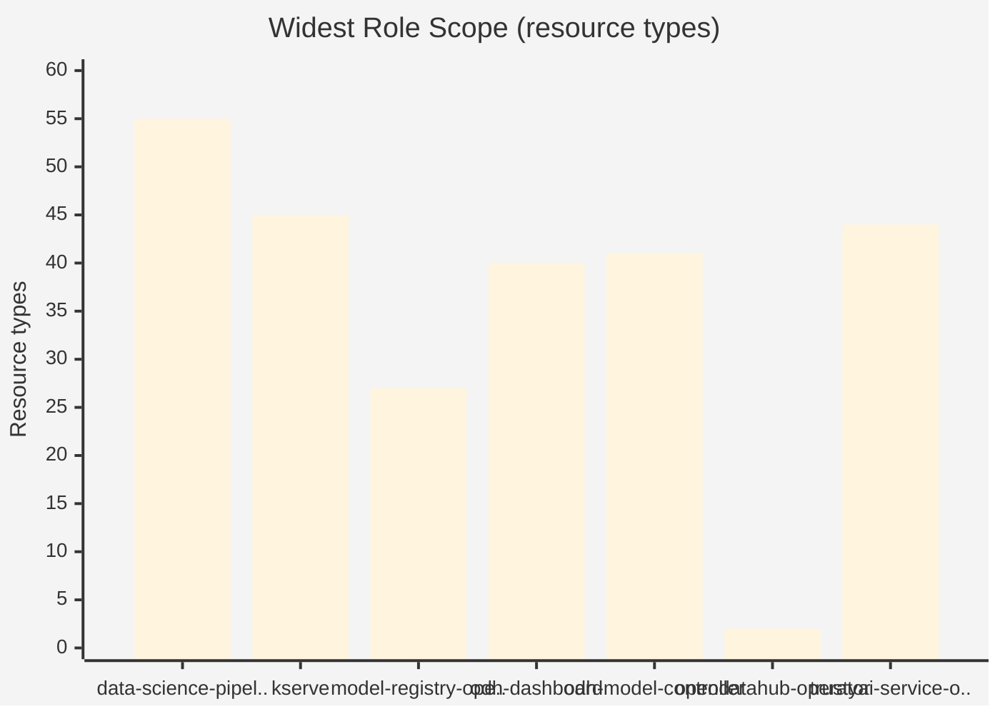

# RBAC Surface

52 cluster roles across the platform.

## Permission Scope by Component

Each bar shows the widest role (by resource type count). Color indicates scope: :red_circle: wide (>30 resources), :orange_circle: medium (10-30), :green_circle: narrow (<10).

## Roles by Component

| Component | Roles | Widest Role | Resources | Scope |
|-----------|-------|-------------|-----------|-------|
| data-science-pipelines-operator | 4 | manager-role | 55 | **wide** |
| kserve | 2 | kserve-manager-role | 45 | **wide** |
| model-registry-operator | 6 | manager-role | 27 | medium |
| odh-dashboard | 1 | odh-dashboard | 40 | **wide** |
| odh-model-controller | 7 | odh-model-controller-role | 41 | **wide** |
| opendatahub-operator | 23 | modelregistry-viewer-role | 2 | narrow |
| trustyai-service-operator | 9 | manager-role | 44 | **wide** |

Full role details

| Owner | Role | Resource Types |
|-------|------|----------------|
| data-science-pipelines-operator | manager-role | 55 |
| data-science-pipelines-operator | manager-argo-role | 22 |
| data-science-pipelines-operator | aggregate-dspa-admin-edit | 4 |
| data-science-pipelines-operator | aggregate-dspa-admin-view | 4 |
| kserve | kserve-manager-role | 45 |
| kserve | kserve-proxy-role | 2 |
| model-registry-operator | manager-role | 27 |
| model-registry-operator | proxy-role | 2 |
| model-registry-operator | modelregistry-admin-role | 2 |
| model-registry-operator | modelregistry-editor-role | 2 |
| model-registry-operator | modelregistry-viewer-role | 2 |
| model-registry-operator | metrics-reader | 0 |
| odh-dashboard | odh-dashboard | 40 |
| odh-model-controller | odh-model-controller-role | 41 |
| odh-model-controller | kserve-prometheus-k8s | 3 |
| odh-model-controller | account-editor-role | 2 |
| odh-model-controller | account-viewer-role | 2 |
| odh-model-controller | proxy-role | 2 |
| odh-model-controller | metrics-auth-role | 2 |
| odh-model-controller | metrics-reader | 0 |
| opendatahub-operator | modelregistry-viewer-role | 2 |
| opendatahub-operator | kueue-viewer-role | 2 |
| opendatahub-operator | dashboard-viewer-role | 2 |
| opendatahub-operator | datasciencepipelines-editor-role | 2 |
| opendatahub-operator | datasciencepipelines-viewer-role | 2 |
| opendatahub-operator | kserve-editor-role | 2 |
| opendatahub-operator | kserve-viewer-role | 2 |
| opendatahub-operator | ray-viewer-role | 2 |
| opendatahub-operator | ray-editor-role | 2 |
| opendatahub-operator | modelregistry-editor-role | 2 |
| opendatahub-operator | dashboard-editor-role | 2 |
| opendatahub-operator | monitoring-viewer-role | 2 |
| opendatahub-operator | kueue-editor-role | 2 |
| opendatahub-operator | trainingoperator-editor-role | 2 |
| opendatahub-operator | trainingoperator-viewer-role | 2 |
| opendatahub-operator | trustyai-editor-role | 2 |
| opendatahub-operator | trustyai-viewer-role | 2 |
| opendatahub-operator | workbenches-editor-role | 2 |
| opendatahub-operator | workbenches-viewer-role | 2 |
| opendatahub-operator | auth-editor-role | 2 |
| opendatahub-operator | auth-viewer-role | 2 |
| opendatahub-operator | monitoring-editor-role | 2 |
| opendatahub-operator | metrics-reader | 0 |
| trustyai-service-operator | manager-role | 44 |
| trustyai-service-operator | evalhub-proxy-role | 4 |
| trustyai-service-operator | proxy-role | 2 |
| trustyai-service-operator | nemoguardrail-editor-role | 2 |
| trustyai-service-operator | nemoguardrail-viewer-role | 2 |
| trustyai-service-operator | lmeval-user-role | 2 |
| trustyai-service-operator | trustyaiservice-editor-role | 2 |
| trustyai-service-operator | trustyaiservice-viewer-role | 2 |
| trustyai-service-operator | metrics-reader | 0 |

