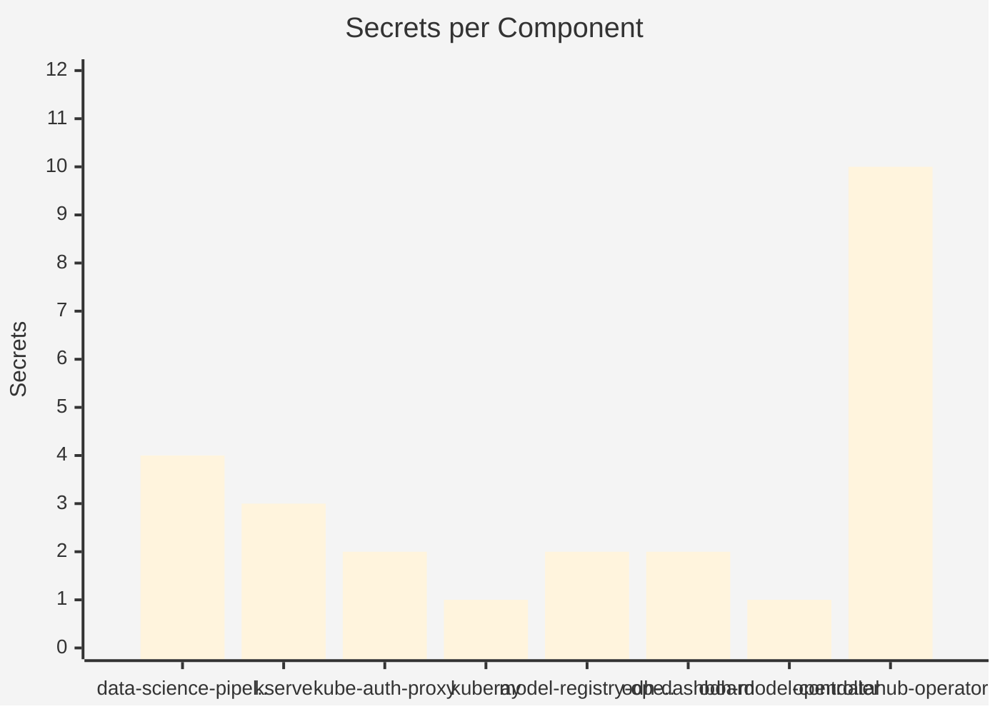

# Secrets Inventory

25 secrets referenced across the platform. No secret values are extracted, only names, types, and which component references them.

## Secret Distribution

## Secrets by Component

| Component | TLS | Opaque | Total |
|-----------|-----|--------|-------|
| data-science-pipelines-operator | 0 | 4 | 4 |
| kserve | 0 | 3 | 3 |
| kube-auth-proxy | 0 | 2 | 2 |
| kuberay | 0 | 1 | 1 |
| model-registry-operator | 0 | 2 | 2 |
| odh-dashboard | 1 | 1 | 2 |
| odh-model-controller | 1 | 0 | 1 |
| opendatahub-operator | 5 | 5 | 10 |

Full secret inventory

| Owner | Secret | Type |
|-------|--------|------|
| data-science-pipelines-operator | mariadb-certs | Opaque |
| data-science-pipelines-operator | ds-pipeline-db-test | Opaque |
| data-science-pipelines-operator | minio-certs | Opaque |
| data-science-pipelines-operator | minio | Opaque |
| kserve | llmisvc-webhook-server-cert | Opaque |
| kserve | localmodel-webhook-server-cert | Opaque |
| kserve | kserve-webhook-server-cert | Opaque |
| kube-auth-proxy | kube-auth-proxy-secret | Opaque |
| kube-auth-proxy | kube-rbac-proxy-client-certificates | Opaque |
| kuberay | webhook-server-cert | Opaque |
| model-registry-operator | webhook-server-cert | Opaque |
| model-registry-operator | controller-manager-metrics-service | Opaque |
| odh-dashboard | dashboard-proxy-tls | kubernetes.io/tls |
| odh-dashboard | webhook-server-cert | Opaque |
| odh-model-controller | odh-model-controller-webhook-cert | kubernetes.io/tls |
| opendatahub-operator | odh-model-controller-webhook-cert | kubernetes.io/tls |
| opendatahub-operator | webhook-server-cert | Opaque |
| opendatahub-operator | controller-manager-metrics-service | Opaque |
| opendatahub-operator | odh-notebook-controller-webhook-cert | kubernetes.io/tls |
| opendatahub-operator | opendatahub-operator-controller-webhook-cert | kubernetes.io/tls |
| opendatahub-operator | redhat-ods-operator-controller-webhook-cert | kubernetes.io/tls |
| opendatahub-operator | kserve-webhook-server-cert | Opaque |
| opendatahub-operator | kubeflow-training-operator-webhook-cert | Opaque |
| opendatahub-operator | dashboard-proxy-tls | kubernetes.io/tls |
| opendatahub-operator | training-operator-webhook-cert | Opaque |

## Patterns

- **Webhook certs** are the dominant secret type (18 of 25 secrets).
- **kubernetes.io/tls** secrets (7) are used for TLS-terminated services.

