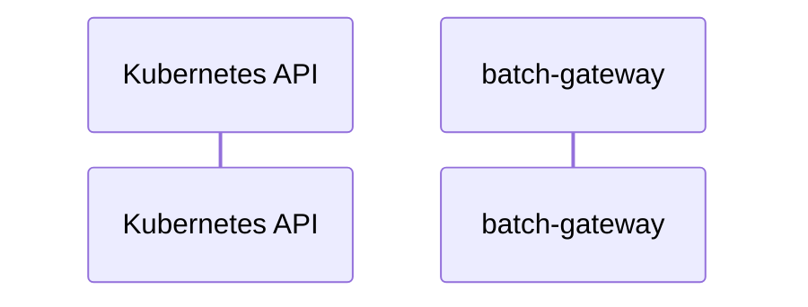

# batch-gateway: Dataflow

## Controller Watches

Kubernetes resources this controller monitors for changes. Each watch triggers reconciliation when the watched resource is created, updated, or deleted.

No controller watches found in analyzed sources.

## Reconciliation Flow

How the controller interacts with the Kubernetes API during reconciliation.

### HTTP Endpoints

| Method | Path | Source |
|--------|------|--------|
| * | / | [`internal/apiserver/common/rest.go:74`](https://github.com/llm-d/batch-gateway/blob/3a99bc3cffc25aba58b5e1855fca895fd36b2d90/internal/apiserver/common/rest.go#L74) |
| * | /health | [`cmd/batch-gc/main.go:164`](https://github.com/llm-d/batch-gateway/blob/3a99bc3cffc25aba58b5e1855fca895fd36b2d90/cmd/batch-gc/main.go#L164) |
| * | /metrics | [`cmd/batch-gc/main.go:163`](https://github.com/llm-d/batch-gateway/blob/3a99bc3cffc25aba58b5e1855fca895fd36b2d90/cmd/batch-gc/main.go#L163) |

## Configuration

ConfigMaps and Helm values that control this component's runtime behavior.

### Helm

**Chart:** batch-gateway v0.1.0

