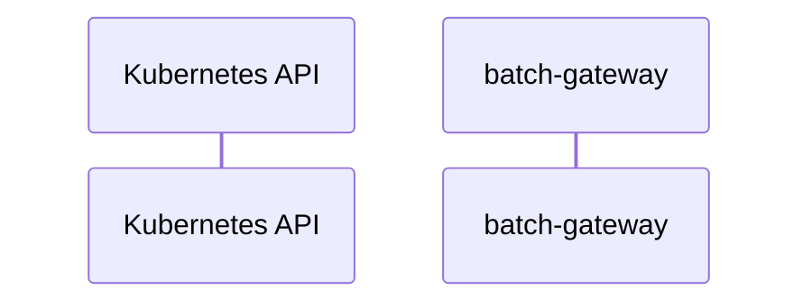

# batch-gateway: Dataflow

## Controller Watches

Kubernetes resources this controller monitors for changes. Each watch triggers reconciliation when the watched resource is created, updated, or deleted.

No controller watches found in analyzed sources.

## Reconciliation Flow

How the controller interacts with the Kubernetes API during reconciliation.

```mermaid
sequenceDiagram
    %% Static dataflow for batch-gateway

    participant KubernetesAPI as Kubernetes API
    participant batch_gateway as batch-gateway
```

### HTTP Endpoints

| Method | Path | Source |
|--------|------|--------|
| * | / | [`internal/apiserver/common/rest.go:74`](https://github.com/llm-d/batch-gateway/blob/6c776d2eb0239d2516113f29177fb06db4f158f9/internal/apiserver/common/rest.go#L74) |
| * | /health | [`cmd/batch-gc/main.go:178`](https://github.com/llm-d/batch-gateway/blob/6c776d2eb0239d2516113f29177fb06db4f158f9/cmd/batch-gc/main.go#L178) |
| * | /metrics | [`cmd/batch-gc/main.go:177`](https://github.com/llm-d/batch-gateway/blob/6c776d2eb0239d2516113f29177fb06db4f158f9/cmd/batch-gc/main.go#L177) |

## Configuration

ConfigMaps and Helm values that control this component's runtime behavior.

### Helm

**Chart:** batch-gateway v0.1.0

