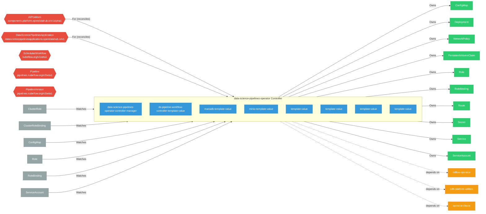

# data-science-pipelines-operator

> **Architecture snapshot: 2026-09-19** (2026-09-19)

**Repository:** opendatahub-io/data-science-pipelines-operator  
**Analyzer:** arch-analyzer dev  
**Extracted:** 2026-09-19T04:03:35Z

## Summary

| Metric | Count |
|--------|-------|
| CRDs | 5 |
| Deployments | 8 |
| Services | 8 |
| Secrets | 0 |
| Cluster Roles | 4 |
| Controller Watches | 20 |

## Component Architecture

CRDs, controllers, and owned Kubernetes resources.

### CRDs

| Group | Version | Kind | Scope | Fields | Validation Rules | Discovery | Source |
|-------|---------|------|-------|--------|------------------|-----------|--------|
| components.platform.opendatahub.io | v1alpha1 | AIPipelines | Cluster | 22 | 1 | YAML | [`config/crd/bases/components.platform.opendatahub.io_aipipelines.yaml`](https://github.com/opendatahub-io/data-science-pipelines-operator/blob/476f10821ce25cafa4fd7394d9a241799c103afb/config/crd/bases/components.platform.opendatahub.io_aipipelines.yaml) |
| datasciencepipelinesapplications.opendatahub.io | v1 | DataSciencePipelinesApplication | Namespaced | 240 | 10 | YAML | [`config/crd/bases/datasciencepipelinesapplications.opendatahub.io_datasciencepipelinesapplications.yaml`](https://github.com/opendatahub-io/data-science-pipelines-operator/blob/476f10821ce25cafa4fd7394d9a241799c103afb/config/crd/bases/datasciencepipelinesapplications.opendatahub.io_datasciencepipelinesapplications.yaml) |
| kubeflow.org | v1beta1 | ScheduledWorkflow | Namespaced | 5 | 0 | YAML | [`config/crd/bases/scheduledworkflows.yaml`](https://github.com/opendatahub-io/data-science-pipelines-operator/blob/476f10821ce25cafa4fd7394d9a241799c103afb/config/crd/bases/scheduledworkflows.yaml) |
| pipelines.kubeflow.org | v2beta1 | Pipeline | Namespaced | 7 | 0 | YAML | [`config/crd/bases/pipelines.kubeflow.org_pipelines.yaml`](https://github.com/opendatahub-io/data-science-pipelines-operator/blob/476f10821ce25cafa4fd7394d9a241799c103afb/config/crd/bases/pipelines.kubeflow.org_pipelines.yaml) |
| pipelines.kubeflow.org | v2beta1 | PipelineVersion | Namespaced | 19 | 0 | YAML | [`config/crd/bases/pipelines.kubeflow.org_pipelineversions.yaml`](https://github.com/opendatahub-io/data-science-pipelines-operator/blob/476f10821ce25cafa4fd7394d9a241799c103afb/config/crd/bases/pipelines.kubeflow.org_pipelineversions.yaml) |

## Dependencies

### Internal Platform Dependencies

| Component | Interaction |
|-----------|-------------|
| mlflow-operator | Go module dependency: github.com/opendatahub-io/mlflow-operator/api |
| odh-platform-utilities | Go module dependency: github.com/opendatahub-io/odh-platform-utilities |
| operator-chaos | Go module dependency: github.com/opendatahub-io/operator-chaos |

### Key External Dependencies

| Module | Version |
|--------|---------|
| github.com/go-logr/logr | v1.4.3 |
| github.com/prometheus/client_golang | v1.23.2 |
| k8s.io/api | v0.36.0 |
| k8s.io/apiextensions-apiserver | v0.36.0 |
| k8s.io/apimachinery | v0.36.0 |
| k8s.io/client-go | v0.36.0 |
| sigs.k8s.io/controller-runtime | v0.24.1 |

