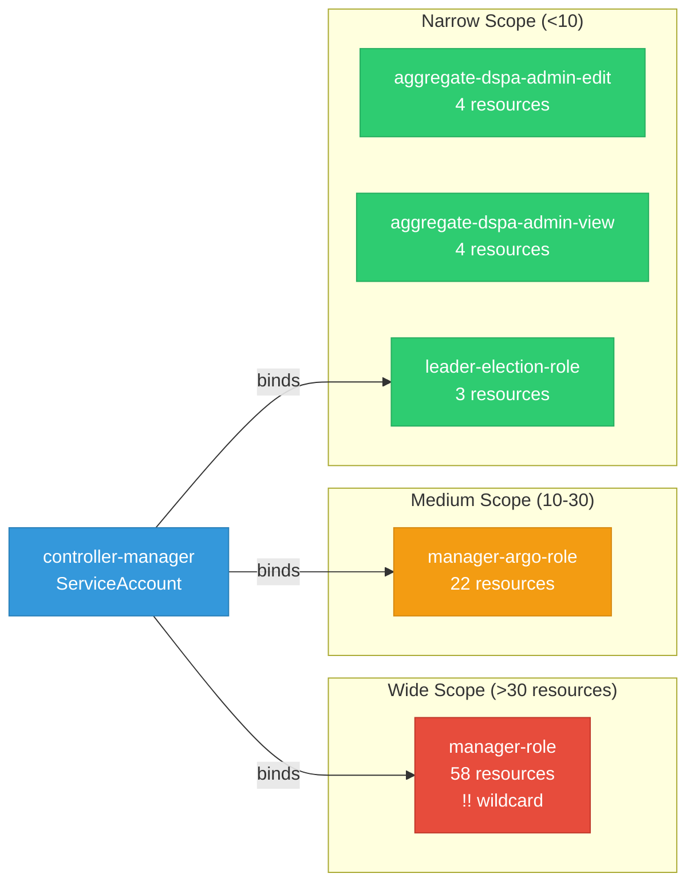

# data-science-pipelines-operator: RBAC

ServiceAccount bindings, roles, and resource permissions.

## RBAC Overview

This component defines a large RBAC surface (199 diagram lines). The graph below groups roles by permission scope.

## Bindings

Subject-to-role mappings defining who has access to what.

| Binding | Type | Role | Subject |
|---------|------|------|---------|
| manager-argo-rolebinding | ClusterRoleBinding | manager-argo-role | ServiceAccount/controller-manager |
| manager-rolebinding | ClusterRoleBinding | manager-role | ServiceAccount/controller-manager |
| leader-election-rolebinding | RoleBinding | leader-election-role | ServiceAccount/controller-manager |

## Role Details

Per-rule breakdown of API groups, resources, and verbs for each role.

| Role | Kind | API Groups | Resources | Verbs |
|------|------|------------|-----------|-------|
| aggregate-dspa-admin-edit | ClusterRole |  | datasciencepipelinesapplications, datasciencepipelinesapplications/api | get, list, watch, create, update, patch, delete |
| aggregate-dspa-admin-edit | ClusterRole |  | pipelines, pipelineversions | get, list, watch, create, update, patch, delete |
| aggregate-dspa-admin-view | ClusterRole |  | datasciencepipelinesapplications, datasciencepipelinesapplications/api | get, list, watch |
| aggregate-dspa-admin-view | ClusterRole |  | pipelines, pipelineversions | get, list, watch |
| manager-argo-role | ClusterRole |  | leases | create, get, update |
| manager-argo-role | ClusterRole |  | pods, pods/exec | create, get, list, watch, update, patch, delete |
| manager-argo-role | ClusterRole |  | configmaps | get, watch, list |
| manager-argo-role | ClusterRole |  | persistentvolumeclaims, persistentvolumeclaims/finalizers | create, update, delete, get |
| manager-argo-role | ClusterRole |  | workflows, workflows/finalizers, workflowtasksets, workflowtasksets/finalizers, workflowartifactgctasks, workflowartifactgctasks/finalizers | get, list, watch, update, patch, delete, create |
| manager-argo-role | ClusterRole |  | workflowtemplates, workflowtemplates/finalizers | get, list, watch |
| manager-argo-role | ClusterRole |  | serviceaccounts | get, list |
| manager-argo-role | ClusterRole |  | workflowtaskresults | list, watch, deletecollection |
| manager-argo-role | ClusterRole |  | serviceaccounts | get, list |
| manager-argo-role | ClusterRole |  | secrets | get |
| manager-argo-role | ClusterRole |  | cronworkflows, cronworkflows/finalizers | get, list, watch, update, patch, delete |
| manager-argo-role | ClusterRole |  | events | create, patch |
| manager-argo-role | ClusterRole |  | poddisruptionbudgets | create, get, delete |
| manager-role | ClusterRole |  | configmaps, secrets, serviceaccounts | create, delete, get, list, patch, update, watch |
| manager-role | ClusterRole |  | events | create, list, patch |
| manager-role | ClusterRole |  | persistentvolumeclaims, persistentvolumes, services | *, create, delete, get, list, patch, update, watch |
| manager-role | ClusterRole |  | pods, pods/exec, pods/log | * |
| manager-role | ClusterRole |  | deployments, deployments/finalizers, replicasets | * |
| manager-role | ClusterRole |  | deployments, services | create, delete, get, list, patch, update, watch |
| manager-role | ClusterRole |  | mutatingwebhookconfigurations, validatingwebhookconfigurations | create |
| manager-role | ClusterRole |  | mutatingwebhookconfigurations, validatingwebhookconfigurations | delete, get, list, patch, update, watch |
| manager-role | ClusterRole |  | deployments | create, delete, get, list, patch, update, watch |
| manager-role | ClusterRole |  | workflowartifactgctasks, workflowartifactgctasks/finalizers, workflows | * |
| manager-role | ClusterRole |  | workflowtaskresults | create, patch |
| manager-role | ClusterRole |  | tokenreviews | create |
| manager-role | ClusterRole |  | subjectaccessreviews | create |
| manager-role | ClusterRole |  | jobs | * |
| manager-role | ClusterRole |  | datasciencepipelinesapplications, datasciencepipelinesapplications/api | create, delete, get, list, patch, update, watch |
| manager-role | ClusterRole |  | datasciencepipelinesapplications/finalizers | update |
| manager-role | ClusterRole |  | datasciencepipelinesapplications/status | get, patch, update |
| manager-role | ClusterRole |  | imagestreamtags | get |
| manager-role | ClusterRole |  | * | * |
| manager-role | ClusterRole |  | seldondeployments | * |
| manager-role | ClusterRole |  | experiments, runs | create, get, list, update |
| manager-role | ClusterRole |  | mlflows | get, list, watch |
| manager-role | ClusterRole |  | servicemonitors | create, delete, get, list, patch, update, watch |
| manager-role | ClusterRole |  | ingresses | get, list |
| manager-role | ClusterRole |  | networkpolicies | create, delete, get, list, patch, update, watch |
| manager-role | ClusterRole |  | pipelines, pipelines/finalizers, pipelineversions, pipelineversions/finalizers, pipelineversions/status | create, delete, get, list, patch, update, watch |
| manager-role | ClusterRole |  | rayclusters, rayjobs, rayservices | create, delete, get, list, patch |
| manager-role | ClusterRole |  | clusterrolebindings, clusterroles | create, delete, get, list, update, watch |
| manager-role | ClusterRole |  | rolebindings, roles | create, delete, get, list, patch, update, watch |
| manager-role | ClusterRole |  | routes | create, delete, get, list, patch, update, watch |
| manager-role | ClusterRole |  | inferenceservices | create, delete, get, list, patch |
| manager-role | ClusterRole |  | volumesnapshots | create, delete, get |
| manager-role | ClusterRole |  | appwrappers, appwrappers/finalizers, appwrappers/status | create, delete, deletecollection, get, list, patch, update, watch |
| leader-election-role | Role |  | configmaps | get, list, watch, create, update, patch, delete |
| leader-election-role | Role |  | leases | get, list, watch, create, update, patch, delete |
| leader-election-role | Role |  | events | create, patch |

