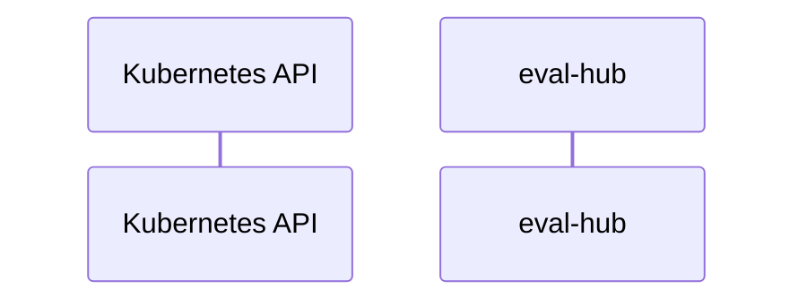

# eval-hub: Dataflow

## Controller Watches

Kubernetes resources this controller monitors for changes. Each watch triggers reconciliation when the watched resource is created, updated, or deleted.

No controller watches found in analyzed sources.

## Reconciliation Flow

How the controller interacts with the Kubernetes API during reconciliation.

### HTTP Endpoints

| Method | Path | Source |
|--------|------|--------|
| * | / | [`internal/evalhub_mcp/server/server.go:227`](https://github.com/eval-hub/eval-hub/blob/6b54caf5c4e914cab51d58d260a751d99aa32f6e/internal/evalhub_mcp/server/server.go#L227) |
| * | /health | [`internal/evalhub_mcp/server/server.go:222`](https://github.com/eval-hub/eval-hub/blob/6b54caf5c4e914cab51d58d260a751d99aa32f6e/internal/evalhub_mcp/server/server.go#L222) |
| * | /metrics | [`internal/eval_hub/server/metrics_server.go:28`](https://github.com/eval-hub/eval-hub/blob/6b54caf5c4e914cab51d58d260a751d99aa32f6e/internal/eval_hub/server/metrics_server.go#L28) |

## Configuration

ConfigMaps and Helm values that control this component's runtime behavior.

