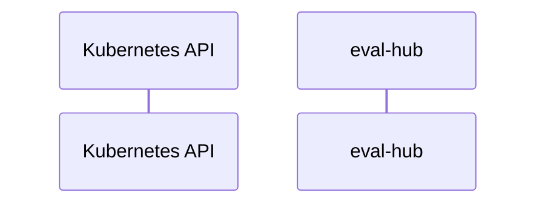

# eval-hub: Dataflow

## Controller Watches

Kubernetes resources this controller monitors for changes. Each watch triggers reconciliation when the watched resource is created, updated, or deleted.

No controller watches found in analyzed sources.

## Reconciliation Flow

How the controller interacts with the Kubernetes API during reconciliation.

### HTTP Endpoints

| Method | Path | Source |
|--------|------|--------|
| * | / | [`internal/evalhub_mcp/server/server.go:229`](https://github.com/eval-hub/eval-hub/blob/fc206826dcb5cdc878b0430f354e03fb2f2a2ad1/internal/evalhub_mcp/server/server.go#L229) |
| * | /health | [`internal/evalhub_mcp/server/server.go:224`](https://github.com/eval-hub/eval-hub/blob/fc206826dcb5cdc878b0430f354e03fb2f2a2ad1/internal/evalhub_mcp/server/server.go#L224) |
| * | /metrics | [`internal/eval_hub/server/metrics_server.go:28`](https://github.com/eval-hub/eval-hub/blob/fc206826dcb5cdc878b0430f354e03fb2f2a2ad1/internal/eval_hub/server/metrics_server.go#L28) |

## Configuration

ConfigMaps and Helm values that control this component's runtime behavior.

