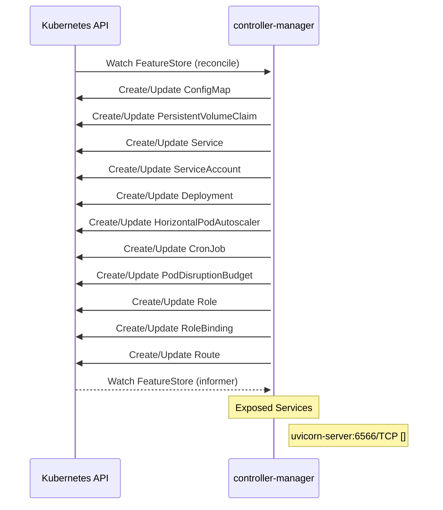

# feast: Dataflow

## Controller Watches

Kubernetes resources this controller monitors for changes. Each watch triggers reconciliation when the watched resource is created, updated, or deleted.

| Type | GVK | Source |
|------|-----|--------|
| For | api/v1/FeatureStore | [`infra/feast-operator/internal/controller/featurestore_controller.go:413`](https://github.com/feast-dev/feast/blob/94a9b9a5b55ccdb2276943793c4b12e2caccfd3b/infra/feast-operator/internal/controller/featurestore_controller.go#L413) |
| Owns | /v1/ConfigMap | [`infra/feast-operator/internal/controller/featurestore_controller.go:414`](https://github.com/feast-dev/feast/blob/94a9b9a5b55ccdb2276943793c4b12e2caccfd3b/infra/feast-operator/internal/controller/featurestore_controller.go#L414) |
| Owns | /v1/PersistentVolumeClaim | [`infra/feast-operator/internal/controller/featurestore_controller.go:417`](https://github.com/feast-dev/feast/blob/94a9b9a5b55ccdb2276943793c4b12e2caccfd3b/infra/feast-operator/internal/controller/featurestore_controller.go#L417) |
| Owns | /v1/Service | [`infra/feast-operator/internal/controller/featurestore_controller.go:416`](https://github.com/feast-dev/feast/blob/94a9b9a5b55ccdb2276943793c4b12e2caccfd3b/infra/feast-operator/internal/controller/featurestore_controller.go#L416) |
| Owns | /v1/ServiceAccount | [`infra/feast-operator/internal/controller/featurestore_controller.go:418`](https://github.com/feast-dev/feast/blob/94a9b9a5b55ccdb2276943793c4b12e2caccfd3b/infra/feast-operator/internal/controller/featurestore_controller.go#L418) |
| Owns | apps/v1/Deployment | [`infra/feast-operator/internal/controller/featurestore_controller.go:415`](https://github.com/feast-dev/feast/blob/94a9b9a5b55ccdb2276943793c4b12e2caccfd3b/infra/feast-operator/internal/controller/featurestore_controller.go#L415) |
| Owns | autoscaling/v2/HorizontalPodAutoscaler | [`infra/feast-operator/internal/controller/featurestore_controller.go:422`](https://github.com/feast-dev/feast/blob/94a9b9a5b55ccdb2276943793c4b12e2caccfd3b/infra/feast-operator/internal/controller/featurestore_controller.go#L422) |
| Owns | batch/v1/CronJob | [`infra/feast-operator/internal/controller/featurestore_controller.go:421`](https://github.com/feast-dev/feast/blob/94a9b9a5b55ccdb2276943793c4b12e2caccfd3b/infra/feast-operator/internal/controller/featurestore_controller.go#L421) |
| Owns | policy/v1/PodDisruptionBudget | [`infra/feast-operator/internal/controller/featurestore_controller.go:423`](https://github.com/feast-dev/feast/blob/94a9b9a5b55ccdb2276943793c4b12e2caccfd3b/infra/feast-operator/internal/controller/featurestore_controller.go#L423) |
| Owns | rbac.authorization.k8s.io/v1/Role | [`infra/feast-operator/internal/controller/featurestore_controller.go:420`](https://github.com/feast-dev/feast/blob/94a9b9a5b55ccdb2276943793c4b12e2caccfd3b/infra/feast-operator/internal/controller/featurestore_controller.go#L420) |
| Owns | rbac.authorization.k8s.io/v1/RoleBinding | [`infra/feast-operator/internal/controller/featurestore_controller.go:419`](https://github.com/feast-dev/feast/blob/94a9b9a5b55ccdb2276943793c4b12e2caccfd3b/infra/feast-operator/internal/controller/featurestore_controller.go#L419) |
| Owns | route/v1/Route | [`infra/feast-operator/internal/controller/featurestore_controller.go:427`](https://github.com/feast-dev/feast/blob/94a9b9a5b55ccdb2276943793c4b12e2caccfd3b/infra/feast-operator/internal/controller/featurestore_controller.go#L427) |
| Watches | api/v1/FeatureStore | [`infra/feast-operator/internal/controller/featurestore_controller.go:424`](https://github.com/feast-dev/feast/blob/94a9b9a5b55ccdb2276943793c4b12e2caccfd3b/infra/feast-operator/internal/controller/featurestore_controller.go#L424) |

## Reconciliation Flow

How the controller interacts with the Kubernetes API during reconciliation.

### HTTP Endpoints

| Method | Path | Source |
|--------|------|--------|
| * | /get-online-features | [`go/internal/feast/server/http_server.go:388`](https://github.com/feast-dev/feast/blob/94a9b9a5b55ccdb2276943793c4b12e2caccfd3b/go/internal/feast/server/http_server.go#L388) |
| * | /get-online-features | [`go/internal/feast/server/http_server.go:402`](https://github.com/feast-dev/feast/blob/94a9b9a5b55ccdb2276943793c4b12e2caccfd3b/go/internal/feast/server/http_server.go#L402) |
| * | /health | [`go/internal/feast/server/http_server.go:389`](https://github.com/feast-dev/feast/blob/94a9b9a5b55ccdb2276943793c4b12e2caccfd3b/go/internal/feast/server/http_server.go#L389) |
| * | /health | [`go/internal/feast/server/http_server.go:403`](https://github.com/feast-dev/feast/blob/94a9b9a5b55ccdb2276943793c4b12e2caccfd3b/go/internal/feast/server/http_server.go#L403) |
| * | /metrics | [`go/main.go:204`](https://github.com/feast-dev/feast/blob/94a9b9a5b55ccdb2276943793c4b12e2caccfd3b/go/main.go#L204) |
| * | /metrics | [`go/main.go:264`](https://github.com/feast-dev/feast/blob/94a9b9a5b55ccdb2276943793c4b12e2caccfd3b/go/main.go#L264) |

## Configuration

ConfigMaps and Helm values that control this component's runtime behavior.

### Helm

**Chart:** feast v0.66.0

