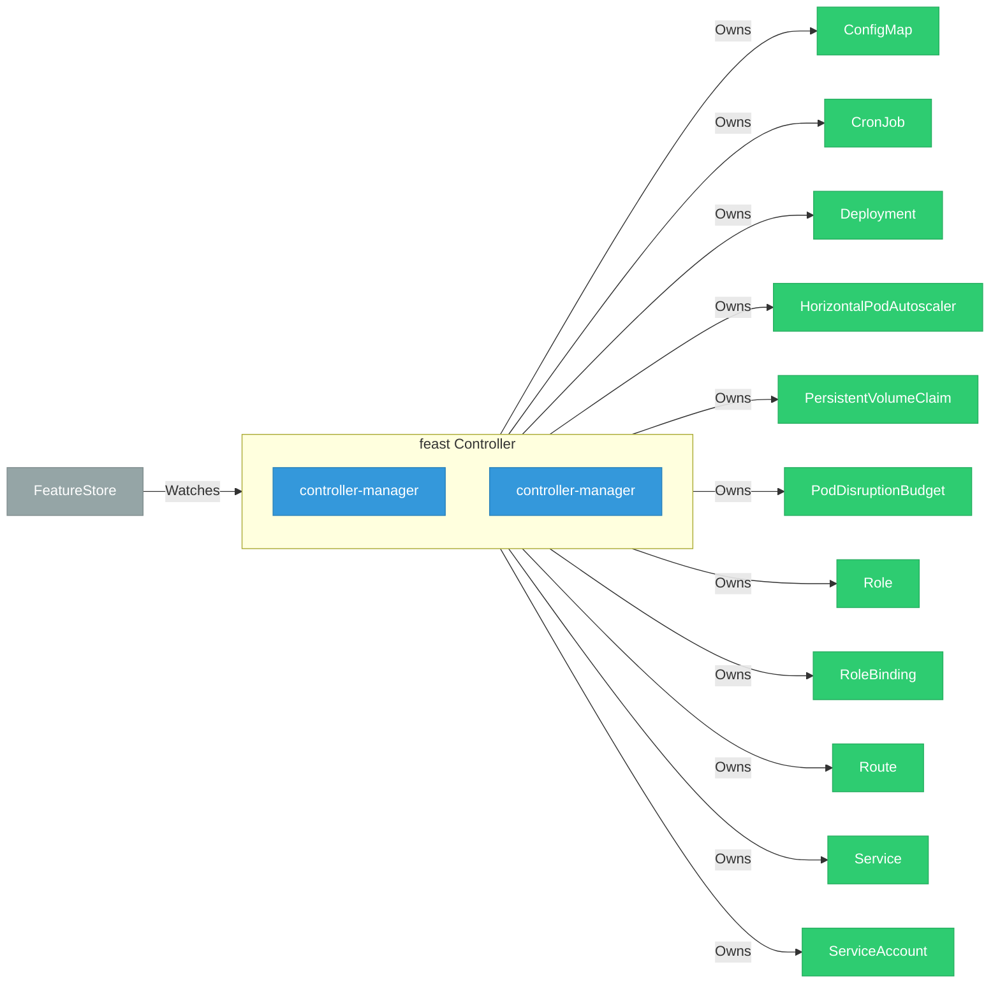

# feast

> **Architecture snapshot: 2026-09-07** (2026-09-07)

**Repository:** feast-dev/feast  
**Analyzer:** arch-analyzer dev  
**Extracted:** 2026-09-07T03:59:20Z

## Summary

| Metric | Count |
|--------|-------|
| CRDs | 0 |
| Deployments | 2 |
| Services | 1 |
| Secrets | 0 |
| Cluster Roles | 0 |
| Controller Watches | 13 |

## Component Architecture

CRDs, controllers, and owned Kubernetes resources.

### CRDs

No CRDs found in analyzed sources.

## Dependencies

### Key External Dependencies

| Module | Version |
|--------|---------|
| github.com/prometheus-operator/prometheus-operator/pkg/client | v0.83.0 |
| github.com/prometheus/client_golang | v1.23.2 |
| github.com/prometheus/client_golang | v1.23.2 |
| github.com/prometheus/client_model | v0.6.2 |
| google.golang.org/grpc | v1.81.1 |
| k8s.io/api | v0.35.2 |
| k8s.io/apiextensions-apiserver | v0.35.1 |
| k8s.io/apimachinery | v0.35.2 |
| k8s.io/client-go | v0.35.2 |
| sigs.k8s.io/controller-runtime | v0.23.3 |

