# kserve

> **Architecture snapshot: 2026-09-07** (2026-09-07)

**Repository:** kserve/kserve  
**Analyzer:** arch-analyzer dev  
**Extracted:** 2026-09-07T04:02:59Z

## Summary

| Metric | Count |
|--------|-------|
| CRDs | 27 |
| Deployments | 4 |
| Services | 6 |
| Secrets | 3 |
| Cluster Roles | 2 |
| Controller Watches | 76 |

## Component Architecture

CRDs, controllers, and owned Kubernetes resources.

```mermaid
graph LR
    %% Component architecture for kserve

    classDef crd fill:#e74c3c,stroke:#c0392b,color:#fff
    classDef controller fill:#3498db,stroke:#2980b9,color:#fff
    classDef owned fill:#2ecc71,stroke:#27ae60,color:#fff
    classDef external fill:#95a5a6,stroke:#7f8c8d,color:#fff
    classDef dep fill:#f39c12,stroke:#e67e22,color:#fff

    subgraph controller["kserve Controller"]
        dep_1["kserve-controller-manager"]
        class dep_1 controller
        dep_2["kserve-localmodel-controller-manager"]
        class dep_2 controller
        dep_3["kserve-module-controller-manager"]
        class dep_3 controller
        dep_4["llmisvc-controller-manager"]
        class dep_4 controller
    end

    crd_ClusterServingRuntime{{"ClusterServingRuntime\n/v1alpha1"}}
    class crd_ClusterServingRuntime crd
    crd_ClusterStorageContainer{{"ClusterStorageContainer\n/v1alpha1"}}
    class crd_ClusterStorageContainer crd
    crd_InferenceGraph{{"InferenceGraph\n/v1alpha1"}}
    class crd_InferenceGraph crd
    crd_InferenceGraph -->|"For (reconciles)"| controller
    crd_LLMInferenceService{{"LLMInferenceService\n/v1alpha1"}}
    class crd_LLMInferenceService crd
    crd_LLMInferenceService -->|"For (reconciles)"| controller
    crd_LLMInferenceServiceConfig{{"LLMInferenceServiceConfig\n/v1alpha1"}}
    class crd_LLMInferenceServiceConfig crd
    crd_LLMInferenceServiceConfig -->|"For (reconciles)"| controller
    crd_LocalModelCache{{"LocalModelCache\n/v1alpha1"}}
    class crd_LocalModelCache crd
    crd_LocalModelCache -->|"For (reconciles)"| controller
    crd_LocalModelNamespaceCache{{"LocalModelNamespaceCache\n/v1alpha1"}}
    class crd_LocalModelNamespaceCache crd
    crd_LocalModelNamespaceCache -->|"For (reconciles)"| controller
    crd_LocalModelNode{{"LocalModelNode\n/v1alpha1"}}
    class crd_LocalModelNode crd
    crd_LocalModelNode -->|"For (reconciles)"| controller
    crd_LocalModelNodeGroup{{"LocalModelNodeGroup\n/v1alpha1"}}
    class crd_LocalModelNodeGroup crd
    crd_ServingRuntime{{"ServingRuntime\n/v1alpha1"}}
    class crd_ServingRuntime crd
    crd_TrainedModel{{"TrainedModel\n/v1alpha1"}}
    class crd_TrainedModel crd
    crd_TrainedModel -->|"For (reconciles)"| controller
    crd_LLMInferenceService{{"LLMInferenceService\n/v1alpha2"}}
    class crd_LLMInferenceService crd
    crd_LLMInferenceService -->|"For (reconciles)"| controller
    crd_LLMInferenceServiceConfig{{"LLMInferenceServiceConfig\n/v1alpha2"}}
    class crd_LLMInferenceServiceConfig crd
    crd_LLMInferenceServiceConfig -->|"For (reconciles)"| controller
    crd_InferenceService{{"InferenceService\n/v1beta1"}}
    class crd_InferenceService crd
    crd_InferenceService -->|"For (reconciles)"| controller
    crd_InferencePool{{"InferencePool\ninference.networking.x-k8s.io/v1alpha2pool"}}
    class crd_InferencePool crd
    crd_ClusterServingRuntime{{"ClusterServingRuntime\nserving.kserve.io/v1alpha1"}}
    class crd_ClusterServingRuntime crd
    crd_ClusterStorageContainer{{"ClusterStorageContainer\nserving.kserve.io/v1alpha1"}}
    class crd_ClusterStorageContainer crd
    crd_InferenceGraph{{"InferenceGraph\nserving.kserve.io/v1alpha1"}}
    class crd_InferenceGraph crd
    crd_InferenceGraph -->|"For (reconciles)"| controller
    crd_LocalModelCache{{"LocalModelCache\nserving.kserve.io/v1alpha1"}}
    class crd_LocalModelCache crd
    crd_LocalModelCache -->|"For (reconciles)"| controller
    crd_LocalModelNamespaceCache{{"LocalModelNamespaceCache\nserving.kserve.io/v1alpha1"}}
    class crd_LocalModelNamespaceCache crd
    crd_LocalModelNamespaceCache -->|"For (reconciles)"| controller
    crd_LocalModelNode{{"LocalModelNode\nserving.kserve.io/v1alpha1"}}
    class crd_LocalModelNode crd
    crd_LocalModelNode -->|"For (reconciles)"| controller
    crd_LocalModelNodeGroup{{"LocalModelNodeGroup\nserving.kserve.io/v1alpha1"}}
    class crd_LocalModelNodeGroup crd
    crd_ServingRuntime{{"ServingRuntime\nserving.kserve.io/v1alpha1"}}
    class crd_ServingRuntime crd
    crd_TrainedModel{{"TrainedModel\nserving.kserve.io/v1alpha1"}}
    class crd_TrainedModel crd
    crd_TrainedModel -->|"For (reconciles)"| controller
    crd_LLMInferenceService{{"LLMInferenceService\nserving.kserve.io/v1alpha2"}}
    class crd_LLMInferenceService crd
    crd_LLMInferenceService -->|"For (reconciles)"| controller
    crd_LLMInferenceServiceConfig{{"LLMInferenceServiceConfig\nserving.kserve.io/v1alpha2"}}
    class crd_LLMInferenceServiceConfig crd
    crd_LLMInferenceServiceConfig -->|"For (reconciles)"| controller
    crd_InferenceService{{"InferenceService\nserving.kserve.io/v1beta1"}}
    class crd_InferenceService crd
    crd_InferenceService -->|"For (reconciles)"| controller
    controller -->|"Owns"| owned_5["ClusterRole"]
    class owned_5 owned
    controller -->|"Owns"| owned_6["ClusterRoleBinding"]
    class owned_6 owned
    controller -->|"Owns"| owned_7["ConfigMap"]
    class owned_7 owned
    controller -->|"Owns"| owned_8["DaemonSet"]
    class owned_8 owned
    controller -->|"Owns"| owned_9["Deployment"]
    class owned_9 owned
    controller -->|"Owns"| owned_10["HTTPRoute"]
    class owned_10 owned
    controller -->|"Owns"| owned_11["HorizontalPodAutoscaler"]
    class owned_11 owned
    controller -->|"Owns"| owned_12["InferencePool"]
    class owned_12 owned
    controller -->|"Owns"| owned_13["Ingress"]
    class owned_13 owned
    controller -->|"Owns"| owned_14["Job"]
    class owned_14 owned
    controller -->|"Owns"| owned_15["LeaderWorkerSet"]
    class owned_15 owned
    controller -->|"Owns"| owned_16["MutatingWebhookConfiguration"]
    class owned_16 owned
    controller -->|"Owns"| owned_17["NetworkPolicy"]
    class owned_17 owned
    controller -->|"Owns"| owned_18["OpenTelemetryCollector"]
    class owned_18 owned
    controller -->|"Owns"| owned_19["PersistentVolume"]
    class owned_19 owned
    controller -->|"Owns"| owned_20["PersistentVolumeClaim"]
    class owned_20 owned
    controller -->|"Owns"| owned_21["PodMonitor"]
    class owned_21 owned
    controller -->|"Owns"| owned_22["ResourceClaimTemplate"]
    class owned_22 owned
    controller -->|"Owns"| owned_23["Role"]
    class owned_23 owned
    controller -->|"Owns"| owned_24["RoleBinding"]
    class owned_24 owned
    controller -->|"Owns"| owned_25["Route"]
    class owned_25 owned
    controller -->|"Owns"| owned_26["ScaledObject"]
    class owned_26 owned
    controller -->|"Owns"| owned_27["Secret"]
    class owned_27 owned
    controller -->|"Owns"| owned_28["SecurityContextConstraints"]
    class owned_28 owned
    controller -->|"Owns"| owned_29["Service"]
    class owned_29 owned
    controller -->|"Owns"| owned_30["ServiceAccount"]
    class owned_30 owned
    controller -->|"Owns"| owned_31["ServiceMonitor"]
    class owned_31 owned
    controller -->|"Owns"| owned_32["ValidatingWebhookConfiguration"]
    class owned_32 owned
    controller -->|"Owns"| owned_33["VirtualService"]
    class owned_33 owned
    watch_34["ClusterServingRuntime"] -->|"Watches"| controller
    class watch_34 external
    watch_35["ConfigMap"] -->|"Watches"| controller
    class watch_35 external
    watch_36["Gateway"] -->|"Watches"| controller
    class watch_36 external
    watch_37["HTTPRoute"] -->|"Watches"| controller
    class watch_37 external
    watch_38["InferencePool"] -->|"Watches"| controller
    class watch_38 external
    watch_39["InferenceService"] -->|"Watches"| controller
    class watch_39 external
    watch_40["LLMInferenceService"] -->|"Watches"| controller
    class watch_40 external
    watch_41["LLMInferenceServiceConfig"] -->|"Watches"| controller
    class watch_41 external
    watch_42["LocalModelNode"] -->|"Watches"| controller
    class watch_42 external
    watch_43["Node"] -->|"Watches"| controller
    class watch_43 external
    watch_44["Pod"] -->|"Watches"| controller
    class watch_44 external
    watch_45["ServingRuntime"] -->|"Watches"| controller
    class watch_45 external
    controller -.->|"depends on"| odh_46["odh-platform-utilities"]
    class odh_46 dep
```

### CRDs

| Group | Version | Kind | Scope | Fields | Validation Rules | Discovery | Source |
|-------|---------|------|-------|--------|------------------|-----------|--------|
|  | v1alpha1 | ClusterServingRuntime | Namespaced | 19 | 0 | Go AST | [`/home/runner/work/_temp/arch-analyzer-repos/kserve/pkg/apis/serving/v1alpha1/servingruntime_types.go`](https://github.com/kserve/kserve/blob/b6447d8642707dfd29eca7050bf1bcb4dd15512c//home/runner/work/_temp/arch-analyzer-repos/kserve/pkg/apis/serving/v1alpha1/servingruntime_types.go) |
|  | v1alpha1 | ClusterStorageContainer | Namespaced | 19 | 0 | Go AST | [`/home/runner/work/_temp/arch-analyzer-repos/kserve/pkg/apis/serving/v1alpha1/storage_container_types.go`](https://github.com/kserve/kserve/blob/b6447d8642707dfd29eca7050bf1bcb4dd15512c//home/runner/work/_temp/arch-analyzer-repos/kserve/pkg/apis/serving/v1alpha1/storage_container_types.go) |
|  | v1alpha1 | InferenceGraph | Namespaced | 19 | 0 | Go AST | [`/home/runner/work/_temp/arch-analyzer-repos/kserve/pkg/apis/serving/v1alpha1/inference_graph.go`](https://github.com/kserve/kserve/blob/b6447d8642707dfd29eca7050bf1bcb4dd15512c//home/runner/work/_temp/arch-analyzer-repos/kserve/pkg/apis/serving/v1alpha1/inference_graph.go) |
|  | v1alpha1 | LLMInferenceService | Namespaced | 19 | 0 | Go AST | [`/home/runner/work/_temp/arch-analyzer-repos/kserve/pkg/apis/serving/v1alpha1/llm_inference_service_types.go`](https://github.com/kserve/kserve/blob/b6447d8642707dfd29eca7050bf1bcb4dd15512c//home/runner/work/_temp/arch-analyzer-repos/kserve/pkg/apis/serving/v1alpha1/llm_inference_service_types.go) |
|  | v1alpha1 | LLMInferenceServiceConfig | Namespaced | 19 | 0 | Go AST | [`/home/runner/work/_temp/arch-analyzer-repos/kserve/pkg/apis/serving/v1alpha1/llm_inference_service_types.go`](https://github.com/kserve/kserve/blob/b6447d8642707dfd29eca7050bf1bcb4dd15512c//home/runner/work/_temp/arch-analyzer-repos/kserve/pkg/apis/serving/v1alpha1/llm_inference_service_types.go) |
|  | v1alpha1 | LocalModelCache | Namespaced | 19 | 0 | Go AST | [`/home/runner/work/_temp/arch-analyzer-repos/kserve/pkg/apis/serving/v1alpha1/local_model_cache_types.go`](https://github.com/kserve/kserve/blob/b6447d8642707dfd29eca7050bf1bcb4dd15512c//home/runner/work/_temp/arch-analyzer-repos/kserve/pkg/apis/serving/v1alpha1/local_model_cache_types.go) |
|  | v1alpha1 | LocalModelNamespaceCache | Namespaced | 19 | 0 | Go AST | [`/home/runner/work/_temp/arch-analyzer-repos/kserve/pkg/apis/serving/v1alpha1/local_model_namespace_cache_types.go`](https://github.com/kserve/kserve/blob/b6447d8642707dfd29eca7050bf1bcb4dd15512c//home/runner/work/_temp/arch-analyzer-repos/kserve/pkg/apis/serving/v1alpha1/local_model_namespace_cache_types.go) |
|  | v1alpha1 | LocalModelNode | Namespaced | 19 | 0 | Go AST | [`/home/runner/work/_temp/arch-analyzer-repos/kserve/pkg/apis/serving/v1alpha1/local_model_node_types.go`](https://github.com/kserve/kserve/blob/b6447d8642707dfd29eca7050bf1bcb4dd15512c//home/runner/work/_temp/arch-analyzer-repos/kserve/pkg/apis/serving/v1alpha1/local_model_node_types.go) |
|  | v1alpha1 | LocalModelNodeGroup | Namespaced | 19 | 0 | Go AST | [`/home/runner/work/_temp/arch-analyzer-repos/kserve/pkg/apis/serving/v1alpha1/local_model_node_group_types.go`](https://github.com/kserve/kserve/blob/b6447d8642707dfd29eca7050bf1bcb4dd15512c//home/runner/work/_temp/arch-analyzer-repos/kserve/pkg/apis/serving/v1alpha1/local_model_node_group_types.go) |
|  | v1alpha1 | ServingRuntime | Namespaced | 19 | 0 | Go AST | [`/home/runner/work/_temp/arch-analyzer-repos/kserve/pkg/apis/serving/v1alpha1/servingruntime_types.go`](https://github.com/kserve/kserve/blob/b6447d8642707dfd29eca7050bf1bcb4dd15512c//home/runner/work/_temp/arch-analyzer-repos/kserve/pkg/apis/serving/v1alpha1/servingruntime_types.go) |
|  | v1alpha1 | TrainedModel | Namespaced | 19 | 0 | Go AST | [`/home/runner/work/_temp/arch-analyzer-repos/kserve/pkg/apis/serving/v1alpha1/trained_model.go`](https://github.com/kserve/kserve/blob/b6447d8642707dfd29eca7050bf1bcb4dd15512c//home/runner/work/_temp/arch-analyzer-repos/kserve/pkg/apis/serving/v1alpha1/trained_model.go) |
|  | v1alpha2 | LLMInferenceService | Namespaced | 19 | 0 | Go AST | [`/home/runner/work/_temp/arch-analyzer-repos/kserve/pkg/apis/serving/v1alpha2/llm_inference_service_types.go`](https://github.com/kserve/kserve/blob/b6447d8642707dfd29eca7050bf1bcb4dd15512c//home/runner/work/_temp/arch-analyzer-repos/kserve/pkg/apis/serving/v1alpha2/llm_inference_service_types.go) |
|  | v1alpha2 | LLMInferenceServiceConfig | Namespaced | 19 | 0 | Go AST | [`/home/runner/work/_temp/arch-analyzer-repos/kserve/pkg/apis/serving/v1alpha2/llm_inference_service_types.go`](https://github.com/kserve/kserve/blob/b6447d8642707dfd29eca7050bf1bcb4dd15512c//home/runner/work/_temp/arch-analyzer-repos/kserve/pkg/apis/serving/v1alpha2/llm_inference_service_types.go) |
|  | v1beta1 | InferenceService | Namespaced | 19 | 0 | Go AST | [`/home/runner/work/_temp/arch-analyzer-repos/kserve/pkg/apis/serving/v1beta1/inference_service.go`](https://github.com/kserve/kserve/blob/b6447d8642707dfd29eca7050bf1bcb4dd15512c//home/runner/work/_temp/arch-analyzer-repos/kserve/pkg/apis/serving/v1beta1/inference_service.go) |
| inference.networking.x-k8s.io | v1alpha2pool | InferencePool | Namespaced | 19 | 0 | Go AST | [`/home/runner/work/_temp/arch-analyzer-repos/kserve/pkg/apis/gie/v1alpha2pool/inferencepool_types.go`](https://github.com/kserve/kserve/blob/b6447d8642707dfd29eca7050bf1bcb4dd15512c//home/runner/work/_temp/arch-analyzer-repos/kserve/pkg/apis/gie/v1alpha2pool/inferencepool_types.go) |
| serving.kserve.io | v1alpha1 | ClusterServingRuntime | Cluster | 1191 | 0 | YAML | [`config/crd/full/serving.kserve.io_clusterservingruntimes.yaml`](https://github.com/kserve/kserve/blob/b6447d8642707dfd29eca7050bf1bcb4dd15512c/config/crd/full/serving.kserve.io_clusterservingruntimes.yaml) |
| serving.kserve.io | v1alpha1 | ClusterStorageContainer | Cluster | 216 | 0 | YAML | [`config/crd/full/clusterstoragecontainer/serving.kserve.io_clusterstoragecontainers.yaml`](https://github.com/kserve/kserve/blob/b6447d8642707dfd29eca7050bf1bcb4dd15512c/config/crd/full/clusterstoragecontainer/serving.kserve.io_clusterstoragecontainers.yaml) |
| serving.kserve.io | v1alpha1 | InferenceGraph | Namespaced | 150 | 0 | YAML | [`config/crd/full/serving.kserve.io_inferencegraphs.yaml`](https://github.com/kserve/kserve/blob/b6447d8642707dfd29eca7050bf1bcb4dd15512c/config/crd/full/serving.kserve.io_inferencegraphs.yaml) |
| serving.kserve.io | v1alpha1 | LocalModelCache | Cluster | 23 | 1 | YAML | [`config/crd/full/localmodel/serving.kserve.io_localmodelcaches.yaml`](https://github.com/kserve/kserve/blob/b6447d8642707dfd29eca7050bf1bcb4dd15512c/config/crd/full/localmodel/serving.kserve.io_localmodelcaches.yaml) |
| serving.kserve.io | v1alpha1 | LocalModelNamespaceCache | Namespaced | 23 | 1 | YAML | [`config/crd/full/localmodel/serving.kserve.io_localmodelnamespacecaches.yaml`](https://github.com/kserve/kserve/blob/b6447d8642707dfd29eca7050bf1bcb4dd15512c/config/crd/full/localmodel/serving.kserve.io_localmodelnamespacecaches.yaml) |
| serving.kserve.io | v1alpha1 | LocalModelNode | Cluster | 15 | 0 | YAML | [`config/crd/full/localmodel/serving.kserve.io_localmodelnodes.yaml`](https://github.com/kserve/kserve/blob/b6447d8642707dfd29eca7050bf1bcb4dd15512c/config/crd/full/localmodel/serving.kserve.io_localmodelnodes.yaml) |
| serving.kserve.io | v1alpha1 | LocalModelNodeGroup | Cluster | 220 | 0 | YAML | [`config/crd/full/localmodel/serving.kserve.io_localmodelnodegroups.yaml`](https://github.com/kserve/kserve/blob/b6447d8642707dfd29eca7050bf1bcb4dd15512c/config/crd/full/localmodel/serving.kserve.io_localmodelnodegroups.yaml) |
| serving.kserve.io | v1alpha1 | ServingRuntime | Namespaced | 1191 | 0 | YAML | [`config/crd/full/serving.kserve.io_servingruntimes.yaml`](https://github.com/kserve/kserve/blob/b6447d8642707dfd29eca7050bf1bcb4dd15512c/config/crd/full/serving.kserve.io_servingruntimes.yaml) |
| serving.kserve.io | v1alpha1 | TrainedModel | Namespaced | 25 | 0 | YAML | [`config/crd/full/serving.kserve.io_trainedmodels.yaml`](https://github.com/kserve/kserve/blob/b6447d8642707dfd29eca7050bf1bcb4dd15512c/config/crd/full/serving.kserve.io_trainedmodels.yaml) |
| serving.kserve.io | v1alpha2 | LLMInferenceService | Namespaced | 7045 | 130 | YAML | [`config/crd/full/llmisvc/serving.kserve.io_llminferenceservices.yaml`](https://github.com/kserve/kserve/blob/b6447d8642707dfd29eca7050bf1bcb4dd15512c/config/crd/full/llmisvc/serving.kserve.io_llminferenceservices.yaml) |
| serving.kserve.io | v1alpha2 | LLMInferenceServiceConfig | Namespaced | 6971 | 28 | YAML | [`config/crd/full/llmisvc/serving.kserve.io_llminferenceserviceconfigs.yaml`](https://github.com/kserve/kserve/blob/b6447d8642707dfd29eca7050bf1bcb4dd15512c/config/crd/full/llmisvc/serving.kserve.io_llminferenceserviceconfigs.yaml) |
| serving.kserve.io | v1beta1 | InferenceService | Namespaced | 11221 | 0 | YAML | [`config/crd/full/serving.kserve.io_inferenceservices.yaml`](https://github.com/kserve/kserve/blob/b6447d8642707dfd29eca7050bf1bcb4dd15512c/config/crd/full/serving.kserve.io_inferenceservices.yaml) |

## Dependencies

### Internal Platform Dependencies

| Component | Interaction |
|-----------|-------------|
| odh-platform-utilities | Go module dependency: github.com/opendatahub-io/odh-platform-utilities |

### Key External Dependencies

| Module | Version |
|--------|---------|
| github.com/go-logr/logr | v1.4.3 |
| github.com/go-logr/zapr | v1.3.0 |
| github.com/prometheus-operator/prometheus-operator/pkg/apis/monitoring | v0.89.0 |
| github.com/prometheus/client_model | v0.6.2 |
| github.com/prometheus/common | v0.70.1 |
| k8s.io/api | v0.34.5 |
| k8s.io/api | v0.35.3 |
| k8s.io/apiextensions-apiserver | v0.34.3 |
| k8s.io/apiextensions-apiserver | v0.35.3 |
| k8s.io/apimachinery | v0.34.5 |
| k8s.io/apimachinery | v0.35.4 |
| k8s.io/client-go | v0.34.5 |
| k8s.io/client-go | v0.35.3 |
| sigs.k8s.io/controller-runtime | v0.23.3 |
| sigs.k8s.io/controller-runtime | v0.22.5 |

