# kserve-autogluon-server: Dataflow

## Controller Watches

Kubernetes resources this controller monitors for changes. Each watch triggers reconciliation when the watched resource is created, updated, or deleted.

| Type | GVK | Source |
|------|-----|--------|
| For | serving/v1alpha1/InferenceGraph | [`pkg/controller/v1alpha1/inferencegraph/controller.go:373`](https://github.com/kserve/kserve-autogluon-server/blob/aad6612fe382c04130a0675500087545cb6edc3f/pkg/controller/v1alpha1/inferencegraph/controller.go#L373) |
| For | serving/v1alpha1/LocalModelCache | [`pkg/controller/v1alpha1/localmodel/reconcilers/localmodelcache_reconciler.go:339`](https://github.com/kserve/kserve-autogluon-server/blob/aad6612fe382c04130a0675500087545cb6edc3f/pkg/controller/v1alpha1/localmodel/reconcilers/localmodelcache_reconciler.go#L339) |
| For | serving/v1alpha1/LocalModelNamespaceCache | [`pkg/controller/v1alpha1/localmodel/reconcilers/localmodelnamespacecache_reconciler.go:354`](https://github.com/kserve/kserve-autogluon-server/blob/aad6612fe382c04130a0675500087545cb6edc3f/pkg/controller/v1alpha1/localmodel/reconcilers/localmodelnamespacecache_reconciler.go#L354) |
| For | serving/v1alpha1/LocalModelNode | [`pkg/controller/v1alpha1/localmodelnode/controller.go:613`](https://github.com/kserve/kserve-autogluon-server/blob/aad6612fe382c04130a0675500087545cb6edc3f/pkg/controller/v1alpha1/localmodelnode/controller.go#L613) |
| For | serving/v1alpha1/TrainedModel | [`pkg/controller/v1alpha1/trainedmodel/controller.go:306`](https://github.com/kserve/kserve-autogluon-server/blob/aad6612fe382c04130a0675500087545cb6edc3f/pkg/controller/v1alpha1/trainedmodel/controller.go#L306) |
| For | serving/v1alpha2/LLMInferenceService | [`pkg/controller/v1alpha2/llmisvc/controller.go:367`](https://github.com/kserve/kserve-autogluon-server/blob/aad6612fe382c04130a0675500087545cb6edc3f/pkg/controller/v1alpha2/llmisvc/controller.go#L367) |
| For | serving/v1beta1/InferenceService | [`pkg/controller/v1beta1/inferenceservice/controller.go:657`](https://github.com/kserve/kserve-autogluon-server/blob/aad6612fe382c04130a0675500087545cb6edc3f/pkg/controller/v1beta1/inferenceservice/controller.go#L657) |
| Owns | /v1/PersistentVolume | [`pkg/controller/v1alpha1/localmodel/reconcilers/localmodelcache_reconciler.go:340`](https://github.com/kserve/kserve-autogluon-server/blob/aad6612fe382c04130a0675500087545cb6edc3f/pkg/controller/v1alpha1/localmodel/reconcilers/localmodelcache_reconciler.go#L340) |
| Owns | /v1/PersistentVolumeClaim | [`pkg/controller/v1alpha1/localmodel/reconcilers/localmodelcache_reconciler.go:341`](https://github.com/kserve/kserve-autogluon-server/blob/aad6612fe382c04130a0675500087545cb6edc3f/pkg/controller/v1alpha1/localmodel/reconcilers/localmodelcache_reconciler.go#L341) |
| Owns | /v1/PersistentVolumeClaim | [`pkg/controller/v1alpha1/localmodel/reconcilers/localmodelnamespacecache_reconciler.go:355`](https://github.com/kserve/kserve-autogluon-server/blob/aad6612fe382c04130a0675500087545cb6edc3f/pkg/controller/v1alpha1/localmodel/reconcilers/localmodelnamespacecache_reconciler.go#L355) |
| Owns | /v1/Secret | [`pkg/controller/v1alpha2/llmisvc/controller.go:371`](https://github.com/kserve/kserve-autogluon-server/blob/aad6612fe382c04130a0675500087545cb6edc3f/pkg/controller/v1alpha2/llmisvc/controller.go#L371) |
| Owns | /v1/Service | [`pkg/controller/v1beta1/inferenceservice/controller.go:659`](https://github.com/kserve/kserve-autogluon-server/blob/aad6612fe382c04130a0675500087545cb6edc3f/pkg/controller/v1beta1/inferenceservice/controller.go#L659) |
| Owns | /v1/Service | [`pkg/controller/v1alpha2/llmisvc/controller.go:372`](https://github.com/kserve/kserve-autogluon-server/blob/aad6612fe382c04130a0675500087545cb6edc3f/pkg/controller/v1alpha2/llmisvc/controller.go#L372) |
| Owns | api/v1/InferencePool | [`pkg/controller/v1alpha2/llmisvc/controller.go:393`](https://github.com/kserve/kserve-autogluon-server/blob/aad6612fe382c04130a0675500087545cb6edc3f/pkg/controller/v1alpha2/llmisvc/controller.go#L393) |
| Owns | api/v1alpha1/VariantAutoscaling | [`pkg/controller/v1alpha2/llmisvc/controller.go:403`](https://github.com/kserve/kserve-autogluon-server/blob/aad6612fe382c04130a0675500087545cb6edc3f/pkg/controller/v1alpha2/llmisvc/controller.go#L403) |
| Owns | apis/v1/HTTPRoute | [`pkg/controller/v1alpha2/llmisvc/controller.go:385`](https://github.com/kserve/kserve-autogluon-server/blob/aad6612fe382c04130a0675500087545cb6edc3f/pkg/controller/v1alpha2/llmisvc/controller.go#L385) |
| Owns | apis/v1/HTTPRoute | [`pkg/controller/v1beta1/inferenceservice/controller.go:703`](https://github.com/kserve/kserve-autogluon-server/blob/aad6612fe382c04130a0675500087545cb6edc3f/pkg/controller/v1beta1/inferenceservice/controller.go#L703) |
| Owns | apis/v1beta1/OpenTelemetryCollector | [`pkg/controller/v1beta1/inferenceservice/controller.go:685`](https://github.com/kserve/kserve-autogluon-server/blob/aad6612fe382c04130a0675500087545cb6edc3f/pkg/controller/v1beta1/inferenceservice/controller.go#L685) |
| Owns | apix/v1alpha2/InferencePool | [`pkg/controller/v1alpha2/llmisvc/controller.go:398`](https://github.com/kserve/kserve-autogluon-server/blob/aad6612fe382c04130a0675500087545cb6edc3f/pkg/controller/v1alpha2/llmisvc/controller.go#L398) |
| Owns | apps/v1/Deployment | [`pkg/controller/v1beta1/inferenceservice/controller.go:658`](https://github.com/kserve/kserve-autogluon-server/blob/aad6612fe382c04130a0675500087545cb6edc3f/pkg/controller/v1beta1/inferenceservice/controller.go#L658) |
| Owns | apps/v1/Deployment | [`pkg/controller/v1alpha2/llmisvc/controller.go:370`](https://github.com/kserve/kserve-autogluon-server/blob/aad6612fe382c04130a0675500087545cb6edc3f/pkg/controller/v1alpha2/llmisvc/controller.go#L370) |
| Owns | apps/v1/Deployment | [`pkg/controller/v1alpha1/inferencegraph/controller.go:374`](https://github.com/kserve/kserve-autogluon-server/blob/aad6612fe382c04130a0675500087545cb6edc3f/pkg/controller/v1alpha1/inferencegraph/controller.go#L374) |
| Owns | autoscaling/v2/HorizontalPodAutoscaler | [`pkg/controller/v1alpha2/llmisvc/controller.go:373`](https://github.com/kserve/kserve-autogluon-server/blob/aad6612fe382c04130a0675500087545cb6edc3f/pkg/controller/v1alpha2/llmisvc/controller.go#L373) |
| Owns | batch/v1/Job | [`pkg/controller/v1alpha1/localmodelnode/controller.go:614`](https://github.com/kserve/kserve-autogluon-server/blob/aad6612fe382c04130a0675500087545cb6edc3f/pkg/controller/v1alpha1/localmodelnode/controller.go#L614) |
| Owns | keda/v1alpha1/ScaledObject | [`pkg/controller/v1alpha2/llmisvc/controller.go:407`](https://github.com/kserve/kserve-autogluon-server/blob/aad6612fe382c04130a0675500087545cb6edc3f/pkg/controller/v1alpha2/llmisvc/controller.go#L407) |
| Owns | keda/v1alpha1/ScaledObject | [`pkg/controller/v1beta1/inferenceservice/controller.go:668`](https://github.com/kserve/kserve-autogluon-server/blob/aad6612fe382c04130a0675500087545cb6edc3f/pkg/controller/v1beta1/inferenceservice/controller.go#L668) |
| Owns | leaderworkerset/v1/LeaderWorkerSet | [`pkg/controller/v1alpha2/llmisvc/controller.go:411`](https://github.com/kserve/kserve-autogluon-server/blob/aad6612fe382c04130a0675500087545cb6edc3f/pkg/controller/v1alpha2/llmisvc/controller.go#L411) |
| Owns | networking.k8s.io/v1/Ingress | [`pkg/controller/v1alpha2/llmisvc/controller.go:369`](https://github.com/kserve/kserve-autogluon-server/blob/aad6612fe382c04130a0675500087545cb6edc3f/pkg/controller/v1alpha2/llmisvc/controller.go#L369) |
| Owns | networking.k8s.io/v1/Ingress | [`pkg/controller/v1beta1/inferenceservice/controller.go:709`](https://github.com/kserve/kserve-autogluon-server/blob/aad6612fe382c04130a0675500087545cb6edc3f/pkg/controller/v1beta1/inferenceservice/controller.go#L709) |
| Owns | networking/v1beta1/VirtualService | [`pkg/controller/v1beta1/inferenceservice/controller.go:691`](https://github.com/kserve/kserve-autogluon-server/blob/aad6612fe382c04130a0675500087545cb6edc3f/pkg/controller/v1beta1/inferenceservice/controller.go#L691) |
| Owns | serving/v1/Service | [`pkg/controller/v1alpha1/inferencegraph/controller.go:377`](https://github.com/kserve/kserve-autogluon-server/blob/aad6612fe382c04130a0675500087545cb6edc3f/pkg/controller/v1alpha1/inferencegraph/controller.go#L377) |
| Owns | serving/v1/Service | [`pkg/controller/v1beta1/inferenceservice/controller.go:662`](https://github.com/kserve/kserve-autogluon-server/blob/aad6612fe382c04130a0675500087545cb6edc3f/pkg/controller/v1beta1/inferenceservice/controller.go#L662) |
| Watches | /v1/ConfigMap | [`pkg/controller/v1alpha2/llmisvc/controller.go:374`](https://github.com/kserve/kserve-autogluon-server/blob/aad6612fe382c04130a0675500087545cb6edc3f/pkg/controller/v1alpha2/llmisvc/controller.go#L374) |
| Watches | /v1/ConfigMap | [`pkg/controller/v1alpha2/llmisvc/controller.go:375`](https://github.com/kserve/kserve-autogluon-server/blob/aad6612fe382c04130a0675500087545cb6edc3f/pkg/controller/v1alpha2/llmisvc/controller.go#L375) |
| Watches | /v1/Node | [`pkg/controller/v1alpha1/localmodel/reconcilers/localmodelcache_reconciler.go:365`](https://github.com/kserve/kserve-autogluon-server/blob/aad6612fe382c04130a0675500087545cb6edc3f/pkg/controller/v1alpha1/localmodel/reconcilers/localmodelcache_reconciler.go#L365) |
| Watches | /v1/Node | [`pkg/controller/v1alpha1/localmodel/reconcilers/localmodelnamespacecache_reconciler.go:383`](https://github.com/kserve/kserve-autogluon-server/blob/aad6612fe382c04130a0675500087545cb6edc3f/pkg/controller/v1alpha1/localmodel/reconcilers/localmodelnamespacecache_reconciler.go#L383) |
| Watches | /v1/Pod | [`pkg/controller/v1alpha2/llmisvc/controller.go:376`](https://github.com/kserve/kserve-autogluon-server/blob/aad6612fe382c04130a0675500087545cb6edc3f/pkg/controller/v1alpha2/llmisvc/controller.go#L376) |
| Watches | /v1/Pod | [`pkg/controller/v1beta1/inferenceservice/controller.go:713`](https://github.com/kserve/kserve-autogluon-server/blob/aad6612fe382c04130a0675500087545cb6edc3f/pkg/controller/v1beta1/inferenceservice/controller.go#L713) |
| Watches | api/v1/InferencePool | [`pkg/controller/v1alpha2/llmisvc/controller.go:394`](https://github.com/kserve/kserve-autogluon-server/blob/aad6612fe382c04130a0675500087545cb6edc3f/pkg/controller/v1alpha2/llmisvc/controller.go#L394) |
| Watches | apis/v1/Gateway | [`pkg/controller/v1alpha2/llmisvc/controller.go:389`](https://github.com/kserve/kserve-autogluon-server/blob/aad6612fe382c04130a0675500087545cb6edc3f/pkg/controller/v1alpha2/llmisvc/controller.go#L389) |
| Watches | apis/v1/HTTPRoute | [`pkg/controller/v1alpha2/llmisvc/controller.go:386`](https://github.com/kserve/kserve-autogluon-server/blob/aad6612fe382c04130a0675500087545cb6edc3f/pkg/controller/v1alpha2/llmisvc/controller.go#L386) |
| Watches | apix/v1alpha2/InferencePool | [`pkg/controller/v1alpha2/llmisvc/controller.go:399`](https://github.com/kserve/kserve-autogluon-server/blob/aad6612fe382c04130a0675500087545cb6edc3f/pkg/controller/v1alpha2/llmisvc/controller.go#L399) |
| Watches | serving/v1alpha1/ClusterServingRuntime | [`pkg/controller/v1beta1/inferenceservice/controller.go:720`](https://github.com/kserve/kserve-autogluon-server/blob/aad6612fe382c04130a0675500087545cb6edc3f/pkg/controller/v1beta1/inferenceservice/controller.go#L720) |
| Watches | serving/v1alpha1/LocalModelNode | [`pkg/controller/v1alpha1/localmodel/reconcilers/localmodelcache_reconciler.go:367`](https://github.com/kserve/kserve-autogluon-server/blob/aad6612fe382c04130a0675500087545cb6edc3f/pkg/controller/v1alpha1/localmodel/reconcilers/localmodelcache_reconciler.go#L367) |
| Watches | serving/v1alpha1/LocalModelNode | [`pkg/controller/v1alpha1/localmodel/reconcilers/localmodelnamespacecache_reconciler.go:384`](https://github.com/kserve/kserve-autogluon-server/blob/aad6612fe382c04130a0675500087545cb6edc3f/pkg/controller/v1alpha1/localmodel/reconcilers/localmodelnamespacecache_reconciler.go#L384) |
| Watches | serving/v1alpha1/ServingRuntime | [`pkg/controller/v1beta1/inferenceservice/controller.go:712`](https://github.com/kserve/kserve-autogluon-server/blob/aad6612fe382c04130a0675500087545cb6edc3f/pkg/controller/v1beta1/inferenceservice/controller.go#L712) |
| Watches | serving/v1alpha2/LLMInferenceService | [`pkg/controller/v1alpha1/localmodel/reconcilers/localmodelnamespacecache_reconciler.go:378`](https://github.com/kserve/kserve-autogluon-server/blob/aad6612fe382c04130a0675500087545cb6edc3f/pkg/controller/v1alpha1/localmodel/reconcilers/localmodelnamespacecache_reconciler.go#L378) |
| Watches | serving/v1alpha2/LLMInferenceService | [`pkg/controller/v1alpha1/localmodel/reconcilers/localmodelcache_reconciler.go:360`](https://github.com/kserve/kserve-autogluon-server/blob/aad6612fe382c04130a0675500087545cb6edc3f/pkg/controller/v1alpha1/localmodel/reconcilers/localmodelcache_reconciler.go#L360) |
| Watches | serving/v1alpha2/LLMInferenceServiceConfig | [`pkg/controller/v1alpha2/llmisvc/controller.go:368`](https://github.com/kserve/kserve-autogluon-server/blob/aad6612fe382c04130a0675500087545cb6edc3f/pkg/controller/v1alpha2/llmisvc/controller.go#L368) |
| Watches | serving/v1beta1/InferenceService | [`pkg/controller/v1alpha1/localmodel/reconcilers/localmodelcache_reconciler.go:358`](https://github.com/kserve/kserve-autogluon-server/blob/aad6612fe382c04130a0675500087545cb6edc3f/pkg/controller/v1alpha1/localmodel/reconcilers/localmodelcache_reconciler.go#L358) |
| Watches | serving/v1beta1/InferenceService | [`pkg/controller/v1alpha1/localmodel/reconcilers/localmodelnamespacecache_reconciler.go:376`](https://github.com/kserve/kserve-autogluon-server/blob/aad6612fe382c04130a0675500087545cb6edc3f/pkg/controller/v1alpha1/localmodel/reconcilers/localmodelnamespacecache_reconciler.go#L376) |

### Programmatic Resource Operations

| Verb | Kind | Group | Condition |
|------|------|-------|----------|
| create | ConfigMap |  |  |
| update | ConfigMap |  |  |
| update | LLMInferenceService | serving |  |
| patch | LocalModelCache | serving |  |
| patch | LocalModelNamespaceCache | serving |  |
| create | Deployment | apps |  |
| patch | Deployment | apps |  |
| delete | Deployment | apps |  |
| delete | HTTPRoute | apis |  |
| create | HTTPRoute | apis |  |
| update | HTTPRoute | apis |  |
| create | VirtualService | networking |  |
| update | VirtualService | networking |  |
| delete | VirtualService | networking |  |
| create | Service |  |  |
| update | Service |  |  |
| delete | Service |  |  |
| delete | Ingress | networking.k8s.io |  |
| create | Ingress | networking.k8s.io |  |
| update | Ingress | networking.k8s.io |  |
| create | HorizontalPodAutoscaler | autoscaling |  |
| update | HorizontalPodAutoscaler | autoscaling |  |
| delete | HorizontalPodAutoscaler | autoscaling |  |
| delete | ScaledObject | keda |  |
| create | ScaledObject | keda |  |
| update | ScaledObject | keda |  |
| delete | OpenTelemetryCollector | apis |  |
| create | OpenTelemetryCollector | apis |  |
| update | OpenTelemetryCollector | apis |  |
| delete | Service | serving |  |
| update | Service | serving |  |
| create | Service | serving |  |
| delete | TrainedModel | serving |  |
| update | TrainedModel | serving |  |
| patch | InferenceService | serving |  |

## Reconciliation Flow

How the controller interacts with the Kubernetes API during reconciliation.

```mermaid
sequenceDiagram
    %% Static dataflow for kserve-autogluon-server

    participant KubernetesAPI as Kubernetes API
    participant kserve_controller_manager as kserve-controller-manager
    participant kserve_localmodel_controller_manager as kserve-localmodel-controller-manager
    participant llmisvc_controller_manager as llmisvc-controller-manager

    KubernetesAPI->>+kserve_controller_manager: Watch InferenceGraph (reconcile)
    KubernetesAPI->>+kserve_controller_manager: Watch LocalModelCache (reconcile)
    KubernetesAPI->>+kserve_controller_manager: Watch LocalModelNamespaceCache (reconcile)
    KubernetesAPI->>+kserve_controller_manager: Watch LocalModelNode (reconcile)
    KubernetesAPI->>+kserve_controller_manager: Watch TrainedModel (reconcile)
    KubernetesAPI->>+kserve_controller_manager: Watch LLMInferenceService (reconcile)
    KubernetesAPI->>+kserve_controller_manager: Watch InferenceService (reconcile)
    kserve_controller_manager->>KubernetesAPI: Create/Update PersistentVolume
    kserve_controller_manager->>KubernetesAPI: Create/Update PersistentVolumeClaim
    kserve_controller_manager->>KubernetesAPI: Create/Update PersistentVolumeClaim
    kserve_controller_manager->>KubernetesAPI: Create/Update Secret
    kserve_controller_manager->>KubernetesAPI: Create/Update Service
    kserve_controller_manager->>KubernetesAPI: Create/Update Service
    kserve_controller_manager->>KubernetesAPI: Create/Update InferencePool
    kserve_controller_manager->>KubernetesAPI: Create/Update VariantAutoscaling
    kserve_controller_manager->>KubernetesAPI: Create/Update HTTPRoute
    kserve_controller_manager->>KubernetesAPI: Create/Update HTTPRoute
    kserve_controller_manager->>KubernetesAPI: Create/Update OpenTelemetryCollector
    kserve_controller_manager->>KubernetesAPI: Create/Update InferencePool
    kserve_controller_manager->>KubernetesAPI: Create/Update Deployment
    kserve_controller_manager->>KubernetesAPI: Create/Update Deployment
    kserve_controller_manager->>KubernetesAPI: Create/Update Deployment
    kserve_controller_manager->>KubernetesAPI: Create/Update HorizontalPodAutoscaler
    kserve_controller_manager->>KubernetesAPI: Create/Update Job
    kserve_controller_manager->>KubernetesAPI: Create/Update ScaledObject
    kserve_controller_manager->>KubernetesAPI: Create/Update ScaledObject
    kserve_controller_manager->>KubernetesAPI: Create/Update LeaderWorkerSet
    kserve_controller_manager->>KubernetesAPI: Create/Update Ingress
    kserve_controller_manager->>KubernetesAPI: Create/Update Ingress
    kserve_controller_manager->>KubernetesAPI: Create/Update VirtualService
    kserve_controller_manager->>KubernetesAPI: Create/Update Service
    kserve_controller_manager->>KubernetesAPI: Create/Update Service
    KubernetesAPI-->>+kserve_controller_manager: Watch ConfigMap (informer)
    KubernetesAPI-->>+kserve_controller_manager: Watch ConfigMap (informer)
    KubernetesAPI-->>+kserve_controller_manager: Watch Node (informer)
    KubernetesAPI-->>+kserve_controller_manager: Watch Node (informer)
    KubernetesAPI-->>+kserve_controller_manager: Watch Pod (informer)
    KubernetesAPI-->>+kserve_controller_manager: Watch Pod (informer)
    KubernetesAPI-->>+kserve_controller_manager: Watch InferencePool (informer)
    KubernetesAPI-->>+kserve_controller_manager: Watch Gateway (informer)
    KubernetesAPI-->>+kserve_controller_manager: Watch HTTPRoute (informer)
    KubernetesAPI-->>+kserve_controller_manager: Watch InferencePool (informer)
    KubernetesAPI-->>+kserve_controller_manager: Watch ClusterServingRuntime (informer)
    KubernetesAPI-->>+kserve_controller_manager: Watch LocalModelNode (informer)
    KubernetesAPI-->>+kserve_controller_manager: Watch LocalModelNode (informer)
    KubernetesAPI-->>+kserve_controller_manager: Watch ServingRuntime (informer)
    KubernetesAPI-->>+kserve_controller_manager: Watch LLMInferenceService (informer)
    KubernetesAPI-->>+kserve_controller_manager: Watch LLMInferenceService (informer)
    KubernetesAPI-->>+kserve_controller_manager: Watch LLMInferenceServiceConfig (informer)
    KubernetesAPI-->>+kserve_controller_manager: Watch InferenceService (informer)
    KubernetesAPI-->>+kserve_controller_manager: Watch InferenceService (informer)

    Note over kserve_controller_manager: Exposed Services
    Note right of kserve_controller_manager: kserve-controller-manager-metrics-service:8443/TCP [https]
    Note right of kserve_controller_manager: kserve-controller-manager-service:8443/TCP []
    Note right of kserve_controller_manager: kserve-webhook-server-service:443/TCP []
    Note right of kserve_controller_manager: llmisvc-controller-manager-service:8443/TCP [https]
    Note right of kserve_controller_manager: llmisvc-webhook-server-service:443/TCP [https]
    Note right of kserve_controller_manager: localmodel-webhook-server-service:443/TCP []

    Note over KubernetesAPI: Defined CRDs
    Note right of KubernetesAPI: ClusterServingRuntime (/v1alpha1)
    Note right of KubernetesAPI: ClusterStorageContainer (/v1alpha1)
    Note right of KubernetesAPI: InferenceGraph (/v1alpha1)
    Note right of KubernetesAPI: LLMInferenceService (/v1alpha1)
    Note right of KubernetesAPI: LLMInferenceServiceConfig (/v1alpha1)
    Note right of KubernetesAPI: LocalModelCache (/v1alpha1)
    Note right of KubernetesAPI: LocalModelNamespaceCache (/v1alpha1)
    Note right of KubernetesAPI: LocalModelNode (/v1alpha1)
    Note right of KubernetesAPI: LocalModelNodeGroup (/v1alpha1)
    Note right of KubernetesAPI: ServingRuntime (/v1alpha1)
    Note right of KubernetesAPI: TrainedModel (/v1alpha1)
    Note right of KubernetesAPI: LLMInferenceService (/v1alpha2)
    Note right of KubernetesAPI: LLMInferenceServiceConfig (/v1alpha2)
    Note right of KubernetesAPI: InferenceService (/v1beta1)
    Note right of KubernetesAPI: ClusterServingRuntime (serving.kserve.io/v1alpha1)
    Note right of KubernetesAPI: ClusterStorageContainer (serving.kserve.io/v1alpha1)
    Note right of KubernetesAPI: InferenceGraph (serving.kserve.io/v1alpha1)
    Note right of KubernetesAPI: LocalModelCache (serving.kserve.io/v1alpha1)
    Note right of KubernetesAPI: LocalModelNamespaceCache (serving.kserve.io/v1alpha1)
    Note right of KubernetesAPI: LocalModelNode (serving.kserve.io/v1alpha1)
    Note right of KubernetesAPI: LocalModelNodeGroup (serving.kserve.io/v1alpha1)
    Note right of KubernetesAPI: ServingRuntime (serving.kserve.io/v1alpha1)
    Note right of KubernetesAPI: TrainedModel (serving.kserve.io/v1alpha1)
    Note right of KubernetesAPI: LLMInferenceService (serving.kserve.io/v1alpha2)
    Note right of KubernetesAPI: LLMInferenceServiceConfig (serving.kserve.io/v1alpha2)
    Note right of KubernetesAPI: InferenceService (serving.kserve.io/v1beta1)
```

### Webhooks

| Name | Type | Path | Failure Policy | Service | Overlays | Enable Condition | Sources |
|------|------|------|----------------|---------|----------|------------------|----------|
| InferenceGraphValidator-webhook | validating | /validate-inferencegraph |  |  |  |  |  |
| InferenceServiceDefaulter-webhook | mutating | /mutate-inferenceservices |  |  |  |  |  |
| InferenceServiceValidator-webhook | validating | /validate-inferenceservices |  |  |  |  |  |
| LocalModelCacheValidator-webhook | validating | /validate-localmodelcaches |  |  |  |  |  |
| LocalModelNamespaceCacheValidator-webhook | validating | /validate-localmodelnamespacecaches |  |  |  |  |  |
| TrainedModelValidator-webhook | validating | /validate-trainedmodel |  |  |  |  |  |
| clusterservingruntime.kserve-webhook-server.validator | validating | /validate-serving-kserve-io-v1alpha1-clusterservingruntime | Fail | kserve/kserve-webhook-server-service | config/overlays/all |  | [`config/webhook/manifests.yaml`](https://github.com/kserve/kserve-autogluon-server/blob/aad6612fe382c04130a0675500087545cb6edc3f/config/webhook/manifests.yaml), [`kustomize:config/overlays/all (clusterservingruntime.serving.kserve.io)`](https://github.com/kserve/kserve-autogluon-server/blob/aad6612fe382c04130a0675500087545cb6edc3f/kustomize:config/overlays/all %28clusterservingruntime.serving.kserve.io%29) |
| conversion-unknown | conversion | /convert |  | kserve/llmisvc-webhook-server-service |  |  | [`config/crd/full/llmisvc/llmisvc_conversion_webhook_patch.yaml`](https://github.com/kserve/kserve-autogluon-server/blob/aad6612fe382c04130a0675500087545cb6edc3f/config/crd/full/llmisvc/llmisvc_conversion_webhook_patch.yaml) |
| conversion-unknown | conversion | /convert |  | kserve/llmisvc-webhook-server-service |  |  | [`config/crd/full/llmisvc/llmisvcconfig_conversion_webhook_patch.yaml`](https://github.com/kserve/kserve-autogluon-server/blob/aad6612fe382c04130a0675500087545cb6edc3f/config/crd/full/llmisvc/llmisvcconfig_conversion_webhook_patch.yaml) |
| conversion-unknown | conversion | /convert |  | kserve/llmisvc-webhook-server-service |  |  | [`config/crd/minimal/llmisvc/llmisvc_conversion_webhook_patch.yaml`](https://github.com/kserve/kserve-autogluon-server/blob/aad6612fe382c04130a0675500087545cb6edc3f/config/crd/minimal/llmisvc/llmisvc_conversion_webhook_patch.yaml) |
| conversion-unknown | conversion | /convert |  | kserve/llmisvc-webhook-server-service |  |  | [`config/crd/minimal/llmisvc/llmisvcconfig_conversion_webhook_patch.yaml`](https://github.com/kserve/kserve-autogluon-server/blob/aad6612fe382c04130a0675500087545cb6edc3f/config/crd/minimal/llmisvc/llmisvcconfig_conversion_webhook_patch.yaml) |
| inferencegraph.kserve-webhook-server.validator | validating | /validate-serving-kserve-io-v1alpha1-inferencegraph | Fail | kserve/kserve-webhook-server-service | config/overlays/all |  | [`config/webhook/manifests.yaml`](https://github.com/kserve/kserve-autogluon-server/blob/aad6612fe382c04130a0675500087545cb6edc3f/config/webhook/manifests.yaml), [`kustomize:config/overlays/all (inferencegraph.serving.kserve.io)`](https://github.com/kserve/kserve-autogluon-server/blob/aad6612fe382c04130a0675500087545cb6edc3f/kustomize:config/overlays/all %28inferencegraph.serving.kserve.io%29) |
| inferenceservice.kserve-webhook-server.defaulter | mutating | /mutate-serving-kserve-io-v1beta1-inferenceservice | Fail | kserve/kserve-webhook-server-service | config/overlays/all |  | [`config/webhook/manifests.yaml`](https://github.com/kserve/kserve-autogluon-server/blob/aad6612fe382c04130a0675500087545cb6edc3f/config/webhook/manifests.yaml), [`kustomize:config/overlays/all (inferenceservice.serving.kserve.io)`](https://github.com/kserve/kserve-autogluon-server/blob/aad6612fe382c04130a0675500087545cb6edc3f/kustomize:config/overlays/all %28inferenceservice.serving.kserve.io%29) |
| inferenceservice.kserve-webhook-server.pod-mutator | mutating | /mutate-pods | Fail | kserve/kserve-webhook-server-service | config/overlays/all |  | [`config/webhook/manifests.yaml`](https://github.com/kserve/kserve-autogluon-server/blob/aad6612fe382c04130a0675500087545cb6edc3f/config/webhook/manifests.yaml), [`kustomize:config/overlays/all (inferenceservice.serving.kserve.io)`](https://github.com/kserve/kserve-autogluon-server/blob/aad6612fe382c04130a0675500087545cb6edc3f/kustomize:config/overlays/all %28inferenceservice.serving.kserve.io%29) |
| inferenceservice.kserve-webhook-server.validator | validating | /validate-serving-kserve-io-v1beta1-inferenceservice | Fail | kserve/kserve-webhook-server-service | config/overlays/all |  | [`config/webhook/manifests.yaml`](https://github.com/kserve/kserve-autogluon-server/blob/aad6612fe382c04130a0675500087545cb6edc3f/config/webhook/manifests.yaml), [`kustomize:config/overlays/all (inferenceservice.serving.kserve.io)`](https://github.com/kserve/kserve-autogluon-server/blob/aad6612fe382c04130a0675500087545cb6edc3f/kustomize:config/overlays/all %28inferenceservice.serving.kserve.io%29) |
| llminferenceservice.kserve-webhook-server.v1alpha1.defaulter | mutating | /mutate-serving-kserve-io-v1alpha1-llminferenceservice | Fail | kserve/llmisvc-webhook-server-service | config/overlays/all |  | [`kustomize:config/overlays/all (llminferenceservice.serving.kserve.io)`](https://github.com/kserve/kserve-autogluon-server/blob/aad6612fe382c04130a0675500087545cb6edc3f/kustomize:config/overlays/all %28llminferenceservice.serving.kserve.io%29) |
| llminferenceservice.kserve-webhook-server.v1alpha1.validator | validating | /validate-serving-kserve-io-v1alpha1-llminferenceservice | Fail | kserve/llmisvc-webhook-server-service | config/overlays/all |  | [`kustomize:config/overlays/all (llminferenceservice.serving.kserve.io)`](https://github.com/kserve/kserve-autogluon-server/blob/aad6612fe382c04130a0675500087545cb6edc3f/kustomize:config/overlays/all %28llminferenceservice.serving.kserve.io%29) |
| llminferenceservice.kserve-webhook-server.v1alpha2.defaulter | mutating | /mutate-serving-kserve-io-v1alpha2-llminferenceservice | Fail | kserve/llmisvc-webhook-server-service | config/overlays/all |  | [`kustomize:config/overlays/all (llminferenceservice.serving.kserve.io)`](https://github.com/kserve/kserve-autogluon-server/blob/aad6612fe382c04130a0675500087545cb6edc3f/kustomize:config/overlays/all %28llminferenceservice.serving.kserve.io%29) |
| llminferenceservice.kserve-webhook-server.v1alpha2.validator | validating | /validate-serving-kserve-io-v1alpha2-llminferenceservice | Fail | kserve/llmisvc-webhook-server-service | config/overlays/all |  | [`kustomize:config/overlays/all (llminferenceservice.serving.kserve.io)`](https://github.com/kserve/kserve-autogluon-server/blob/aad6612fe382c04130a0675500087545cb6edc3f/kustomize:config/overlays/all %28llminferenceservice.serving.kserve.io%29) |
| llminferenceserviceconfig.kserve-webhook-server.v1alpha1.validator | validating | /validate-serving-kserve-io-v1alpha1-llminferenceserviceconfig | Fail | kserve/llmisvc-webhook-server-service | config/overlays/all |  | [`kustomize:config/overlays/all (llminferenceserviceconfig.serving.kserve.io)`](https://github.com/kserve/kserve-autogluon-server/blob/aad6612fe382c04130a0675500087545cb6edc3f/kustomize:config/overlays/all %28llminferenceserviceconfig.serving.kserve.io%29) |
| llminferenceserviceconfig.kserve-webhook-server.v1alpha2.validator | validating | /validate-serving-kserve-io-v1alpha2-llminferenceserviceconfig | Fail | kserve/llmisvc-webhook-server-service | config/overlays/all |  | [`kustomize:config/overlays/all (llminferenceserviceconfig.serving.kserve.io)`](https://github.com/kserve/kserve-autogluon-server/blob/aad6612fe382c04130a0675500087545cb6edc3f/kustomize:config/overlays/all %28llminferenceserviceconfig.serving.kserve.io%29) |
| localmodelcache.kserve-webhook-server.validator | validating | /validate-serving-kserve-io-v1alpha1-localmodelcache | Fail | kserve/localmodel-webhook-server-service | config/overlays/all |  | [`config/localmodels/webhook_cainjection_patch.yaml`](https://github.com/kserve/kserve-autogluon-server/blob/aad6612fe382c04130a0675500087545cb6edc3f/config/localmodels/webhook_cainjection_patch.yaml), [`kustomize:config/overlays/all (localmodelcache.serving.kserve.io)`](https://github.com/kserve/kserve-autogluon-server/blob/aad6612fe382c04130a0675500087545cb6edc3f/kustomize:config/overlays/all %28localmodelcache.serving.kserve.io%29) |
| servingruntime.kserve-webhook-server.validator | validating | /validate-serving-kserve-io-v1alpha1-servingruntime | Fail | kserve/kserve-webhook-server-service | config/overlays/all |  | [`config/webhook/manifests.yaml`](https://github.com/kserve/kserve-autogluon-server/blob/aad6612fe382c04130a0675500087545cb6edc3f/config/webhook/manifests.yaml), [`kustomize:config/overlays/all (servingruntime.serving.kserve.io)`](https://github.com/kserve/kserve-autogluon-server/blob/aad6612fe382c04130a0675500087545cb6edc3f/kustomize:config/overlays/all %28servingruntime.serving.kserve.io%29) |
| trainedmodel.kserve-webhook-server.validator | validating | /validate-serving-kserve-io-v1alpha1-trainedmodel | Fail | kserve/kserve-webhook-server-service | config/overlays/all |  | [`config/webhook/manifests.yaml`](https://github.com/kserve/kserve-autogluon-server/blob/aad6612fe382c04130a0675500087545cb6edc3f/config/webhook/manifests.yaml), [`kustomize:config/overlays/all (trainedmodel.serving.kserve.io)`](https://github.com/kserve/kserve-autogluon-server/blob/aad6612fe382c04130a0675500087545cb6edc3f/kustomize:config/overlays/all %28trainedmodel.serving.kserve.io%29) |

#### llminferenceservice.kserve-webhook-server.v1alpha1.validator Behavior

| Field | Operation | Condition |
|-------|-----------|----------|
| spec | invalid |  |
| worker | invalid |  |
| dataLocal | invalid |  |
| data | invalid |  |
| pipeline | invalid |  |
| replicas | invalid |  |
| inline | invalid |  |
| ref.name | invalid |  |

#### llminferenceservice.kserve-webhook-server.v1alpha2.validator Behavior

| Field | Operation | Condition |
|-------|-----------|----------|
| spec | invalid |  |
| worker | invalid |  |
| dataLocal | invalid |  |
| data | invalid |  |
| pipeline | invalid |  |
| replicas | invalid |  |
| inline | invalid |  |
| ref.name | invalid |  |
| maxRank | invalid |  |
| maxAdapters | invalid |  |
| maxCpuAdapters | invalid |  |

#### llminferenceserviceconfig.kserve-webhook-server.v1alpha1.validator Behavior

| Field | Operation | Condition |
|-------|-----------|----------|
| spec.baseRefs | forbidden |  |
| replicas | invalid |  |

#### llminferenceserviceconfig.kserve-webhook-server.v1alpha2.validator Behavior

| Field | Operation | Condition |
|-------|-----------|----------|
| spec.baseRefs | forbidden |  |
| replicas | invalid |  |

### HTTP Endpoints

| Method | Path | Source |
|--------|------|--------|
| * | / | [`cmd/router/main.go:510`](https://github.com/kserve/kserve-autogluon-server/blob/aad6612fe382c04130a0675500087545cb6edc3f/cmd/router/main.go#L510) |
| * | gateway.networking.k8s.io | [`pkg/controller/v1alpha2/llmisvc/config_merge.go:522`](https://github.com/kserve/kserve-autogluon-server/blob/aad6612fe382c04130a0675500087545cb6edc3f/pkg/controller/v1alpha2/llmisvc/config_merge.go#L522) |
| * | gateway.networking.k8s.io | [`pkg/controller/v1alpha2/llmisvc/fixture/gwapi_builders.go:210`](https://github.com/kserve/kserve-autogluon-server/blob/aad6612fe382c04130a0675500087545cb6edc3f/pkg/controller/v1alpha2/llmisvc/fixture/gwapi_builders.go#L210) |
| * | gateway.networking.k8s.io | [`pkg/controller/v1alpha2/llmisvc/fixture/gwapi_builders.go:228`](https://github.com/kserve/kserve-autogluon-server/blob/aad6612fe382c04130a0675500087545cb6edc3f/pkg/controller/v1alpha2/llmisvc/fixture/gwapi_builders.go#L228) |
| * | gateway.networking.k8s.io | [`pkg/controller/v1alpha2/llmisvc/fixture/gwapi_builders.go:430`](https://github.com/kserve/kserve-autogluon-server/blob/aad6612fe382c04130a0675500087545cb6edc3f/pkg/controller/v1alpha2/llmisvc/fixture/gwapi_builders.go#L430) |
| * | gateway.networking.k8s.io | [`pkg/controller/v1alpha2/llmisvc/fixture/gwapi_builders.go:738`](https://github.com/kserve/kserve-autogluon-server/blob/aad6612fe382c04130a0675500087545cb6edc3f/pkg/controller/v1alpha2/llmisvc/fixture/gwapi_builders.go#L738) |
| * | inference.networking.k8s.io | [`pkg/controller/v1alpha2/llmisvc/fixture/gwapi_builders.go:290`](https://github.com/kserve/kserve-autogluon-server/blob/aad6612fe382c04130a0675500087545cb6edc3f/pkg/controller/v1alpha2/llmisvc/fixture/gwapi_builders.go#L290) |
| * | inference.networking.k8s.io | [`pkg/controller/v1alpha2/llmisvc/router.go:638`](https://github.com/kserve/kserve-autogluon-server/blob/aad6612fe382c04130a0675500087545cb6edc3f/pkg/controller/v1alpha2/llmisvc/router.go#L638) |
| * | inference.networking.k8s.io | [`pkg/controller/v1alpha2/llmisvc/router.go:672`](https://github.com/kserve/kserve-autogluon-server/blob/aad6612fe382c04130a0675500087545cb6edc3f/pkg/controller/v1alpha2/llmisvc/router.go#L672) |
| * | inference.networking.x-k8s.io | [`pkg/controller/v1alpha2/llmisvc/fixture/gwapi_builders.go:304`](https://github.com/kserve/kserve-autogluon-server/blob/aad6612fe382c04130a0675500087545cb6edc3f/pkg/controller/v1alpha2/llmisvc/fixture/gwapi_builders.go#L304) |

## Configuration

ConfigMaps and Helm values that control this component's runtime behavior.

### ConfigMaps

| Name | Data Keys | Source |
|------|-----------|--------|
| inferenceservice-config | agent, autoscaler, batcher, credentials, deploy, explainers, inferenceService, ingress, localModel, logger, metricsAggregator, opentelemetryCollector, router, security, service, storageInitializer | [`charts/_common/common-patches/configmap-patch.yaml`](https://github.com/kserve/kserve-autogluon-server/blob/aad6612fe382c04130a0675500087545cb6edc3f/charts/_common/common-patches/configmap-patch.yaml) |
| inferenceservice-config | agent, autoscaler, batcher, credentials, deploy, explainers, inferenceService, ingress, localModel, logger, metricsAggregator, opentelemetryCollector, router, security, service, storageInitializer | [`charts/kserve-llmisvc-resources/files/common/configmap-patch.yaml`](https://github.com/kserve/kserve-autogluon-server/blob/aad6612fe382c04130a0675500087545cb6edc3f/charts/kserve-llmisvc-resources/files/common/configmap-patch.yaml) |
| inferenceservice-config | _example, agent, autoscaler, batcher, credentials, deploy, explainers, inferenceService, ingress, localModel, logger, metricsAggregator, opentelemetryCollector, router, security, storageInitializer | [`charts/kserve-llmisvc-resources/files/common/configmap.yaml`](https://github.com/kserve/kserve-autogluon-server/blob/aad6612fe382c04130a0675500087545cb6edc3f/charts/kserve-llmisvc-resources/files/common/configmap.yaml) |
| inferenceservice-config | agent, autoscaler, batcher, credentials, deploy, explainers, inferenceService, ingress, localModel, logger, metricsAggregator, opentelemetryCollector, router, security, service, storageInitializer | [`charts/kserve-resources/files/common/configmap-patch.yaml`](https://github.com/kserve/kserve-autogluon-server/blob/aad6612fe382c04130a0675500087545cb6edc3f/charts/kserve-resources/files/common/configmap-patch.yaml) |
| inferenceservice-config | _example, agent, autoscaler, batcher, credentials, deploy, explainers, inferenceService, ingress, localModel, logger, metricsAggregator, opentelemetryCollector, router, security, storageInitializer | [`charts/kserve-resources/files/common/configmap.yaml`](https://github.com/kserve/kserve-autogluon-server/blob/aad6612fe382c04130a0675500087545cb6edc3f/charts/kserve-resources/files/common/configmap.yaml) |

### Helm

**Chart:** kserve-crd vv0.19.0

