# kserve-autogluon-server

> **Architecture snapshot: 2026-09-07** (2026-09-07)

**Repository:** kserve/kserve-autogluon-server  
**Analyzer:** arch-analyzer dev  
**Extracted:** 2026-09-07T03:57:22Z

## Summary

| Metric | Count |
|--------|-------|
| CRDs | 26 |
| Deployments | 3 |
| Services | 6 |
| Secrets | 3 |
| Cluster Roles | 2 |
| Controller Watches | 52 |

## Component Architecture

CRDs, controllers, and owned Kubernetes resources.

```mermaid
graph LR
    %% Component architecture for kserve-autogluon-server

    classDef crd fill:#e74c3c,stroke:#c0392b,color:#fff
    classDef controller fill:#3498db,stroke:#2980b9,color:#fff
    classDef owned fill:#2ecc71,stroke:#27ae60,color:#fff
    classDef external fill:#95a5a6,stroke:#7f8c8d,color:#fff
    classDef dep fill:#f39c12,stroke:#e67e22,color:#fff

    subgraph controller["kserve-autogluon-server Controller"]
        dep_1["kserve-controller-manager"]
        class dep_1 controller
        dep_2["kserve-localmodel-controller-manager"]
        class dep_2 controller
        dep_3["llmisvc-controller-manager"]
        class dep_3 controller
    end

    crd_ClusterServingRuntime{{"ClusterServingRuntime\n/v1alpha1"}}
    class crd_ClusterServingRuntime crd
    crd_ClusterStorageContainer{{"ClusterStorageContainer\n/v1alpha1"}}
    class crd_ClusterStorageContainer crd
    crd_InferenceGraph{{"InferenceGraph\n/v1alpha1"}}
    class crd_InferenceGraph crd
    crd_InferenceGraph -->|"For (reconciles)"| controller
    crd_LLMInferenceService{{"LLMInferenceService\n/v1alpha1"}}
    class crd_LLMInferenceService crd
    crd_LLMInferenceService -->|"For (reconciles)"| controller
    crd_LLMInferenceServiceConfig{{"LLMInferenceServiceConfig\n/v1alpha1"}}
    class crd_LLMInferenceServiceConfig crd
    crd_LocalModelCache{{"LocalModelCache\n/v1alpha1"}}
    class crd_LocalModelCache crd
    crd_LocalModelCache -->|"For (reconciles)"| controller
    crd_LocalModelNamespaceCache{{"LocalModelNamespaceCache\n/v1alpha1"}}
    class crd_LocalModelNamespaceCache crd
    crd_LocalModelNamespaceCache -->|"For (reconciles)"| controller
    crd_LocalModelNode{{"LocalModelNode\n/v1alpha1"}}
    class crd_LocalModelNode crd
    crd_LocalModelNode -->|"For (reconciles)"| controller
    crd_LocalModelNodeGroup{{"LocalModelNodeGroup\n/v1alpha1"}}
    class crd_LocalModelNodeGroup crd
    crd_ServingRuntime{{"ServingRuntime\n/v1alpha1"}}
    class crd_ServingRuntime crd
    crd_TrainedModel{{"TrainedModel\n/v1alpha1"}}
    class crd_TrainedModel crd
    crd_TrainedModel -->|"For (reconciles)"| controller
    crd_LLMInferenceService{{"LLMInferenceService\n/v1alpha2"}}
    class crd_LLMInferenceService crd
    crd_LLMInferenceService -->|"For (reconciles)"| controller
    crd_LLMInferenceServiceConfig{{"LLMInferenceServiceConfig\n/v1alpha2"}}
    class crd_LLMInferenceServiceConfig crd
    crd_InferenceService{{"InferenceService\n/v1beta1"}}
    class crd_InferenceService crd
    crd_InferenceService -->|"For (reconciles)"| controller
    crd_ClusterServingRuntime{{"ClusterServingRuntime\nserving.kserve.io/v1alpha1"}}
    class crd_ClusterServingRuntime crd
    crd_ClusterStorageContainer{{"ClusterStorageContainer\nserving.kserve.io/v1alpha1"}}
    class crd_ClusterStorageContainer crd
    crd_InferenceGraph{{"InferenceGraph\nserving.kserve.io/v1alpha1"}}
    class crd_InferenceGraph crd
    crd_InferenceGraph -->|"For (reconciles)"| controller
    crd_LocalModelCache{{"LocalModelCache\nserving.kserve.io/v1alpha1"}}
    class crd_LocalModelCache crd
    crd_LocalModelCache -->|"For (reconciles)"| controller
    crd_LocalModelNamespaceCache{{"LocalModelNamespaceCache\nserving.kserve.io/v1alpha1"}}
    class crd_LocalModelNamespaceCache crd
    crd_LocalModelNamespaceCache -->|"For (reconciles)"| controller
    crd_LocalModelNode{{"LocalModelNode\nserving.kserve.io/v1alpha1"}}
    class crd_LocalModelNode crd
    crd_LocalModelNode -->|"For (reconciles)"| controller
    crd_LocalModelNodeGroup{{"LocalModelNodeGroup\nserving.kserve.io/v1alpha1"}}
    class crd_LocalModelNodeGroup crd
    crd_ServingRuntime{{"ServingRuntime\nserving.kserve.io/v1alpha1"}}
    class crd_ServingRuntime crd
    crd_TrainedModel{{"TrainedModel\nserving.kserve.io/v1alpha1"}}
    class crd_TrainedModel crd
    crd_TrainedModel -->|"For (reconciles)"| controller
    crd_LLMInferenceService{{"LLMInferenceService\nserving.kserve.io/v1alpha2"}}
    class crd_LLMInferenceService crd
    crd_LLMInferenceService -->|"For (reconciles)"| controller
    crd_LLMInferenceServiceConfig{{"LLMInferenceServiceConfig\nserving.kserve.io/v1alpha2"}}
    class crd_LLMInferenceServiceConfig crd
    crd_InferenceService{{"InferenceService\nserving.kserve.io/v1beta1"}}
    class crd_InferenceService crd
    crd_InferenceService -->|"For (reconciles)"| controller
    controller -->|"Owns"| owned_4["Deployment"]
    class owned_4 owned
    controller -->|"Owns"| owned_5["HTTPRoute"]
    class owned_5 owned
    controller -->|"Owns"| owned_6["HorizontalPodAutoscaler"]
    class owned_6 owned
    controller -->|"Owns"| owned_7["InferencePool"]
    class owned_7 owned
    controller -->|"Owns"| owned_8["Ingress"]
    class owned_8 owned
    controller -->|"Owns"| owned_9["Job"]
    class owned_9 owned
    controller -->|"Owns"| owned_10["LeaderWorkerSet"]
    class owned_10 owned
    controller -->|"Owns"| owned_11["OpenTelemetryCollector"]
    class owned_11 owned
    controller -->|"Owns"| owned_12["PersistentVolume"]
    class owned_12 owned
    controller -->|"Owns"| owned_13["PersistentVolumeClaim"]
    class owned_13 owned
    controller -->|"Owns"| owned_14["ScaledObject"]
    class owned_14 owned
    controller -->|"Owns"| owned_15["Secret"]
    class owned_15 owned
    controller -->|"Owns"| owned_16["Service"]
    class owned_16 owned
    controller -->|"Owns"| owned_17["VariantAutoscaling"]
    class owned_17 owned
    controller -->|"Owns"| owned_18["VirtualService"]
    class owned_18 owned
    watch_19["ClusterServingRuntime"] -->|"Watches"| controller
    class watch_19 external
    watch_20["ConfigMap"] -->|"Watches"| controller
    class watch_20 external
    watch_21["Gateway"] -->|"Watches"| controller
    class watch_21 external
    watch_22["HTTPRoute"] -->|"Watches"| controller
    class watch_22 external
    watch_23["InferencePool"] -->|"Watches"| controller
    class watch_23 external
    watch_24["InferenceService"] -->|"Watches"| controller
    class watch_24 external
    watch_25["LLMInferenceService"] -->|"Watches"| controller
    class watch_25 external
    watch_26["LLMInferenceServiceConfig"] -->|"Watches"| controller
    class watch_26 external
    watch_27["LocalModelNode"] -->|"Watches"| controller
    class watch_27 external
    watch_28["Node"] -->|"Watches"| controller
    class watch_28 external
    watch_29["Pod"] -->|"Watches"| controller
    class watch_29 external
    watch_30["ServingRuntime"] -->|"Watches"| controller
    class watch_30 external
```

### CRDs

| Group | Version | Kind | Scope | Fields | Validation Rules | Discovery | Source |
|-------|---------|------|-------|--------|------------------|-----------|--------|
|  | v1alpha1 | ClusterServingRuntime | Namespaced | 19 | 0 | Go AST | [`/home/runner/work/_temp/arch-analyzer-repos/kserve-autogluon-server/pkg/apis/serving/v1alpha1/servingruntime_types.go`](https://github.com/kserve/kserve-autogluon-server/blob/aad6612fe382c04130a0675500087545cb6edc3f//home/runner/work/_temp/arch-analyzer-repos/kserve-autogluon-server/pkg/apis/serving/v1alpha1/servingruntime_types.go) |
|  | v1alpha1 | ClusterStorageContainer | Namespaced | 19 | 0 | Go AST | [`/home/runner/work/_temp/arch-analyzer-repos/kserve-autogluon-server/pkg/apis/serving/v1alpha1/storage_container_types.go`](https://github.com/kserve/kserve-autogluon-server/blob/aad6612fe382c04130a0675500087545cb6edc3f//home/runner/work/_temp/arch-analyzer-repos/kserve-autogluon-server/pkg/apis/serving/v1alpha1/storage_container_types.go) |
|  | v1alpha1 | InferenceGraph | Namespaced | 19 | 0 | Go AST | [`/home/runner/work/_temp/arch-analyzer-repos/kserve-autogluon-server/pkg/apis/serving/v1alpha1/inference_graph.go`](https://github.com/kserve/kserve-autogluon-server/blob/aad6612fe382c04130a0675500087545cb6edc3f//home/runner/work/_temp/arch-analyzer-repos/kserve-autogluon-server/pkg/apis/serving/v1alpha1/inference_graph.go) |
|  | v1alpha1 | LLMInferenceService | Namespaced | 19 | 0 | Go AST | [`/home/runner/work/_temp/arch-analyzer-repos/kserve-autogluon-server/pkg/apis/serving/v1alpha1/llm_inference_service_types.go`](https://github.com/kserve/kserve-autogluon-server/blob/aad6612fe382c04130a0675500087545cb6edc3f//home/runner/work/_temp/arch-analyzer-repos/kserve-autogluon-server/pkg/apis/serving/v1alpha1/llm_inference_service_types.go) |
|  | v1alpha1 | LLMInferenceServiceConfig | Namespaced | 18 | 0 | Go AST | [`/home/runner/work/_temp/arch-analyzer-repos/kserve-autogluon-server/pkg/apis/serving/v1alpha1/llm_inference_service_types.go`](https://github.com/kserve/kserve-autogluon-server/blob/aad6612fe382c04130a0675500087545cb6edc3f//home/runner/work/_temp/arch-analyzer-repos/kserve-autogluon-server/pkg/apis/serving/v1alpha1/llm_inference_service_types.go) |
|  | v1alpha1 | LocalModelCache | Namespaced | 19 | 0 | Go AST | [`/home/runner/work/_temp/arch-analyzer-repos/kserve-autogluon-server/pkg/apis/serving/v1alpha1/local_model_cache_types.go`](https://github.com/kserve/kserve-autogluon-server/blob/aad6612fe382c04130a0675500087545cb6edc3f//home/runner/work/_temp/arch-analyzer-repos/kserve-autogluon-server/pkg/apis/serving/v1alpha1/local_model_cache_types.go) |
|  | v1alpha1 | LocalModelNamespaceCache | Namespaced | 19 | 0 | Go AST | [`/home/runner/work/_temp/arch-analyzer-repos/kserve-autogluon-server/pkg/apis/serving/v1alpha1/local_model_namespace_cache_types.go`](https://github.com/kserve/kserve-autogluon-server/blob/aad6612fe382c04130a0675500087545cb6edc3f//home/runner/work/_temp/arch-analyzer-repos/kserve-autogluon-server/pkg/apis/serving/v1alpha1/local_model_namespace_cache_types.go) |
|  | v1alpha1 | LocalModelNode | Namespaced | 19 | 0 | Go AST | [`/home/runner/work/_temp/arch-analyzer-repos/kserve-autogluon-server/pkg/apis/serving/v1alpha1/local_model_node_types.go`](https://github.com/kserve/kserve-autogluon-server/blob/aad6612fe382c04130a0675500087545cb6edc3f//home/runner/work/_temp/arch-analyzer-repos/kserve-autogluon-server/pkg/apis/serving/v1alpha1/local_model_node_types.go) |
|  | v1alpha1 | LocalModelNodeGroup | Namespaced | 19 | 0 | Go AST | [`/home/runner/work/_temp/arch-analyzer-repos/kserve-autogluon-server/pkg/apis/serving/v1alpha1/local_model_node_group_types.go`](https://github.com/kserve/kserve-autogluon-server/blob/aad6612fe382c04130a0675500087545cb6edc3f//home/runner/work/_temp/arch-analyzer-repos/kserve-autogluon-server/pkg/apis/serving/v1alpha1/local_model_node_group_types.go) |
|  | v1alpha1 | ServingRuntime | Namespaced | 19 | 0 | Go AST | [`/home/runner/work/_temp/arch-analyzer-repos/kserve-autogluon-server/pkg/apis/serving/v1alpha1/servingruntime_types.go`](https://github.com/kserve/kserve-autogluon-server/blob/aad6612fe382c04130a0675500087545cb6edc3f//home/runner/work/_temp/arch-analyzer-repos/kserve-autogluon-server/pkg/apis/serving/v1alpha1/servingruntime_types.go) |
|  | v1alpha1 | TrainedModel | Namespaced | 19 | 0 | Go AST | [`/home/runner/work/_temp/arch-analyzer-repos/kserve-autogluon-server/pkg/apis/serving/v1alpha1/trained_model.go`](https://github.com/kserve/kserve-autogluon-server/blob/aad6612fe382c04130a0675500087545cb6edc3f//home/runner/work/_temp/arch-analyzer-repos/kserve-autogluon-server/pkg/apis/serving/v1alpha1/trained_model.go) |
|  | v1alpha2 | LLMInferenceService | Namespaced | 19 | 0 | Go AST | [`/home/runner/work/_temp/arch-analyzer-repos/kserve-autogluon-server/pkg/apis/serving/v1alpha2/llm_inference_service_types.go`](https://github.com/kserve/kserve-autogluon-server/blob/aad6612fe382c04130a0675500087545cb6edc3f//home/runner/work/_temp/arch-analyzer-repos/kserve-autogluon-server/pkg/apis/serving/v1alpha2/llm_inference_service_types.go) |
|  | v1alpha2 | LLMInferenceServiceConfig | Namespaced | 18 | 0 | Go AST | [`/home/runner/work/_temp/arch-analyzer-repos/kserve-autogluon-server/pkg/apis/serving/v1alpha2/llm_inference_service_types.go`](https://github.com/kserve/kserve-autogluon-server/blob/aad6612fe382c04130a0675500087545cb6edc3f//home/runner/work/_temp/arch-analyzer-repos/kserve-autogluon-server/pkg/apis/serving/v1alpha2/llm_inference_service_types.go) |
|  | v1beta1 | InferenceService | Namespaced | 19 | 0 | Go AST | [`/home/runner/work/_temp/arch-analyzer-repos/kserve-autogluon-server/pkg/apis/serving/v1beta1/inference_service.go`](https://github.com/kserve/kserve-autogluon-server/blob/aad6612fe382c04130a0675500087545cb6edc3f//home/runner/work/_temp/arch-analyzer-repos/kserve-autogluon-server/pkg/apis/serving/v1beta1/inference_service.go) |
| serving.kserve.io | v1alpha1 | ClusterServingRuntime | Cluster | 1183 | 0 | YAML | [`config/crd/full/serving.kserve.io_clusterservingruntimes.yaml`](https://github.com/kserve/kserve-autogluon-server/blob/aad6612fe382c04130a0675500087545cb6edc3f/config/crd/full/serving.kserve.io_clusterservingruntimes.yaml) |
| serving.kserve.io | v1alpha1 | ClusterStorageContainer | Cluster | 216 | 0 | YAML | [`config/crd/full/clusterstoragecontainer/serving.kserve.io_clusterstoragecontainers.yaml`](https://github.com/kserve/kserve-autogluon-server/blob/aad6612fe382c04130a0675500087545cb6edc3f/config/crd/full/clusterstoragecontainer/serving.kserve.io_clusterstoragecontainers.yaml) |
| serving.kserve.io | v1alpha1 | InferenceGraph | Namespaced | 150 | 0 | YAML | [`config/crd/full/serving.kserve.io_inferencegraphs.yaml`](https://github.com/kserve/kserve-autogluon-server/blob/aad6612fe382c04130a0675500087545cb6edc3f/config/crd/full/serving.kserve.io_inferencegraphs.yaml) |
| serving.kserve.io | v1alpha1 | LocalModelCache | Cluster | 23 | 1 | YAML | [`config/crd/full/localmodel/serving.kserve.io_localmodelcaches.yaml`](https://github.com/kserve/kserve-autogluon-server/blob/aad6612fe382c04130a0675500087545cb6edc3f/config/crd/full/localmodel/serving.kserve.io_localmodelcaches.yaml) |
| serving.kserve.io | v1alpha1 | LocalModelNamespaceCache | Namespaced | 23 | 1 | YAML | [`config/crd/full/localmodel/serving.kserve.io_localmodelnamespacecaches.yaml`](https://github.com/kserve/kserve-autogluon-server/blob/aad6612fe382c04130a0675500087545cb6edc3f/config/crd/full/localmodel/serving.kserve.io_localmodelnamespacecaches.yaml) |
| serving.kserve.io | v1alpha1 | LocalModelNode | Cluster | 15 | 0 | YAML | [`config/crd/full/localmodel/serving.kserve.io_localmodelnodes.yaml`](https://github.com/kserve/kserve-autogluon-server/blob/aad6612fe382c04130a0675500087545cb6edc3f/config/crd/full/localmodel/serving.kserve.io_localmodelnodes.yaml) |
| serving.kserve.io | v1alpha1 | LocalModelNodeGroup | Cluster | 220 | 0 | YAML | [`config/crd/full/localmodel/serving.kserve.io_localmodelnodegroups.yaml`](https://github.com/kserve/kserve-autogluon-server/blob/aad6612fe382c04130a0675500087545cb6edc3f/config/crd/full/localmodel/serving.kserve.io_localmodelnodegroups.yaml) |
| serving.kserve.io | v1alpha1 | ServingRuntime | Namespaced | 1183 | 0 | YAML | [`config/crd/full/serving.kserve.io_servingruntimes.yaml`](https://github.com/kserve/kserve-autogluon-server/blob/aad6612fe382c04130a0675500087545cb6edc3f/config/crd/full/serving.kserve.io_servingruntimes.yaml) |
| serving.kserve.io | v1alpha1 | TrainedModel | Namespaced | 25 | 0 | YAML | [`config/crd/full/serving.kserve.io_trainedmodels.yaml`](https://github.com/kserve/kserve-autogluon-server/blob/aad6612fe382c04130a0675500087545cb6edc3f/config/crd/full/serving.kserve.io_trainedmodels.yaml) |
| serving.kserve.io | v1alpha2 | LLMInferenceService | Namespaced | 5787 | 110 | YAML | [`config/crd/full/llmisvc/serving.kserve.io_llminferenceservices.yaml`](https://github.com/kserve/kserve-autogluon-server/blob/aad6612fe382c04130a0675500087545cb6edc3f/config/crd/full/llmisvc/serving.kserve.io_llminferenceservices.yaml) |
| serving.kserve.io | v1alpha2 | LLMInferenceServiceConfig | Namespaced | 5715 | 95 | YAML | [`config/crd/full/llmisvc/serving.kserve.io_llminferenceserviceconfigs.yaml`](https://github.com/kserve/kserve-autogluon-server/blob/aad6612fe382c04130a0675500087545cb6edc3f/config/crd/full/llmisvc/serving.kserve.io_llminferenceserviceconfigs.yaml) |
| serving.kserve.io | v1beta1 | InferenceService | Namespaced | 6548 | 0 | YAML | [`config/crd/full/serving.kserve.io_inferenceservices.yaml`](https://github.com/kserve/kserve-autogluon-server/blob/aad6612fe382c04130a0675500087545cb6edc3f/config/crd/full/serving.kserve.io_inferenceservices.yaml) |

## Dependencies

### Key External Dependencies

| Module | Version |
|--------|---------|
| github.com/go-logr/logr | v1.4.3 |
| github.com/go-logr/zapr | v1.3.0 |
| github.com/prometheus/client_model | v0.6.2 |
| github.com/prometheus/common | v0.67.4 |
| k8s.io/api | v0.34.5 |
| k8s.io/apiextensions-apiserver | v0.34.3 |
| k8s.io/apimachinery | v0.34.5 |
| k8s.io/client-go | v0.34.5 |
| sigs.k8s.io/controller-runtime | v0.19.7 |

