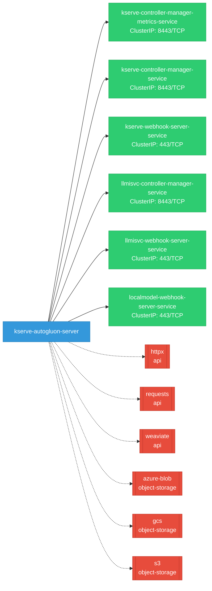

# kserve-autogluon-server: Network

## Service Map

### Services

| Name | Type | Ports | Source |
|------|------|-------|--------|
| kserve-controller-manager-metrics-service | ClusterIP | 8443/TCP | [`kustomize:config/overlays/all`](https://github.com/kserve/kserve-autogluon-server/blob/aad6612fe382c04130a0675500087545cb6edc3f/kustomize:config/overlays/all) |
| kserve-controller-manager-service | ClusterIP | 8443/TCP | [`kustomize:config/overlays/all`](https://github.com/kserve/kserve-autogluon-server/blob/aad6612fe382c04130a0675500087545cb6edc3f/kustomize:config/overlays/all) |
| kserve-webhook-server-service | ClusterIP | 443/TCP | [`kustomize:config/overlays/all`](https://github.com/kserve/kserve-autogluon-server/blob/aad6612fe382c04130a0675500087545cb6edc3f/kustomize:config/overlays/all) |
| llmisvc-controller-manager-service | ClusterIP | 8443/TCP | [`kustomize:config/overlays/all`](https://github.com/kserve/kserve-autogluon-server/blob/aad6612fe382c04130a0675500087545cb6edc3f/kustomize:config/overlays/all) |
| llmisvc-webhook-server-service | ClusterIP | 443/TCP | [`kustomize:config/overlays/all`](https://github.com/kserve/kserve-autogluon-server/blob/aad6612fe382c04130a0675500087545cb6edc3f/kustomize:config/overlays/all) |
| localmodel-webhook-server-service | ClusterIP | 443/TCP | [`kustomize:config/overlays/all`](https://github.com/kserve/kserve-autogluon-server/blob/aad6612fe382c04130a0675500087545cb6edc3f/kustomize:config/overlays/all) |

### Ingress / Routing

| Kind | Name | Hosts | Paths | TLS | Source |
|------|------|-------|-------|-----|--------|
| HTTPRoute | rbac-inferred |  |  | no | [`rbac/kserve-manager-role`](https://github.com/kserve/kserve-autogluon-server/blob/aad6612fe382c04130a0675500087545cb6edc3f/rbac/kserve-manager-role) |
| Ingress | rbac-inferred |  |  | no | [`rbac/kserve-manager-role`](https://github.com/kserve/kserve-autogluon-server/blob/aad6612fe382c04130a0675500087545cb6edc3f/rbac/kserve-manager-role) |
| VirtualService | rbac-inferred |  |  | no | [`rbac/kserve-manager-role`](https://github.com/kserve/kserve-autogluon-server/blob/aad6612fe382c04130a0675500087545cb6edc3f/rbac/kserve-manager-role) |

!!! warning "No Network Policies"
    No NetworkPolicy resources were found in the analyzed sources. Network policies may exist in overlays, Helm values, or cluster-level configurations not captured by static analysis.

