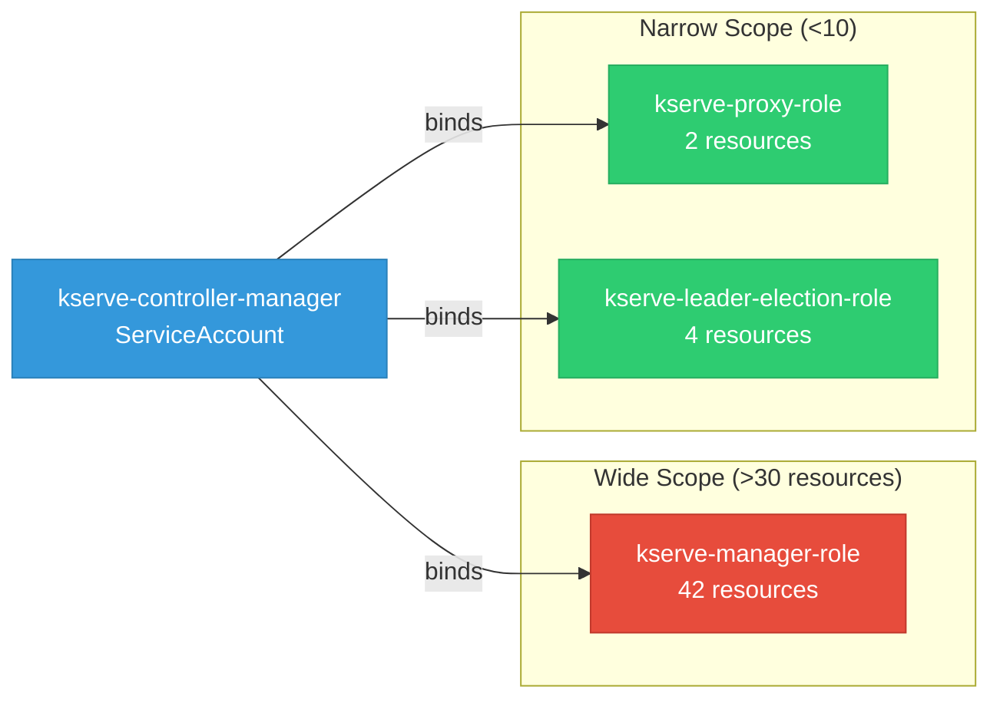

# kserve-autogluon-server: RBAC

ServiceAccount bindings, roles, and resource permissions.

## RBAC Overview

This component defines a large RBAC surface (113 diagram lines). The graph below groups roles by permission scope.

## Bindings

Subject-to-role mappings defining who has access to what.

| Binding | Type | Role | Subject |
|---------|------|------|---------|
| kserve-manager-rolebinding | ClusterRoleBinding | kserve-manager-role | ServiceAccount/kserve-controller-manager |
| kserve-proxy-rolebinding | ClusterRoleBinding | kserve-proxy-role | ServiceAccount/kserve-controller-manager |
| kserve-leader-election-rolebinding | RoleBinding | kserve-leader-election-role | ServiceAccount/kserve-controller-manager |

## Role Details

Per-rule breakdown of API groups, resources, and verbs for each role.

| Role | Kind | API Groups | Resources | Verbs |
|------|------|------------|-----------|-------|
| kserve-manager-role | ClusterRole |  | configmaps | create, get, update |
| kserve-manager-role | ClusterRole |  | events, services | create, delete, get, list, patch, update, watch |
| kserve-manager-role | ClusterRole |  | namespaces, pods | get, list, watch |
| kserve-manager-role | ClusterRole |  | secrets, serviceaccounts | get |
| kserve-manager-role | ClusterRole |  | mutatingwebhookconfigurations, validatingwebhookconfigurations | create, delete, get, list, patch, update, watch |
| kserve-manager-role | ClusterRole |  | deployments | create, delete, get, list, patch, update, watch |
| kserve-manager-role | ClusterRole |  | horizontalpodautoscalers | create, delete, get, list, patch, update, watch |
| kserve-manager-role | ClusterRole |  | httproutes | create, delete, get, list, patch, update, watch |
| kserve-manager-role | ClusterRole |  | scaledobjects, scaledobjects/finalizers | create, delete, get, list, patch, update, watch |
| kserve-manager-role | ClusterRole |  | scaledobjects/status | get, patch, update |
| kserve-manager-role | ClusterRole |  | virtualservices, virtualservices/finalizers | create, delete, get, list, patch, update, watch |
| kserve-manager-role | ClusterRole |  | virtualservices/status | get, patch, update |
| kserve-manager-role | ClusterRole |  | ingresses | create, delete, get, list, patch, update, watch |
| kserve-manager-role | ClusterRole |  | opentelemetrycollectors, opentelemetrycollectors/finalizers | create, delete, get, list, patch, update, watch |
| kserve-manager-role | ClusterRole |  | opentelemetrycollectors/status | get, patch, update |
| kserve-manager-role | ClusterRole |  | services, services/finalizers | create, delete, get, list, patch, update, watch |
| kserve-manager-role | ClusterRole |  | services/status | get, patch, update |
| kserve-manager-role | ClusterRole |  | clusterservingruntimes, clusterservingruntimes/finalizers, clusterstoragecontainers, inferencegraphs, inferencegraphs/finalizers, inferenceservices, inferenceservices/finalizers, servingruntimes, servingruntimes/finalizers, trainedmodels | create, delete, get, list, patch, update, watch |
| kserve-manager-role | ClusterRole |  | clusterservingruntimes/status, inferencegraphs/status, inferenceservices/status, servingruntimes/status, trainedmodels/status | get, patch, update |
| kserve-manager-role | ClusterRole |  | localmodelcaches, localmodelnamespacecaches | get, list, watch |
| kserve-proxy-role | ClusterRole |  | tokenreviews | create |
| kserve-proxy-role | ClusterRole |  | subjectaccessreviews | create |
| kserve-leader-election-role | Role |  | leases | create, get, list, update |
| kserve-leader-election-role | Role |  | configmaps | get, list, watch, create, update, patch, delete |
| kserve-leader-election-role | Role |  | configmaps/status | get, update, patch |
| kserve-leader-election-role | Role |  | events | create |

