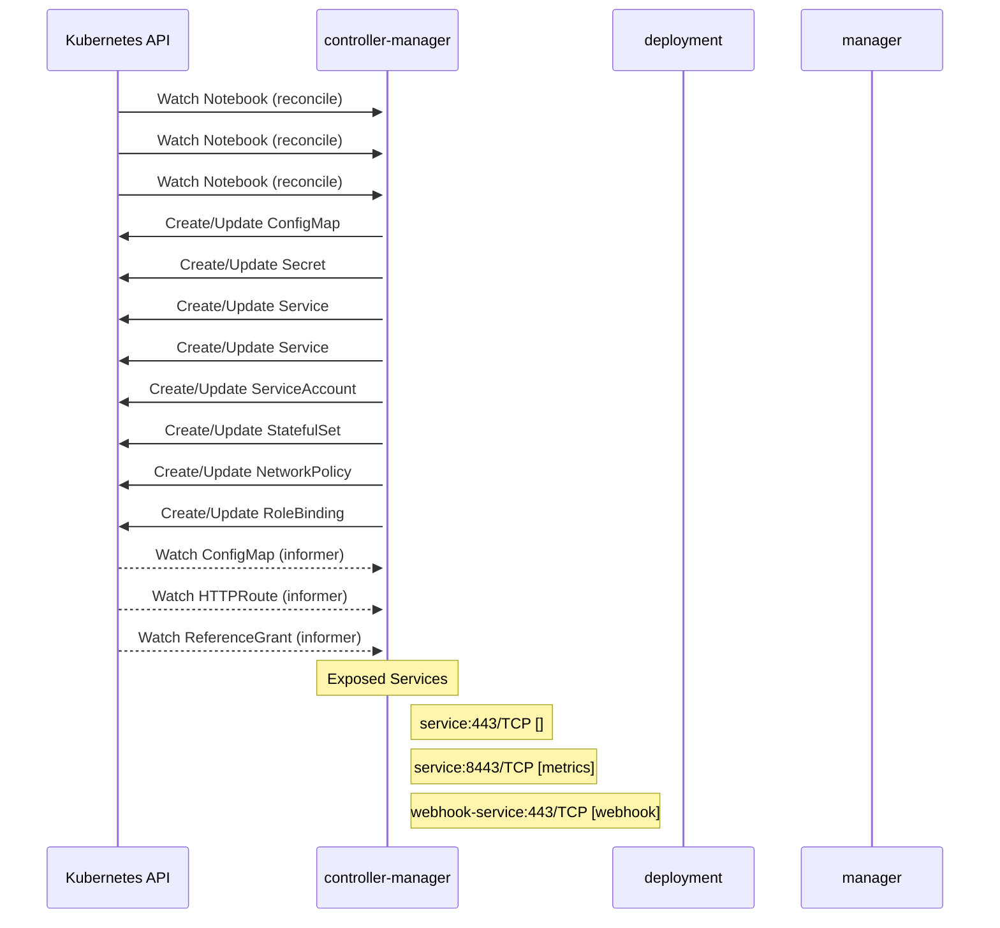

# kubeflow: Dataflow

## Controller Watches

Kubernetes resources this controller monitors for changes. Each watch triggers reconciliation when the watched resource is created, updated, or deleted.

| Type | GVK | Source |
|------|-----|--------|
| For | api/v1/Notebook | [`components/odh-notebook-controller/controllers/notebook_controller.go:736`](https://github.com/opendatahub-io/kubeflow/blob/6662d06dff25166947c5558fa3931ac9c26c037f/components/odh-notebook-controller/controllers/notebook_controller.go#L736) |
| For | api/v1beta1/Notebook | [`components/notebook-controller/controllers/culling_controller.go:580`](https://github.com/opendatahub-io/kubeflow/blob/6662d06dff25166947c5558fa3931ac9c26c037f/components/notebook-controller/controllers/culling_controller.go#L580) |
| For | api/v1beta1/Notebook | [`components/notebook-controller/controllers/notebook_controller.go:801`](https://github.com/opendatahub-io/kubeflow/blob/6662d06dff25166947c5558fa3931ac9c26c037f/components/notebook-controller/controllers/notebook_controller.go#L801) |
| Owns | /v1/ConfigMap | [`components/odh-notebook-controller/controllers/notebook_controller.go:740`](https://github.com/opendatahub-io/kubeflow/blob/6662d06dff25166947c5558fa3931ac9c26c037f/components/odh-notebook-controller/controllers/notebook_controller.go#L740) |
| Owns | /v1/Secret | [`components/odh-notebook-controller/controllers/notebook_controller.go:739`](https://github.com/opendatahub-io/kubeflow/blob/6662d06dff25166947c5558fa3931ac9c26c037f/components/odh-notebook-controller/controllers/notebook_controller.go#L739) |
| Owns | /v1/Service | [`components/odh-notebook-controller/controllers/notebook_controller.go:738`](https://github.com/opendatahub-io/kubeflow/blob/6662d06dff25166947c5558fa3931ac9c26c037f/components/odh-notebook-controller/controllers/notebook_controller.go#L738) |
| Owns | /v1/Service | [`components/notebook-controller/controllers/notebook_controller.go:803`](https://github.com/opendatahub-io/kubeflow/blob/6662d06dff25166947c5558fa3931ac9c26c037f/components/notebook-controller/controllers/notebook_controller.go#L803) |
| Owns | /v1/ServiceAccount | [`components/odh-notebook-controller/controllers/notebook_controller.go:737`](https://github.com/opendatahub-io/kubeflow/blob/6662d06dff25166947c5558fa3931ac9c26c037f/components/odh-notebook-controller/controllers/notebook_controller.go#L737) |
| Owns | apps/v1/StatefulSet | [`components/notebook-controller/controllers/notebook_controller.go:802`](https://github.com/opendatahub-io/kubeflow/blob/6662d06dff25166947c5558fa3931ac9c26c037f/components/notebook-controller/controllers/notebook_controller.go#L802) |
| Owns | networking.k8s.io/v1/NetworkPolicy | [`components/odh-notebook-controller/controllers/notebook_controller.go:741`](https://github.com/opendatahub-io/kubeflow/blob/6662d06dff25166947c5558fa3931ac9c26c037f/components/odh-notebook-controller/controllers/notebook_controller.go#L741) |
| Owns | rbac.authorization.k8s.io/v1/RoleBinding | [`components/odh-notebook-controller/controllers/notebook_controller.go:742`](https://github.com/opendatahub-io/kubeflow/blob/6662d06dff25166947c5558fa3931ac9c26c037f/components/odh-notebook-controller/controllers/notebook_controller.go#L742) |
| Watches | /v1/ConfigMap | [`components/odh-notebook-controller/controllers/notebook_controller.go:817`](https://github.com/opendatahub-io/kubeflow/blob/6662d06dff25166947c5558fa3931ac9c26c037f/components/odh-notebook-controller/controllers/notebook_controller.go#L817) |
| Watches | apis/v1/HTTPRoute | [`components/odh-notebook-controller/controllers/notebook_controller.go:746`](https://github.com/opendatahub-io/kubeflow/blob/6662d06dff25166947c5558fa3931ac9c26c037f/components/odh-notebook-controller/controllers/notebook_controller.go#L746) |
| Watches | apis/v1beta1/ReferenceGrant | [`components/odh-notebook-controller/controllers/notebook_controller.go:776`](https://github.com/opendatahub-io/kubeflow/blob/6662d06dff25166947c5558fa3931ac9c26c037f/components/odh-notebook-controller/controllers/notebook_controller.go#L776) |

## Reconciliation Flow

How the controller interacts with the Kubernetes API during reconciliation.

### Webhooks

| Name | Type | Path | Failure Policy | Service | Overlays | Enable Condition | Sources |
|------|------|------|----------------|---------|----------|------------------|----------|
| notebooks-validation.opendatahub.io | validating | /validate-notebook-v1 | fail |  |  |  | [`components/odh-notebook-controller/controllers/notebook_validating_webhook.go`](https://github.com/opendatahub-io/kubeflow/blob/6662d06dff25166947c5558fa3931ac9c26c037f/components/odh-notebook-controller/controllers/notebook_validating_webhook.go), [`components/odh-notebook-controller/controllers/notebook_validating_webhook.go`](https://github.com/opendatahub-io/kubeflow/blob/6662d06dff25166947c5558fa3931ac9c26c037f/components/odh-notebook-controller/controllers/notebook_validating_webhook.go) |
| notebooks.opendatahub.io | mutating | /mutate-notebook-v1 | fail |  |  |  | [`components/odh-notebook-controller/controllers/notebook_mutating_webhook.go`](https://github.com/opendatahub-io/kubeflow/blob/6662d06dff25166947c5558fa3931ac9c26c037f/components/odh-notebook-controller/controllers/notebook_mutating_webhook.go), [`components/odh-notebook-controller/controllers/notebook_mutating_webhook.go`](https://github.com/opendatahub-io/kubeflow/blob/6662d06dff25166947c5558fa3931ac9c26c037f/components/odh-notebook-controller/controllers/notebook_mutating_webhook.go) |

## Configuration

ConfigMaps and Helm values that control this component's runtime behavior.

