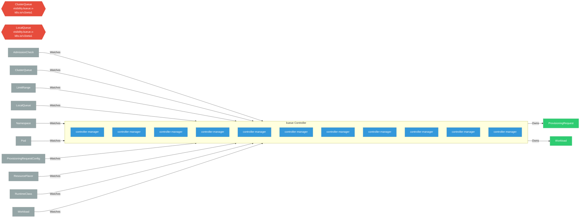

# kueue

> **Architecture snapshot: 2026-09-07** (2026-09-07)

**Repository:** opendatahub-io/kueue  
**Analyzer:** arch-analyzer dev  
**Extracted:** 2026-09-07T03:59:40Z

## Summary

| Metric | Count |
|--------|-------|
| CRDs | 2 |
| Deployments | 11 |
| Services | 2 |
| Secrets | 1 |
| Cluster Roles | 0 |
| Controller Watches | 22 |

## Component Architecture

CRDs, controllers, and owned Kubernetes resources.

### CRDs

| Group | Version | Kind | Scope | Fields | Validation Rules | Discovery | Source |
|-------|---------|------|-------|--------|------------------|-----------|--------|
| visibility.kueue.x-k8s.io | v1beta1 | ClusterQueue | Namespaced | 18 | 0 | Go AST | [`/home/runner/work/_temp/arch-analyzer-repos/kueue/apis/visibility/v1beta1/types.go`](https://github.com/opendatahub-io/kueue/blob/97024bd289d2cc5c9369b40d9f3483ab1483143d//home/runner/work/_temp/arch-analyzer-repos/kueue/apis/visibility/v1beta1/types.go) |
| visibility.kueue.x-k8s.io | v1beta1 | LocalQueue | Namespaced | 18 | 0 | Go AST | [`/home/runner/work/_temp/arch-analyzer-repos/kueue/apis/visibility/v1beta1/types.go`](https://github.com/opendatahub-io/kueue/blob/97024bd289d2cc5c9369b40d9f3483ab1483143d//home/runner/work/_temp/arch-analyzer-repos/kueue/apis/visibility/v1beta1/types.go) |

## Dependencies

### Key External Dependencies

| Module | Version |
|--------|---------|
| github.com/go-logr/logr | v1.4.2 |
| github.com/prometheus/client_golang | v1.21.1 |
| github.com/prometheus/client_model | v0.6.1 |
| k8s.io/api | v0.32.3 |
| k8s.io/api | v0.32.3 |
| k8s.io/apimachinery | v0.32.3 |
| k8s.io/apimachinery | v0.32.3 |
| k8s.io/apiserver | v0.32.3 |
| k8s.io/client-go | v0.32.3 |
| k8s.io/client-go | v0.32.3 |
| sigs.k8s.io/controller-runtime | v0.19.4 |

