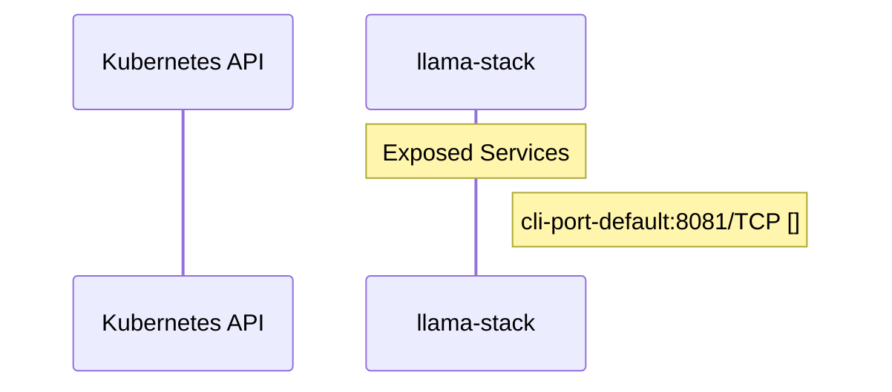

# llama-stack: Dataflow

## Controller Watches

Kubernetes resources this controller monitors for changes. Each watch triggers reconciliation when the watched resource is created, updated, or deleted.

No controller watches found in analyzed sources.

## Reconciliation Flow

How the controller interacts with the Kubernetes API during reconciliation.

### HTTP Endpoints

| Method | Path | Source |
|--------|------|--------|
| GET | /v1/admin/tools | [`client-sdks/stainless/openapi.yml`](https://github.com/opendatahub-io/llama-stack/blob/1acb60086c391f316a50cdb62f812abd2e924403/client-sdks/stainless/openapi.yml) |
| GET | /v1/batches | [`client-sdks/stainless/openapi.yml`](https://github.com/opendatahub-io/llama-stack/blob/1acb60086c391f316a50cdb62f812abd2e924403/client-sdks/stainless/openapi.yml) |
| POST | /v1/batches | [`client-sdks/stainless/openapi.yml`](https://github.com/opendatahub-io/llama-stack/blob/1acb60086c391f316a50cdb62f812abd2e924403/client-sdks/stainless/openapi.yml) |
| GET | /v1/batches/{batch_id} | [`client-sdks/stainless/openapi.yml`](https://github.com/opendatahub-io/llama-stack/blob/1acb60086c391f316a50cdb62f812abd2e924403/client-sdks/stainless/openapi.yml) |
| POST | /v1/batches/{batch_id}/cancel | [`client-sdks/stainless/openapi.yml`](https://github.com/opendatahub-io/llama-stack/blob/1acb60086c391f316a50cdb62f812abd2e924403/client-sdks/stainless/openapi.yml) |
| GET | /v1/chat/completions | [`client-sdks/stainless/openapi.yml`](https://github.com/opendatahub-io/llama-stack/blob/1acb60086c391f316a50cdb62f812abd2e924403/client-sdks/stainless/openapi.yml) |
| POST | /v1/chat/completions | [`client-sdks/stainless/openapi.yml`](https://github.com/opendatahub-io/llama-stack/blob/1acb60086c391f316a50cdb62f812abd2e924403/client-sdks/stainless/openapi.yml) |
| GET | /v1/chat/completions/{completion_id} | [`client-sdks/stainless/openapi.yml`](https://github.com/opendatahub-io/llama-stack/blob/1acb60086c391f316a50cdb62f812abd2e924403/client-sdks/stainless/openapi.yml) |
| GET | /v1/chat/completions/{completion_id}/messages | [`client-sdks/stainless/openapi.yml`](https://github.com/opendatahub-io/llama-stack/blob/1acb60086c391f316a50cdb62f812abd2e924403/client-sdks/stainless/openapi.yml) |
| POST | /v1/completions | [`client-sdks/stainless/openapi.yml`](https://github.com/opendatahub-io/llama-stack/blob/1acb60086c391f316a50cdb62f812abd2e924403/client-sdks/stainless/openapi.yml) |
| POST | /v1/conversations | [`client-sdks/stainless/openapi.yml`](https://github.com/opendatahub-io/llama-stack/blob/1acb60086c391f316a50cdb62f812abd2e924403/client-sdks/stainless/openapi.yml) |
| DELETE | /v1/conversations/{conversation_id} | [`client-sdks/stainless/openapi.yml`](https://github.com/opendatahub-io/llama-stack/blob/1acb60086c391f316a50cdb62f812abd2e924403/client-sdks/stainless/openapi.yml) |
| GET | /v1/conversations/{conversation_id} | [`client-sdks/stainless/openapi.yml`](https://github.com/opendatahub-io/llama-stack/blob/1acb60086c391f316a50cdb62f812abd2e924403/client-sdks/stainless/openapi.yml) |
| POST | /v1/conversations/{conversation_id} | [`client-sdks/stainless/openapi.yml`](https://github.com/opendatahub-io/llama-stack/blob/1acb60086c391f316a50cdb62f812abd2e924403/client-sdks/stainless/openapi.yml) |
| GET | /v1/conversations/{conversation_id}/items | [`client-sdks/stainless/openapi.yml`](https://github.com/opendatahub-io/llama-stack/blob/1acb60086c391f316a50cdb62f812abd2e924403/client-sdks/stainless/openapi.yml) |
| POST | /v1/conversations/{conversation_id}/items | [`client-sdks/stainless/openapi.yml`](https://github.com/opendatahub-io/llama-stack/blob/1acb60086c391f316a50cdb62f812abd2e924403/client-sdks/stainless/openapi.yml) |
| DELETE | /v1/conversations/{conversation_id}/items/{item_id} | [`client-sdks/stainless/openapi.yml`](https://github.com/opendatahub-io/llama-stack/blob/1acb60086c391f316a50cdb62f812abd2e924403/client-sdks/stainless/openapi.yml) |
| GET | /v1/conversations/{conversation_id}/items/{item_id} | [`client-sdks/stainless/openapi.yml`](https://github.com/opendatahub-io/llama-stack/blob/1acb60086c391f316a50cdb62f812abd2e924403/client-sdks/stainless/openapi.yml) |
| POST | /v1/embeddings | [`client-sdks/stainless/openapi.yml`](https://github.com/opendatahub-io/llama-stack/blob/1acb60086c391f316a50cdb62f812abd2e924403/client-sdks/stainless/openapi.yml) |
| GET | /v1/files | [`client-sdks/stainless/openapi.yml`](https://github.com/opendatahub-io/llama-stack/blob/1acb60086c391f316a50cdb62f812abd2e924403/client-sdks/stainless/openapi.yml) |
| POST | /v1/files | [`client-sdks/stainless/openapi.yml`](https://github.com/opendatahub-io/llama-stack/blob/1acb60086c391f316a50cdb62f812abd2e924403/client-sdks/stainless/openapi.yml) |
| DELETE | /v1/files/{file_id} | [`client-sdks/stainless/openapi.yml`](https://github.com/opendatahub-io/llama-stack/blob/1acb60086c391f316a50cdb62f812abd2e924403/client-sdks/stainless/openapi.yml) |
| GET | /v1/files/{file_id} | [`client-sdks/stainless/openapi.yml`](https://github.com/opendatahub-io/llama-stack/blob/1acb60086c391f316a50cdb62f812abd2e924403/client-sdks/stainless/openapi.yml) |
| GET | /v1/files/{file_id}/content | [`client-sdks/stainless/openapi.yml`](https://github.com/opendatahub-io/llama-stack/blob/1acb60086c391f316a50cdb62f812abd2e924403/client-sdks/stainless/openapi.yml) |
| GET | /v1/health | [`client-sdks/stainless/openapi.yml`](https://github.com/opendatahub-io/llama-stack/blob/1acb60086c391f316a50cdb62f812abd2e924403/client-sdks/stainless/openapi.yml) |
| GET | /v1/inspect/routes | [`client-sdks/stainless/openapi.yml`](https://github.com/opendatahub-io/llama-stack/blob/1acb60086c391f316a50cdb62f812abd2e924403/client-sdks/stainless/openapi.yml) |
| POST | /v1/messages | [`client-sdks/stainless/openapi.yml`](https://github.com/opendatahub-io/llama-stack/blob/1acb60086c391f316a50cdb62f812abd2e924403/client-sdks/stainless/openapi.yml) |
| GET | /v1/messages/batches | [`client-sdks/stainless/openapi.yml`](https://github.com/opendatahub-io/llama-stack/blob/1acb60086c391f316a50cdb62f812abd2e924403/client-sdks/stainless/openapi.yml) |
| POST | /v1/messages/batches | [`client-sdks/stainless/openapi.yml`](https://github.com/opendatahub-io/llama-stack/blob/1acb60086c391f316a50cdb62f812abd2e924403/client-sdks/stainless/openapi.yml) |
| GET | /v1/messages/batches/{message_batch_id} | [`client-sdks/stainless/openapi.yml`](https://github.com/opendatahub-io/llama-stack/blob/1acb60086c391f316a50cdb62f812abd2e924403/client-sdks/stainless/openapi.yml) |
| POST | /v1/messages/batches/{message_batch_id}/cancel | [`client-sdks/stainless/openapi.yml`](https://github.com/opendatahub-io/llama-stack/blob/1acb60086c391f316a50cdb62f812abd2e924403/client-sdks/stainless/openapi.yml) |
| GET | /v1/messages/batches/{message_batch_id}/results | [`client-sdks/stainless/openapi.yml`](https://github.com/opendatahub-io/llama-stack/blob/1acb60086c391f316a50cdb62f812abd2e924403/client-sdks/stainless/openapi.yml) |
| POST | /v1/messages/count_tokens | [`client-sdks/stainless/openapi.yml`](https://github.com/opendatahub-io/llama-stack/blob/1acb60086c391f316a50cdb62f812abd2e924403/client-sdks/stainless/openapi.yml) |
| GET | /v1/models | [`client-sdks/stainless/openapi.yml`](https://github.com/opendatahub-io/llama-stack/blob/1acb60086c391f316a50cdb62f812abd2e924403/client-sdks/stainless/openapi.yml) |
| GET | /v1/models/{model_id} | [`client-sdks/stainless/openapi.yml`](https://github.com/opendatahub-io/llama-stack/blob/1acb60086c391f316a50cdb62f812abd2e924403/client-sdks/stainless/openapi.yml) |
| GET | /v1/prompts | [`client-sdks/stainless/openapi.yml`](https://github.com/opendatahub-io/llama-stack/blob/1acb60086c391f316a50cdb62f812abd2e924403/client-sdks/stainless/openapi.yml) |
| POST | /v1/prompts | [`client-sdks/stainless/openapi.yml`](https://github.com/opendatahub-io/llama-stack/blob/1acb60086c391f316a50cdb62f812abd2e924403/client-sdks/stainless/openapi.yml) |
| DELETE | /v1/prompts/{prompt_id} | [`client-sdks/stainless/openapi.yml`](https://github.com/opendatahub-io/llama-stack/blob/1acb60086c391f316a50cdb62f812abd2e924403/client-sdks/stainless/openapi.yml) |
| GET | /v1/prompts/{prompt_id} | [`client-sdks/stainless/openapi.yml`](https://github.com/opendatahub-io/llama-stack/blob/1acb60086c391f316a50cdb62f812abd2e924403/client-sdks/stainless/openapi.yml) |
| PUT | /v1/prompts/{prompt_id} | [`client-sdks/stainless/openapi.yml`](https://github.com/opendatahub-io/llama-stack/blob/1acb60086c391f316a50cdb62f812abd2e924403/client-sdks/stainless/openapi.yml) |
| PUT | /v1/prompts/{prompt_id}/set-default-version | [`client-sdks/stainless/openapi.yml`](https://github.com/opendatahub-io/llama-stack/blob/1acb60086c391f316a50cdb62f812abd2e924403/client-sdks/stainless/openapi.yml) |
| GET | /v1/prompts/{prompt_id}/versions | [`client-sdks/stainless/openapi.yml`](https://github.com/opendatahub-io/llama-stack/blob/1acb60086c391f316a50cdb62f812abd2e924403/client-sdks/stainless/openapi.yml) |
| GET | /v1/providers | [`client-sdks/stainless/openapi.yml`](https://github.com/opendatahub-io/llama-stack/blob/1acb60086c391f316a50cdb62f812abd2e924403/client-sdks/stainless/openapi.yml) |
| GET | /v1/providers/{provider_id} | [`client-sdks/stainless/openapi.yml`](https://github.com/opendatahub-io/llama-stack/blob/1acb60086c391f316a50cdb62f812abd2e924403/client-sdks/stainless/openapi.yml) |
| GET | /v1/responses | [`client-sdks/stainless/openapi.yml`](https://github.com/opendatahub-io/llama-stack/blob/1acb60086c391f316a50cdb62f812abd2e924403/client-sdks/stainless/openapi.yml) |
| POST | /v1/responses | [`client-sdks/stainless/openapi.yml`](https://github.com/opendatahub-io/llama-stack/blob/1acb60086c391f316a50cdb62f812abd2e924403/client-sdks/stainless/openapi.yml) |
| POST | /v1/responses/compact | [`client-sdks/stainless/openapi.yml`](https://github.com/opendatahub-io/llama-stack/blob/1acb60086c391f316a50cdb62f812abd2e924403/client-sdks/stainless/openapi.yml) |
| DELETE | /v1/responses/{response_id} | [`client-sdks/stainless/openapi.yml`](https://github.com/opendatahub-io/llama-stack/blob/1acb60086c391f316a50cdb62f812abd2e924403/client-sdks/stainless/openapi.yml) |
| GET | /v1/responses/{response_id} | [`client-sdks/stainless/openapi.yml`](https://github.com/opendatahub-io/llama-stack/blob/1acb60086c391f316a50cdb62f812abd2e924403/client-sdks/stainless/openapi.yml) |
| POST | /v1/responses/{response_id}/cancel | [`client-sdks/stainless/openapi.yml`](https://github.com/opendatahub-io/llama-stack/blob/1acb60086c391f316a50cdb62f812abd2e924403/client-sdks/stainless/openapi.yml) |
| GET | /v1/responses/{response_id}/input_items | [`client-sdks/stainless/openapi.yml`](https://github.com/opendatahub-io/llama-stack/blob/1acb60086c391f316a50cdb62f812abd2e924403/client-sdks/stainless/openapi.yml) |
| POST | /v1/vector-io/insert | [`client-sdks/stainless/openapi.yml`](https://github.com/opendatahub-io/llama-stack/blob/1acb60086c391f316a50cdb62f812abd2e924403/client-sdks/stainless/openapi.yml) |
| POST | /v1/vector-io/query | [`client-sdks/stainless/openapi.yml`](https://github.com/opendatahub-io/llama-stack/blob/1acb60086c391f316a50cdb62f812abd2e924403/client-sdks/stainless/openapi.yml) |
| GET | /v1/vector_stores | [`client-sdks/stainless/openapi.yml`](https://github.com/opendatahub-io/llama-stack/blob/1acb60086c391f316a50cdb62f812abd2e924403/client-sdks/stainless/openapi.yml) |
| POST | /v1/vector_stores | [`client-sdks/stainless/openapi.yml`](https://github.com/opendatahub-io/llama-stack/blob/1acb60086c391f316a50cdb62f812abd2e924403/client-sdks/stainless/openapi.yml) |
| DELETE | /v1/vector_stores/{vector_store_id} | [`client-sdks/stainless/openapi.yml`](https://github.com/opendatahub-io/llama-stack/blob/1acb60086c391f316a50cdb62f812abd2e924403/client-sdks/stainless/openapi.yml) |
| GET | /v1/vector_stores/{vector_store_id} | [`client-sdks/stainless/openapi.yml`](https://github.com/opendatahub-io/llama-stack/blob/1acb60086c391f316a50cdb62f812abd2e924403/client-sdks/stainless/openapi.yml) |
| POST | /v1/vector_stores/{vector_store_id} | [`client-sdks/stainless/openapi.yml`](https://github.com/opendatahub-io/llama-stack/blob/1acb60086c391f316a50cdb62f812abd2e924403/client-sdks/stainless/openapi.yml) |
| POST | /v1/vector_stores/{vector_store_id}/file_batches | [`client-sdks/stainless/openapi.yml`](https://github.com/opendatahub-io/llama-stack/blob/1acb60086c391f316a50cdb62f812abd2e924403/client-sdks/stainless/openapi.yml) |
| GET | /v1/vector_stores/{vector_store_id}/file_batches/{batch_id} | [`client-sdks/stainless/openapi.yml`](https://github.com/opendatahub-io/llama-stack/blob/1acb60086c391f316a50cdb62f812abd2e924403/client-sdks/stainless/openapi.yml) |
| POST | /v1/vector_stores/{vector_store_id}/file_batches/{batch_id}/cancel | [`client-sdks/stainless/openapi.yml`](https://github.com/opendatahub-io/llama-stack/blob/1acb60086c391f316a50cdb62f812abd2e924403/client-sdks/stainless/openapi.yml) |
| GET | /v1/vector_stores/{vector_store_id}/file_batches/{batch_id}/files | [`client-sdks/stainless/openapi.yml`](https://github.com/opendatahub-io/llama-stack/blob/1acb60086c391f316a50cdb62f812abd2e924403/client-sdks/stainless/openapi.yml) |
| GET | /v1/vector_stores/{vector_store_id}/files | [`client-sdks/stainless/openapi.yml`](https://github.com/opendatahub-io/llama-stack/blob/1acb60086c391f316a50cdb62f812abd2e924403/client-sdks/stainless/openapi.yml) |
| POST | /v1/vector_stores/{vector_store_id}/files | [`client-sdks/stainless/openapi.yml`](https://github.com/opendatahub-io/llama-stack/blob/1acb60086c391f316a50cdb62f812abd2e924403/client-sdks/stainless/openapi.yml) |
| DELETE | /v1/vector_stores/{vector_store_id}/files/{file_id} | [`client-sdks/stainless/openapi.yml`](https://github.com/opendatahub-io/llama-stack/blob/1acb60086c391f316a50cdb62f812abd2e924403/client-sdks/stainless/openapi.yml) |
| GET | /v1/vector_stores/{vector_store_id}/files/{file_id} | [`client-sdks/stainless/openapi.yml`](https://github.com/opendatahub-io/llama-stack/blob/1acb60086c391f316a50cdb62f812abd2e924403/client-sdks/stainless/openapi.yml) |
| POST | /v1/vector_stores/{vector_store_id}/files/{file_id} | [`client-sdks/stainless/openapi.yml`](https://github.com/opendatahub-io/llama-stack/blob/1acb60086c391f316a50cdb62f812abd2e924403/client-sdks/stainless/openapi.yml) |
| GET | /v1/vector_stores/{vector_store_id}/files/{file_id}/content | [`client-sdks/stainless/openapi.yml`](https://github.com/opendatahub-io/llama-stack/blob/1acb60086c391f316a50cdb62f812abd2e924403/client-sdks/stainless/openapi.yml) |
| POST | /v1/vector_stores/{vector_store_id}/search | [`client-sdks/stainless/openapi.yml`](https://github.com/opendatahub-io/llama-stack/blob/1acb60086c391f316a50cdb62f812abd2e924403/client-sdks/stainless/openapi.yml) |
| GET | /v1/version | [`client-sdks/stainless/openapi.yml`](https://github.com/opendatahub-io/llama-stack/blob/1acb60086c391f316a50cdb62f812abd2e924403/client-sdks/stainless/openapi.yml) |
| GET | /v1alpha/admin/connectors | [`client-sdks/stainless/openapi.yml`](https://github.com/opendatahub-io/llama-stack/blob/1acb60086c391f316a50cdb62f812abd2e924403/client-sdks/stainless/openapi.yml) |
| GET | /v1alpha/admin/connectors/{connector_id} | [`client-sdks/stainless/openapi.yml`](https://github.com/opendatahub-io/llama-stack/blob/1acb60086c391f316a50cdb62f812abd2e924403/client-sdks/stainless/openapi.yml) |
| GET | /v1alpha/admin/connectors/{connector_id}/tools | [`client-sdks/stainless/openapi.yml`](https://github.com/opendatahub-io/llama-stack/blob/1acb60086c391f316a50cdb62f812abd2e924403/client-sdks/stainless/openapi.yml) |
| GET | /v1alpha/admin/connectors/{connector_id}/tools/{tool_name} | [`client-sdks/stainless/openapi.yml`](https://github.com/opendatahub-io/llama-stack/blob/1acb60086c391f316a50cdb62f812abd2e924403/client-sdks/stainless/openapi.yml) |
| GET | /v1alpha/admin/health | [`client-sdks/stainless/openapi.yml`](https://github.com/opendatahub-io/llama-stack/blob/1acb60086c391f316a50cdb62f812abd2e924403/client-sdks/stainless/openapi.yml) |
| GET | /v1alpha/admin/inspect/routes | [`client-sdks/stainless/openapi.yml`](https://github.com/opendatahub-io/llama-stack/blob/1acb60086c391f316a50cdb62f812abd2e924403/client-sdks/stainless/openapi.yml) |
| GET | /v1alpha/admin/providers | [`client-sdks/stainless/openapi.yml`](https://github.com/opendatahub-io/llama-stack/blob/1acb60086c391f316a50cdb62f812abd2e924403/client-sdks/stainless/openapi.yml) |
| GET | /v1alpha/admin/providers/{provider_id} | [`client-sdks/stainless/openapi.yml`](https://github.com/opendatahub-io/llama-stack/blob/1acb60086c391f316a50cdb62f812abd2e924403/client-sdks/stainless/openapi.yml) |
| GET | /v1alpha/admin/version | [`client-sdks/stainless/openapi.yml`](https://github.com/opendatahub-io/llama-stack/blob/1acb60086c391f316a50cdb62f812abd2e924403/client-sdks/stainless/openapi.yml) |
| GET | /v1alpha/file-processors/jobs | [`client-sdks/stainless/openapi.yml`](https://github.com/opendatahub-io/llama-stack/blob/1acb60086c391f316a50cdb62f812abd2e924403/client-sdks/stainless/openapi.yml) |
| POST | /v1alpha/file-processors/jobs | [`client-sdks/stainless/openapi.yml`](https://github.com/opendatahub-io/llama-stack/blob/1acb60086c391f316a50cdb62f812abd2e924403/client-sdks/stainless/openapi.yml) |
| GET | /v1alpha/file-processors/jobs/{job_id} | [`client-sdks/stainless/openapi.yml`](https://github.com/opendatahub-io/llama-stack/blob/1acb60086c391f316a50cdb62f812abd2e924403/client-sdks/stainless/openapi.yml) |
| POST | /v1alpha/file-processors/jobs/{job_id}/cancel | [`client-sdks/stainless/openapi.yml`](https://github.com/opendatahub-io/llama-stack/blob/1acb60086c391f316a50cdb62f812abd2e924403/client-sdks/stainless/openapi.yml) |
| POST | /v1alpha/file-processors/process | [`client-sdks/stainless/openapi.yml`](https://github.com/opendatahub-io/llama-stack/blob/1acb60086c391f316a50cdb62f812abd2e924403/client-sdks/stainless/openapi.yml) |
| POST | /v1alpha/inference/rerank | [`client-sdks/stainless/openapi.yml`](https://github.com/opendatahub-io/llama-stack/blob/1acb60086c391f316a50cdb62f812abd2e924403/client-sdks/stainless/openapi.yml) |
| POST | /v1alpha/interactions | [`client-sdks/stainless/openapi.yml`](https://github.com/opendatahub-io/llama-stack/blob/1acb60086c391f316a50cdb62f812abd2e924403/client-sdks/stainless/openapi.yml) |
| GET | /v1alpha/skills | [`client-sdks/stainless/openapi.yml`](https://github.com/opendatahub-io/llama-stack/blob/1acb60086c391f316a50cdb62f812abd2e924403/client-sdks/stainless/openapi.yml) |
| POST | /v1alpha/skills | [`client-sdks/stainless/openapi.yml`](https://github.com/opendatahub-io/llama-stack/blob/1acb60086c391f316a50cdb62f812abd2e924403/client-sdks/stainless/openapi.yml) |
| DELETE | /v1alpha/skills/{skill_id} | [`client-sdks/stainless/openapi.yml`](https://github.com/opendatahub-io/llama-stack/blob/1acb60086c391f316a50cdb62f812abd2e924403/client-sdks/stainless/openapi.yml) |
| GET | /v1alpha/skills/{skill_id} | [`client-sdks/stainless/openapi.yml`](https://github.com/opendatahub-io/llama-stack/blob/1acb60086c391f316a50cdb62f812abd2e924403/client-sdks/stainless/openapi.yml) |
| POST | /v1alpha/skills/{skill_id} | [`client-sdks/stainless/openapi.yml`](https://github.com/opendatahub-io/llama-stack/blob/1acb60086c391f316a50cdb62f812abd2e924403/client-sdks/stainless/openapi.yml) |
| GET | /v1alpha/skills/{skill_id}/content | [`client-sdks/stainless/openapi.yml`](https://github.com/opendatahub-io/llama-stack/blob/1acb60086c391f316a50cdb62f812abd2e924403/client-sdks/stainless/openapi.yml) |
| GET | /v1alpha/skills/{skill_id}/versions | [`client-sdks/stainless/openapi.yml`](https://github.com/opendatahub-io/llama-stack/blob/1acb60086c391f316a50cdb62f812abd2e924403/client-sdks/stainless/openapi.yml) |
| POST | /v1alpha/skills/{skill_id}/versions | [`client-sdks/stainless/openapi.yml`](https://github.com/opendatahub-io/llama-stack/blob/1acb60086c391f316a50cdb62f812abd2e924403/client-sdks/stainless/openapi.yml) |
| DELETE | /v1alpha/skills/{skill_id}/versions/{version} | [`client-sdks/stainless/openapi.yml`](https://github.com/opendatahub-io/llama-stack/blob/1acb60086c391f316a50cdb62f812abd2e924403/client-sdks/stainless/openapi.yml) |
| GET | /v1alpha/skills/{skill_id}/versions/{version} | [`client-sdks/stainless/openapi.yml`](https://github.com/opendatahub-io/llama-stack/blob/1acb60086c391f316a50cdb62f812abd2e924403/client-sdks/stainless/openapi.yml) |
| GET | /v1alpha/skills/{skill_id}/versions/{version}/content | [`client-sdks/stainless/openapi.yml`](https://github.com/opendatahub-io/llama-stack/blob/1acb60086c391f316a50cdb62f812abd2e924403/client-sdks/stainless/openapi.yml) |

## Configuration

ConfigMaps and Helm values that control this component's runtime behavior.

