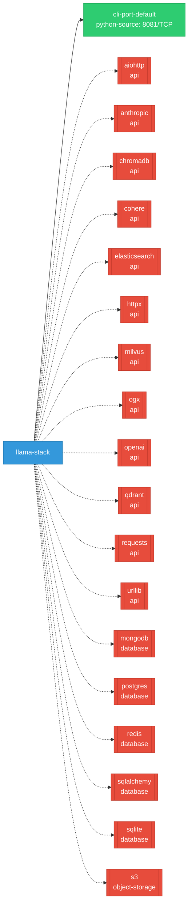

# llama-stack: Network

## Service Map

### Services

| Name | Type | Ports | Source |
|------|------|-------|--------|
| cli-port-default | python-source | 8081/TCP | [`benchmarking/k8s-benchmark/openai-mock-server.py:191`](https://github.com/opendatahub-io/llama-stack/blob/1acb60086c391f316a50cdb62f812abd2e924403/benchmarking/k8s-benchmark/openai-mock-server.py#L191) |

!!! warning "No Network Policies"
    No NetworkPolicy resources were found in the analyzed sources. Network policies may exist in overlays, Helm values, or cluster-level configurations not captured by static analysis.

