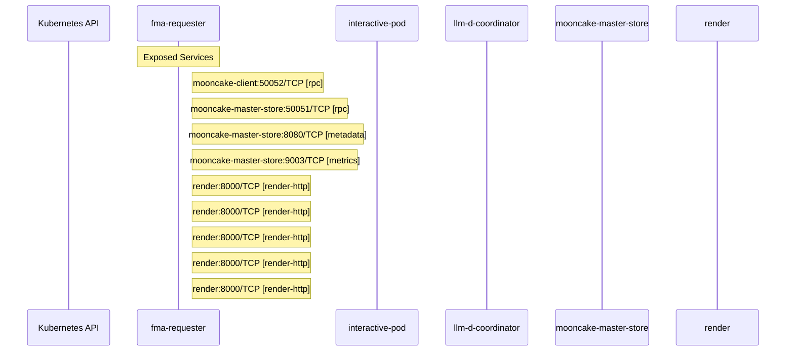

# llm-d: Dataflow

## Controller Watches

Kubernetes resources this controller monitors for changes. Each watch triggers reconciliation when the watched resource is created, updated, or deleted.

No controller watches found in analyzed sources.

## Reconciliation Flow

How the controller interacts with the Kubernetes API during reconciliation.

## Configuration

ConfigMaps and Helm values that control this component's runtime behavior.

### ConfigMaps

| Name | Data Keys | Source |
|------|-----------|--------|
| deepseek-model-mapping | baseModel | [`guides/multi-model-routing/manifests/configmaps.yaml`](https://github.com/llm-d/llm-d/blob/080c14d957755da4cc363745638619fc748558f1/guides/multi-model-routing/manifests/configmaps.yaml) |
| llm-d-coordinator-config | coordinator.yaml | [`guides/coord-disaggregation/coordinator/configmap.yaml`](https://github.com/llm-d/llm-d/blob/080c14d957755da4cc363745638619fc748558f1/guides/coord-disaggregation/coordinator/configmap.yaml) |
| llm-d-inference-gateway | deployment, service | [`guides/recipes/gateway/istio/configmap.yaml`](https://github.com/llm-d/llm-d/blob/080c14d957755da4cc363745638619fc748558f1/guides/recipes/gateway/istio/configmap.yaml) |
| mooncake-master-store-config | master.yaml | [`helpers/mooncake-master-store/base/configmap.yaml`](https://github.com/llm-d/llm-d/blob/080c14d957755da4cc363745638619fc748558f1/helpers/mooncake-master-store/base/configmap.yaml) |
| mooncake-store-config | mooncake_config.json | [`guides/tiered-prefix-cache/modelserver/gpu/vllm/mooncake-store/cpu/base/configmap.yaml`](https://github.com/llm-d/llm-d/blob/080c14d957755da4cc363745638619fc748558f1/guides/tiered-prefix-cache/modelserver/gpu/vllm/mooncake-store/cpu/base/configmap.yaml) |
| mooncake-store-config | mooncake_config.json | [`guides/tiered-prefix-cache/modelserver/gpu/vllm/mooncake-store/fs/base/configmap.yaml`](https://github.com/llm-d/llm-d/blob/080c14d957755da4cc363745638619fc748558f1/guides/tiered-prefix-cache/modelserver/gpu/vllm/mooncake-store/fs/base/configmap.yaml) |
| qwen-model-mapping | baseModel | [`guides/multi-model-routing/manifests/configmaps.yaml`](https://github.com/llm-d/llm-d/blob/080c14d957755da4cc363745638619fc748558f1/guides/multi-model-routing/manifests/configmaps.yaml) |

