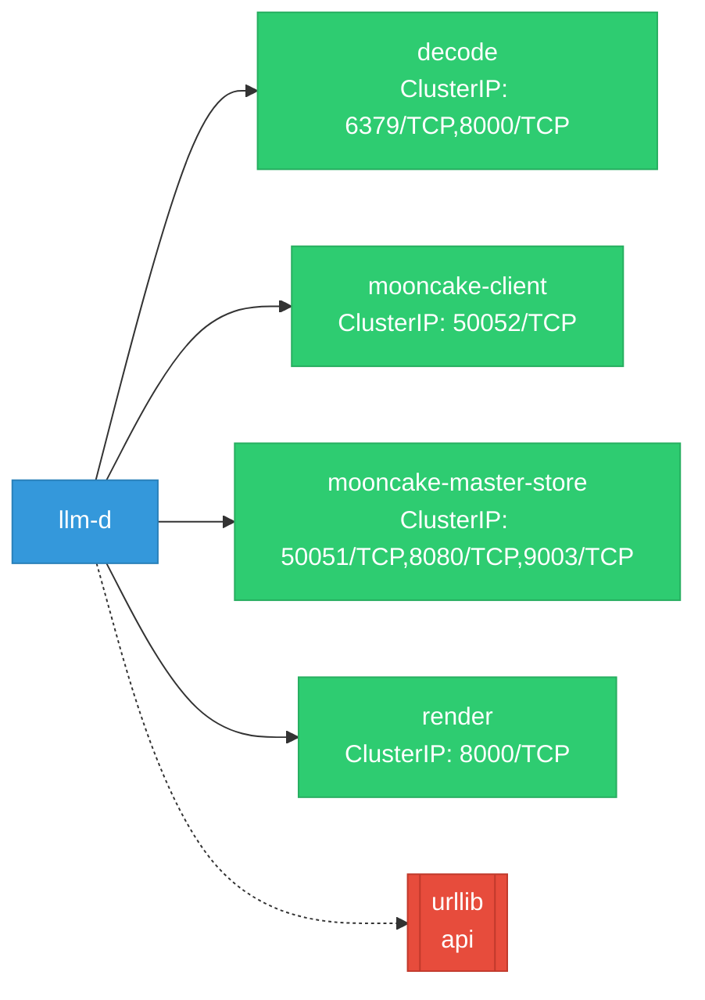

# llm-d: Network

## Service Map

*4 unique services (8 total, duplicates from test fixtures collapsed).*

### Services

| Name | Type | Ports | Source |
|------|------|-------|--------|
| decode | ClusterIP | 8000/TCP, 6379/TCP | [`guides/tiered-prefix-cache/modelserver/tpu/v7/vllm/native/cpu/multi-host/service.yaml`](https://github.com/llm-d/llm-d/blob/7921182b690e0fa97d79b14ebed1233118a9f5e0/guides/tiered-prefix-cache/modelserver/tpu/v7/vllm/native/cpu/multi-host/service.yaml) |
| mooncake-client | ClusterIP | 50052/TCP | [`helpers/mooncake-client/base/service.yaml`](https://github.com/llm-d/llm-d/blob/7921182b690e0fa97d79b14ebed1233118a9f5e0/helpers/mooncake-client/base/service.yaml) |
| mooncake-master-store | ClusterIP | 50051/TCP, 8080/TCP, 9003/TCP | [`helpers/mooncake-master-store/base/service.yaml`](https://github.com/llm-d/llm-d/blob/7921182b690e0fa97d79b14ebed1233118a9f5e0/helpers/mooncake-master-store/base/service.yaml) |
| render | ClusterIP | 8000/TCP | [`guides/p2p-kv-cache-sharing/render/service.yaml`](https://github.com/llm-d/llm-d/blob/7921182b690e0fa97d79b14ebed1233118a9f5e0/guides/p2p-kv-cache-sharing/render/service.yaml) |
| render | ClusterIP | 8000/TCP | [`guides/p2p-kv-cache-sharing/render/standalone/service.yaml`](https://github.com/llm-d/llm-d/blob/7921182b690e0fa97d79b14ebed1233118a9f5e0/guides/p2p-kv-cache-sharing/render/standalone/service.yaml) |
| render | ClusterIP | 8000/TCP | [`guides/precise-prefix-cache-routing/render/service.yaml`](https://github.com/llm-d/llm-d/blob/7921182b690e0fa97d79b14ebed1233118a9f5e0/guides/precise-prefix-cache-routing/render/service.yaml) |
| render | ClusterIP | 8000/TCP | [`guides/precise-prefix-cache-routing/render/standalone/service.yaml`](https://github.com/llm-d/llm-d/blob/7921182b690e0fa97d79b14ebed1233118a9f5e0/guides/precise-prefix-cache-routing/render/standalone/service.yaml) |
| render | ClusterIP | 8000/TCP | [`guides/wide-ep-lws/render/service.yaml`](https://github.com/llm-d/llm-d/blob/7921182b690e0fa97d79b14ebed1233118a9f5e0/guides/wide-ep-lws/render/service.yaml) |

### Ingress / Routing

| Kind | Name | Hosts | Paths | TLS | Source |
|------|------|-------|-------|-----|--------|
| Gateway | llm-d-inference-gateway |  |  | no | [`guides/recipes/gateway/agentgateway/gateway.yaml`](https://github.com/llm-d/llm-d/blob/7921182b690e0fa97d79b14ebed1233118a9f5e0/guides/recipes/gateway/agentgateway/gateway.yaml) |
| Gateway | llm-d-inference-gateway |  |  | no | [`guides/recipes/gateway/base/gateway.yaml`](https://github.com/llm-d/llm-d/blob/7921182b690e0fa97d79b14ebed1233118a9f5e0/guides/recipes/gateway/base/gateway.yaml) |
| Gateway | llm-d-inference-gateway |  |  | no | [`guides/recipes/gateway/envoy-ai-gateway/gateway.yaml`](https://github.com/llm-d/llm-d/blob/7921182b690e0fa97d79b14ebed1233118a9f5e0/guides/recipes/gateway/envoy-ai-gateway/gateway.yaml) |
| Gateway | llm-d-inference-gateway |  |  | no | [`guides/recipes/gateway/istio/gateway.yaml`](https://github.com/llm-d/llm-d/blob/7921182b690e0fa97d79b14ebed1233118a9f5e0/guides/recipes/gateway/istio/gateway.yaml) |
| Gateway | llm-d-inference-gateway |  |  | no | [`guides/recipes/gateway/kgateway/gateway.yaml`](https://github.com/llm-d/llm-d/blob/7921182b690e0fa97d79b14ebed1233118a9f5e0/guides/recipes/gateway/kgateway/gateway.yaml) |
| HTTPRoute | ${GUIDE_NAME} |  | /v1/completions, /v1/completions, /v1/completions, /v1/chat/completions, /v1/chat/completions, /v1/chat/completions, /inference/v1/generate, /inference/v1/generate, /inference/v1/generate, / | no | [`guides/coord-disaggregation/router/httproute/base/httproute.yaml`](https://github.com/llm-d/llm-d/blob/7921182b690e0fa97d79b14ebed1233118a9f5e0/guides/coord-disaggregation/router/httproute/base/httproute.yaml) |
| HTTPRoute | ${GUIDE_NAME} |  | /v1/completions, /v1/chat/completions, /inference/v1/generate, /v1/completions, /v1/chat/completions, /inference/v1/generate, /v1/completions, /v1/chat/completions, /inference/v1/generate, / | no | [`guides/coord-disaggregation/router/httproute-3-epp/base/httproute.yaml`](https://github.com/llm-d/llm-d/blob/7921182b690e0fa97d79b14ebed1233118a9f5e0/guides/coord-disaggregation/router/httproute-3-epp/base/httproute.yaml) |
| HTTPRoute | coordinator |  | /v1/completions, /v1/chat/completions, /inference/v1/generate | no | [`guides/coord-disaggregation/coordinator/base/httproute.yaml`](https://github.com/llm-d/llm-d/blob/7921182b690e0fa97d79b14ebed1233118a9f5e0/guides/coord-disaggregation/coordinator/base/httproute.yaml) |
| HTTPRoute | deepseek-route |  |  | no | [`guides/multi-model-routing/manifests/httproutes.yaml`](https://github.com/llm-d/llm-d/blob/7921182b690e0fa97d79b14ebed1233118a9f5e0/guides/multi-model-routing/manifests/httproutes.yaml) |
| HTTPRoute | multi-endpoint-routes |  | /v1/audio/speech, /v1/audio/transcriptions, /v1/images/generations | no | [`guides/diffusion-serving/multi-endpoint/httproutes.yaml`](https://github.com/llm-d/llm-d/blob/7921182b690e0fa97d79b14ebed1233118a9f5e0/guides/diffusion-serving/multi-endpoint/httproutes.yaml) |
| HTTPRoute | qwen-route |  |  | no | [`guides/multi-model-routing/manifests/httproutes.yaml`](https://github.com/llm-d/llm-d/blob/7921182b690e0fa97d79b14ebed1233118a9f5e0/guides/multi-model-routing/manifests/httproutes.yaml) |

!!! warning "No Network Policies"
    No NetworkPolicy resources were found in the analyzed sources. Network policies may exist in overlays, Helm values, or cluster-level configurations not captured by static analysis.

